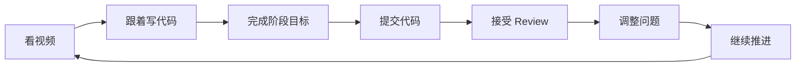
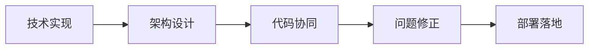

# 学习方式

<MuxPlayer
  className="mt-8"
  playbackId="00iLCL5dr5fnmXW00GRNrWyfOGSjEI3WTE01P1c1bQhiWg"
  title="学习方式"
/>

> [!NOTE]
>
> 本节课讲的是整套课程的学习方式。学习方式很直接：跟着视频一节一节看，并同步把项目写出来。
>
> 课程不会让学习者拿到一个项目后自行发挥，而是会把整个项目拆成多个阶段和里程碑，通过 Git 协同、阶段目标和 Code Review 的方式推进。老师会在关键节点介入，及时指出代码问题，并给出调整建议。
>
> 本节课的重点落在“跟着项目真实推进”上。学习者在这个过程中接触到的不只有技术实现，还会接触架构思维、设计思想、代码协同和部署流程。课程希望通过这种方式，让学习者在正确方向上持续推进，而不是只完成一个表面的项目结果。

### 学习主线

这一节课先把学习方式讲清楚。

整套课程的学习方式非常明确。学习者需要跟着视频一节一节往下看，并且同步对照视频内容把项目写出来。

课程推进的基本方式可以概括为：

这条路径很简单，但要求学习者真正动手。

课程最终要落到项目实现上。只看视频、只理解概念，很难把课程里的架构思维和工程方式变成自己的能力。学习者需要在写代码的过程中不断遇到问题、修正问题，最后把项目完整做出来。

### 阶段推进

课程会把整个项目拆成多个阶段。

老师会在不同阶段设置对应的里程碑，也会给出每个阶段需要完成的效果。这样做可以让学习过程更清晰，不会一下子面对一个过大的项目，也不会在开发过程中失去方向。

每个阶段都对应一个相对明确的目标。

学习者完成当前阶段之后，再进入下一个阶段。这样可以形成“小步快跑”的节奏，项目会一点一点往前推进，问题也能在较早阶段被发现和处理。

> [!TIP]
>
> 这类课程最适合按阶段推进。每完成一个里程碑，就及时回头检查代码质量、目录结构和实现思路，后面的学习压力会小很多。

### Git 协同

课程会使用 Git 来管理代码协同流程。

字幕里提到，后面会有一节课专门介绍 Git 协同流程，说明代码如何提交、如何管理、如何配合阶段目标推进。

这一部分的意义不只在于会用 Git 命令。

真实工作中，项目开发通常都离不开代码协同。团队需要通过分支、提交、合并、Review 等方式管理代码。课程把 Git 协同放进学习流程里，可以让学习者更接近真实项目开发方式。

这一步会帮助学习者熟悉几个关键习惯：

- 代码按阶段提交
- 开发过程有记录
- 问题可以被追踪
- 修改可以被回看
- 协作流程更加规范

这些习惯会直接影响后续项目开发质量。

### Code Review

课程会在阶段里程碑上加入 Code Review。

老师会在 Review 过程中指出代码中的问题，并给出相关调整建议。这样可以做到及时发现问题、及时处理问题、及时调整方向。

这一点很重要。

学习项目最容易出现的问题，是学习者自己写完一部分后不知道写得对不对，也不知道问题在哪里。代码能跑，不代表结构合理；功能完成，不代表实现质量稳定。Code Review 可以把这些隐藏问题及时暴露出来。

课程里的 Review 主要有几个作用：

| 作用     | 说明                                     |
| -------- | ---------------------------------------- |
| 发现问题 | 及时指出代码中的错误和不合理设计         |
| 调整方向 | 避免学习者在错误路径上越走越远           |
| 建立规范 | 让代码风格、结构和协同方式更接近真实工作 |
| 提升质量 | 让项目最终成果更稳定、更可维护           |

这也是本节课和普通项目练习之间的一个重要差别。

学习者不会被放在一个完全自行摸索的状态里，而是在阶段推进中不断接受反馈。

### 学习目标

本节课最后把学习目标进一步扩展开了。

课程希望学习者获得的不只是技术层面的内容，还包括架构思维、设计思想、协同方式和部署流程。

这几个方向可以放在一条完整项目链路里理解：

技术实现解决“功能怎么做”。

架构设计解决“系统怎么组织”。

代码协同解决“项目怎么和别人一起推进”。

问题修正解决“代码质量怎么保证”。

部署落地解决“项目最终怎么真正跑起来”。

这些内容共同构成了课程里的完整学习过程。

### 本节小结

本节课讲清楚了课程的学习方式。

学习者需要按照视频节奏推进项目，并在每个阶段完成对应里程碑。课程会借助 Git 管理代码协同，也会在关键节点进行 Code Review，帮助学习者及时发现问题、调整方向。

这一节课的重点在于建立正确的学习方法。

课程不是给出一个项目让学习者自由发挥，而是通过阶段拆分、过程管理和代码反馈，让学习者沿着正确方向把项目完整做出来。后面的学习过程中，真正重要的是持续跟进、同步编码、按阶段提交，并在反馈中不断修正。
