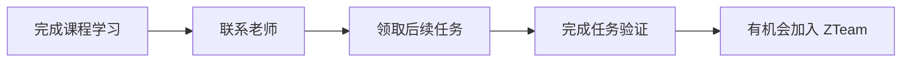
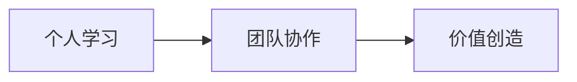

# ZTeam

<MuxPlayer
  className="mt-8"
  playbackId="eSPrTXc01003gr2uBDlkwNuQ02z4JPAmdqZnGflfzmdDlE"
  title="ZTeam"
/>

> [!NOTE]
>
> 本节课是前言部分的最后一节，主要讲老师对课程后续的规划。
>
> 老师会在课程中尽可能完整地传递自己的知识、思想、认知和经验。学习者完成课程后，可以联系老师继续完成后续任务。任务完成顺利，并且学习者本人愿意参与，就有机会加入老师规划中的虚拟团队 ZTeam。
>
> ZTeam 的目标是把课程学习继续往真实产出上延伸。这个团队未来可能一起做产品、接项目、参与远程工作，也可能一起做前端知识传播。它承载的是课程之后更长远的规划：把学习成果转化为团队协作、真实项目和更大的行业影响力。

### 后续规划

这一节课是前言的最后一节。

老师在这一节里讲的是课程结束之后的规划。前面几节课已经把课程背景、适合人群、学习方式都讲清楚了，这一节把视角继续往后放，说明学习者完成课程后还可以继续往哪里走。

课程本身是第一步。

学习者完成课程，掌握项目，实现能力提升之后，后面还会有进一步的任务和团队规划。这一节课就是在交代这部分内容。

### 课程承诺

老师先讲了自己在课程中的承诺。

他会尽可能毫无保留地把自己掌握到的知识、思想、认知和理解传递给学习者。这句话的重点在于，课程承载的不只是项目实现，也包括老师多年积累下来的经验和判断。

这些内容大致可以分成四类：

- 知识
- 思想
- 认知
- 理解

知识对应具体技术内容。

思想对应编程思想和系统设计方式。

认知对应对行业、项目和职业发展的判断。

理解对应长期实践之后形成的经验总结。

这些内容会随着课程项目逐步展开，学习者需要在项目实践中慢慢吸收。

### 后续任务

课程完成之后，学习者可以联系老师。

老师会给出一些任务，让学习者继续完成。这个安排相当于课程学习之后的进一步筛选和延伸。

这里有两个条件。

第一，学习者需要先完成课程学习。

第二，后续任务需要顺利完成。

这两个条件共同决定了后续参与团队的基础。课程项目是能力训练，后续任务是进一步验证。只有真正把项目做下来，并继续完成任务，才能进入下一阶段。

可以把这条路径理解成：

这条路径把课程学习和后续团队规划连接起来了。

### ZTeam

老师提到，会邀请完成任务并且愿意参与的学习者加入一个虚拟小组，也可以理解为虚拟团队。这个团队被命名为 ZTeam。

ZTeam 是专门围绕这套课程设计出来的后续组织形式。

它不是传统意义上的公司团队，也不是简单的学习群，而是一个基于课程学习成果继续往真实协作延伸的小组。学习者完成课程之后，如果能力和意愿都匹配，就可以继续进入这个团队参与更多事情。

> [!IMPORTANT]
>
> 加入 ZTeam 的前提是完成课程学习，并完成老师后续布置的任务。这个过程强调真实能力和真实参与意愿。

### 团队方向

ZTeam 的规划比较开放。

老师提到，团队未来可以一起做很多事情，例如打造产品、接单、参与远程工作，也可以做前端知识传播相关的自媒体内容。

这些方向可以整理成几类：

| 方向     | 具体内容               |
| -------- | ---------------------- |
| 产品方向 | 一起打造成功产品       |
| 项目方向 | 承接外部项目或订单     |
| 远程方向 | 以团队名义参与远程工作 |
| 内容方向 | 建设前端知识传播团队   |

这些方向的共同点，是把课程学习继续往真实产出上推进。

课程负责建立基础能力，ZTeam 负责提供后续协作和实践的可能性。学习者如果进入这个团队，后面接触到的就不只是课程项目，还有更真实的产品、项目、内容和团队协作。

### 长期目标

老师最后讲到了 ZTeam 更长远的目标。

他希望把自己现有的知识和经验分享给更多人，让这个队伍逐渐壮大，并且对业界产生更大的影响力，从而创造更大的价值。

这一段把 ZTeam 的意义讲得比较清楚。

它不只是课程结束后的附加安排，也承载着一个更长期的想法：通过课程筛选和培养一批真正愿意成长、愿意做事的人，再让这些人一起做出更有价值的产品、项目和内容。

这里面有三层递进关系：

个人先通过课程完成能力提升。

能力达标后进入团队协作。

团队再通过产品、项目或内容创造更大的价值。

这就是本节课最后想传达的长期规划。

### 本节小结

本节课把课程前言部分收住了，也把课程之后的可能性讲出来了。

老师会在课程中尽可能完整地传递自己的知识、思想和经验。学习者完成课程之后，可以继续联系老师完成后续任务。任务完成顺利，并且本人愿意参与，就有机会加入 ZTeam。

ZTeam 的定位，是课程之后继续实践和协作的虚拟团队。它未来可能围绕产品、项目、远程工作和知识传播展开。

本节课最后落到一个很清楚的方向。

课程学习是起点，项目完成是基础，后续任务是验证，ZTeam 是进一步参与真实协作和价值创造的机会。
