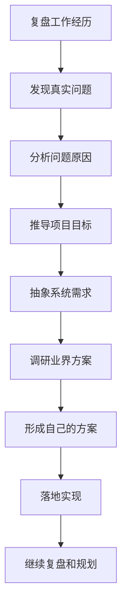
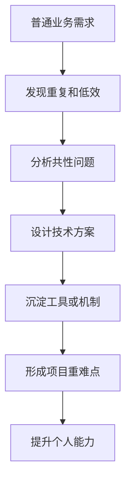

# 痛点：纯前端业务开发（体力活，无成长）

<MuxPlayer
  className="mt-8"
  playbackId="7bVK401Gvze013yS3aqpTV1tZ7T99Y3IGHOIF2erVbonI"
  title="痛点：纯前端业务开发（体力活，无成长）"
/>

> [!NOTE]
>
> 本节课正式进入课程项目的推导阶段。老师先给出一套做项目的方法：从真实工作中复盘问题，再分析问题、推导目标、形成需求、调研方案，最后落地实现并继续复盘。
>
> 本节课提炼出的第一个痛点是：很多前端开发者长期处在重复 CRUD 工作中，工作内容以列表、表单、接口对接和页面交付为主，整体更像体力活，技术成长空间有限。
>
> 本节课还强调了一个重要判断：技术深度不一定来自特别稀有的项目，也可以来自普通业务中的问题复盘和技术改造。开发者需要从当下项目中主动发现重复、低效和难维护的问题，再通过技术方案解决这些问题。这个过程会自然形成项目重难点，也会带来真正的能力提升。

## 课程起点

这一节课开始，课程进入正式的项目推导阶段。

前面几节课主要在讲课程背景、适合人群、学习方式和整体规划。从这一节开始，课程会逐步回答一个更具体的问题：这套课程到底要做一个什么项目，这个项目为什么值得做，以及它是怎样从真实工作问题中一步一步推导出来的。

老师没有直接给出项目功能清单，而是先从日常开发中的痛点出发。

这种讲法很重要。一个真正有价值的项目，不应该只是凭空设计出来的功能集合，而应该来自真实问题。先看到问题，再分析问题，最后形成方案，整个项目才会有明确的成立理由。

## 做事方法

老师先提出了一套做事情的方法。

一个开发者完成工作之后，需要回头复盘自己做过什么，过程中踩过什么坑，如果重新来一次会怎样调整。通过这种复盘，真实问题会慢慢浮现出来，后面的目标、需求和技术方案也会更自然地被推导出来。

这套方法可以概括为下面这条流程：

这条流程是本章内容的主线。

课程后面不会直接跳到写代码，而是会先把问题、目标、需求和方案逐步讲清楚。这样做可以让项目有更清晰的来源，也能让学习者理解每一个设计为什么会出现。

## 第一个痛点

本节课提炼出的第一个痛点，来自很多前端开发者在中后台业务中的共同经历。

很多人在工作中长期处在“就事论事”的开发状态。来了一个需求，就写一个页面；来了一个接口，就完成一次对接；来了一个表单，就继续复制相似结构进行修改。

这些工作在业务里很常见，主要包括：

- 列表页
- 表单页
- 查询条件
- 新增和编辑
- 删除确认
- 接口对接
- 状态展示

这些内容本身是中后台系统必须要有的，但如果开发者长期只在这一层反复执行，工作就会逐渐变成低价值重复劳动。

老师把这种状态称为“体力活”。

它会消耗大量时间，也会让开发者一直处在执行层。每天都在写代码，每天也都在交付需求，但个人技术能力很难持续提升。

## 成长停滞

重复 CRUD 最大的问题，是工作量和成长并不匹配。

很多开发者在中后台项目中做了大量页面和功能，看起来项目经验很多，但这些经验经常高度重复。做得越久，越容易发现自己一直在相似模式里循环。

这里可以把这种状态整理成一个简单关系：

重复性工作的影响主要体现在几个方面：

| 表现         | 影响                                 |
| ------------ | ------------------------------------ |
| 功能重复度高 | 每次做的内容差别不大                 |
| 技术挑战较少 | 很难形成新的能力突破                 |
| 思考空间有限 | 容易只关注当前功能交付               |
| 沉淀不足     | 做完一个需求后，很难复用到下一个场景 |

很多人觉得自己像在“搬砖”，根源就在这里。

工作年限在增长，需求数量在增长，但技术能力没有同步增长。开发者长期停留在执行层，就很难形成系统思维、架构思维和真正有深度的项目经验。

## 常见误区

面对成长停滞，很多人会期待自己遇到一个特别强、特别难、特别有技术含量的项目。

老师对这个想法做了提醒。

真实工作里的项目首先服务商业目标。公司做一个系统、上线一个功能，核心关注点通常是业务能不能推进、产品能不能交付、商业目标能不能达成。项目很少专门为了开发者成长而设计。

即使真的遇到一个特别难的项目，开发者也需要有对应的技术基础才能接住。

老师举了两个比较夸张的例子：

- 突然让普通开发者去做 AI 大模型
- 突然让普通开发者去做火箭相关系统

这些项目确实有难度，也足够特别。但没有相应积累时，机会本身不会自动转化为能力。

> [!WARNING]
>
> 技术成长不能完全依赖“遇到一个好项目”。更现实的路径，是在当前项目中发现问题，再通过技术手段把问题解决好。

## 技术深度

老师接着给出了另一种更实际的成长路径。

技术深度很多时候来自普通业务中的持续改进。一个项目看起来普通，并不代表它没有技术问题。中后台业务里的 CRUD 很常见，也正因为它高频、重复、共性强，里面才更容易抽象出值得解决的问题。

比如：

- 重复页面能不能抽象
- 表单配置能不能沉淀
- 列表能力能不能复用
- 接口调用能不能统一
- 权限、路由、布局能不能规范化
- 多个项目之间的公共能力能不能复用

这些问题都来自普通业务。

当开发者开始用技术手段解决这些问题时，普通业务就会产生技术深度。

这条路径可以这样理解：

这条路径比等待特殊项目更稳定。

开发者真正能掌控的，是自己能不能在现有工作里发现问题，并把这些问题用技术方案解决得更好。

## 当前项目

本节课强调，开发者应该更多关注自己当下正在做的项目。

当前项目里通常就存在很多可以复盘的地方，比如：

- 重复工作是否太多
- 开发效率是否太低
- 代码是否难以维护
- 功能是否无法复用
- 项目结构是否混乱
- 业务能力是否难以沉淀

这些问题都来自日常开发，不需要等待特别复杂的业务才会出现。

当开发者开始主动复盘这些问题，工作状态就会发生变化。

执行需求时，关注点是当前功能能不能做完。

改进系统时，关注点会变成这类问题能不能被长期解决。

这一步是从“业务执行者”走向“系统改进者”的开始。

> [!TIP]
>
> 普通业务并不低级。真正限制成长的，是长期只完成执行动作，没有复盘、抽象和沉淀。中后台项目里也可以长出技术深度，关键在于开发者有没有主动发现问题。

## 后续推导

本节课最后把问题收束回来。

当前已经明确的第一个痛点是：很多前端开发者长期做重复性的 CRUD 工作，能力很难提升。

接下来课程会继续基于这个痛点往下推导。

要解决这个问题，需要进一步回答几个问题：

1. 这个问题背后的目标是什么？
2. 如果要解决重复 CRUD，需要建设什么能力？
3. 这些能力应该如何抽象成系统需求？
4. 业界已有方案是怎样做的？
5. 课程最终要形成怎样的项目方案？

这一节课完成的是项目推导的第一步。

它先把真实痛点摆出来，为后面推导目标、需求和系统方案做准备。

## 本节小结

本节课正式开启项目推导阶段。

整节课的主线，是从工作复盘出发，发现前端中后台开发中的第一个核心痛点：重复 CRUD 让开发者长期停留在执行层，工作很多，成长有限。

本节课最重要的结论有三个。

第一，项目应该从真实问题中推导出来。

课程后续会按照发现问题、分析问题、推导需求、调研方案、形成方案、落地实现的路径展开。

第二，很多前端开发者的成长困境来自重复性工作。

中后台业务里的大量列表、表单、接口对接，会让开发者长期处在低价值重复劳动中。

第三，技术深度可以从普通业务中挖掘出来。

开发者不需要一直等待一个特别项目。关注当前项目中的重复、低效和难维护问题，并通过技术方案解决这些问题，这个过程本身就会形成真正的项目重难点。
