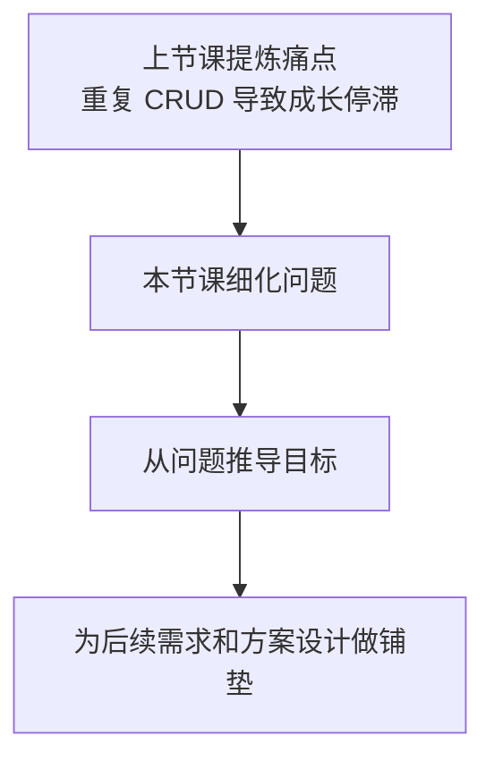
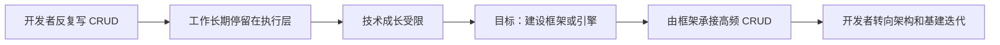
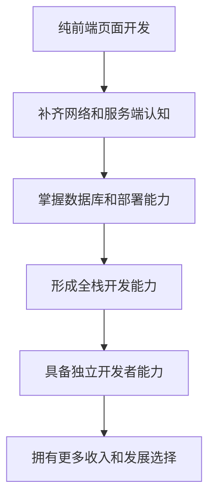
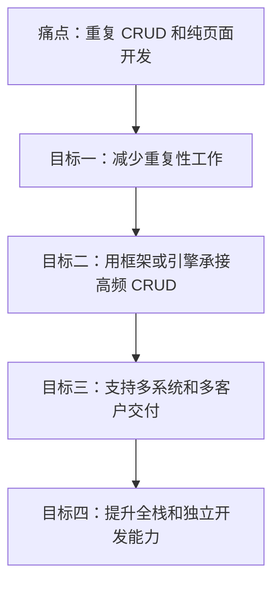
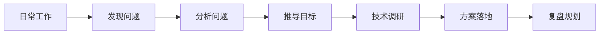

# 目标：专注架构设计与基建，脱离体力活

<MuxPlayer
  className="mt-8"
  playbackId="K7cKo2AMAWDfGqgehELmJeh8h7HUu63HMZtLg01p901Nc"
  title="目标：专注架构设计与基建，脱离体力活"
/>
> [!NOTE]
>
> 本节课延续上一节的“重复 CRUD 导致成长停滞”这个痛点，进一步把问题拆细，并从问题中推导出课程要达成的目标。
>
> 本节课提炼出四个目标：减少重复性工作，把高频 CRUD 交给框架或引擎承接，支持多客户、多系统交付场景，提升从前端到后端的全栈开发能力。
>
> 本节课的重点不在具体实现方案，而在目标推导过程。老师希望通过这套课程，把“发现问题、分析问题、推导目标、技术调研、方案落地、最终复盘”这一整套做事方式传递出来。后续项目会沿着这些目标继续往下推导需求和系统方案。

## 课程衔接

本节课继续上一节的内容。

上一节已经提炼出一个核心痛点：很多前端开发者在工作中长期做重复性的 CRUD 体力活，技术能力很难持续提升。

这一节开始把这个痛点拆得更具体。

老师没有直接进入解决方案，而是先把问题逐个展开，再从每个问题里推导出对应目标。课程在这里依然保持一条清晰路径：先把目标梳理出来，具体怎么做放到后面的课程继续展开。

这一节的推进方式可以概括为：

## 重复工作

第一个问题，是工作中存在大量重复性开发。

在中后台系统里，很多页面和功能结构高度相似。管理后台页面、表单、列表、查询、详情、编辑等内容经常反复出现。开发者很容易进入复制、粘贴、修改的工作状态。

这种重复性工作带来的问题很明显。

代码写了很多，但大部分时间都花在相似内容的重新实现上。开发者的注意力被消耗在页面堆叠和功能搬运里，很难真正进入更高层次的架构设计和能力沉淀。

这一类问题对应的目标很直接：

> 尽量减少重复性工作，让已经高频出现的能力可以被沉淀和复用。

这里先不展开具体方案。

本节课只先把目标确定下来：后面的系统设计需要围绕“减少重复开发”这一点继续推进。

## CRUD 占比

第二个问题，是 CRUD 工作占比过高。

这个问题和“重复工作”有关，但侧重点不同。重复工作强调的是相似页面和相似功能反复出现；CRUD 占比高强调的是工作内容本身比较基础，主要集中在增删改查这类低复杂度功能上。

在中后台系统里，这种情况非常常见。

典型内容包括：

- 表单提交
- 列表查询
- 详情查询
- 搜索筛选
- 分页
- 新增、编辑、删除

这些功能本身没有问题，它们是业务系统必须具备的基础能力。问题在于，当开发者长期围绕这些基础功能反复开发，工作重心就会一直停留在执行层。

课程在这里推导出的目标，是把开发者的工作重心从“每天写 CRUD”转向“维护框架和引擎”。

可以这样理解：

这也是本节课标题里的核心方向：专注架构设计与基建，逐步脱离体力活。

## 多客户交付

第三个问题，来自 to B、to G 项目和外包交付场景。

这类项目里经常会出现同一套系统交付给多个客户的情况。系统本身可能有一套标准产品，但不同客户会提出不同定制需求。于是团队经常把标准产品复制一份，再在复制出来的版本上修改。

客户数量变多之后，项目会越来越混乱。

一个系统可能逐渐演化出多个分支，每个分支服务不同客户。后续标准能力更新、问题修复、功能升级都会变得很麻烦。不同客户版本之间的差异越来越大，维护成本也会持续上升。

这类问题的本质，是标准产品和定制需求之间没有被很好地组织起来。

课程在这里推导出的目标，是建设一套能够支持多系统交付的框架。

这套框架需要承接两个方向：

- 共性能力统一沉淀
- 客户差异通过配置或扩展处理

这样一来，不同客户之间就不需要频繁复制标准产品，也不需要在多个分支里重复开发相同功能。

这一目标可以整理成下面的结构：

| 问题场景               | 典型表现                       | 推导目标           |
| ---------------------- | ------------------------------ | ------------------ |
| 同一套系统交付多个客户 | 标准产品不断复制，分支越来越多 | 支持多系统交付     |
| 不同客户存在定制需求   | 每个客户都要单独改一份         | 提供定制化扩展能力 |
| 公共功能重复开发       | 标准能力难以统一维护           | 沉淀共性能力       |

这个目标会直接影响后面系统的整体设计。

如果课程最终要做的是一套应用框架，那么它就需要从一开始考虑多系统、多客户、多场景交付的问题。

## 全栈能力

第四个问题，是大部分前端开发者日常工作过度集中在页面开发上。

老师提到，很多同学在工作里接触最多的是前端页面，网络、后端、数据库、部署这些内容基本很少涉及。长期这样发展，前端开发者的能力边界会越来越窄。

这一点和前面几节课讲的行业趋势是连在一起的。

未来单纯写页面的需求还会存在，但竞争力会下降。产业互联网、中后台系统、to B 和 to G 项目会越来越重视完整系统能力。开发者如果只停留在页面层，后续选择会变少，抗风险能力也会变弱。

所以课程在这里推导出一个很重要的目标：

> 提升从前到后的全栈开发能力，让学习者具备独立完成一套中后台系统的能力。

这不代表每个人都必须立刻成为大型系统架构师。

它更强调一种能力底座：当没有稳定上班机会时，开发者也可以凭借全栈能力接单、参与远程工作，甚至以独立开发者的方式完成一些中后台系统开发。

这部分目标可以用一条能力路径表示：

这里的重点是选择权。

上班可以是一个重要收入来源，但不应该成为唯一的路径。技术能力足够完整时，开发者会有更高的容错率，也有更多应对环境变化的方式。

## 目标汇总

本节课把上一节的痛点，进一步整理成了四个课程目标。

这四个目标之间有明显递进关系。

也可以从“痛点—目标”的关系来整理：

| 痛点                 | 目标                       |
| -------------------- | -------------------------- |
| 页面和功能重复开发多 | 减少重复性工作             |
| CRUD 占比过高        | 让框架或引擎承接基础 CRUD  |
| 多客户交付混乱       | 支持多系统、多客户交付     |
| 长期只做前端页面     | 培养全栈开发和独立开发能力 |

这些目标会成为后面继续推导需求和技术方案的依据。

课程后续不是凭空设计一个系统，而是围绕这些目标继续往下推。

## 做事方式

本节课最后还补充了一个重要信息。

老师希望通过整套课程，传递的不只是项目本身，还有一套体系化做事方式。

这套方式包括：

- 在日常工作中发现问题
- 对问题做分析
- 推导出目标
- 进行技术调研
- 完成技术落地
- 最后继续复盘

这也是前几节课一直在强调的主线。

课程项目本身会沿着这套流程展开，学习者在做项目的过程中，也能学习到怎样从普通业务中挖掘问题，怎样把问题变成目标，怎样继续推导出系统设计。

这条线可以这样表示：

这套做事方式会贯穿整个课程。

它比单纯完成一个项目更重要，因为这决定了学习者以后能不能在自己的工作中继续复用这套方法。

## 本节小结

本节课把“重复 CRUD 导致成长停滞”这个痛点进一步拆开，并推导出课程要达成的几个目标。

第一，减少重复性工作。

大量中后台页面和功能存在相似结构，课程后续需要通过系统设计来沉淀这些共性能力。

第二，把高频 CRUD 从人工重复开发中抽离出来。

开发者的工作重心需要从每天写增删改查，逐步转向框架、引擎和基础设施建设。

第三，支持多系统和多客户交付。

to B、to G 和外包场景中，标准产品经常需要适配不同客户。课程后续要考虑如何让共性能力统一维护，同时保留定制化空间。

第四，提升全栈能力。

学习者需要从纯前端页面开发，逐步扩展到服务端、数据库、部署和完整中后台系统开发，最终具备更强的独立开发能力。

这一节课完成的任务，是把痛点转化成目标。

后面课程会继续基于这些目标，推导更具体的系统需求和技术方案。
