# 技术选型

<MuxPlayer
  className="mt-8"
  playbackId="84fTFk7RDl01D5lunCf1Vl4TX1oJmCT7ffCK8fL7IgaQ"
  title="项目架构设计"
/>

> [!NOTE]
>
> 本节课讲的是 **ELPIS 系统的技术选型**。课程会按照系统架构的三层来选择技术：数据层、BFF 层、展示层。
>
> 最终选型结果是：数据层使用 **MySQL + Log4js**，BFF 层使用 **Node.js 18 + Koa2**，展示层使用 **Vue3 + Element Plus + Webpack5**。
>
> 这一节真正重要的内容，是技术选型的思路。选型不能只看某个技术是否流行，也不能简单判断谁更好。更合理的方式，是结合项目场景、团队背景、生态成熟度、学习目标、未来扩展和个人经验，选出当前阶段最匹配的一套技术栈。
>
> 老师希望学习者以后在工作、面试、创业或独立开发时，都能说清楚“为什么选择这个技术”，而不是只停留在“我用过这个技术”。

## 课程重点

本节课围绕 **技术选型** 展开。

老师先明确了两个目标。

第一，学习者需要知道 ELPIS 系统后续会用到哪些技术，以及这些技术分别用在系统的哪一层。

第二，学习者需要理解技术选型背后的思考方式。课程不会直接给出一个技术清单，而是通过对比和分析，说明每一个技术为什么会被选中。

这一点对开发者很重要。

在真实工作中，项目负责人、技术负责人或者核心开发者经常需要做技术选型。选型结果不一定永远是最优解，但至少要经过分析，能够说清楚当前选择背后的理由。

## 系统分层

课程先回到前面推导出来的系统架构。

整个 ELPIS 系统可以分成三层：

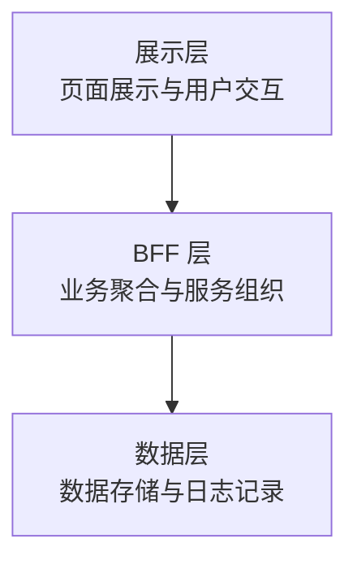

这三层对应不同的职责。

展示层负责页面、交互和前端工程。

BFF 层负责接口组织、业务逻辑聚合、服务转发和中间层能力。

数据层负责数据存储、数据操作和日志记录。

本节课的技术选型，也会按照这三层依次展开。

## 选型思路

老师在课程一开始就强调，技术选型不能只看八股式对比。

比如 MySQL 和 MongoDB、Koa 和 Express、Vue 和 React，这些技术都很成熟，很难简单说某一个一定更好。真正做项目时，关键不是判断谁绝对更强，而是判断谁更适合当前项目。

技术选型通常需要综合几个因素：

- 当前项目的业务场景
- 学习者或团队的技术背景
- 技术生态是否成熟
- 后续维护是否稳定
- 项目未来是否需要扩展
- 技术是否有助于达成课程目标

可以把这套思路整理成一个流程：

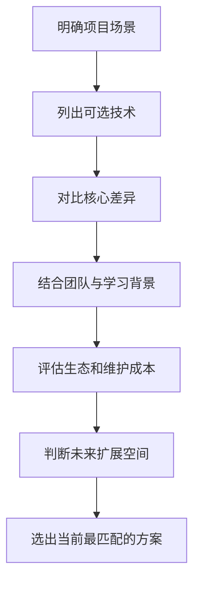

> [!TIP]
>
> 技术选型的重点，是说清楚选择理由。面试或项目复盘时，“为什么用它”通常比“用过它”更能体现技术判断力。

## 数据层

数据层主要选择两个部分。

一个是数据库，用来存储和操作业务数据。

另一个是日志系统，用来记录服务运行状态、接口请求信息和问题排查线索。

这两个部分都是服务端系统里非常基础，也非常关键的能力。

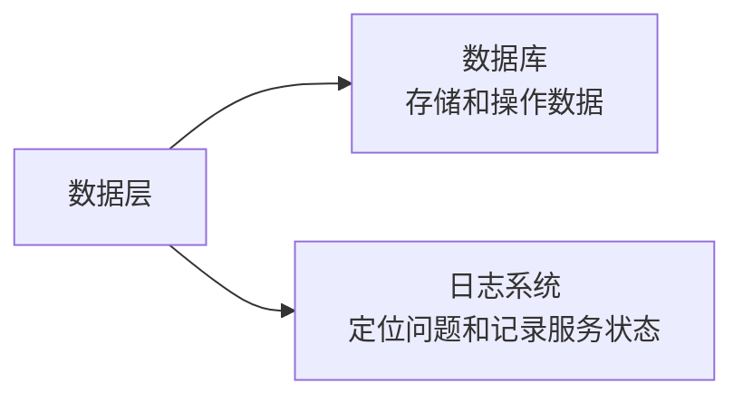

课程在数据层最终选择了：

| 部分     | 选型   |
| -------- | ------ |
| 数据库   | MySQL  |
| 日志系统 | Log4js |

## 数据库选择

数据库部分主要对比的是 **MySQL** 和 **MongoDB**。

MySQL 是关系型数据库，数据按照表结构存储。可以把它理解成类似 Excel 的二维表，有固定表头，每一行数据都按照表结构写入。它通过 SQL 语句完成数据查询、修改、删除和新增。

MongoDB 是文档型数据库，数据更接近 JSON 或 JavaScript Object。每一条数据都可以是一份文档，结构相对灵活，不一定要求所有数据都有完全一致的字段。

两者的基本差异可以这样理解：

| 维度     | MySQL                        | MongoDB                            |
| -------- | ---------------------------- | ---------------------------------- |
| 数据模型 | 关系型数据库                 | 文档型数据库                       |
| 存储形式 | 表、行、列                   | 文档、JSON 类结构                  |
| 数据结构 | 预先定义表结构               | 结构更灵活                         |
| 查询方式 | SQL                          | 查询操作符、聚合管道               |
| 典型场景 | 强一致性、事务、传统业务系统 | 灵活结构、快速开发、非固定数据结构 |

老师在这里还专门解释了事务。

事务可以理解为一组操作要么一起成功，要么一起失败。比如一个业务需要同时写入三张表，如果第一张表成功、第二张表失败、第三张表没有执行，数据就会处于不完整状态。事务就是为了解决这种一致性问题。

> [!IMPORTANT]
>
> 数据库选型不能只看存储结构是否顺手。MongoDB 的文档结构和 JavaScript 对象很像，对前端同学比较亲切，但这一个理由不足以支撑整个系统选型。

## 选择 MySQL

课程最终选择 **MySQL**。

这个选择主要基于几个考虑。

第一，MySQL 使用范围更广。

在传统后端开发中，MySQL 非常常见。很多专业后端开发者都会使用 MySQL，相关资料、工具、经验和生态也更加成熟。

第二，MySQL 的通用性更强。

虽然本课程 BFF 层使用 Node.js，但未来系统并不一定永远绑定 Node.js。后续如果迁移到 Java、Go 或 Python，MySQL 依然有非常成熟的支持。

第三，MySQL 对学习者的长期竞争力更有帮助。

很多学习者原本没有数据库经验。相比只学习一个更贴近 JavaScript 对象结构的文档数据库，掌握 MySQL 对后续工作、面试和跨语言系统开发会更通用。

第四，老师提到过一个背景信息：在一些真实企业环境中，部分 Node.js 应用也逐渐从 MongoDB 迁移到了 MySQL。

这些因素综合起来，MySQL 更符合课程项目的目标。

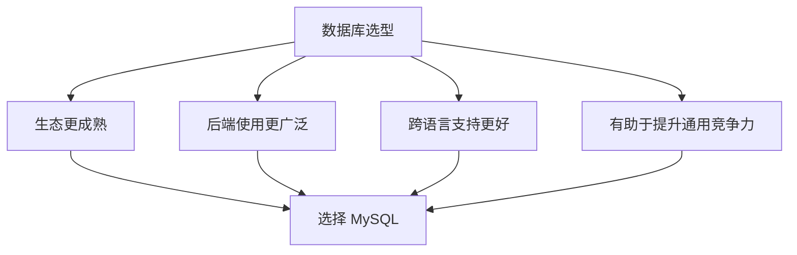

## 日志系统

数据层的第二个选择，是日志系统。

在普通前端开发中，开发者对日志系统的感知可能不强。很多时候，前端直接请求后端接口，出问题时主要看浏览器控制台、接口状态码、请求参数和返回结果。

引入 BFF 层之后，情况会发生变化。

请求不再是页面直接到后端接口，而是先进入 BFF，再由 BFF 转发或聚合后端服务。中间多了一层服务，就必须有对应的日志记录。

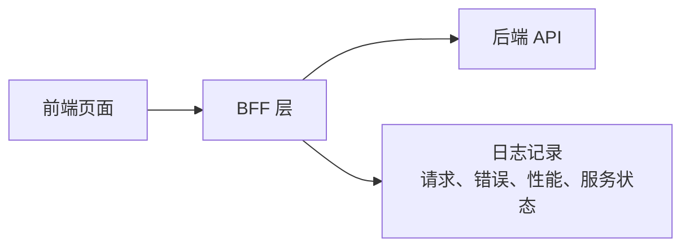

日志系统主要解决几个问题：

- 接口出错时，判断问题发生在 BFF 还是后端 API
- 联调时，记录请求参数、返回结果和错误信息
- 线上运行时，辅助定位问题
- 后续做性能监控和服务分析时，提供基础数据

> [!WARNING]
>
> BFF 层一旦进入系统架构，日志能力就不能省略。没有日志，很多线上问题只能靠猜，排查成本会非常高。

## 选择 Log4js

日志工具有很多选择，课程中主要提到了 Log4js、Winston、Bunyan、Pino 等。

老师的选型思路是先看生态和稳定性。

生态不够活跃、维护不够稳定的工具，会给后续系统带来风险。工具如果长期不更新，或者问题没人跟进，项目未来升级和维护都会受到影响。

在剩下的选择里，Winston 和 Log4js 都比较成熟。

Winston 更灵活，上手简单，支持多种日志传输方式，学习成本相对低。

Log4js 配置能力更强，支持更复杂的日志层级和记录方式，更适合偏企业级、大规模、高并发的服务场景。

课程最终选择 **Log4js**，主要因为 ELPIS 系统的目标不是做一个简单练习项目，而是要支撑企业级应用，后续还要孵化多个中后台系统，并具备真实交付的可能性。

| 工具          | 特点                                   | 适配倾向                                       |
| ------------- | -------------------------------------- | ---------------------------------------------- |
| Winston       | 灵活、易用、配置简单                   | 快速开发、轻量项目                             |
| Log4js        | 配置能力强、层级清晰、企业级场景更合适 | 中大型服务、企业级系统                         |
| Bunyan / Pino | 也可用于日志处理                       | 课程中因生态和稳定性优先级较低，未作为最终选择 |

所以，数据层的最终结果是：

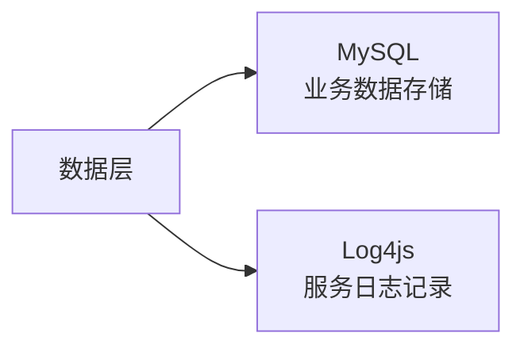

## BFF 层

BFF 层的核心选择，是服务端技术栈。

课程最终选择：

| 部分           | 选型       |
| -------------- | ---------- |
| 服务端运行环境 | Node.js 18 |
| 服务框架       | Koa2       |

BFF 层的选型和课程对象关系很大。

大部分学习者是前端开发者，很多人没有完整的后端开发经验。如果直接使用 Java、Go 或 Python，学习者会同时面对两个陌生内容：一是新的编程语言，二是后端开发的运行逻辑。

这样学习曲线会很陡。

Node.js 使用 JavaScript，前端同学至少可以先降低语言陌生感，把主要精力放在后端世界观、服务端运行流程和 BFF 架构设计上。

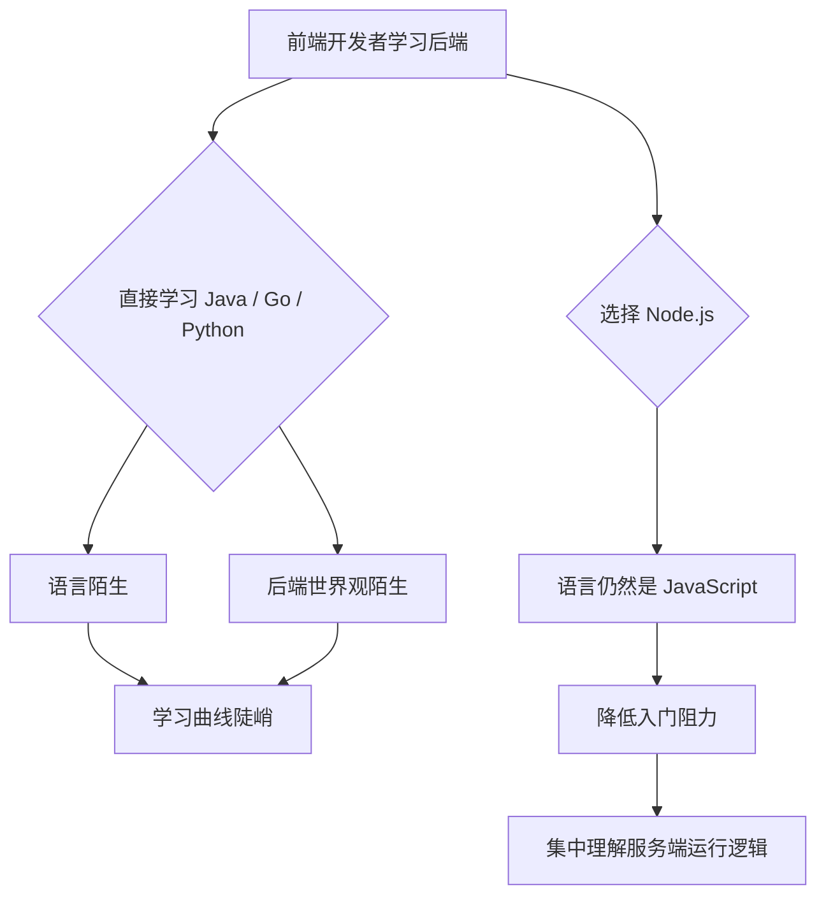

## 选择 Node.js

课程选择 Node.js，主要是为了让学习者更平滑地进入服务端开发。

Node.js 使用 JavaScript，运行时也基于 V8。对前端开发者来说，这意味着语言层面的障碍会小很多。

这样一来，学习者可以把注意力集中到几个更重要的内容上：

- 服务端请求如何进入系统
- 接口如何组织
- 中间件如何工作
- Controller 和 Service 如何分层
- 数据库如何接入
- BFF 如何转发和聚合后端服务

等学习者通过 Node.js 熟悉服务端世界之后，再去迁移到 Java、Go 或 Python，会顺畅很多。

这里的学习路径可以理解为：

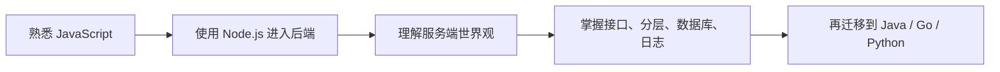

## 选择 Koa

Node.js 只是运行环境，真正搭建服务还需要服务端框架。

课程中提到了很多 Node.js 相关框架或工具，比如 Koa、Express、Connect、Egg.js、NestJS、Next.js 等。

老师最终选择 **Koa2**。

选择 Koa 的原因有两层。

第一，它不会太上层。

像 NestJS、Next.js 这类框架封装程度更高，很多底层服务逻辑已经被框架处理掉了。对于教学来说，直接使用这些框架，学习者可能很快把服务跑起来，但对服务端底层运行机制理解不够清晰。

第二，它也不会太底层。

如果直接使用 Node.js 原生 HTTP 模块开发，学习成本和编码成本都会增加，对课程主线不够友好。

Koa 处在一个比较合适的位置。

它足够轻量，可以让学习者看到服务端框架的核心运行逻辑；同时又提供了基本抽象，不需要从最底层开始手写所有内容。

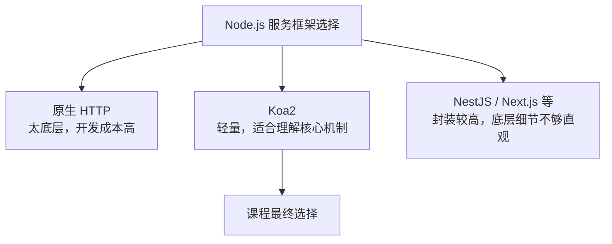

老师本人也有较多 Koa 和 Egg.js 相关经验。

课程会结合这些经验，带学习者用 Koa 搭建一个简易版的 Egg 核心能力。这样既能完成项目，也能帮助学习者理解服务端框架内部是如何组织起来的。

> [!TIP]
>
> 本课程使用 Koa 的重点，不只是写几个接口，而是借助 Koa 理解服务端框架的搭建思路。

## 展示层

展示层是学习者最熟悉的部分。

课程最终选择：

| 部分       | 选型         |
| ---------- | ------------ |
| 前端框架   | Vue3         |
| UI 组件库  | Element Plus |
| 工程化工具 | Webpack5     |

展示层主要负责页面展示、用户交互、前端工程组织和构建流程。

老师在这一部分没有展开大量 Vue 和 React 的对比，因为前端框架之争已经被讨论过很多次。课程更关注项目实践，以及如何通过这套组合完成企业级应用开发。

## 选择 Vue3

课程选择 Vue3，主要与老师自身经验和教学效果有关。

老师在实际工作中使用 Vue 的时间更长，对 Vue 的特性、代码组织方式和项目实践经验更熟悉。使用自己更熟悉的技术栈进行教学，可以更稳定地传递经验，也能在项目推进过程中讲出更多细节。

这里还强调了一个很重要的观点。

程序员不应该把“会某一个框架”当作最终竞争力。更重要的是理解前端框架的底层逻辑，形成快速上手新框架的能力。

也就是说，学习者需要掌握的是：

- 前端框架如何组织组件
- 状态和数据如何驱动视图
- 工程结构如何拆分
- 路由、状态管理、构建流程如何配合
- 如何快速迁移到另一个同类框架

> [!IMPORTANT]
>
> 框架本身会变化。真正稳定的能力，是理解框架背后的运行逻辑，并能在短时间内上手新技术。

## 选择 Element Plus

UI 组件库选择 **Element Plus**。

Element Plus 在 Vue3 生态中使用广泛，很多中后台系统都会用到它。虽然它不一定是最美观、最优雅的 UI 方案，但它足够主流，资料多，场景覆盖广，适合课程中的企业级中后台项目。

这类课程更关注完整系统落地。

使用主流组件库，可以减少 UI 细节上的额外消耗，把主要精力放在系统设计、工程化、BFF、数据层和完整项目实现上。

## 选择 Webpack5

展示层最后一个重要选择，是工程化工具。

课程选择 **Webpack5**。

老师提到，有些同学可能会疑惑为什么不用 Vite。这里的核心考虑是课程目标。

Vite 在开发体验和启动速度上有明显优势，现代前端项目中也非常常见。但这节课更希望学习者理解工程化本身，包括模块处理、打包流程、构建配置、资源处理和企业级项目工程组织。

Webpack5 在这些方面更适合作为工程化学习入口。

它能让学习者更完整地接触前端工程化中的关键概念。等通过 Webpack5 理解工程化之后，再迁移到 Vite 或其他构建工具，难度会低很多。

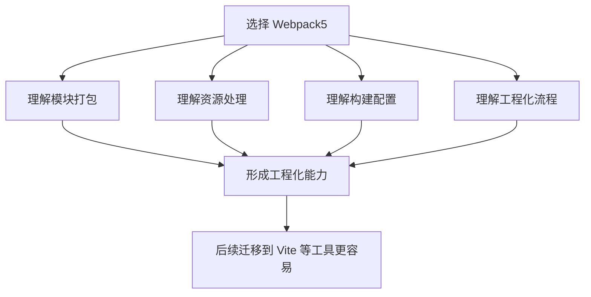

## 选型汇总

本节课最终形成了一套完整技术栈。

| 层级   | 技术选型     | 主要考虑                           |
| ------ | ------------ | ---------------------------------- |
| 数据层 | MySQL        | 生态成熟、通用性强、跨语言支持好   |
| 数据层 | Log4js       | 更适合企业级服务日志场景           |
| BFF 层 | Node.js 18   | 降低前端学习后端的语言门槛         |
| BFF 层 | Koa2         | 轻量、适合理解服务端框架核心逻辑   |
| 展示层 | Vue3         | 老师经验更充分，适合教学和项目落地 |
| 展示层 | Element Plus | 主流中后台组件库，生态成熟         |
| 展示层 | Webpack5     | 有利于完整理解前端工程化           |

整体架构可以整理成下面这样：

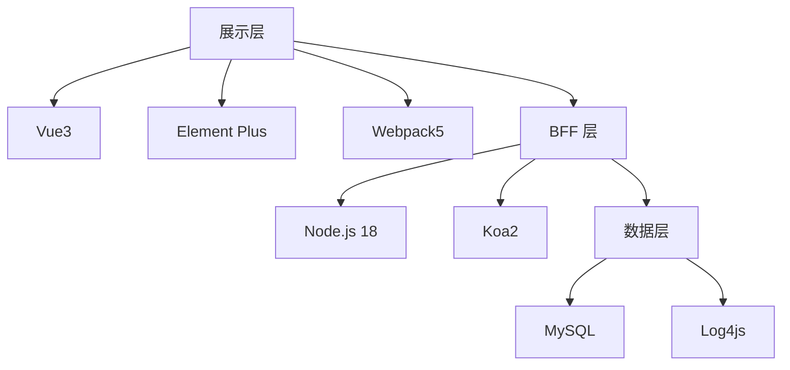

## 核心方法

本节课最后再次回到技术选型方法。

老师希望学习者关注的，不只是这些技术名称本身，而是每个选择背后的依据。

这套选型里，每一项都有对应理由：

| 技术         | 选择理由                                 |
| ------------ | ---------------------------------------- |
| MySQL        | 生态好、通用性强、对后续语言迁移友好     |
| Log4js       | 更符合企业级服务日志需求                 |
| Node.js      | 消除语言陌生感，让前端同学更平滑进入后端 |
| Koa          | 适合理解服务框架核心，也符合老师经验     |
| Vue3         | 老师经验更丰富，适合课程教学             |
| Element Plus | 主流、常见、适合中后台系统               |
| Webpack5     | 有利于完整掌握工程化思想                 |

这些理由有的来自生态，有的来自项目场景，有的来自学习目标，也有的来自老师个人经验。

这正是技术选型的真实状态。

选型不是单一标准决定的，而是多个因素综合判断后的结果。

## 学习提醒

课程后面会一行代码一行代码地带学习者完成项目。

所以这节课提到的技术，如果暂时不熟悉，不需要过度焦虑。学习者可以先通过资料建立基本概念，后面会在项目中逐步使用和理解。

更重要的是先建立技术选型意识。

以后再遇到新项目、团队协作、面试复盘或独立开发时，学习者需要能回答这些问题：

- 当前项目的核心场景是什么？
- 可选技术有哪些？
- 每个技术的优势和限制是什么？
- 团队是否具备维护能力？
- 后续是否容易扩展？
- 当前选择是否能支撑项目目标？

这些问题比单纯背技术名更重要。

## 本节小结

本节课完成了 ELPIS 系统的技术选型。

系统被分成数据层、BFF 层和展示层。数据层选择 MySQL 和 Log4js，BFF 层选择 Node.js 18 和 Koa2，展示层选择 Vue3、Element Plus 和 Webpack5。

这套技术栈的选择，分别对应不同考虑。

MySQL 强调生态、通用性和长期竞争力。

Log4js 强调企业级日志能力。

Node.js 强调前端学习后端时的平滑过渡。

Koa 强调服务端框架核心逻辑的学习。

Vue3 和 Element Plus 强调主流生态与教学熟悉度。

Webpack5 强调对前端工程化的完整理解。

本节课最重要的收获，是技术选型思路。

一个成熟的开发者，需要能从项目场景出发，结合生态、团队、未来扩展、维护成本和学习目标，选出当前最匹配的技术方案，并且清楚地说出选择背后的理由。
