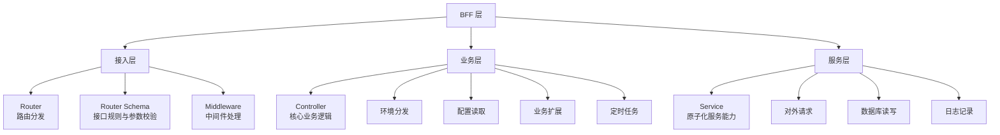
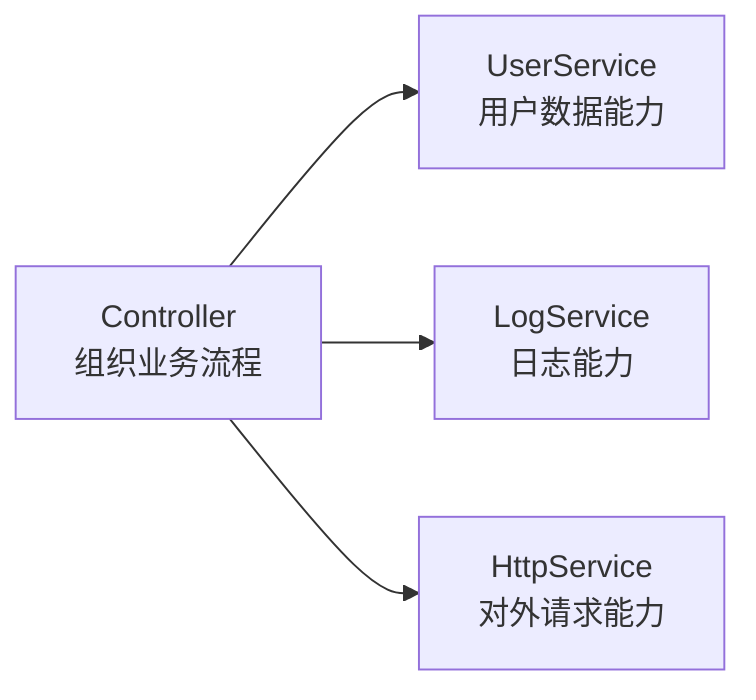
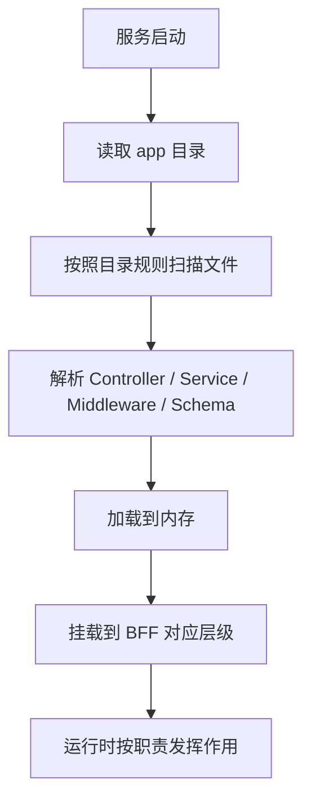
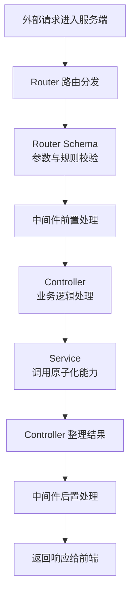
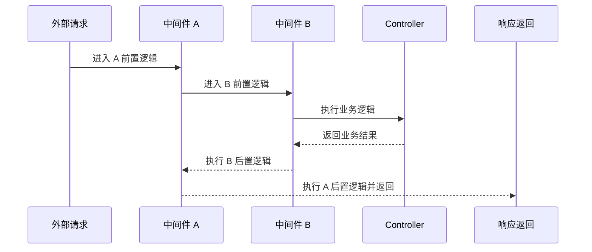
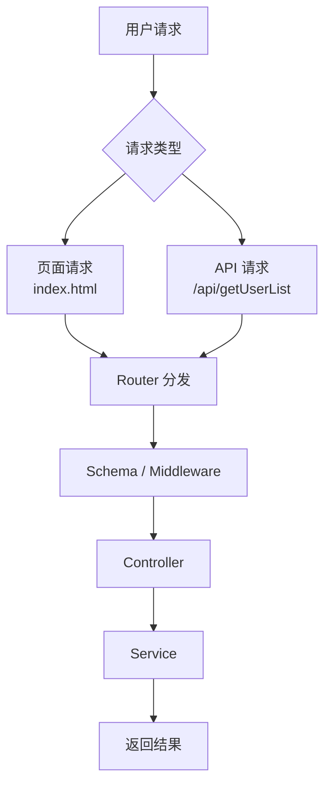

# 服务端 BFF 方案设计

<MuxPlayer
  className="mt-8"
  playbackId="rwuwQetNWeBxnWJ4LPN66fBdKlVMlkzrqMx15CU1TWY"
  title="服务端 BFF 方案设计"
/>

> [!NOTE]
>
> 本节课讲的是 **BFF 层的服务端方案设计**。上节课已经确定使用 Koa 作为服务框架，这一节继续往下推导：在 Koa 之上，如何组织一个可运行、可扩展、可维护的 BFF 服务体系。
>
> 整个 BFF 层会被拆成三部分：**接入层、业务层、服务层**。接入层负责路由分发、参数校验和中间件处理；业务层负责 Controller、环境分发、配置读取、业务扩展和定时任务；服务层负责 Service，提供数据库读写、对外请求、日志记录等原子化能力。
>
> 这一节的核心不只是认识这些名词，更重要的是理解它们如何被组织起来。课程会约定 `app` 作为服务文件根目录，再通过一个服务内核，也就是 **LPKoa**，在服务启动时扫描目录、解析文件、加载模块，并把这些模块放到 BFF 架构中对应的位置。后续所有业务能力，都会基于这个内核运行。
>
> 本节课属于后续代码实现的基础设计部分。老师强调，这几节系统设计课需要反复看，因为后面的代码会不断回到这些设计上。

## 课程位置

这一节课开始讲服务端 BFF 层的具体设计。

前面课程已经完成了技术选型，确定 BFF 层使用 **Node.js + Koa**。本节课在这个基础上继续向下展开：Koa 只是一个服务框架，真正要支撑课程里的系统，还需要在 Koa 之上设计一套服务组织方式。

这套组织方式要解决几个问题：

- 不同类型的代码应该放在哪里
- 路由、业务、服务能力如何分层
- 服务启动时如何加载这些代码
- 请求进入系统之后如何流转
- 后续业务如何基于这套规则扩展

这些问题解决之后，BFF 层才不只是几个接口文件，而是一套可以持续扩展的服务端系统。

## 整体分层

BFF 层会被拆成三层：



这三层各自承担不同职责。

接入层负责接住外部请求，并完成进入业务前的基础处理。

业务层负责承载具体业务逻辑，把请求转化成系统内部可以执行的业务动作。

服务层负责提供更底层、更通用的能力，例如请求外部服务、读写数据库、记录日志等。

## 接入层

接入层是请求进入 BFF 后最先经过的位置。

这一层主要包含三类内容：

| 模块          | 作用                             |
| ------------- | -------------------------------- |
| Router        | 根据请求路径和方法进行路由分发   |
| Router Schema | 校验请求参数、请求方法和接口规则 |
| Middleware    | 在业务处理前后执行通用逻辑       |

接入层的重点，是把外部请求先整理成系统可以处理的状态。

一个请求进入服务端后，不能直接交给业务逻辑处理。它需要先判断路径是否匹配、请求方式是否正确、参数是否符合规则，还要经过一些通用中间件处理。

这些内容放在接入层，可以让业务层保持相对干净。

业务层不用关心太多入口判断和通用拦截逻辑，只需要专注处理业务本身。

## 业务层

业务层的核心是 **Controller**。

Controller 可以理解为业务逻辑处理器。请求通过接入层之后，会进入对应的 Controller，由 Controller 根据业务场景进行处理。

业务层里不只有 Controller，还会包含一些围绕业务运行的能力，比如：

- 环境分发
- 配置读取
- 业务扩展
- 定时器
- 通用方法处理

这些内容都服务于业务逻辑。

Controller 在处理业务时，可能需要读取配置，也可能需要根据不同环境执行不同逻辑，还可能需要调用某些扩展能力。它本身是业务处理的中心，但不会把所有底层能力都写在自己里面。

这就引出了下一层：服务层。

## 服务层

服务层的核心是 **Service**。

Service 提供各种原子化能力。所谓原子化能力，可以理解为可以被多个业务复用的基础服务能力。

常见能力包括：

- 对外服务请求
- 数据库读写
- 日志书写
- 通用数据处理
- 基础接口封装

Controller 负责组织业务流程，Service 负责完成具体能力。

例如，一个 Controller 要处理“获取用户列表”的业务，它可能需要调用用户 Service 查询数据库，也可能需要调用日志 Service 记录操作，还可能需要调用其他外部服务获取补充信息。

这种拆分可以让系统结构更清楚。



> [!TIP]
>
> Controller 更关注业务语义，Service 更关注可复用能力。这个边界分清楚之后，后续系统会更容易维护和扩展。

## 目录规则

有了分层设计之后，还需要一套目录规则把这些内容真正组织起来。

老师在课程中先约定：使用 `app` 作为服务文件的根目录，不同功能的代码放到对应目录下。

可以先理解成下面这种结构：

```text
app
├── controller
│   ├── user.js
│   └── site.js
├── service
│   ├── user.js
│   ├── log.js
│   └── http.js
├── router
│   └── index.js
├── middleware
│   ├── auth.js
│   └── error.js
└── schema
    └── user.js
```

这套规则的作用，是让系统知道不同代码应该属于哪一层。

写 Controller，就放到 `app/controller`。

写 Service，就放到 `app/service`。

写中间件，就放到 `app/middleware`。

写接口规则，就放到 `app/schema`。

目录规则让代码从一开始就有秩序。后续项目变大之后，开发者也能快速判断一个能力应该放在哪里。

## 服务内核

只有目录规则还不够。

目录只是静态文件结构，系统运行时还需要把这些文件读取出来、加载起来、挂载到对应位置。这个过程需要一个解析器，也就是课程中提到的服务内核。

老师暂时把这个内核命名为 **LPKoa**。

LPKoa 的职责可以概括为：



这一步是 BFF 层最关键的底层设计。

开发者写的 Controller、Service、中间件和规则文件，最终都需要通过 LPKoa 被系统识别和加载。没有这个内核，目录规则只是一种文件摆放方式，无法真正变成运行时能力。

> [!IMPORTANT]
>
> LPKoa 是整个 BFF 层的服务内核。后续业务扩展、服务运行和代码组织，都会基于这个内核展开。

## 小型 Egg 思路

老师把 LPKoa 类比成一个简单版的 Egg。

Egg 本身是一个成熟的 Node.js 企业级框架，内部有完整的目录约定、插件机制、加载机制和运行时能力。课程里的 LPKoa 不会做到 Egg 那么复杂，但会借鉴类似思想：通过约定目录和服务加载机制，把业务代码组织成可运行的服务系统。

这个类比可以帮助理解课程目标。

课程后面不是简单写几个 Koa 接口，而是会在 Koa 之上搭建一个更有规则、更接近企业级服务框架的小型内核。

可以这样理解两者关系：

| 层级  | 说明                                            |
| ----- | ----------------------------------------------- |
| Koa   | 提供基础 Web 服务能力                           |
| LPKoa | 在 Koa 之上增加目录约定、模块解析和业务组织能力 |
| Egg   | 更成熟、更完整的企业级 Node.js 框架             |

LPKoa 的意义，是让学习者亲手理解一个服务框架的核心组织方式。

## 请求流程

本节课的另一条主线，是请求在 BFF 层中的流转过程。

一个外部请求进入服务端之后，会依次经过接入层、业务层、服务层，然后再返回结果。

完整流程可以整理成这样：



这条流程后续会反复出现。

它把 BFF 层里的几个关键模块串了起来：Router 负责找到入口，Schema 负责校验规则，中间件负责通用处理，Controller 负责业务逻辑，Service 负责底层能力，最后再经过中间件后置处理返回结果。

## 中间件模型

Koa 的中间件是洋葱模型。

老师在字幕里提到，中间件可以理解为一层一层包裹在业务处理逻辑外面的结构。每个中间件都有进入时机，也有离开时机。

它的执行方式可以用下面的图理解：



这种模型的特点是“先进后出”。

先进入的中间件，最后离开。外层中间件包住内层中间件，内层再包住真正的业务处理逻辑。

中间件可以用于很多通用场景：

- 日志记录
- 错误处理
- 权限校验
- 请求耗时统计
- 响应格式统一
- 特定 API 的前置处理

中间件既可以全局配置，也可以针对某些具体接口单独配置。

> [!WARNING]
>
> 中间件的理解是 Koa 学习中的重点。刚开始只看概念会比较抽象，后续写代码时需要反复结合流程图和实际代码回看。

## 页面与 API

老师在课程中特别强调：无论是页面请求，还是 API 请求，都可以走同一套服务流程。

例如用户访问：

```text
localhost:3000/index.html
```

或者访问：

```text
localhost:3000/api/getUserList
```

它们都可以进入同一套 BFF 处理链路。

区别只在于路由匹配之后，最终分发到不同的处理逻辑。页面请求可能返回 HTML 或静态资源，API 请求可能返回 JSON 数据，但进入服务端后的组织方式是一致的。

这个设计让 BFF 层有统一入口。



统一流程的好处，是系统不用为不同类型请求设计完全割裂的处理方式。

页面请求和 API 请求都进入同一套服务内核，后续扩展和维护会更稳定。

## 设计重点

这一节课反复强调，当前讲的是系统设计。

设计课不会停留太久，也不会在这一阶段把所有细节都完全展开。后面的代码实现过程中，会不断回到这些设计，再一行一行实现出来。

这几节课需要反复看，原因在于：

> 后面的代码不是孤立出现的，每一部分实现都会对应前面讲过的系统设计。

尤其是下面几个内容，后续会频繁回看：

- BFF 三层结构
- `app` 目录约定
- LPKoa 服务内核
- 文件扫描和解析
- Router 分发
- Schema 校验
- Koa 洋葱模型
- Controller 与 Service 的调用关系
- 页面请求与 API 请求的统一流程

这些内容先建立概念，后面写代码时再逐步落地。

## 学习建议

老师建议学习者可以提前去看一下 Koa 官网。

现阶段不需要把 Koa 所有内容都掌握到很深，但至少要先建立基本概念。比如 Koa 是什么，中间件如何工作，`ctx` 和 `next` 大概代表什么，请求如何经过多个中间件流转。

可以先重点看这些内容：

- Koa 基本使用方式
- 中间件机制
- 洋葱模型
- 路由相关生态
- 请求和响应对象

> [!TIP]
>
> 这一阶段先建立概念即可。后续课程会通过项目代码逐步实现，学习者可以一边写代码，一边回看这一节的系统设计。

## 课程目标

这一节课最后回到更大的课程目标上。

老师希望学习者通过后续课程，逐步掌握系统设计能力和良好的编程思想。只要这两项能力建立起来，之后遇到新的技术、新的框架、新的系统场景，都会更有底气。

本节课中的 BFF 设计，就是系统设计能力的一次具体训练。

它要求学习者不只关注某一个接口怎么写，还要理解：

- 服务端系统如何分层
- 业务代码如何被组织
- 目录规则如何变成运行时能力
- 请求如何在系统中流转
- 通用能力如何被抽象和复用

这些内容会直接影响后续项目质量。

## 本节小结

本节课讲清楚了 BFF 层的服务端方案设计。

整个 BFF 层被拆成三层：接入层、业务层和服务层。接入层负责 Router、Router Schema 和中间件；业务层负责 Controller、环境分发、配置读取、业务扩展和定时任务；服务层负责 Service，提供对外请求、数据库读写和日志记录等原子化能力。

为了让这些模块真正运行起来，课程会约定 `app` 目录作为服务文件根目录，并通过 LPKoa 服务内核在启动时扫描、解析和加载这些文件。

请求进入服务端之后，会经过 Router 分发、Schema 校验、中间件前置处理、Controller 业务处理、Service 能力调用、中间件后置处理，最后返回结果。页面请求和 API 请求都可以走这套流程。

这一节课是后续服务端代码实现的基础。

后面课程会围绕 LPKoa 内核逐步展开，把这里讲到的目录规则、解析器、分层结构和请求流程一行一行实现出来。
