# 前端领域模型架构设计

<MuxPlayer
  className="mt-8"
  playbackId="Ih00jLEylwb31lfqywofwGZoop00fWKATZvPBZhvXJBWU"
  title="前端领域模型架构设计"
/>

> [!NOTE]
>
> 本节课讲的是 **前端领域模型架构设计**。前面已经明确了系统要解决的问题：中后台项目里有大量重复性 CRUD，同时不同项目、不同客户又存在定制化需求。前端方案要同时处理这两件事：重复能力尽量沉淀，特殊能力保留扩展空间。
>
> 本节课提出的核心设计是：用一套统一的 **DSL / Schema** 描述系统结构，再通过前端解析引擎把这份配置解析成具体页面。这样可以把大量重复页面、组件和交互规则沉淀下来，减少人工重复开发。
>
> 仅有 DSL 还不够。系统还需要借鉴面向对象里的封装、继承和多态思想，让标准领域模型可以派生出不同项目的配置。不同系统基于同一套基础模型扩展自己的定制内容，最终通过解析器生成具体页面。
>
> 前端整体会围绕两个核心任务展开：第一，定义能描述系统结构的 DSL；第二，实现能响应 DSL 的模板框架和解析引擎。后续开发中，工具库、组件库、模板页、Schema View、Iframe View、Custom View 等能力都会围绕这条主线展开。

## 课程位置

这一节课讲的是前端整体方案设计。

前面几节课已经完成了痛点分析、目标推导、技术选型和服务端 BFF 方案设计。到这一节，课程开始把视角放回前端，思考前端部分如何承接前面提出的系统目标。

这个系统面对的场景很典型。

未来会有很多增删改查类运营系统，也可能存在标准产品交付给不同客户的情况。不同系统之间有大量相似页面和相似功能，但每个系统又会有自己的特殊需求。

所以前端设计需要同时满足两类诉求：

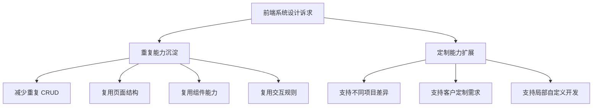

这也是本节课的主线。

重复的部分尽量少做，特殊的部分有针对性地做。前端架构的设计，就是围绕这个目标展开。

## 核心矛盾

中后台系统里，很多内容高度相似。

列表、表单、搜索、分页、操作按钮、详情页、编辑页，这些模块会在不同项目中不断出现。开发者如果每次都手写一遍，就会持续陷入重复性工作。

但问题在于，这些系统又不能完全复用。

每个客户、每个业务、每个项目都会有自己的特殊逻辑。字段不同，按钮不同，接口不同，页面布局不同，操作流程也可能不同。

因此前端设计要处理一个很现实的矛盾：

| 需求类型 | 具体表现                             | 设计方向               |
| -------- | ------------------------------------ | ---------------------- |
| 共性能力 | 大量页面结构、组件、交互逻辑重复     | 抽象、沉淀、复用       |
| 特异需求 | 不同项目有不同字段、接口、按钮和流程 | 配置、继承、扩展       |
| 研发目标 | 少做重复工作，把时间放到差异部分     | 建设领域模型和解析引擎 |

这也是老师前面反复强调的理想状态：

> 重复性的工作尽可能少做，特异性的功能针对性开发。

## 领域模型

本节课引入了 **领域模型** 的设计思路。

领域模型在这里可以理解为一套描述系统结构的数据模型。它不直接写死页面，而是用一份配置描述页面应该长什么样、有哪些组件、调用什么接口、接收什么参数、如何渲染。

老师把这套描述结构称为 **DSL**。

DSL 可以理解成一种面向当前业务场景的“描述语言”。它不一定是新的编程语言，也可以是一套结构化数据。前端通过这套结构化数据，就能知道系统应该如何生成页面。

可以把这个过程理解成：

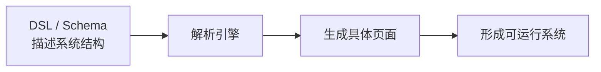

这一步的意义很大。

原来开发者需要手写大量页面代码，现在可以把重复内容抽象成配置，再交给解析器生成。页面开发从“每次重新写一遍”变成“用配置描述差异”。

## DSL 作用

DSL 的作用，是把系统里的重复结构描述出来。

比如一个普通后台列表页，通常会包含搜索区、表格区、操作按钮、分页、接口请求和表单弹窗。过去这些内容可能都要手写。引入 DSL 后，就可以通过配置描述这些内容。

例如：

```text
页面结构
  ├── 搜索区域
  ├── 表格区域
  ├── 操作按钮
  ├── 表单弹窗
  └── 接口配置
```

这类结构在很多中后台系统里都会反复出现。

如果每次都手写，开发者就会不断重复劳动。如果用 DSL 描述，再由解析器生成，就可以把大量共性能力沉淀下来。

DSL 的核心价值可以概括为：

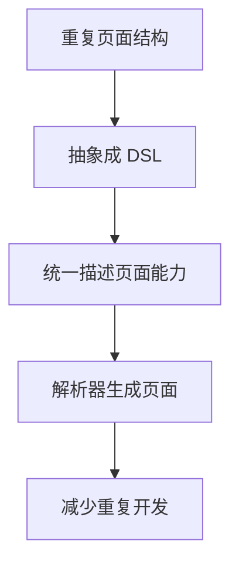

> [!IMPORTANT]
>
> DSL 在这里承担的是“描述系统”的角色。它把页面结构、组件关系、接口规则和交互方式写成配置，再交给解析引擎生成具体页面。

## 定制问题

只有 DSL 还不能完全解决问题。

DSL 能描述重复结构，也能生成标准页面，但真实项目里一定会出现特殊需求。不同客户、不同系统、不同业务，都会要求在标准流程之外增加一些差异。

如果系统只能按照固定 DSL 生成页面，就会缺少定制能力。

所以前端设计还需要引入另一种思想：**面向对象设计**。

老师这里提到了面向对象的三个核心概念：

- 封装
- 继承
- 多态

它们对应到前端领域模型里，可以这样理解：

| 面向对象概念 | 在本系统中的体现                                 |
| ------------ | ------------------------------------------------ |
| 封装         | 把通用页面结构、组件能力、交互规则沉淀成基础模型 |
| 继承         | 不同项目可以基于基础模型派生出自己的配置         |
| 多态         | 同一类能力在不同项目中可以有不同表现             |

也就是说，领域模型不能只是一份固定配置。

它需要支持继承、扩展和重载。

## 配置继承

课程里的前端领域模型，需要支持从基础配置派生出子配置。

标准系统可以先定义一套基础模型。不同项目在这个基础模型上新增配置、修改配置，或者重载某些能力。这样既能复用标准能力，又能保留项目自己的特殊逻辑。

这个过程可以用下面的图理解：

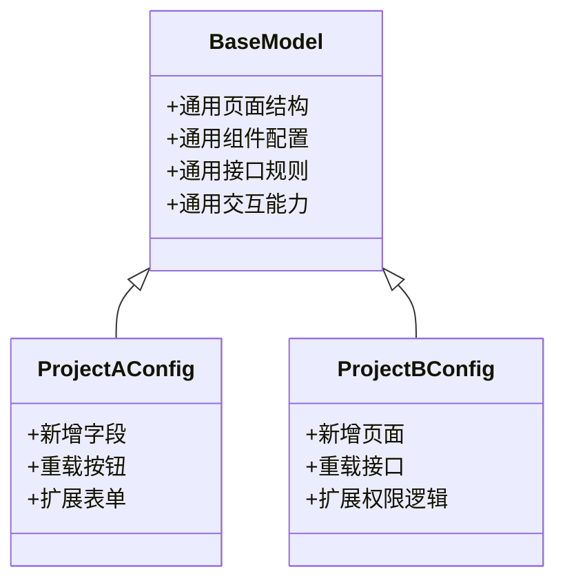

这种设计可以解决两个问题。

第一，重复内容不需要每个项目重新写。

基础模型已经沉淀了标准页面、标准组件和标准交互。新项目只需要继承这些能力。

第二，特殊内容可以在子配置中处理。

不同项目需要新增字段、调整按钮、替换接口、定制页面，都可以通过扩展和重载完成。

> [!TIP]
>
> 领域模型的继承能力，是前端系统支持多项目、多客户、多场景交付的关键。它让系统既能复用标准能力，也能保留定制空间。

## 两件核心事

本节课明确提出，前端接下来需要完成两件非常核心的事情。

第一件事，是定义 DSL。

这份 DSL 要能够描述具体项目的领域模型，包括页面结构、组件关系、接口配置、数据展示、交互动作和扩展点。

第二件事，是实现解析引擎。

解析引擎负责读取 DSL，并根据 DSL 动态生成具体系统。没有解析引擎，DSL 只是一份配置文件；有了解析引擎，配置才能真正变成页面和系统能力。

可以整理成下面这条链路：

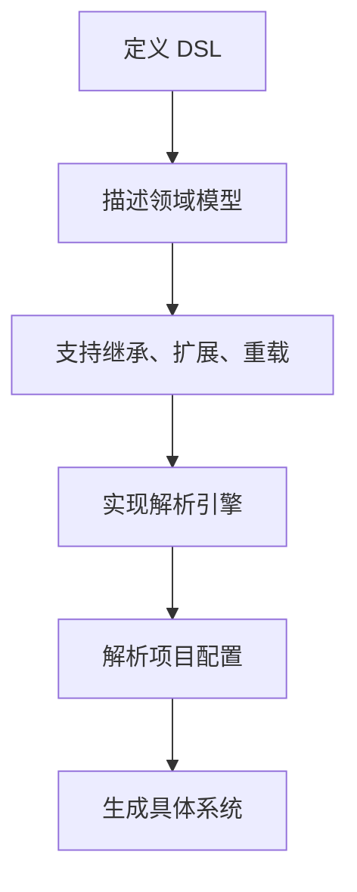

这条链路就是前端后续实现的主线。

老师也提醒，这一阶段听起来会比较抽象。当前只需要先建立整体概念，后面真正写代码时，会逐步把这些内容拆开讲清楚。

## 模板框架

有了 DSL 和解析引擎之后，还需要一个能响应 DSL 的模板框架。

这个模板框架负责承载页面运行。

它不是某一个具体业务页面，而是一套可以根据配置生成不同页面的前端框架。DSL 提供描述，模板框架负责响应描述，解析引擎负责把描述转换成页面。

整体关系可以这样理解：

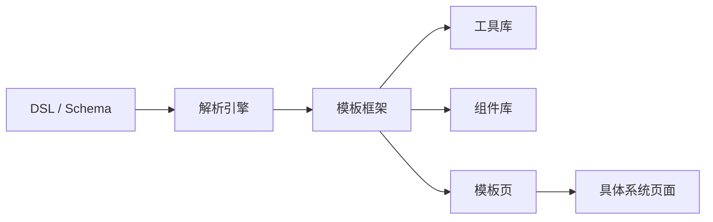

模板框架里会包含几个重要部分：

- 工具库
- 组件库
- 模板页
- Schema View
- Iframe View
- Custom View

这些内容共同支撑前端页面的生成和扩展。

## 工具库

前端需要一个工具库。

工具库用来存放各种通用方法和基础能力，比如网络请求、公共方法、数据处理工具等。后续如果系统出现新的通用能力，也可以继续添加到工具库中。

工具库的价值在于减少重复代码。

很多系统都会用到相似的请求方法、数据处理方法、格式化方法。如果每个页面各写一套，后期维护会非常困难。把这些能力沉淀到工具库中，可以让业务开发更稳定，也更容易复用。

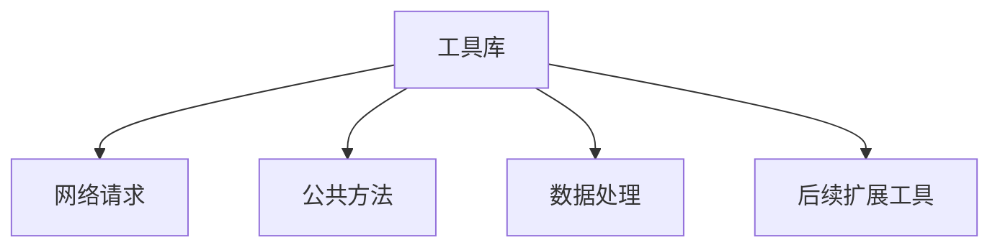

工具库属于前端模板框架的基础设施。

它不直接决定页面长什么样，但会支撑组件、页面和业务逻辑运行。

## 组件库

组件库是模板框架里非常重要的一部分。

本节课提到，组件库中的组件应该能够根据 Schema / DSL 进行渲染。也就是说，组件不只是普通静态组件，还需要具备配置驱动能力。

常见组件包括：

- Header Container
- Sider Container
- Search Bar
- Table
- Form
- 其他动态组件

这些组件需要能够通过 DSL 描述出具体表现，比如：

```text
组件需要展示什么
组件调用什么接口
组件接收什么参数
组件如何渲染数据
组件有哪些操作按钮
组件触发什么交互
```

组件库的设计目标，是把中后台常见页面能力沉淀下来。

例如 Search Bar 负责搜索区域，Table 负责表格展示，Form 负责新增和编辑。它们都是高频出现的通用模块，适合被封装成可配置组件。

## 组件扩展

组件库不能只做固定能力。

真实项目里经常会有新需求，所以组件库需要支持动态扩展。系统可以根据后续开发需求，不断新增组件，也可以对已有组件保留扩展点。

本节课特别提到了几个扩展方式：

| 组件             | 扩展方式                                 |
| ---------------- | ---------------------------------------- |
| Header Container | 预留插槽                                 |
| Sider Container  | 预留插槽                                 |
| Search Bar       | 支持动态扩展组件                         |
| Form             | 支持动态扩展表单项                       |
| Table            | 根据 Schema 渲染操作按钮，并动态调起组件 |

这种设计可以让组件库既有标准能力，又不把业务写死。

尤其是 Table。

表格在中后台系统里非常高频，通常会带有查看、编辑、删除、启用、禁用、导出等操作。通过 Schema 描述操作按钮，再由 Table 动态渲染，就可以避免每个页面重复写按钮逻辑。

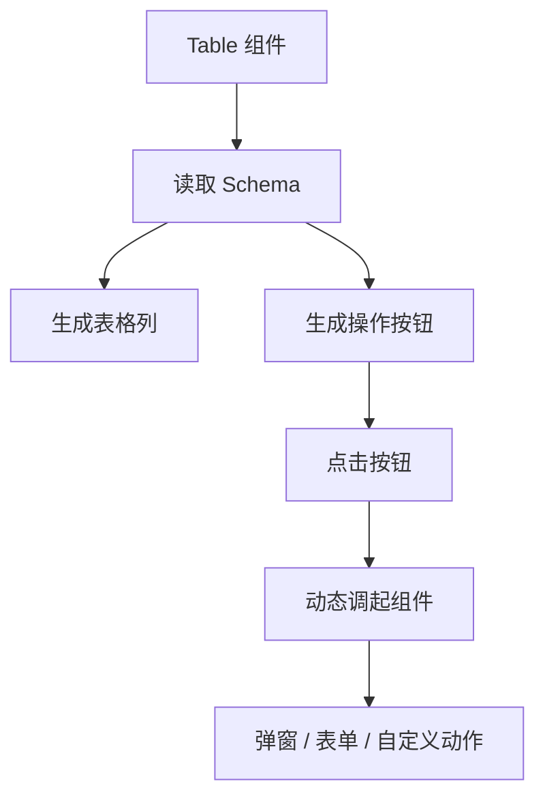

## 模板页

模板页是响应 DSL 的页面入口。

课程里会先实现一个模板页入口。用户进入这个模板页后，系统会根据 DSL 和 Vue 的渲染能力，把页面分发到不同类型的 View 上。

本节课提到三类 View：

| View 类型   | 作用                     |
| ----------- | ------------------------ |
| Schema View | 根据 Schema 动态渲染页面 |
| Iframe View | 支持引入第三方页面       |
| Custom View | 支持完全自定义页面开发   |

这三类 View 对应三种不同场景。

Schema View 用于标准化程度比较高的页面。

Iframe View 用于需要嵌入第三方服务页面的场景。

Custom View 用于特殊程度比较高、无法完全通过 Schema 描述的页面。

整体分发过程可以这样理解：

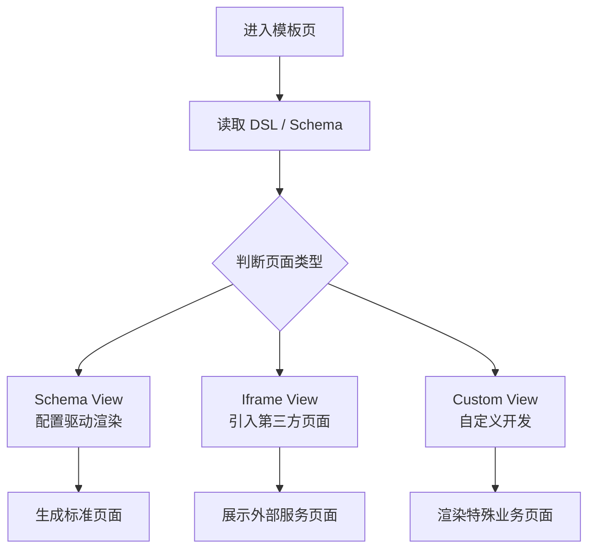

这套设计让模板页既能处理大部分标准场景，也能给特殊场景留下入口。

## Schema View

Schema View 是前端领域模型设计中最重要的一类页面。

它负责根据 Schema 动态渲染页面。中后台里大量标准页面，都可以通过 Schema View 承接。

一个典型的 Schema View 页面，可能会由这些组件组成：

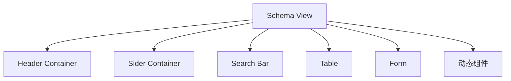

这些组件都通过 Schema 进行配置。

页面结构、字段展示、搜索条件、表格列、按钮、弹窗表单，都可以被描述出来。这样一来，一个标准 CRUD 页面就可以通过配置快速生成。

Schema View 解决的是 80% 的标准业务场景。

这些场景不需要每次重新开发，只需要在领域模型中完成配置，再交给解析引擎和组件库处理。

## Iframe View

Iframe View 用来支持第三方页面引入。

有些场景里，系统需要嵌入已有服务页面，或者接入外部系统提供的页面。如果完全重新开发成本较高，Iframe View 可以作为一种集成方式。

它的作用比较清晰：

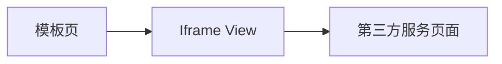

这种设计让系统不会只局限在自研页面上。

当项目需要快速接入外部能力时，可以通过 Iframe View 完成页面承载。

## Custom View

Custom View 用来处理特殊业务需求。

有些页面结构复杂，交互特殊，或者业务逻辑和标准 CRUD 差别很大。这类页面如果强行塞进 Schema View，配置会变得很复杂，系统也会失去清晰性。

Custom View 提供了完全自定义开发的空间。

也就是说，标准页面走 Schema View，第三方页面走 Iframe View，特殊页面走 Custom View。这样前端系统既有配置化能力，也不会把所有场景都强行配置化。

> [!WARNING]
>
> 配置化不是把所有页面都配置出来。标准、高频、重复的部分适合配置化；特殊、复杂、差异明显的部分更适合保留自定义开发入口。

## 多页面设计

本节课还提到，系统本身支持多页面设计。

当前课程里会先实现一个模板页入口，但这个模板页只是其中一个入口。后续如果有更多页面需求，也可以新增其他模板页，再根据具体场景开发新的页面入口。

这说明前端架构并不局限于单一页面形态。

它可以先从一个核心模板页开始，把通用能力跑通；后续根据业务复杂度，再扩展更多模板页。

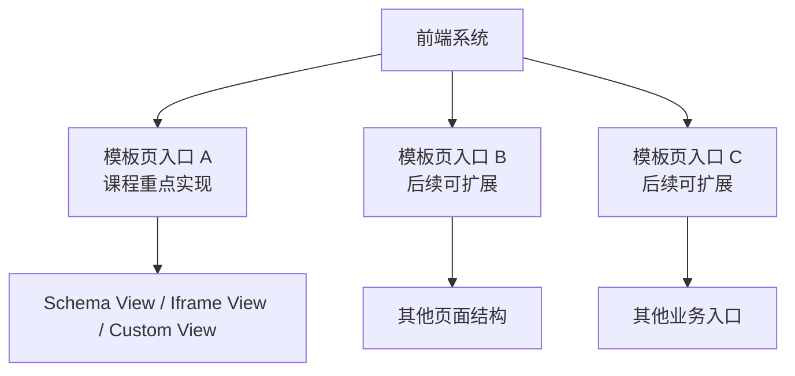

这种设计给系统后续演进留下了空间。

## 工作重心

前端领域模型设计完成后，研发工作重心会发生变化。

过去开发者可能每天都在重复写管理后台页面。大量时间花在列表、表单、按钮、弹窗、接口对接上。

引入领域模型和模板框架之后，重复部分可以沉淀为可复用能力。研发更多时间会投入到两类事情上：

- 维护和增强可复用组件、工具、模板能力
- 针对具体项目开发新增需求和定制化能力

这正是本节课希望达成的状态。

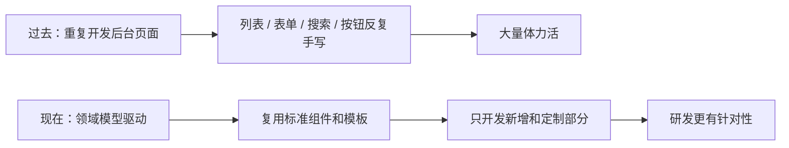

系统中可复用部分解决大部分常规业务，定制部分只处理少量特殊需求。

老师用颜色区分过这类关系：蓝色和黄色部分代表已经沉淀好的可复用能力，绿色部分代表不同项目中的定制化开发内容。

可以理解为：

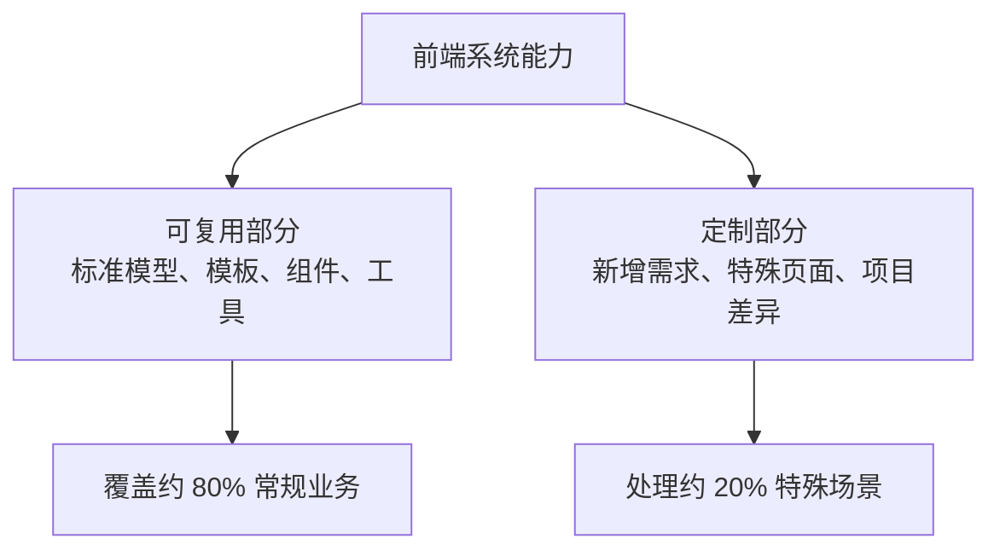

## 系统收益

这种设计带来的收益，不只是开发效率提升。

第一，重复工作会减少。

标准页面和高频组件由 DSL、解析引擎和组件库承接，开发者不用反复手写相同结构。

第二，个人成长会更明显。

开发者的工作会从写重复页面，逐步转向维护组件体系、设计配置结构、实现解析引擎和处理特殊业务。这些工作更接近架构设计和基础能力建设。

第三，系统可维护性会更好。

如果每个项目都复制一套页面代码，时间久了会越来越难维护。通过统一模型和模板框架沉淀能力，可以减缓项目复杂度增长，也能减少代码失控。

> [!IMPORTANT]
>
> 这套前端设计的价值，不只是提效。它会把研发从重复页面开发中拉出来，让开发者把更多精力放在可复用能力、扩展机制和系统结构上。

## 学习提醒

老师在最后提醒，这一节虽然讲得比较快，但后面会频繁回到这张设计图。

当前阶段有些内容听起来抽象是正常的。

领域模型、DSL、解析引擎、模板框架、配置继承、Schema View，这些概念单独听会比较虚。后续真正写代码时，课程会不断回到这一节的设计，把这些内容一步一步落地。

学习时可以先抓住这几个关键点：

- 前端要解决重复开发和定制扩展两个问题
- DSL 用来描述系统结构
- 解析引擎用来把 DSL 转成页面
- 配置要支持继承、扩展和重载
- 模板框架要包含工具库、组件库和模板页
- 页面分成 Schema View、Iframe View、Custom View
- 标准能力沉淀，特殊能力定制开发

> [!TIP]
>
> 当前阶段先建立整体图景。后面写代码时，再把 DSL、组件、模板页和解析流程逐步拆开理解。

## 课程转折

这一节课也标志着前期设计部分基本结束。

老师在结尾提到，前言、问题分析、技术选型和整体设计到这里就过完了。下一节课开始，课程会进入真正的研发阶段，也就是开始一步一步把前面设计出来的方案落地。

所以这一节课承担的是承上启下的作用。

它把前端系统的整体设计讲完，也为后续代码实现建立了架构基础。后面写代码时，学习者需要不断回头看这一节，理解每段代码对应的是哪一个设计点。

## 本节小结

本节课讲清楚了前端领域模型架构设计。

前端要解决的核心问题，是中后台系统里大量重复 CRUD 和项目定制需求同时存在。系统需要把重复部分沉淀下来，把特殊部分留出扩展空间。

为了解决这个问题，课程引入 DSL / Schema 描述系统结构，再通过解析引擎把配置解析成具体页面。同时，DSL 需要支持继承、扩展和重载，让标准领域模型可以派生出不同项目的配置。

前端模板框架会围绕工具库、组件库和模板页展开。

工具库沉淀公共方法和请求能力。

组件库沉淀 Header Container、Sider Container、Search Bar、Table、Form 等可配置组件。

模板页负责响应 DSL，并把页面分发到 Schema View、Iframe View 和 Custom View。

这套设计最终希望让 80% 的常规业务通过配置和复用完成，把研发精力集中到 20% 的新增和定制需求上。这样既能减少重复工作，也能提升系统可维护性和开发者成长空间。
