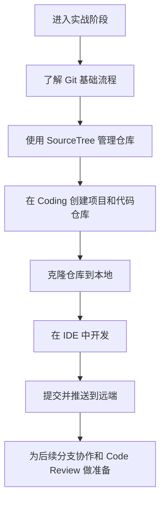
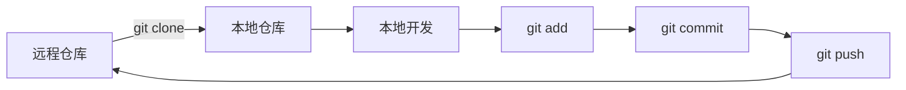
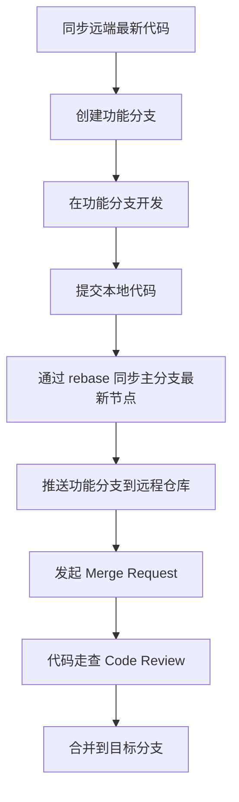
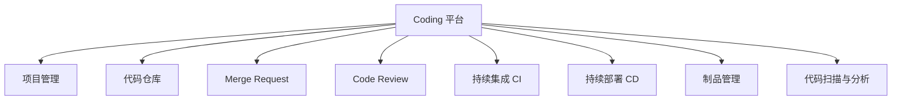
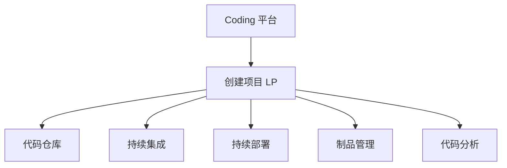
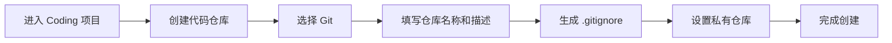
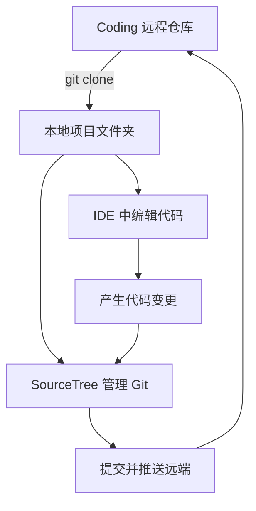
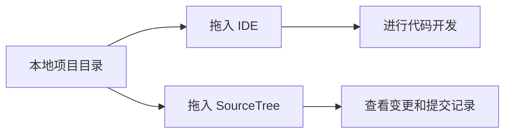
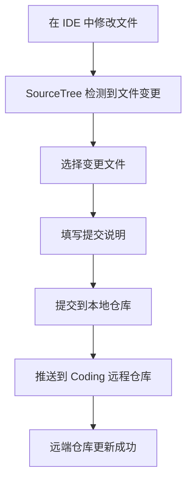
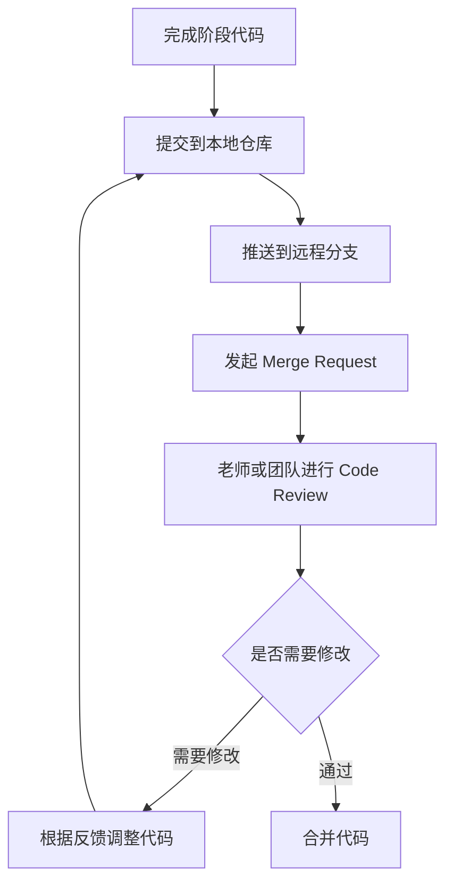

# 创建项目 - git 环境搭建

<MuxPlayer
  className="mt-8"
  playbackId="WegpIU027VWGQGWrXwO7jnnCOlnD2Es6KfmiGwgbrOAs"
  title="创建项目 - git 环境搭建"
/>

> [!NOTE]
>
> 本节课开始进入真实实战阶段，主题是 **Git 环境搭建与代码仓库初始化**。
>
> 这一节主要完成四件事：先扫一遍 Git 的基础使用流程，再介绍可视化管理工具 SourceTree，接着在腾讯 Coding 平台创建项目和代码仓库，最后通过一次简单修改，完整演示从本地开发到提交远程仓库的流程。
>
> 后续课程里的代码管理、分支协作、Merge Request、Code Review、流水线和部署都会围绕 Coding 平台展开。所以这一节虽然是环境准备课，但它会直接影响后面整个项目的研发协同方式。
>
> 本节课的重点不是把 Git 命令讲得很深，而是先让学习者把项目仓库、IDE、SourceTree 和 Coding 平台连接起来，形成后续开发的基础工作流。

## 课程开始

这一节课开始，课程正式进入项目实战阶段。

前面几节课主要在讲课程背景、项目痛点、目标推导、技术选型和架构设计。从这一节开始，课程会逐步进入真实开发流程。老师先安排的内容是 Git 环境搭建，因为后面所有代码都会通过 Git 管理。

本节课会围绕四个部分展开：

- Git 基础使用
- SourceTree 可视化管理
- Coding 平台项目创建
- 本地修改、提交、推送流程

这四部分会共同构成后续项目开发的基础环境。

可以先把这一节的整体结构理解成下面这条线：



## Git 基础

Git 是后续项目代码管理的基础工具。

老师这一节不会深入讲 Git 的所有命令，只做一次基础扫盲。学习者需要先知道代码从远端仓库到本地，再从本地提交回远端的大致流程。

最基础的流程是：



这条线对应的是最简单的一次代码提交过程。

先从远程仓库把代码克隆到本地，本地开发完成后，通过 `git add` 把改动加入暂存区，再通过 `git commit` 提交到本地仓库，最后通过 `git push` 推送到远程仓库。

常见命令可以先记住这几个：

```bash filename="git-commands" copy
git clone <仓库地址>
git add .
git commit -m "提交说明"
git push
```

这些命令会在后续项目中反复出现。

## 迭代开发

真实项目不会只提交一次代码。

后续进入迭代开发后，开发者通常需要先同步远端代码，再创建自己的功能分支，在分支上完成开发，最后发起合并请求。

这条流程可以整理成这样：



这里老师提到了 `git rebase`。

`git rebase` 可以理解成把当前分支的基点移动到主分支的最新节点上。这样做的目的，是让当前功能分支基于最新代码继续提交，减少后续合并时的混乱。

> [!TIP]
>
> 当前阶段只需要先理解 Git 的基本工作流。分支命名、分支策略、Merge Request 和 Code Review 后续会结合具体开发继续展开。

## SourceTree

课程后续会使用 **SourceTree** 作为 Git 可视化管理工具。

在真实开发中，开发者不一定每一步都通过命令行操作 Git。很多时候，会借助可视化工具查看分支、提交记录、文件变更和远端同步状态。

SourceTree 在这里主要承担两个作用：

- 更直观地查看 Git 仓库状态
- 更方便地完成提交、推送、拉取、分支管理等操作

老师也说明，这个工具不是强制要求。

如果学习者已经有自己熟悉的 Git 工具，可以继续使用自己的工具。但课程中的演示会以 SourceTree 为基准，后面看到的 Git 操作、分支管理和提交演示，也会主要通过 SourceTree 展示。

> [!IMPORTANT]
>
> 使用 SourceTree 的重点不是依赖工具本身，而是通过可视化方式更清楚地理解仓库状态、文件变更和分支流转。

## Coding 平台

课程后续的研发协同会围绕 **腾讯 Coding 平台** 展开。

Coding 在这里不只是代码仓库平台，还会承载后续项目里的多种研发能力，比如代码仓库管理、持续集成、持续部署、代码扫描、代码分析、制品管理和 Code Review。

可以把 Coding 在课程中的位置理解成：



这也是老师选择先讲 Coding 的原因。

后面项目不仅要写代码，还会涉及仓库管理、流水线、部署和团队协作。Coding 会作为这些流程的统一入口。

## 创建项目

进入 Coding 后，第一步是创建项目。

这里需要先区分一个概念：Coding 里的“项目”和 Git 代码仓库不是同一个东西。

Coding 项目更像一个研发协同空间，里面可以继续创建代码仓库、配置流水线、管理制品、做代码扫描等。代码仓库只是这个项目空间里的一个组成部分。

这一步的关系可以这样理解：



课程中创建的项目名称是围绕 **LP** 展开的。

项目创建完成之后，就可以进入这个项目，再继续创建 Git 代码仓库。

## 创建仓库

创建完 Coding 项目后，下一步是创建代码仓库。

课程中选择的是 Git 仓库，并设置为私有仓库。创建时会填写仓库名称、描述，并生成 `.gitignore` 文件。

这一步完成后，远程仓库就准备好了。

可以把流程整理成：



仓库创建完成后，本地开发环境就可以通过克隆地址把项目拉下来。

## 克隆方式

Coding 仓库创建完成后，会提供两种常见克隆方式：

| 方式  | 说明                         |
| ----- | ---------------------------- |
| HTTPS | 使用账号和密码进行拉取和推送 |
| SSH   | 通过 SSH Key 建立认证关系    |

课程中主要演示的是 HTTPS 方式。

HTTPS 方式会使用 Coding 账号相关信息完成认证。账号通常来自个人设置里的手机号或邮箱，密码则按照平台的认证方式处理。

SSH 方式也可以使用，但需要提前配置 SSH Key。课程中没有展开具体配置，只是提醒学习者可以根据资料自行了解。

> [!WARNING]
>
> HTTPS 和 SSH 都可以用于克隆仓库。课程演示采用 HTTPS，学习者如果平时习惯 SSH，也可以继续使用自己的方式。

## 本地环境

远程仓库准备好之后，需要把它拉到本地。

老师在演示中打开了几个关键工具：

- 终端
- 本地文件夹
- IDE
- SourceTree

它们各自承担不同职责：

| 工具       | 作用                    |
| ---------- | ----------------------- |
| 终端       | 执行 `git clone` 等命令 |
| 本地文件夹 | 存放克隆下来的项目      |
| IDE        | 编辑代码                |
| SourceTree | 管理 Git 状态和提交流程 |

整体关系可以这样表示：



这条链路搭好之后，后续开发就有了基础环境。

## 克隆项目

课程中通过终端执行 `git clone`，把 Coding 上创建好的仓库克隆到本地。

命令形式类似：

```bash filename="git-clone" copy
git clone <Coding 仓库地址>
```

克隆完成后，本地文件夹中会出现对应项目目录。

接下来需要把这个项目分别交给 IDE 和 SourceTree 管理：



IDE 负责写代码。

SourceTree 负责观察变更、提交代码、推送远端和管理分支。

这也是后续课程里的主要开发方式。

## 首次提交

环境搭好之后，老师演示了一次从修改代码到提交远端的完整流程。

这次演示比较简单，只是在项目文件里添加了一句话，然后回到 SourceTree 查看文件变更，填写提交说明，完成提交，再推送到远端仓库。

完整流程如下：



对应到 Git 命令，大致就是：

```bash filename="git-commit" copy
git add .
git commit -m "提交说明"
git push
```

这里的重点，是让学习者完成第一次完整闭环。

代码从远程仓库克隆到本地，在本地修改，再提交并推回远程。这个闭环跑通后，后续开发才可以继续往下推进。

## 协作准备

本节课前面提到，后续课程会涉及里程碑式代码提交。

也就是说，项目推进到某些阶段后，学习者可能需要把代码提交上来，通过 PR 或 MR 的方式发起合并请求。老师会基于这些合并请求进行代码走查，也就是 Code Review。

这里可以先理解后续协作流程：



这条流程和后面的 GitFlow 分支策略会有直接关系。

本节课只是先把协作工具和仓库环境准备好，后面会继续讲具体分支怎么拉、分支怎么命名、代码怎么合并。

## 本节重点

这一节课虽然叫 Git 环境搭建，但实际完成的是整个项目研发流程的起点。

学习者需要完成几个基础动作：

- 注册并登录 Coding
- 创建课程项目
- 创建 Git 代码仓库
- 选择 HTTPS 或 SSH 方式克隆仓库
- 把项目导入 IDE
- 把项目导入 SourceTree
- 修改一次代码
- 完成本地提交
- 推送到远程仓库

这些动作完成之后，后续课程就可以正式进入代码开发。

> [!TIP]
>
> 这一节最好跟着视频实际操作一遍。Git 环境、远程仓库、IDE 和 SourceTree 之间的关系跑通之后，后面学习项目代码会顺很多。

## 本节小结

本节课正式开启项目实战。

老师先用 Git 基础流程帮助学习者建立代码管理概念：从远程克隆代码到本地，在本地开发，通过 `add`、`commit`、`push` 提交到远端；进入迭代后，还会涉及拉取最新代码、创建功能分支、rebase、推送分支和发起合并请求。

接着，课程介绍了 SourceTree 作为 Git 可视化管理工具。后续演示会主要通过 SourceTree 展开，学习者也可以使用自己熟悉的 Git 工具。

然后，课程进入 Coding 平台。学习者需要在 Coding 中创建项目，再在项目下创建 Git 私有仓库。这个平台后续会承载代码仓库、Merge Request、Code Review、CI/CD、制品管理等研发协同能力。

最后，老师演示了第一次完整提交流程：克隆仓库到本地，把项目导入 IDE 和 SourceTree，在 IDE 中修改文件，再通过 SourceTree 提交并推送到远程仓库。

这一节的核心成果，是把后续开发所需的代码协作环境搭起来。后面所有项目代码、分支协作、里程碑提交和代码走查，都会基于这套环境继续推进。
