# gitflow 协同流程操作演示

<MuxPlayer
  className="mt-8"
  playbackId="EC69exvollqumas00fO7lpLSK6tsssmbAkLYFVTnd954"
  title="gitflow 协同流程操作演示"
/>

> [!NOTE]
>
> 本节课讲的是 **简化版 GitFlow 协同流程**。课程会参考 GitFlow 的思想，但根据个人项目和小团队协作场景做简化，后续项目开发都会按照这套流程推进。
>
> 整体分支分为四类：`master`、`develop`、`feature`、`hotfix`。其中 `master` 和 `develop` 是长期固定存在的分支，`feature` 和 `hotfix` 是临时分支，完成任务后可以删除。
>
> 本节课重点演示了一次完整功能开发流程：从 `develop` 拉出 `feature` 分支，在功能分支上开发，提交并推送到远程，然后在 Coding 平台发起合并请求，通过 Code Review 后合并回 `develop`。合并完成后，本地 `develop` 还需要执行拉取操作，让本地代码和远端保持一致。

## 课程目标

本节课继续 Git 环境相关内容，重点讲后续项目的 **分支协同流程**。

前一节已经完成了 Coding 项目、远程仓库、本地仓库和 SourceTree 的基础搭建。这一节在此基础上继续往下走，讲清楚后面代码应该怎么开发、怎么提交、怎么发起合并请求、怎么进行 Code Review。

这套流程参考了 GitFlow，但课程项目属于个人项目和小团队协作场景，所以会做一定简化。

整体目标可以概括为：

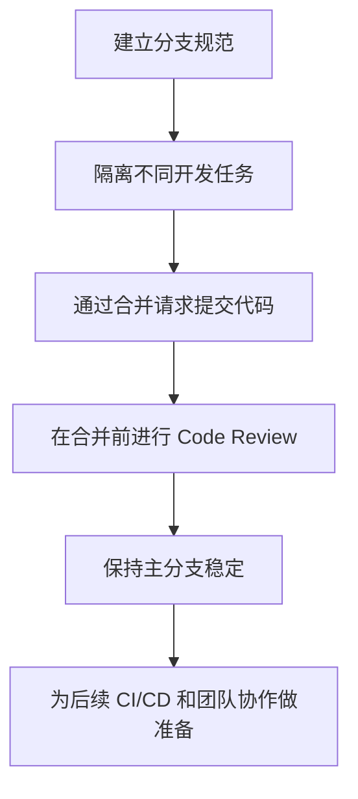

这节课的重点不在 Git 命令本身，而在协作规则。

只有分支规则清楚，后续开发才不会混乱。

## 分支类型

课程把后续项目中的分支分成四类：

| 分支类型    | 是否长期存在 | 主要作用                       |
| ----------- | -----------: | ------------------------------ |
| `master`    |           是 | 保存线上正在运行的稳定代码     |
| `develop`   |           是 | 保存研发阶段的最新代码         |
| `feature/*` |           否 | 每个新功能单独拉出的开发分支   |
| `hotfix/*`  |           否 | 专门处理线上紧急问题的修复分支 |

这四类分支承担不同职责。

`master` 和 `develop` 是固定分支，会长期存在。

`feature` 和 `hotfix` 是临时分支。一个功能开发完，或者一个线上问题修复完，代码合并回目标分支之后，这类分支可以删除。

## master 分支

`master` 分支保存的是线上正在运行的代码。

线上当前运行什么效果，背后对应的代码就应该在 `master` 上。这个分支需要保持稳定，不能随便把未完成的功能提交进去。

可以把 `master` 理解成生产环境代码的基准点。

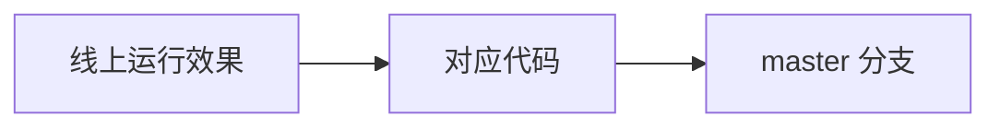

它的核心要求是稳定。

如果一段代码还没有完成开发，或者没有经过测试和 Review，就不应该直接进入 `master`。

## develop 分支

`develop` 分支保存的是研发阶段的最新代码。

日常功能开发完成后，会先合并到 `develop`。它代表当前项目正在研发的最新状态，但不一定已经上线。

`master` 和 `develop` 的关系可以这样理解：

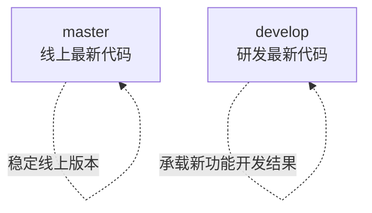

这两个分支都需要长期存在。

`master` 关注线上稳定。

`develop` 关注研发进度。

## feature 分支

`feature` 分支用于开发具体功能。

每次有一个新需求时，都应该从 `develop` 拉出一个独立的 `feature` 分支。开发者在这个分支上完成代码修改，开发完成后再合并回 `develop`。

流程如下：

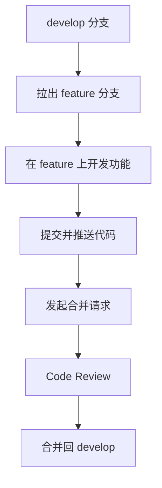

这样做有两个好处。

第一，不同功能之间互相隔离。

一个功能还没开发完，不会影响 `develop` 上其他已经完成的内容，也不会影响线上稳定代码。

第二，代码改动更容易 Review。

每个 `feature` 分支对应一个清晰的功能。合并请求里能看到这次功能具体改了哪些文件、哪些代码，Review 的范围会更明确。

## hotfix 分支

`hotfix` 分支用于处理线上紧急问题。

它和 `feature` 分支最大的区别，是来源不同。

`feature` 从 `develop` 拉出，开发完合并回 `develop`。

`hotfix` 从 `master` 拉出，修复完之后需要同时合并回 `master` 和 `develop`。

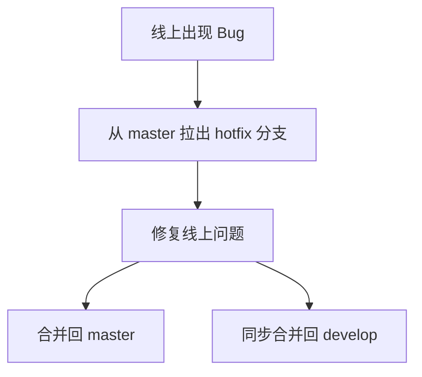

这里有一个重要原因。

线上问题必须基于当前线上代码修复，所以 `hotfix` 要从 `master` 拉出。如果直接在 `develop` 上修复，很可能会把 `develop` 里还没有完成的新功能一起带上线。

修复完成后，代码还要同步回 `develop`。

这样下一次从 `develop` 发布时，才不会丢失这次线上修复。

> [!WARNING]
>
> 线上紧急问题不要直接在 `develop` 上修。`develop` 可能包含未完成的新功能，如果从这里发布，会把不该上线的内容一起带到线上。

## 分支关系

四类分支之间的关系可以整理成下面这张图：

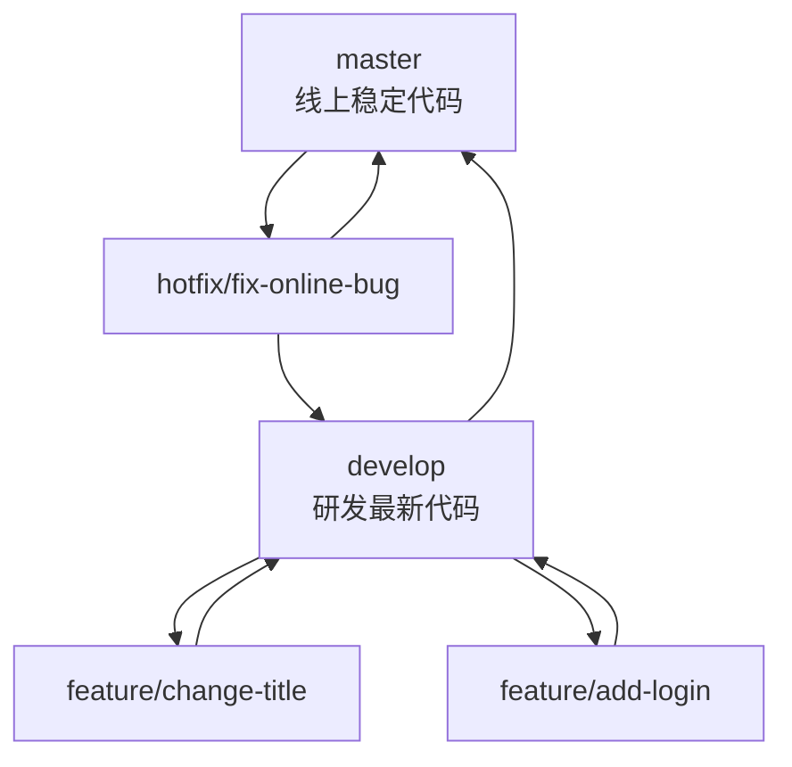

从这张图可以看出：

- `master` 和 `develop` 长期存在
- `feature` 从 `develop` 拉出，再合并回 `develop`
- `hotfix` 从 `master` 拉出，修复后合并回 `master` 和 `develop`
- `feature`、`hotfix` 完成后可以删除

这套分支模型能让研发、上线和线上修复分开处理。

## 创建 develop

课程演示中，仓库一开始已经有 `master` 分支。

接下来需要先创建 `develop` 分支。

在 SourceTree 中的操作是：

```text filename="SourceTree 操作" copy
选中 master 分支
点击“分支”
填写分支名：develop
创建分支
推送到远程
```

如果用命令行表示，大致对应：

```bash filename="git" copy
git checkout master
git checkout -b develop
git push -u origin develop
```

创建完成后，远程仓库里就会同时存在：

```text filename="固定分支" copy
master
develop
```

这两个分支的职责需要一直保持清楚：

| 分支      | 保存内容     |
| --------- | ------------ |
| `master`  | 线上最新代码 |
| `develop` | 研发最新代码 |

## 创建 feature

有新需求时，需要从 `develop` 拉出功能分支。

课程中演示的需求很简单：修改一句文案。

操作流程是：

```text filename="SourceTree 操作" copy
选中 develop 分支
点击“分支”
填写分支名：feature/change-with-me
创建分支
推送到远程
```

对应的 Git 命令可以这样理解：

```bash filename="git" copy
git checkout develop
git checkout -b feature/change-with-me
git push -u origin feature/change-with-me
```

推送完成后，Coding 平台的远程仓库中就能看到这个功能分支。

此时三个分支都存在：

```text filename="远程分支" copy
master
develop
feature/change-with-me
```

刚创建时，这几个分支里的代码内容可能完全一样。

只有在 `feature/change-with-me` 上修改并提交之后，它才会和 `develop`、`master` 产生差异。

## 功能开发

功能分支创建后，所有和这个需求相关的代码修改，都应该在 `feature` 分支上完成。

课程中演示的是修改一段文案。

修改完成后，SourceTree 会检测到文件变更。接下来需要填写提交信息，提交到本地仓库，再推送到远程功能分支。

对应流程如下：

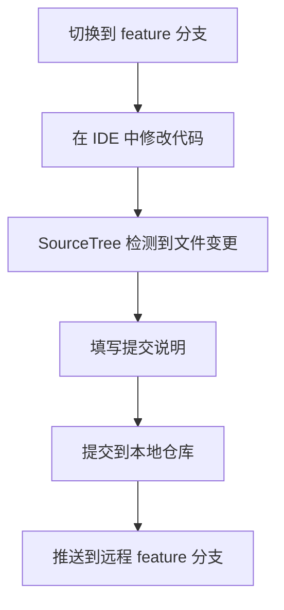

对应 Git 命令可以这样理解：

```bash filename="git" copy
git add .
git commit -m "修改文案"
git push
```

这一步完成后，代码变化只存在于 `feature/change-with-me` 分支。

`develop` 和 `master` 不会受到影响。

## 分支隔离

功能分支的价值，在这一刻就体现出来了。

同一份仓库中，不同分支可以保存不同状态的代码。

课程演示中：

| 分支                     | 状态                 |
| ------------------------ | -------------------- |
| `master`                 | 仍然保持线上稳定内容 |
| `develop`                | 仍然保持研发主线内容 |
| `feature/change-with-me` | 包含本次文案修改     |

这说明功能开发不会直接污染主线分支。

只有当功能开发完成，并通过合并请求合回 `develop` 后，`develop` 才会获得这次改动。

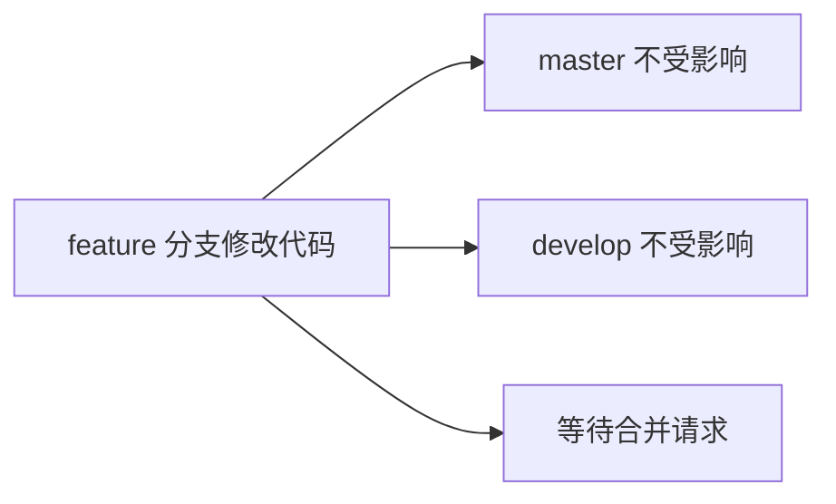

这也是分支协作的核心意义。

每个功能先在自己的分支里完成，等代码确认没问题后，再通过流程合并到目标分支。

## 合并请求

功能开发完成后，需要在 Coding 平台创建合并请求。

合并请求的作用，是把一个分支的代码合并到另一个目标分支上。Coding 中叫 **合并请求**，GitHub 中常叫 **Pull Request**，很多团队也会称为 **PR** 或 **MR**。

本节课中的方向是：

```text filename="合并方向" copy
feature/change-with-me  →  develop
```

合并请求会展示两类重要内容：

- 本次提交记录
- 本次文件改动

这让评审者可以清楚看到这次功能到底改了什么。

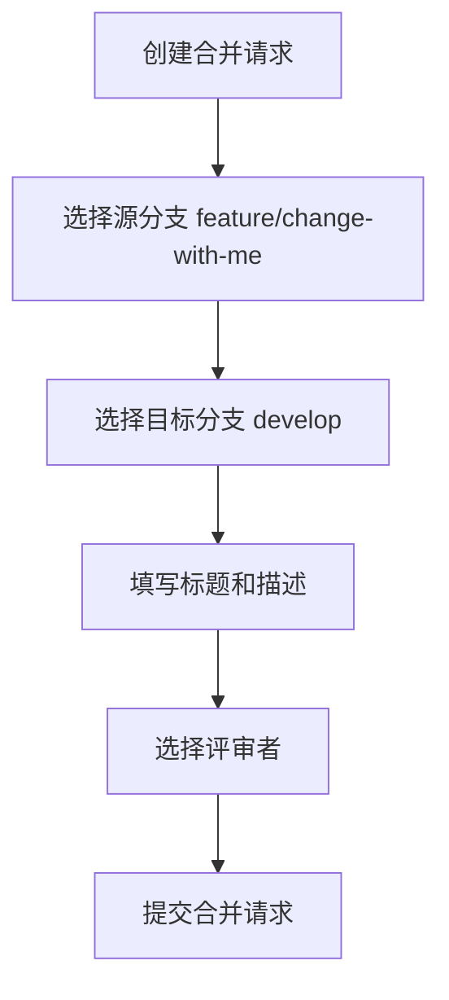

> [!TIP]
>
> 合并请求描述不要随便写。它应该说明这次改动解决了什么问题、改了哪些内容、有没有需要特别注意的地方。描述越清楚，Review 成本越低。

## Code Review

合并请求创建后，就进入 Code Review 环节。

评审者可以在页面中看到提交记录、文件变化和具体代码差异。如果发现问题，可以直接在对应代码行上留言。

课程中演示了类似这样的评论：

```text filename="Review 评论示例" copy
这样改真的好吗？
```

如果评审者认为代码没有问题，可以通过评论表示认可，比如：

```text filename="Review 通过示例" copy
+1
```

这里的 `+1` 可以理解为：这次合并可以通过。

Code Review 的流程可以整理成：

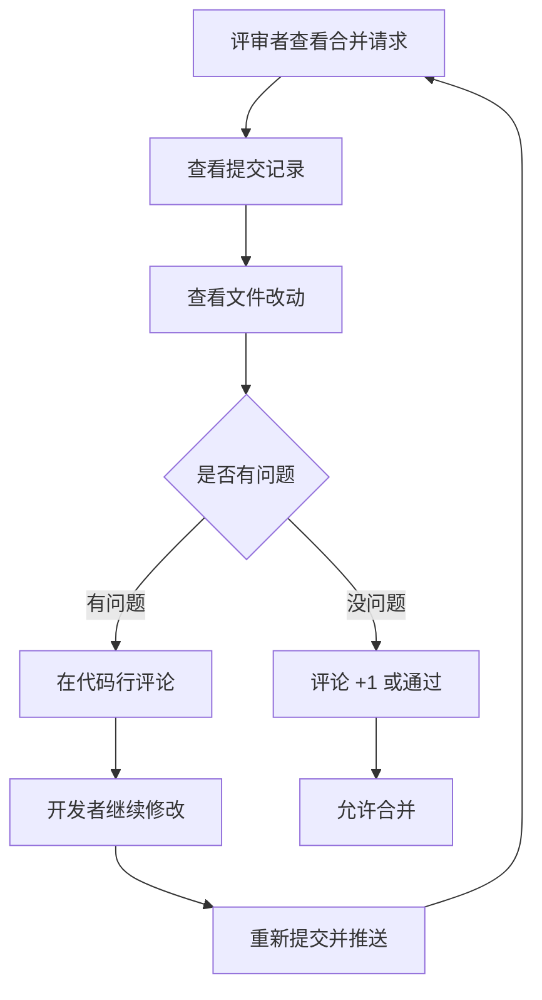

这一步的价值很重要。

Code Review 可以让代码在进入主线分支之前先经过检查，减少低级问题，也能让团队成员知道这次功能具体做了什么。

## 合并分支

Code Review 通过后，就可以执行合并。

本节课中，合并方向是：

```text filename="合并方向" copy
feature/change-with-me  →  develop
```

在 Coding 平台中点击合并后，`feature` 分支里的改动就会进入 `develop`。

合并时平台会提供一个选项：是否删除原分支。

对于真实团队项目，功能分支完成后通常可以删除，避免远程仓库里堆积大量无效分支。

对于课程练习项目，不删除也可以，方便学习者回看自己的操作记录。

| 场景         | 建议                             |
| ------------ | -------------------------------- |
| 真实团队项目 | 合并后删除功能分支，保持仓库干净 |
| 课程练习项目 | 可以暂时保留，方便回看学习过程   |

合并完成后，远程 `develop` 分支就拥有了这次功能代码。

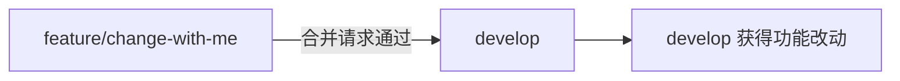

## 本地同步

合并请求是在远程平台上完成的。

这意味着远程 `develop` 已经更新，但本地 `develop` 还没有自动同步。

所以合并完成后，需要回到本地，切换到 `develop` 分支，然后拉取远程最新代码。

对应 SourceTree 操作是：

```text filename="SourceTree 操作" copy
切换到 develop 分支
点击“拉取”
同步远程最新代码
```

对应 Git 命令是：

```bash filename="git" copy
git checkout develop
git pull
```

这一步很容易被忽略。

如果不拉取，本地 `develop` 仍然停留在旧状态。后续继续从本地 `develop` 拉新分支时，就可能基于过期代码继续开发。

> [!IMPORTANT]
>
> 远程合并完成后，本地 `develop` 需要执行拉取。后续新功能应该基于最新的 `develop` 创建分支。

## 完整流程

本节课真正希望学习者形成惯性认知的，是下面这套完整流程。

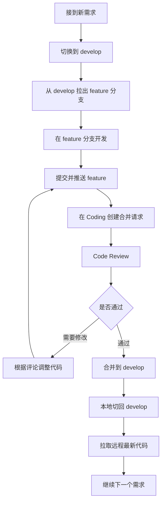

这套流程后续会反复使用。

每一个新功能都应该按照这个方式推进：从 `develop` 开始，在 `feature` 上开发，通过合并请求和 Review 回到 `develop`。

## 命令对照

虽然课程主要使用 SourceTree 演示，但背后的 Git 操作可以简单对应如下：

```bash filename="git" copy
# 创建 develop 分支
git checkout master
git checkout -b develop
git push -u origin develop

# 从 develop 创建功能分支
git checkout develop
git checkout -b feature/change-with-me
git push -u origin feature/change-with-me

# 开发完成后提交并推送
git add .
git commit -m "修改文案"
git push

# 远程合并完成后，同步本地 develop
git checkout develop
git pull
```

这些命令不是本节课要求死记的重点。

更重要的是理解每一步对应的协作动作：创建分支、隔离开发、提交代码、发起合并请求、Review、合并、同步本地。

## 本节重点

这一节课需要重点掌握四件事。

第一，分支职责要清楚。

`master` 保存线上稳定代码，`develop` 保存研发最新代码，`feature` 承载功能开发，`hotfix` 处理线上紧急问题。

第二，新功能从 `develop` 拉分支。

每个需求独立创建 `feature` 分支，开发完成后通过合并请求回到 `develop`。

第三，合并请求是 Code Review 的入口。

代码不要直接合并进主线，先通过合并请求展示提交和改动，再由评审者检查代码。

第四，远程合并后要同步本地。

平台上合并完成，只代表远程目标分支更新了。本地 `develop` 需要执行拉取，才能和远程保持一致。

## 本节小结

本节课完成了简化版 GitFlow 协同流程演示。

课程把分支分成四类：`master`、`develop`、`feature`、`hotfix`。`master` 对应线上稳定代码，`develop` 对应研发最新代码，这两个分支长期存在。`feature` 用于功能开发，从 `develop` 拉出，完成后合并回 `develop`。`hotfix` 用于线上紧急修复，从 `master` 拉出，完成后需要同时合并回 `master` 和 `develop`。

本节课重点演示的是 `feature` 流程。

老师先创建 `develop` 分支，再从 `develop` 拉出 `feature/change-with-me` 分支。接着在功能分支上修改文案，提交并推送到远程。然后在 Coding 平台创建合并请求，把 `feature` 合并到 `develop`。合并前可以进行 Code Review，评审者可以查看改动、添加评论，通过后再执行合并。

合并完成后，还需要回到本地 `develop` 分支执行拉取，让本地代码同步远程最新状态。

这套流程是后续项目协作的基础。

后面每一个功能开发、阶段提交、代码走查和持续集成，都会围绕这套分支流程继续展开。
