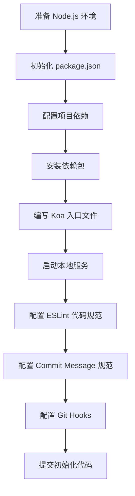
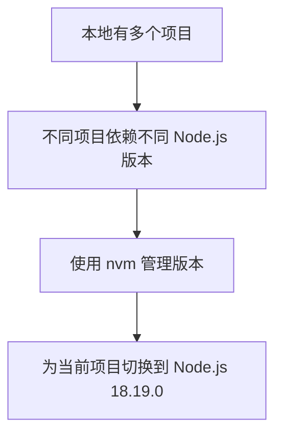
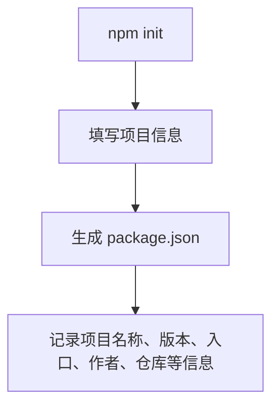
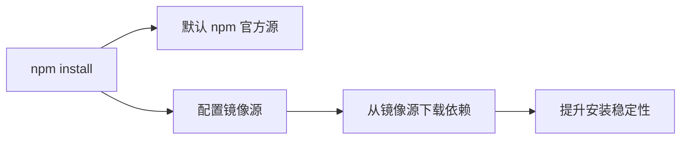
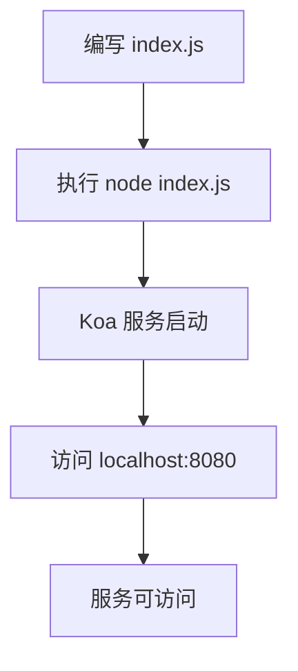
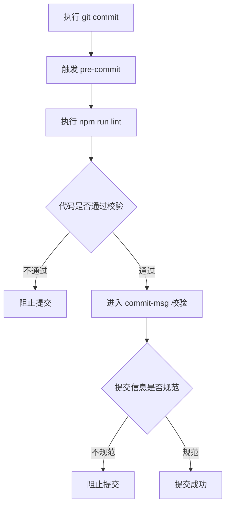
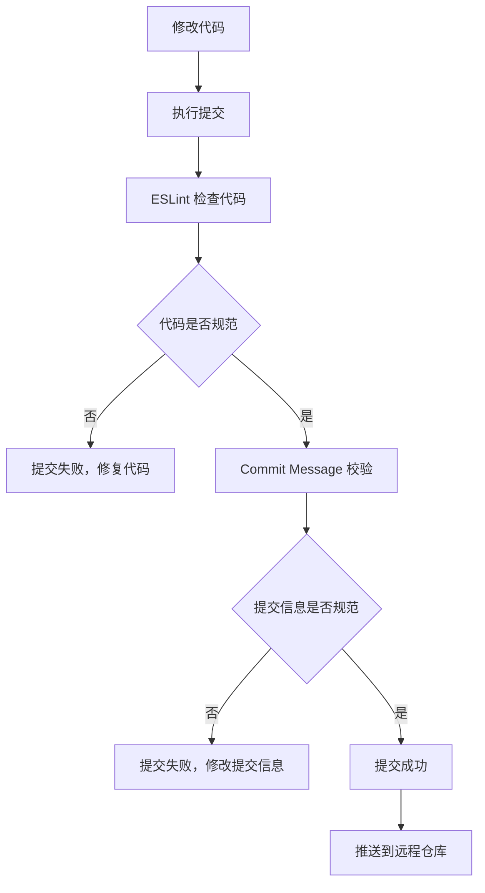
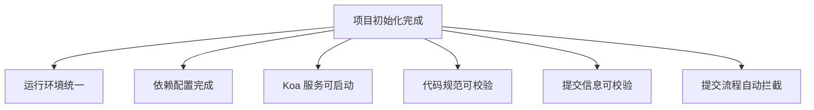

# 项目初始化

<MuxPlayer
  className="mt-8"
  playbackId="BTI02MpAP2EhweQ3KyLzkbCAl1d01X00wqatflUjiYYDhc"
  title="项目初始化"
/>

> [!NOTE]
>
> 本节课开始做 **项目初始化**。核心任务是把项目最基础的运行环境、依赖配置、入口文件和代码规范搭起来。
>
> 本节课主要完成五件事：安装并切换到 **Node.js 18.19.0**，初始化 `package.json`，安装项目运行依赖和开发依赖，编写 Koa 服务入口文件，最后配置 ESLint、Commit Message 校验和 Git Hooks。
>
> 这一节的完成标记有两个：第一，执行 `node -v` 能看到 Node.js 18 版本；第二，执行 `node index.js` 能成功启动本地服务，并在浏览器里访问到 `localhost:8080`。
>
> 这节课虽然是项目初始化，但它不是简单创建几个文件。它是在一步一步搭建后续企业级应用框架的基础骨架：环境统一、依赖统一、入口统一、代码规范统一、提交规范统一。

## 课程目标

本节课正式开始初始化项目。

前面已经完成了 Git 仓库、协同流程和分支规范。这一节进入代码层面，开始把项目最基础的结构搭起来。

本节课会围绕下面这条线推进：



这条流程完成后，项目就具备了最基础的启动能力和规范约束能力。

## Node 环境

本项目依赖 **Node.js 18**。

老师在课程中使用的是：

```bash filename="terminal" copy
18.19.0
```

实际开发中，本地往往不止一个项目。不同项目可能依赖不同 Node.js 版本，所以需要一个 Node 版本管理工具来切换环境。

课程中使用的是 **nvm**。

它的作用是管理本地多个 Node.js 版本，让开发者可以根据项目需要进行安装和切换。



Mac 或 Linux 用户可以使用 nvm。

Windows 用户可以使用对应的 nvm-windows 工具，课程学习资料里会提供相关地址。

## 安装版本

安装 Node.js 18.19.0 的命令如下：

```bash filename="terminal" copy
nvm install 18.19.0
```

安装完成后，切换到这个版本：

```bash filename="terminal" copy
nvm use 18.19.0
```

然后通过下面的命令检查当前 Node.js 版本：

```bash filename="terminal" copy
node -v
```

如果输出类似下面这样，就说明 Node.js 环境准备完成：

```bash filename="terminal" copy
v18.19.0
```

这一节的第一项完成标记，就是本地能够正确输出 Node.js 18 版本。

> [!IMPORTANT]
>
> 后续课程默认项目运行在 Node.js 18 环境下。版本不一致时，可能会出现依赖安装失败、语法支持不一致、运行结果不同等问题。

## 忽略文件

Node 环境准备好之后，下一步是创建 `.gitignore` 文件。

这个文件用来告诉 Git：哪些文件和目录不需要提交到远程仓库。

本节课先配置两个内容：

```gitignore filename=".gitignore" copy
node_modules
package-lock.json
```

`node_modules` 是依赖安装目录，体积很大，而且可以通过 `package.json` 重新安装，所以不需要提交。

`package-lock.json` 在本课程当前阶段也先忽略掉，避免不同环境下锁文件带来额外干扰。

> [!WARNING]
>
> `node_modules` 一定不要提交到 Git 仓库。项目依赖应该通过 `package.json` 管理，再由安装命令重新生成。

## 初始化配置

接下来初始化 `package.json`。

执行命令：

```bash filename="terminal" copy
npm init
```

执行后，命令行会依次让开发者填写项目名称、版本、描述、入口文件、仓库地址、作者等信息。

其中仓库地址可以从 Coding 代码仓库中复制。

初始化完成后，项目根目录下会生成 `package.json` 文件。

它是整个 Node.js 项目的核心配置文件，后续项目依赖、开发命令、规范配置都会逐步写到这里。



## 依赖分类

`package.json` 中有两个非常重要的依赖字段：

- `dependencies`
- `devDependencies`

它们的区别需要先理解清楚。

| 字段              | 含义                 | 典型内容                               |
| ----------------- | -------------------- | -------------------------------------- |
| `dependencies`    | 项目运行时需要的依赖 | Vue、Koa、Element Plus、Axios、ECharts |
| `devDependencies` | 开发阶段需要的依赖   | Webpack、Loader、ESLint、提交校验工具  |

`dependencies` 里的依赖，是项目运行起来必须要用到的包。

比如前端运行需要 Vue，服务端启动需要 Koa，请求接口可能需要 Axios，页面图表可能需要 ECharts。

`devDependencies` 里的依赖，主要服务于开发过程。

比如代码规范检查、构建打包、提交信息校验，这些能力在开发时很重要，但项目真正运行时不一定需要它们。

## 安装依赖

课程中提到，国内环境直接使用 npm 下载依赖时，可能会比较慢，也可能会失败。

所以课程里引入了 **cnpm**。

安装 cnpm 的命令如下：

```bash filename="terminal" copy
npm install cnpm -g
```

安装完成后，可以检查版本：

```bash filename="terminal" copy
cnpm -v
```

然后使用 cnpm 安装项目依赖：

```bash filename="terminal" copy
cnpm install --save-dev
```

这里的重点不是 cnpm 本身，而是理解它解决的问题。

npm 默认会从官方源下载依赖，国内访问时可能不稳定。cnpm 或其他镜像源工具，本质上是把依赖下载源切换到访问更顺畅的位置。

## 配置源

除了安装 cnpm，也可以直接修改 npm 的 registry。

查看当前 npm 配置：

```bash filename="terminal" copy
npm config list
```

设置新的下载源：

```bash filename="terminal" copy
npm config set registry <镜像源地址>
```

如果后续想恢复默认源，也可以重新设置 registry。

```bash filename="terminal" copy
npm config set registry https://registry.npmjs.org/
```

这个过程可以这样理解：



本节课中，老师主要演示的是通过 cnpm 来完成依赖安装。

依赖安装完成后，项目目录中会出现 `node_modules`。

这说明项目依赖已经安装成功。

## 入口文件

依赖安装完成后，开始编写项目入口文件。

课程中使用 `index.js` 作为服务端启动入口。

这个文件的目标很简单：先用 Koa 启动一个本地服务，让项目能够跑起来。

核心代码如下：

```js filename="index.js" copy
const Koa = require("koa")

const app = new Koa()

const port = process.env.PORT || 8080
const host = process.env.IP || "0.0.0.0"

try {
  app.listen(port, host, () => {
    console.log(`server running on port ${port}`)
  })
} catch (err) {
  console.error(err)
}
```

这段代码完成了几件事。

第一，引入 Koa。

第二，创建 Koa 应用实例。

第三，从环境变量中读取端口和 IP，如果没有配置，就使用默认值。

第四，通过 `app.listen` 启动服务。

第五，用 `try...catch` 包住启动逻辑，增强服务启动时的健壮性。

## 启动服务

入口文件写好之后，可以执行下面的命令启动服务：

```bash filename="terminal" copy
node index.js
```

如果命令行输出类似下面这样，就说明服务已经启动成功：

```bash filename="terminal" copy
server running on port 8080
```

接着可以在浏览器中访问：

```text filename="浏览器地址" copy
localhost:8080
```

此时页面可能会显示 `Not Found`。

这不是问题。

因为当前只是把 Koa 服务启动起来，还没有配置具体路由，也没有返回具体页面内容。只要浏览器能访问到这个服务，就说明入口文件已经生效。



这一节的第二个完成标记，就是本地服务能够成功启动并被浏览器访问。

## 代码规范

项目能启动之后，下一步开始配置代码规范。

课程中使用的是 **ESLint**。

ESLint 用来检查 JavaScript 和 Vue 文件中的代码问题，比如变量定义后没有使用、语法不规范、格式不符合规则等。

它的作用不是让代码“看起来更高级”，而是让团队代码保持一致，减少低级错误进入仓库。

本节课涉及两个 ESLint 相关文件：

```text filename="ESLint 文件" copy
.eslintrc
.eslintignore
```

`.eslintrc` 用来配置 ESLint 规则。

`.eslintignore` 用来配置哪些目录或文件不参与校验。

## ESLint 配置

`.eslintrc` 中会配置继承规则、Vue 相关规则、全局变量和一些关闭项。

课程中这份配置主要从学习资料中复制过来即可。

这里可以用简化结构理解它的作用：

```json filename=".eslintrc" copy
{
  "extends": ["eslint:recommended"],
  "rules": {
    "no-unused-vars": "error"
  },
  "globals": {
    "Vue": true,
    "axios": true
  }
}
```

实际课程配置会比这个更完整。

当前需要理解的是：`.eslintrc` 决定 ESLint 按什么规则检查代码。

## 忽略校验

`.eslintignore` 用来告诉 ESLint：哪些目录不需要检查。

本节课配置了：

```text filename=".eslintignore" copy
node_modules
public
```

`node_modules` 是依赖目录，不需要校验。

`public` 后续会用于存放编译或发布后的代码，也不需要走源码级规范检查。

## Lint 命令

配置好 ESLint 后，需要在 `package.json` 中添加一个命令。

这个命令用来检查当前项目下的 `.js` 和 `.vue` 文件。

```json filename="package.json" copy {3-5}
{
  "scripts": {
    "lint": "eslint --quiet --ext .js,.vue ."
  }
}
```

然后执行：

```bash filename="terminal" copy
npm run lint
```

如果代码没有问题，命令会正常结束。

如果代码存在问题，ESLint 会提示具体文件、具体行号和具体错误。

课程中演示了定义一个没有使用的变量：

```js filename="index.js" copy {6}
const Koa = require("koa")

const app = new Koa()

const a = 1

const port = process.env.PORT || 8080
```

再次执行：

```bash filename="terminal" copy
npm run lint
```

ESLint 会提示变量 `a` 被定义了，但没有被使用。

删除这行代码后，再次执行校验，就可以通过。

## 提交规范

除了代码规范，本节课还配置了 **Commit Message 规范**。

在团队协作中，提交信息不能随便写。

如果每个人都写 `test`、`update`、`xxx`，后续排查问题、回滚版本、查看历史记录时都会非常困难。

课程中采用的是比较常见的提交格式：

```text filename="Commit Message 格式" copy
类型: 提交内容
```

比如：

```text filename="Commit Message 示例" copy
feat: 初始化项目
```

常见类型可以先记住这些：

| 类型       | 含义     |
| ---------- | -------- |
| `feat`     | 新功能   |
| `fix`      | 修复问题 |
| `docs`     | 文档修改 |
| `style`    | 样式调整 |
| `refactor` | 代码重构 |
| `test`     | 测试相关 |

这种格式能让提交历史更清晰。

看到 `feat`，就知道这次是新增功能。

看到 `fix`，就知道这次是修复问题。

看到 `refactor`，就知道这次是重构代码。

## 校验工具

有了规范之后，还需要工具来约束。

课程中使用的是 `validate-commit-msg`。

它的作用是检查提交信息是否符合约定格式。

如果提交信息随便写，比如：

```text filename="错误提交信息" copy
xxxx
```

提交时就会失败。

如果按照规范写：

```text filename="正确提交信息" copy
feat: 初始化项目
```

提交就可以通过。

> [!IMPORTANT]
>
> 规范不能只靠自觉。项目里需要工具自动检查，否则一忙起来很容易忘记执行校验。

## Git Hooks

接下来课程引入 **Git Hooks**。

Git Hooks 可以理解为 Git 在某些操作发生时提供的钩子。

比如提交代码前、填写提交信息后，都可以触发一些自动任务。

课程中使用的是 `ghooks`。

它的作用，是把 ESLint 校验和 Commit Message 校验接入正常提交流程。

也就是说，开发者不需要每次手动执行 `npm run lint`，也不需要手动检查提交信息格式。

当执行 Git 提交时，钩子会自动触发对应校验。



## Hooks 配置

在 `package.json` 中添加 `ghooks` 配置。

```json filename="package.json" copy {3-10}
{
  "config": {
    "ghooks": {
      "commit-msg": "validate-commit-msg",
      "pre-commit": "npm run lint"
    }
  }
}
```

这里配置了两个钩子。

`pre-commit` 会在提交前执行：

```bash filename="terminal" copy
npm run lint
```

如果代码规范校验失败，本次提交会被拦截。

`commit-msg` 会在提交信息生成后执行：

```bash filename="terminal" copy
validate-commit-msg
```

如果提交信息格式不符合规范，本次提交也会被拦截。

## 提交流程

配置完成后，一次正常提交会变成下面这样：



对应 Git 命令如下：

```bash filename="git" copy
git add .
git commit -m "feat: 初始化项目"
git push
```

如果代码中存在未使用变量，提交会被 ESLint 拦住。

如果提交信息写成 `xxx`，提交也会被 Commit Message 校验拦住。

只有代码和提交信息都符合规范，提交才能成功。

## 初始化结果

到这里，本节课完成了项目初始化的主要内容。

当前项目已经具备：

- Node.js 18 运行环境
- `.gitignore` 忽略规则
- `package.json` 项目配置
- 项目运行依赖和开发依赖
- Koa 服务入口文件
- ESLint 代码规范校验
- Commit Message 规范校验
- Git Hooks 自动拦截机制

可以把当前初始化结果整理成：



这些内容是后续继续搭建企业级应用框架的基础。

## 完成标记

本节课最后给出了两个明确完成标记。

第一个标记，是 Node.js 版本正确。

```bash filename="terminal" copy
node -v
```

输出应为 Node.js 18 版本：

```bash filename="terminal" copy
v18.19.0
```

第二个标记，是服务可以正常启动。

```bash filename="terminal" copy
node index.js
```

命令行能够看到服务启动信息：

```bash filename="terminal" copy
server running on port 8080
```

浏览器访问：

```text filename="浏览器地址" copy
localhost:8080
```

能够访问到服务。

即使页面显示 `Not Found`，也说明 Koa 服务已经成功启动，只是还没有配置具体路由。

## 本节小结

本节课完成了项目初始化。

课程先通过 nvm 安装并切换到 Node.js 18.19.0，保证后续项目使用统一运行环境。接着创建 `.gitignore`，忽略 `node_modules` 和 `package-lock.json`，避免无关文件进入仓库。

然后通过 `npm init` 初始化 `package.json`，并配置项目依赖和开发依赖。依赖安装过程中，课程引入 cnpm 和 npm registry 配置，解决国内环境下依赖下载不稳定的问题。

项目依赖安装完成后，课程编写了 `index.js` 作为入口文件，使用 Koa 启动本地服务。只要能够通过 `node index.js` 启动服务，并访问 `localhost:8080`，就说明最基础的 Node 服务已经跑通。

接下来，课程开始补充工程规范。

ESLint 用来约束代码质量，`.eslintrc` 定义校验规则，`.eslintignore` 定义忽略目录，`npm run lint` 用来执行检查。

Commit Message 规范用来约束提交信息，要求按照 `类型: 提交内容` 的格式提交，例如 `feat: 初始化项目`。

最后通过 `ghooks` 把 ESLint 和 Commit Message 校验接入 Git 提交流程。这样一来，每次提交代码前都会自动检查代码规范，提交信息也会自动校验。

这一节完成后，项目已经具备最基础的工程骨架和规范约束。后续课程可以在这个基础上继续搭建服务端能力、前端工程能力和完整应用框架。
