# elpis-core 内核引擎设计

<MuxPlayer
  className="mt-8"
  playbackId="J9s9zb02en4MCJy7qZUJClrcWyzFBLcIsPM3egC902If00"
  title="elpis-core 内核引擎设计"
/>

> [!NOTE]
>
> 本节课开始进入 **服务端框架内核设计**。项目运行在 Node.js 上，不能像纯前端项目一样只把静态资源放到 Nginx 中，因此需要先把 BFF 层的服务框架搭起来。
>
> 本节课的核心是 **elpis-core 内核引擎设计**。它要做两件事：第一，约定一套规范目录，用来存放 `router`、`schema`、`middleware`、`controller`、`service` 等文件；第二，实现一组 Loader，在项目启动时扫描这些文件，把静态目录中的代码解析成运行时可用的服务能力。
>
> 这一节还重点讲了 Koa 的 **洋葱模型**。请求进入服务端后，会先经过路由分发、参数校验和中间件，再进入业务逻辑和 Service 层，处理完成后再按相反顺序离开中间件，最终响应给客户端。
>
> 当前阶段先建立整体图景。后续写代码时，会不断回到这张设计图。真正掌握的标志，是写完代码后能够清楚说明：用户写好的文件如何被 elpis-core 解析，如何挂载到运行时，又如何支撑 API 请求和页面请求的完整处理流程。

## 课程位置

这一节开始进入服务端框架搭建。

前面项目已经完成了初始化，Koa 服务也可以启动。接下来要做的事情，是在 Koa 之上搭建一套自己的服务端内核。

项目运行在 Node.js 上，和普通纯前端项目不同。

纯前端项目通常构建出静态资源，再放到 Nginx 这类静态服务器上运行。当前课程要做的是一个 BFF 层服务，它需要接收请求、处理路由、执行中间件、调用业务逻辑、访问数据库和外部服务，所以必须先把 Node.js 服务框架搭起来。

这一节的主题可以概括为：

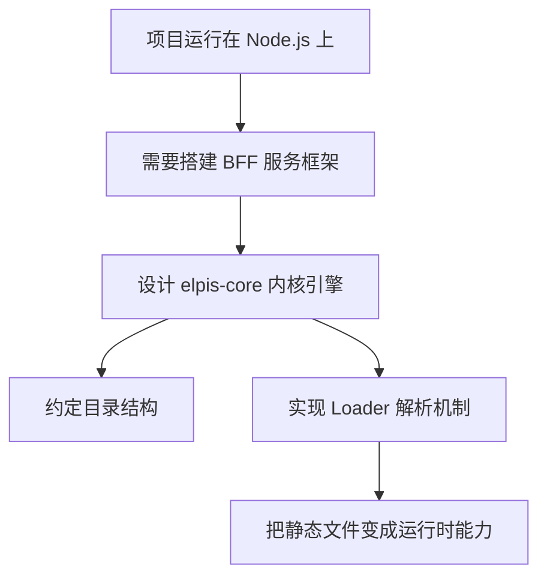

这节课先讲设计。

下一节开始，课程会根据这套设计正式写代码。

## 内核目标

elpis-core 的目标，是在 Koa 之上补齐企业级服务框架需要的组织能力。

Koa 本身提供了基础 Web 服务能力和中间件机制，但它不会强制规定项目目录，也不会自动帮开发者加载 Controller、Service、Middleware、Router 这些模块。

如果直接用 Koa 写业务，很容易变成零散文件堆在一起。

所以课程要做一个内核引擎。

它负责约定目录、扫描文件、加载模块、挂载能力，并让请求能够按照统一规则在系统内部流转。

可以这样理解：

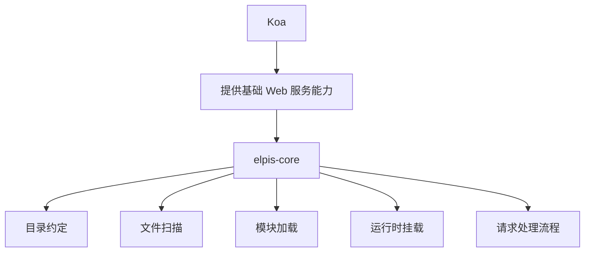

elpis-core 的定位，是一个轻量版服务框架内核。

课程中提到，它会借鉴一些业界框架或服务引擎的实现思想。学习者完成这部分后，也能从侧面理解成熟框架内部是如何组织代码和运行服务的。

## 两件核心事

本节课明确提出，开始搭建 BFF 层之前，需要先完成两件事。

第一件事，是约定目录结构。

不同类型的代码要放到不同目录中。路由文件放路由目录，参数规则放 Schema 目录，中间件放 Middleware 目录，业务逻辑放 Controller 目录，基础服务能力放 Service 目录。

第二件事，是实现 elpis-core。

elpis-core 内部会有不同 Loader。每个 Loader 负责扫描和解析某一类文件。项目启动时，这些 Loader 会把静态文件中的内容加载到内存中，并转换成运行时可以使用的能力。

这两件事之间的关系如下：


目录结构解决“代码放在哪里”的问题。

elpis-core 解决“代码如何运行起来”的问题。

## 目录结构

课程中先规划了一套 `app` 目录。

这个目录会作为 BFF 层业务文件的主要存放位置。

大致结构可以整理为：

```text filename="app 目录结构" copy
app
├── router
│   └── ...
├── router-schema
│   └── ...
├── middleware
│   └── ...
├── controller
│   └── ...
├── service
│   └── ...
├── extends
│   └── ...
├── schedule
│   └── ...
└── config
    └── ...
```

每个目录都有自己的职责。

| 目录            | 作用                                       |
| --------------- | ------------------------------------------ |
| `router`        | 存放路由配置，负责请求路径分发             |
| `router-schema` | 存放路由参数规则，负责请求参数校验         |
| `middleware`    | 存放中间件，负责通用请求处理               |
| `controller`    | 存放业务逻辑处理器                         |
| `service`       | 存放基础服务能力，如数据库、日志、外部请求 |
| `extends`       | 存放业务扩展能力                           |
| `schedule`      | 存放定时任务                               |
| `config`        | 存放项目配置                               |

这套目录结构的意义，是让业务代码从一开始就有清晰归属。

后续开发时，新增一个接口、新增一个中间件、新增一个业务服务，都能根据职责放到对应目录中。

## Loader 机制

目录结构只是静态约定。

项目真正运行时，还需要有人把这些文件读出来、解析出来、挂载到服务内部。

这个工作由 Loader 完成。

不同 Loader 负责不同类型的文件：

| Loader            | 负责内容         |
| ----------------- | ---------------- |
| Router Loader     | 加载路由文件     |
| Schema Loader     | 加载路由参数规则 |
| Middleware Loader | 加载中间件       |
| Controller Loader | 加载业务处理器   |
| Service Loader    | 加载服务能力     |
| Extend Loader     | 加载扩展能力     |
| Schedule Loader   | 加载定时任务     |
| Config Loader     | 加载配置文件     |

项目启动时，elpis-core 会调用这些 Loader。

它们会扫描对应目录，把文件里的内容读取出来，再放入运行时上下文中。后续请求进入系统时，就可以根据路由找到对应 Controller，也可以在 Controller 中调用对应 Service。

这个过程可以整理为：

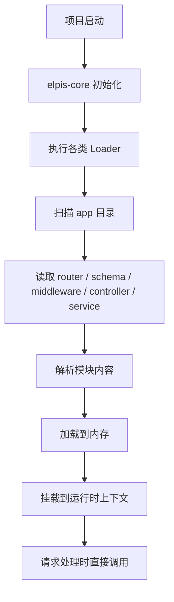

> [!IMPORTANT]
>
> Loader 是 elpis-core 的核心。目录里的文件能不能变成运行时能力，关键就在 Loader 的扫描、解析和挂载过程。

## 静态到运行时

本节课有一条很重要的线：**从静态文件到运行时状态**。

开发者写代码时，看到的是一个个目录和文件。比如某个 Controller 文件、某个 Service 文件、某个中间件文件。

但服务运行时，系统需要的是可以直接调用的对象、函数和模块。

elpis-core 的工作，就是把这两种状态连接起来。

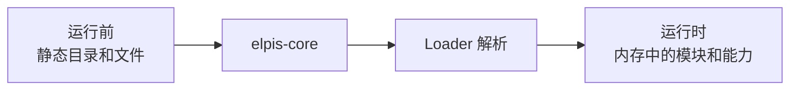

可以把它理解成一次转换过程。

运行前：

```text filename="运行前" copy
app/router
app/router-schema
app/middleware
app/controller
app/service
app/extends
app/schedule
app/config
```

运行后：

```text filename="运行时状态" copy
ctx.router
ctx.schema
ctx.middleware
ctx.controller
ctx.service
ctx.config
```

这里的具体命名后续代码实现时可能会调整，但思想是明确的：
开发者按目录写文件，elpis-core 按规则加载文件，运行时通过统一入口使用这些能力。

## 洋葱模型

本节课还重点讲了 Koa 的洋葱模型。

洋葱模型的核心规则是：**先进后出**。

请求进入服务端时，会一层一层进入中间件；业务逻辑处理完成后，再按相反顺序一层一层离开中间件。

可以用下面的图理解：

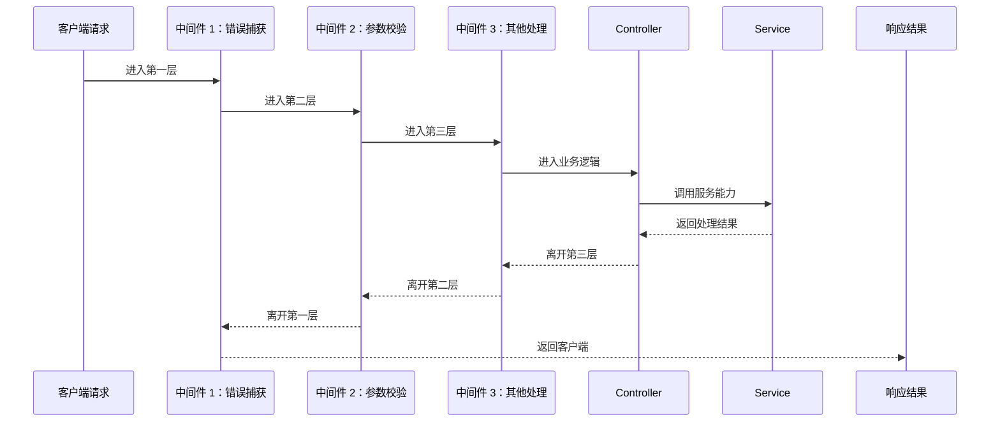

这种模型很适合处理通用逻辑。

比如错误捕获、日志记录、参数校验、权限判断、响应格式处理，都可以放在中间件中。请求进来时执行前置逻辑，请求出去时执行后置逻辑。

> [!TIP]
>
> 理解 Koa 的关键，是理解 `next` 之前和 `next` 之后分别会发生什么。`next` 之前是进入下一层，`next` 之后是从下一层返回后继续执行。

## 请求分层

BFF 层的请求处理过程，会和前面讲过的三层结构对应起来。

这三层分别是：

- 接入层
- 业务层
- 服务层

请求进入系统后，先经过接入层，再进入业务层，最后根据需要调用服务层。

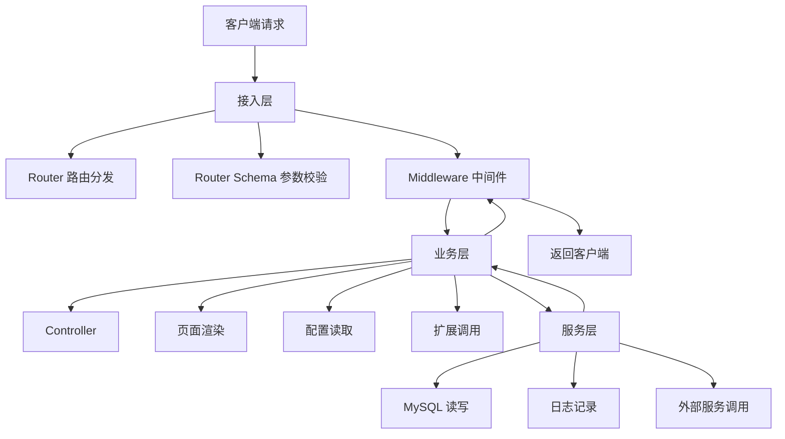

接入层负责把请求接进来。

业务层负责处理具体业务。

服务层负责提供底层能力。

这套分层可以让系统职责更清楚。请求不会直接冲到数据库，也不会把所有逻辑都写在一个文件里，而是按照固定流程逐层处理。

## API 请求

如果进入系统的是一个 API 请求，它会经历完整的 BFF 处理链路。

比如前端请求一个接口：

```text filename="API 请求示例" copy
GET /api/user/list
```

请求进入服务端之后，大致流程如下：

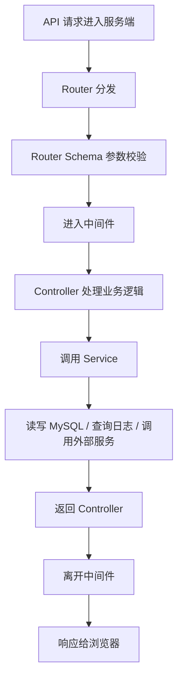

这里可以看到几个关键点。

Router 负责判断这个请求应该交给谁处理。

Schema 负责判断请求参数是否合法。

Middleware 负责执行通用逻辑。

Controller 负责组织业务流程。

Service 负责完成底层服务能力。

最后结果再返回给客户端。

## 页面请求

页面请求也可以走同一套内核流程。

比如用户在浏览器中访问：

```text filename="页面请求示例" copy
localhost:3000/index.html
```

这个请求也会进入服务端，也会经过路由分发、中间件、Controller 处理，最后再返回页面内容。

如果后续系统支持 SSR 场景，Controller 中可能会进行页面渲染，然后把 HTML 返回给浏览器。

页面请求的流程可以整理为：

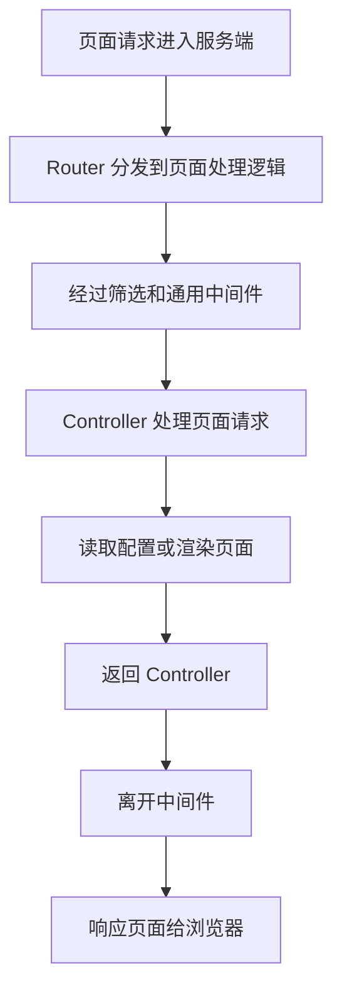

所以，elpis-core 不只支持 API 请求。

它的目标是同时承接 API 请求和页面请求，并让它们都能够进入统一的服务处理流程。

## 内核职责

经过前面的设计，可以把 elpis-core 的职责整理成五类。

| 职责       | 说明                                                                    |
| ---------- | ----------------------------------------------------------------------- |
| 目录约定   | 规定不同类型代码放在不同目录                                            |
| 文件扫描   | 在项目启动时扫描 `app` 下的业务文件                                     |
| 模块解析   | 通过 Loader 解析 Router、Schema、Middleware、Controller、Service 等模块 |
| 运行时挂载 | 把解析后的模块挂载到服务运行时环境中                                    |
| 请求支撑   | 支撑 API 请求、页面请求、中间件、Controller 和 Service 的完整流转       |

可以进一步整理成一张图：

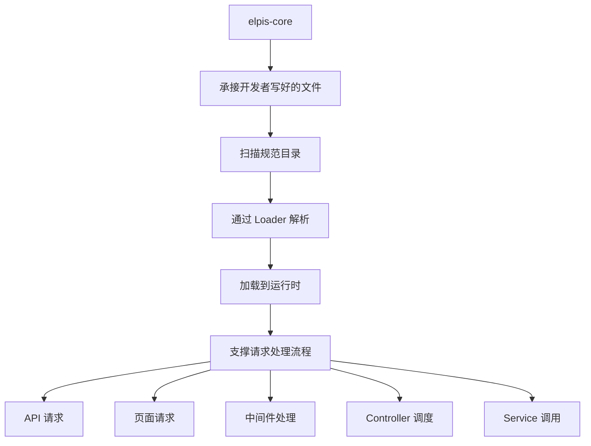

这也是后续代码实现的重点。

课程接下来要写的，不是零散的业务接口，而是先写出这个可以承接业务文件的内核。

## 实现范围

本节课明确了接下来真正要实现的部分。

重点是图中的解析器和内核部分。

也就是：当用户按照规范写好各种文件后，elpis-core 能够把这些文件解析成运行时能力，并支持请求按照设计流程执行。

可以把实现范围理解为：

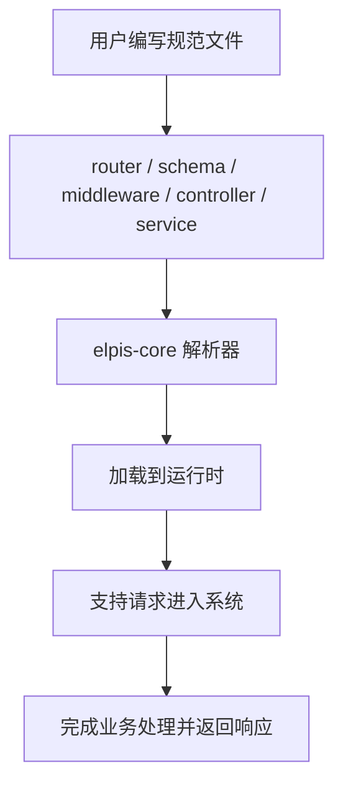

这条线就是接下来几节课的代码目标。

开发者写文件，是上层使用方式。

elpis-core 解析文件，是底层框架能力。

请求被正确处理，是最终运行效果。

## 学习方式

老师在本节课反复提醒，这一节属于设计课，刚开始有点模糊很正常。

因为很多概念现在还没有进入代码实现，比如 Loader 如何写、文件如何扫描、模块如何挂载、Controller 如何调用 Service。只看图时，确实不容易完全理解。

学习方式应该是先记住整体结构，再在后续写代码时不断回看。

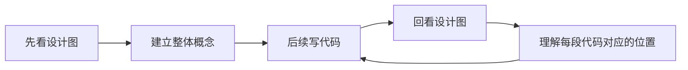

真正达标的状态，是写完所有代码之后，再看这张设计图时，能够清楚知道每一部分在做什么。

比如：

- 哪个目录放什么文件
- 哪个 Loader 负责解析什么
- 请求进入后先到哪里
- 中间件如何先进后出
- Controller 如何调用 Service
- Service 如何访问数据库和外部服务
- 最终响应如何返回浏览器

这些内容清楚之后，elpis-core 这一块就算真正入门。

## 本节重点

本节课需要重点记住三件事。

第一，BFF 层需要自己的服务内核。

Koa 只是基础服务框架，课程要在它之上搭建 elpis-core，用来组织目录、加载文件、挂载模块和支撑请求流程。

第二，elpis-core 的核心是目录规范和 Loader 机制。

目录规范让业务代码有固定位置，Loader 机制让这些静态文件在项目启动时被解析成运行时能力。

第三，请求处理遵循 Koa 洋葱模型。

请求进入时会一层层经过中间件，进入 Controller 和 Service，处理完成后再按相反顺序离开中间件，最终响应给客户端。

## 本节小结

本节课讲的是 elpis-core 内核引擎设计。

项目运行在 Node.js 上，需要先搭建 BFF 层服务框架。课程在 Koa 之上设计 elpis-core，用它来承接企业级服务框架中最基础的能力：目录约定、文件解析、模块加载和请求处理。

本节课先规划了 `app` 目录结构。`router` 存放路由，`router-schema` 存放参数规则，`middleware` 存放中间件，`controller` 存放业务逻辑，`service` 存放服务能力，`extends` 存放扩展能力，`schedule` 存放定时任务，`config` 存放配置。

有了目录结构之后，elpis-core 需要通过不同 Loader 扫描这些目录，把文件解析出来，并加载到运行时环境中。这样开发者写好的静态文件，才能在服务运行时被调用。

请求处理方面，本节课重点讲了 Koa 洋葱模型。请求会先进入外层中间件，再进入内层中间件，然后进入 Controller 和 Service。处理完成后，再按照相反顺序离开中间件，最后响应给客户端。

API 请求和页面请求都可以被 elpis-core 承接。

API 请求会经过路由分发、参数校验、中间件、Controller、Service，最后返回 JSON 或其他响应结果。

页面请求也可以经过同样的服务流程，进入页面 Controller，完成页面渲染或资源响应。

这一节的任务是建立设计图景。

下一节会开始写代码，实现 elpis-core 这部分逻辑。后续写代码时，需要不断回到这节课的设计图，直到能够清楚说明：文件如何被加载，模块如何被挂载，请求如何被处理，响应如何返回。
