# elpis-core 引擎内核实现（1）

<MuxPlayer
  className="mt-8"
  playbackId="NpXzothAmD2uUU00JMIfuUWn027XnFS6s7wQeZr18NWec"
  title="elpis-core 引擎内核实现（1）"
/>

> [!NOTE]
>
> 本节课开始实现 **elpis-core 引擎内核的第一部分**。代码实现前，先按照 GitFlow 流程从 `develop` 拉出功能分支，后续所有内核相关代码都在功能分支上开发。
>
> 这一节主要完成三件事：第一，把项目入口从“直接启动 Koa”调整为“通过 elpis-core 内核启动”；第二，给内核补充基础配置，包括 `options`、项目根路径、业务目录路径和环境识别；第三，开始搭建 Loader 体系，并实现 `middleware-loader` 和 `router-schema-loader` 的基础加载逻辑。
>
> 本节课的核心思想是：开发者以后只需要按照约定把文件放到 `app` 目录下，elpis-core 会在项目启动时通过 Loader 扫描这些文件，把它们加载到内存中，并挂载到 Koa 实例上。这样，静态文件就可以变成运行时可访问的服务能力。

## 开发分支

正式写代码之前，先从 `develop` 拉出一个功能分支。

这一点延续前面讲过的 GitFlow 协同流程。后续所有和 elpis-core 内核相关的代码，都应该在这个功能分支上完成，开发完成后再通过合并请求回到 `develop`。

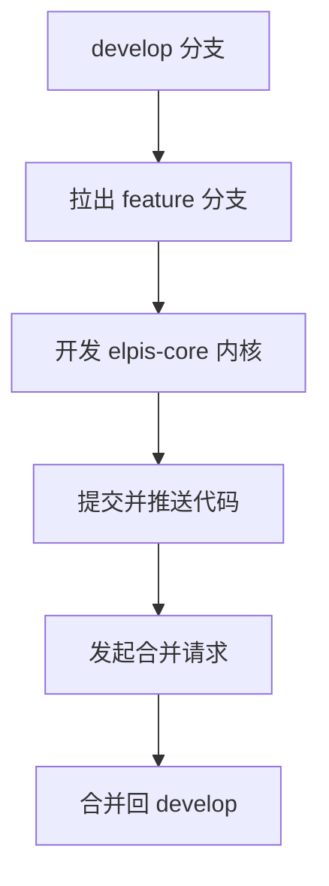

对应命令可以理解为：

```bash filename="git" copy
git checkout develop
git checkout -b feature/elpis-core
git push -u origin feature/elpis-core
```

这一节虽然进入代码实现，但老师仍然把研发流程放在前面。

这说明课程不是只关注代码本身，也在训练完整的研发习惯：功能开发要有分支隔离，代码完成后要走提交、推送、合并请求和 Review 流程。

## 入口调整

上一节项目初始化时，入口文件中是直接创建 Koa 实例并启动服务。

现在开始实现 elpis-core 后，入口文件的职责要发生变化。

原来的入口文件直接控制 Koa：

```js filename="index.js" copy
const Koa = require("koa")

const app = new Koa()

app.listen(8080, () => {
  console.log("server running on port 8080")
})
```

接下来希望变成：入口文件不再直接写 Koa 的启动细节，而是引入 elpis-core，通过内核暴露的 `start` 方法启动项目。

```js filename="index.js" copy {1,3-5}
const elpisCore = require("./elpis-core")

elpisCore.start({
  name: "lp",
})
```

这一处调整很关键。

入口文件从“直接启动 Koa”变成“启动内核”。后续 Koa 实例、环境识别、目录解析、Loader 加载、路由注册等逻辑，都会逐步放到 elpis-core 内部。

## 内核雏形

接下来创建 `elpis-core` 目录，并在里面创建 `index.js`。

目录结构先变成这样：

```text filename="项目目录" copy
.
├── index.js
└── elpis-core
    └── index.js
```

`elpis-core/index.js` 中先提供一个 `start` 方法。

```js filename="elpis-core/index.js" copy
const Koa = require("koa")

module.exports = {
  start(options = {}) {
    const app = new Koa()

    const port = process.env.PORT || 8080
    const host = process.env.IP || "0.0.0.0"

    app.listen(port, host, () => {
      console.log(`server running on port ${port}`)
    })
  },
}
```

这一步完成后，项目仍然可以启动。

区别在于：Koa 的启动逻辑已经从项目根入口迁移到了 elpis-core 内核中。

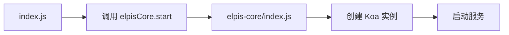

这就是内核的第一层雏形。

## 启动配置

`start` 方法不能只负责启动服务，还需要接收外部传入的项目配置。

所以课程中给 `start` 增加了 `options` 参数，并把它挂载到 Koa 实例上。

```js filename="elpis-core/index.js" copy {4,7}
const Koa = require("koa")

module.exports = {
  start(options = {}) {
    const app = new Koa()

    app.options = options

    const port = process.env.PORT || 8080
    const host = process.env.IP || "0.0.0.0"

    app.listen(port, host, () => {
      console.log(`server running on port ${port}`)
    })
  },
}
```

外部入口可以传入项目配置：

```js filename="index.js" copy {3-5}
const elpisCore = require("./elpis-core")

elpisCore.start({
  name: "lp",
})
```

挂载到 `app.options` 后，后续内核内部的其他模块都可以通过 Koa 实例拿到这些配置。

这一步的意义是给内核留出扩展空间。

现在只传了一个 `name`，后续可以继续传入更多配置，例如项目名称、运行模式、目录设置、插件配置等。

## 路径配置

内核需要知道两个路径。

第一个是项目根目录。

第二个是业务文件目录，也就是后续存放 `router`、`middleware`、`controller`、`service` 等文件的 `app` 目录。

课程中用 `process.cwd()` 获取项目根目录，再基于根目录拼出业务目录路径。

```js filename="elpis-core/index.js" copy {1,9-10}
const path = require("path")
const Koa = require("koa")

module.exports = {
  start(options = {}) {
    const app = new Koa()

    app.options = options
    app.baseDir = process.cwd()
    app.businessPath = path.resolve(app.baseDir, `.${path.sep}app`)

    const port = process.env.PORT || 8080
    const host = process.env.IP || "0.0.0.0"

    app.listen(port, host, () => {
      console.log(`server running on port ${port}`)
    })
  },
}
```

这里使用 `path.sep`，是为了兼容不同操作系统的路径分隔符。

不同系统的路径写法可能不同：

```text filename="路径差异" copy
Mac / Linux: /user/project/app
Windows:     C:\user\project\app
```

使用 `path` 模块处理路径，可以减少系统差异带来的问题。

## 当前内核状态

到这里，elpis-core 已经具备了三个基础能力。

| 能力     | 说明                                                  |
| -------- | ----------------------------------------------------- |
| 启动服务 | 通过 `start` 方法创建 Koa 实例并启动服务              |
| 接收配置 | 外部通过 `options` 传入配置，内核挂载到 `app.options` |
| 记录路径 | 内核记录项目根目录和业务目录路径                      |

可以整理成下面这条链路：

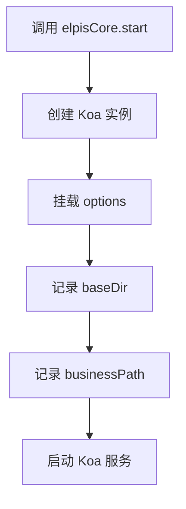

这一步完成后，内核已经开始从单纯的启动函数，变成一个可以承载配置和上下文的运行对象。

## 环境识别

服务端项目通常会区分不同环境。

常见环境包括：

- 本地环境
- 测试环境
- 生产环境

不同环境可能使用不同数据库、不同接口地址、不同日志策略和不同配置文件。

所以 elpis-core 需要先具备环境识别能力。

课程中新增了一个环境识别文件：

```text filename="elpis-core 目录" copy
elpis-core
├── index.js
└── env.js
```

`env.js` 会提供几个方法：

```js filename="elpis-core/env.js" copy
module.exports = {
  isLocal() {
    return process.env.ENV === "local"
  },

  isBeta() {
    return process.env.ENV === "beta"
  },

  isProduction() {
    return process.env.ENV === "production"
  },

  get() {
    return process.env.ENV || "local"
  },
}
```

这里的 `process.env.ENV` 表示启动项目时传入的环境变量。

如果没有传入，就默认认为当前是本地环境 `local`。

## 挂载环境

环境识别器写好后，需要在内核中引入并挂载到 Koa 实例上。

```js filename="elpis-core/index.js" copy {3,12}
const path = require("path")
const Koa = require("koa")
const env = require("./env")

module.exports = {
  start(options = {}) {
    const app = new Koa()

    app.options = options
    app.baseDir = process.cwd()
    app.businessPath = path.resolve(app.baseDir, `.${path.sep}app`)
    app.env = env

    const port = process.env.PORT || 8080
    const host = process.env.IP || "0.0.0.0"

    app.listen(port, host, () => {
      console.log(`server running on port ${port}`)
    })
  },
}
```

挂载完成后，后续内核或业务逻辑就可以通过 `app.env` 判断当前环境。

例如：

```js filename="环境判断示例" copy
app.env.isLocal()
app.env.isBeta()
app.env.isProduction()
app.env.get()
```

这一步完成后，elpis-core 就具备了基础环境识别能力。

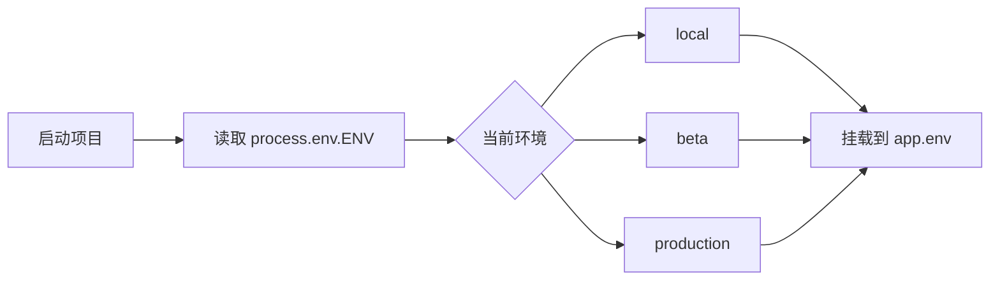

## Loader 体系

完成基础配置后，课程开始搭建 Loader 体系。

上一节设计课已经讲过，elpis-core 的核心任务之一，就是在项目启动时扫描 `app` 目录，把不同目录下的文件加载到内存中。

这一节先创建 `loader` 目录。

```text filename="elpis-core 目录" copy
elpis-core
├── index.js
├── env.js
└── loader
    ├── middleware-loader.js
    ├── router-schema-loader.js
    ├── router-loader.js
    ├── controller-loader.js
    ├── service-loader.js
    ├── config-loader.js
    └── extend-loader.js
```

这七个 Loader 分别对应 BFF 层里的不同能力。

| Loader                 | 负责内容         |
| ---------------------- | ---------------- |
| `middleware-loader`    | 加载中间件       |
| `router-schema-loader` | 加载接口参数规则 |
| `router-loader`        | 注册路由         |
| `controller-loader`    | 加载业务控制器   |
| `service-loader`       | 加载服务能力     |
| `config-loader`        | 加载配置文件     |
| `extend-loader`        | 加载扩展能力     |

这些 Loader 的作用，是把静态目录中的文件变成运行时可以访问的对象或函数。

## 加载顺序

创建好 Loader 文件后，需要在 elpis-core 的 `start` 方法中引入并执行它们。

```js filename="elpis-core/index.js" copy {4-10,20-26}
const path = require("path")
const Koa = require("koa")
const env = require("./env")
const middlewareLoader = require("./loader/middleware-loader")
const routerSchemaLoader = require("./loader/router-schema-loader")
const controllerLoader = require("./loader/controller-loader")
const serviceLoader = require("./loader/service-loader")
const configLoader = require("./loader/config-loader")
const extendLoader = require("./loader/extend-loader")
const routerLoader = require("./loader/router-loader")

module.exports = {
  start(options = {}) {
    const app = new Koa()

    app.options = options
    app.baseDir = process.cwd()
    app.businessPath = path.resolve(app.baseDir, `.${path.sep}app`)
    app.env = env

    middlewareLoader(app)
    routerSchemaLoader(app)
    controllerLoader(app)
    serviceLoader(app)
    configLoader(app)
    extendLoader(app)
    routerLoader(app)

    const port = process.env.PORT || 8080
    const host = process.env.IP || "0.0.0.0"

    app.listen(port, host, () => {
      console.log(`server running on port ${port}`)
    })
  },
}
```

这里有一个细节：`router-loader` 放在最后执行。

因为路由负责最终分发请求，在注册路由之前，中间件、参数规则、Controller、Service 等能力需要先完成加载。

可以把加载顺序理解成：

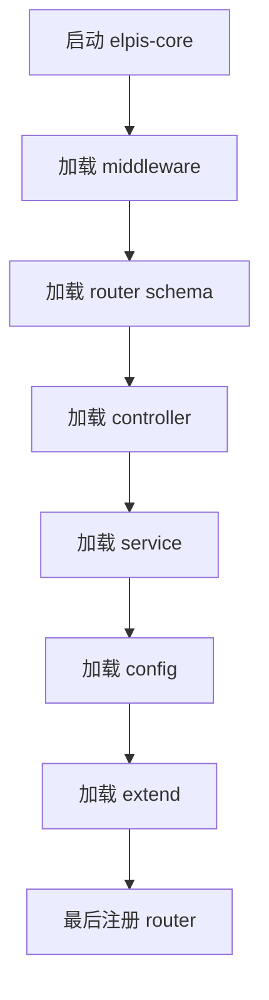

这样请求进入系统时，路由才能找到前面已经加载好的各种能力。

## Loader 形态

每个 Loader 的基本形态都比较一致。

它接收一个 `app` 参数，然后基于 `app.businessPath` 找到对应业务目录，再把读取到的内容挂载回 `app`。

可以先写成基础结构：

```js filename="elpis-core/loader/middleware-loader.js" copy
module.exports = function middlewareLoader(app) {
  // 加载 middleware
}
```

其他 Loader 也是类似结构：

```js filename="elpis-core/loader/router-schema-loader.js" copy
module.exports = function routerSchemaLoader(app) {
  // 加载 router schema
}
```

这种写法的核心是：每个 Loader 都围绕同一个 Koa 实例工作。

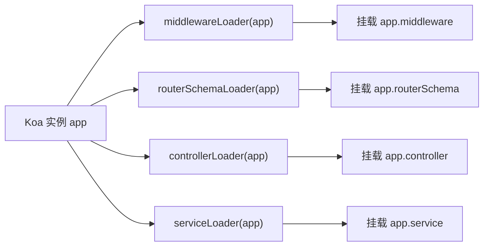

后续业务模块最终都会挂到 `app` 上，形成统一的运行时上下文。

## 中间件加载目标

`middleware-loader` 的目标，是扫描 `app/middleware` 目录，并把里面的中间件挂载到 `app.middleware` 上。

假设后续业务中有这样的文件：

```text filename="middleware 示例目录" copy
app
└── middleware
    └── custom-folder
        └── custom.js
```

加载完成后，希望可以通过类似下面的方式访问：

```js filename="访问中间件示例" copy
app.middleware.customFolder.custom
```

这个过程包含两件事。

第一，根据目录结构生成对象层级。

第二，把文件名和目录名转换成更适合 JavaScript 访问的驼峰形式。

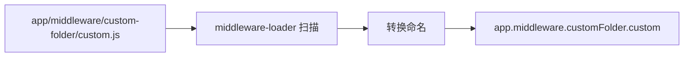

这也是 `middleware-loader` 相对复杂的地方。

它不只是读取一级文件，还要处理多级目录，并把目录结构还原成对象结构。

## 扫描目录

实现 `middleware-loader` 时，先读取 `app/middleware` 目录下的所有 `.js` 文件。

课程中使用类似 `glob` 的工具扫描文件列表。

```js filename="elpis-core/loader/middleware-loader.js" copy {1-2,5-8}
const path = require("path")
const glob = require("glob")

module.exports = function middlewareLoader(app) {
  const middlewarePath = path.resolve(
    app.businessPath,
    `.${path.sep}middleware`
  )

  const fileList = glob.sync(`${middlewarePath}${path.sep}**${path.sep}*.js`)

  const middleware = {}

  app.middleware = middleware
}
```

这里的关键点有三个。

第一，`app.businessPath` 指向业务目录，也就是项目根目录下的 `app`。

第二，`middlewarePath` 指向 `app/middleware`。

第三，`glob.sync` 会扫描这个目录下所有层级中的 `.js` 文件。

> [!TIP]
>
> 这一类 Loader 的共同模式是：先根据 `app.businessPath` 找到目标目录，再扫描目标目录下的文件，最后把文件内容挂载到 `app` 上。

## 路径截取

扫描到文件后，得到的一般是完整路径。

例如：

```text filename="完整路径示例" copy
/workspace/app/app/middleware/custom-folder/custom.js
```

但 Loader 真正需要的是相对于 `middleware` 目录的这一段：

```text filename="相对路径示例" copy
custom-folder/custom
```

所以需要对路径做截取，去掉前面的绝对路径和最后的 `.js` 后缀。

可以把处理过程理解成：

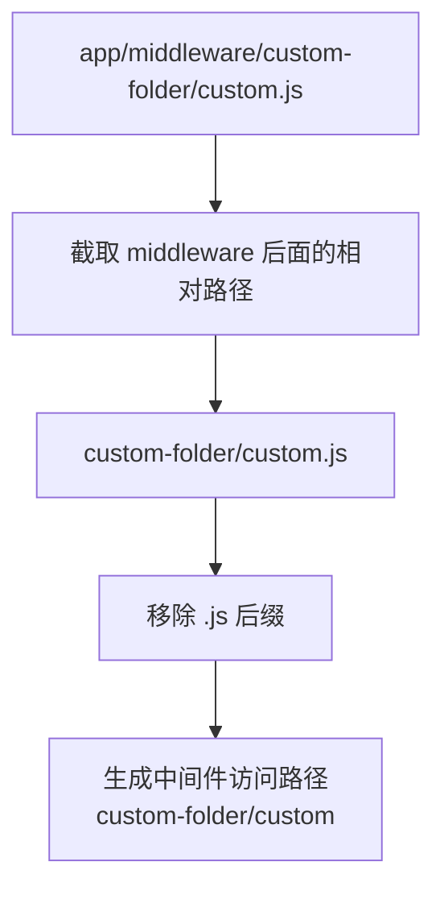

这一步是为了后续生成对象层级。

## 命名转换

拿到相对路径后，还要处理命名。

如果路径中出现 `-`、`_` 或目录分隔符，需要转成适合点语法访问的形式。

例如：

```text filename="命名转换示例" copy
custom-folder/custom.js
```

最终希望变成：

```text filename="访问路径示例" copy
customFolder.custom
```

课程中的处理思路是：

- 根据路径分隔符拆成数组
- 对每一段名称进行处理
- 把 `-x`、`_x` 这类形式转成大写字母
- 最后构造嵌套对象

一个简化版命名转换可以写成：

```js filename="命名转换示例" copy
function toCamelCase(name) {
  return name.replace(/[-_](\w)/g, (_, letter) => {
    return letter.toUpperCase()
  })
}
```

例如：

```js filename="命名转换结果" copy
toCamelCase("custom-folder") // customFolder
```

## 挂载中间件

处理完路径和命名后，下一步是把文件真正挂载到 `app.middleware` 上。

中间件文件通常会导出一个函数。Loader 读取文件后，会把 `app` 传进去执行，最终得到对应中间件能力。

简化后的挂载逻辑可以理解为：

```js filename="elpis-core/loader/middleware-loader.js" copy {12-28}
const path = require("path")
const glob = require("glob")

function toCamelCase(name) {
  return name.replace(/[-_](\w)/g, (_, letter) => {
    return letter.toUpperCase()
  })
}

module.exports = function middlewareLoader(app) {
  const middlewarePath = path.resolve(
    app.businessPath,
    `.${path.sep}middleware`
  )
  const fileList = glob.sync(`${middlewarePath}${path.sep}**${path.sep}*.js`)

  const middleware = {}

  fileList.forEach((file) => {
    const relativePath = file
      .replace(`${middlewarePath}${path.sep}`, "")
      .replace(/\.js$/, "")

    const names = relativePath.split(path.sep).map(toCamelCase)

    let current = middleware

    names.forEach((name, index) => {
      if (index === names.length - 1) {
        current[name] = require(path.resolve(file))(app)
      } else {
        current[name] = current[name] || {}
        current = current[name]
      }
    })
  })

  app.middleware = middleware
}
```

这段逻辑完成了 `middleware-loader` 的核心功能。

它把目录结构转换成对象结构，把中间件文件转换成运行时可以访问的能力。

## 中间件加载流程

`middleware-loader` 的完整流程可以整理成下面这样：

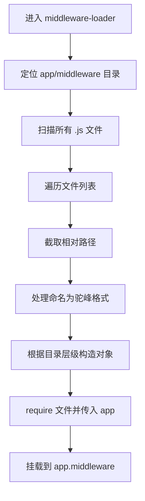

这一节在这里花了较多时间。

原因是 `middleware-loader` 代表了后续很多 Loader 的通用思路：读取目录、扫描文件、处理路径、加载模块、挂载到 `app`。

掌握这个 Loader 后，再理解其他 Loader 会容易很多。

## 注释习惯

这一节老师特别强调了一个编码习惯：先写注释，再写代码。

在实现 `middleware-loader` 时，老师不是直接上来写完整逻辑，而是先用注释把步骤列出来：

```js filename="middleware-loader 设计注释" copy
// 1. 读取 middleware 目录下所有文件
// 2. 遍历所有文件目录
// 3. 截取文件路径
// 4. 处理文件名称
// 5. 挂载 middleware 到 app 对象中
```

这类注释不是事后补充。

它更像是编码前的设计稿。先把要做的事情写清楚，再用代码逐步实现。

> [!TIP]
>
> 写复杂逻辑时，可以先把流程用注释写出来。注释能帮助开发者理清步骤，也能让后面阅读代码的人更快理解这段代码的意图。

## Router Schema

实现完 `middleware-loader` 后，课程开始实现 `router-schema-loader`。

它负责加载接口参数规则。

前面设计课已经讲过，BFF 层的请求进入系统后，会先经过路由分发和参数校验。`router-schema` 就是用来描述每个接口需要接收什么参数、哪些参数必传、参数类型是什么、是否有枚举限制等。

它的位置在：

```text filename="router-schema 目录" copy
app
└── router-schema
    ├── user.js
    └── site.js
```

后续这些配置会配合 **JSON Schema** 和 **AJV** 使用。

- JSON Schema 用来描述参数规则
- AJV 用来执行参数校验
- API 参数校验中间件会读取这些规则并完成校验

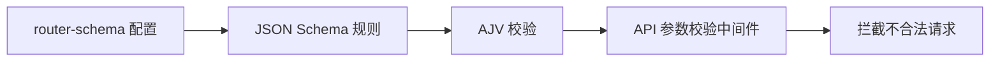

这一节先实现加载逻辑，具体校验规则和中间件会在后面继续展开。

## Schema 加载目标

`router-schema-loader` 的目标，是扫描 `app/router-schema` 目录下的配置文件，并把配置挂载到 `app.routerSchema` 上。

目标结构类似：

```js filename="routerSchema 挂载结果" copy
app.routerSchema = {
  api1: {
    // api1 对应的参数规则
  },
  api2: {
    // api2 对应的参数规则
  },
}
```

和 `middleware-loader` 不同，`router-schema-loader` 处理的是配置对象。

中间件文件通常导出函数，需要执行。

Schema 文件通常导出配置，直接读取并合并即可。

## 实现 Schema Loader

`router-schema-loader` 的实现比 `middleware-loader` 简单。

因为课程中暂时约定 `router-schema` 文件放在一级目录下，不需要处理复杂嵌套目录。

核心逻辑是：

```js filename="elpis-core/loader/router-schema-loader.js" copy {1-2,5-15}
const path = require("path")
const glob = require("glob")

module.exports = function routerSchemaLoader(app) {
  const routerSchemaPath = path.resolve(
    app.businessPath,
    `.${path.sep}router-schema`
  )

  const fileList = glob.sync(`${routerSchemaPath}${path.sep}*.js`)

  let routerSchema = {}

  fileList.forEach((file) => {
    routerSchema = {
      ...routerSchema,
      ...require(path.resolve(file)),
    }
  })

  app.routerSchema = routerSchema
}
```

这段逻辑做了几件事：

- 找到 `app/router-schema` 目录
- 扫描目录下的 `.js` 文件
- 依次 `require` 每个配置文件
- 使用展开运算符合并配置
- 最终挂载到 `app.routerSchema`

因为当前还没有真实业务 Schema 文件，所以运行时 `app.routerSchema` 可能是一个空对象。

这属于正常现象。

## 两类 Loader 对比

本节课实现的两个 Loader，处理方式有明显区别。

| Loader                 | 文件类型   | 加载方式                   | 挂载位置           |
| ---------------------- | ---------- | -------------------------- | ------------------ |
| `middleware-loader`    | 函数型模块 | `require(file)(app)`       | `app.middleware`   |
| `router-schema-loader` | 配置型模块 | `require(file)` 后合并对象 | `app.routerSchema` |

`middleware-loader` 更复杂，因为它要支持多级目录，还要把文件路径转换成对象访问路径。

`router-schema-loader` 更直接，因为它加载的是规则配置，只需要把不同文件导出的对象合并起来。

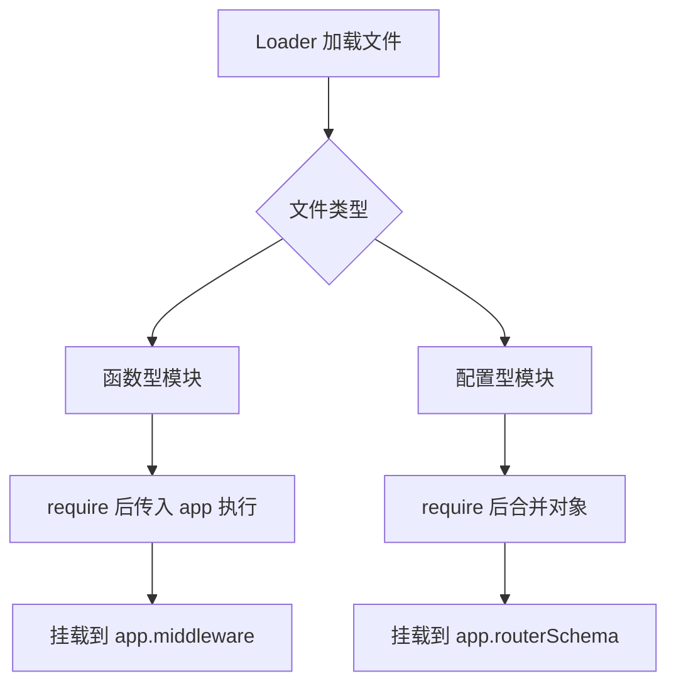

理解这两类差异后，后续实现 Controller、Service、Config、Extend 等 Loader 时，就能更清楚地判断它们应该如何加载。

## 阶段测试

课程中多次强调，代码要写一段测一段。

例如创建 Loader 文件后，先执行项目，确认所有 Loader 能正常加载。

如果拼写错误、文件路径错误或方法名写错，启动时会直接报错。

修复后，再继续往下写。

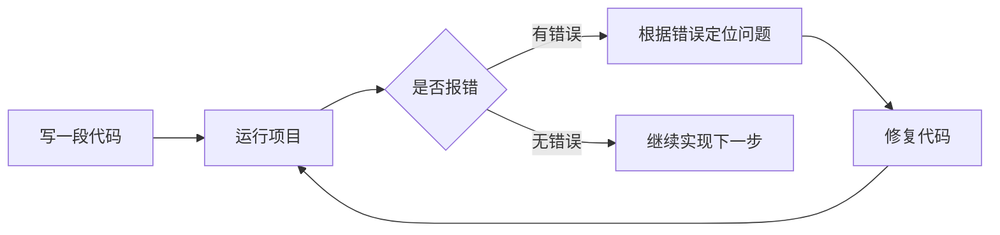

这种习惯在写框架内核时非常重要。

内核代码涉及路径、模块加载、对象挂载和运行时上下文，一旦前面某个细节写错，后面会越来越难排查。

所以这一节的节奏是：创建文件、引入文件、执行 Loader、运行测试、发现问题、修复问题，再继续实现下一个 Loader。

## 当前成果

到本节课结束时，elpis-core 已经完成了第一阶段实现。

当前具备这些能力：

- 通过功能分支开发内核代码
- 项目入口改为调用 `elpisCore.start`
- elpis-core 内部负责创建 Koa 实例
- `start` 方法支持接收 `options`
- Koa 实例上挂载了项目配置
- Koa 实例上记录了项目根目录和业务目录
- 新增 `env.js` 环境识别器
- Koa 实例上挂载了 `app.env`
- 创建了 Loader 目录和七类 Loader 文件
- 在 `start` 方法中依次执行 Loader
- 实现了 `middleware-loader`
- 实现了 `router-schema-loader`

当前结构可以整理成：

```text filename="当前项目结构" copy
.
├── index.js
├── app
│   ├── middleware
│   └── router-schema
└── elpis-core
    ├── index.js
    ├── env.js
    └── loader
        ├── middleware-loader.js
        ├── router-schema-loader.js
        ├── router-loader.js
        ├── controller-loader.js
        ├── service-loader.js
        ├── config-loader.js
        └── extend-loader.js
```

对应运行时状态可以理解为：

```text filename="运行时挂载结果" copy
app.options
app.baseDir
app.businessPath
app.env
app.middleware
app.routerSchema
```

后续课程会继续实现剩下的 Loader，并逐步让 Controller、Service、Router 真正接入请求处理流程。

## 本节重点

本节课需要重点记住四件事。

第一，入口文件开始转向内核启动。

项目不再直接在根入口中创建 Koa 并启动，而是通过 `elpisCore.start()` 统一启动。这样后续所有服务端框架能力都可以收敛到 elpis-core 内部。

第二，Koa 实例会成为运行时上下文。

`options`、路径、环境识别、middleware、routerSchema 等内容都会挂载到 `app` 上。后续 Loader 也都会围绕这个 `app` 实例工作。

第三，Loader 是内核的核心机制。

Loader 会在项目启动时扫描指定目录，把静态文件加载到内存中，再挂载到 `app` 上。开发者只需要按目录约定写文件，内核负责把文件变成运行时能力。

第四，代码实现要小步测试。

这节课不断体现出一个习惯：每完成一小段逻辑，就运行项目确认是否正常。框架内核代码比较容易受到路径、命名和模块加载影响，阶段性测试可以降低排错成本。

## 本节小结

本节课开始实现 elpis-core 引擎内核。

课程先按照 GitFlow 流程从 `develop` 拉出功能分支，保证后续内核代码在独立分支上开发。

随后调整项目入口，把原来直接启动 Koa 的方式，改成通过 `elpisCore.start()` 启动项目。这样项目入口变得更干净，Koa 的创建、配置、环境识别和 Loader 加载都可以逐步收敛到 elpis-core 内部。

接着，课程给 `start` 方法增加了 `options` 参数，并把配置挂载到 Koa 实例上。同时记录了项目根路径 `baseDir` 和业务目录路径 `businessPath`，为后续扫描 `app` 目录做准备。

然后实现了 `env.js` 环境识别器，提供本地、测试、生产环境判断方法，并挂载到 `app.env` 上。

最后进入 Loader 体系搭建。

课程创建了七类 Loader 文件，并在 elpis-core 启动时依次执行它们。其中 `router-loader` 放在最后，因为路由注册需要依赖前面已经加载好的中间件、参数规则、Controller、Service 等能力。

本节课重点实现了两个 Loader。

`middleware-loader` 用来扫描 `app/middleware` 目录，把多级目录中的中间件文件转换成对象结构，并挂载到 `app.middleware` 上。

`router-schema-loader` 用来扫描 `app/router-schema` 目录，把接口参数规则配置合并后挂载到 `app.routerSchema` 上。

这一节完成后，elpis-core 已经具备内核雏形。它开始能够接收配置、识别环境、记录目录，并通过 Loader 把业务文件加载到运行时。后续课程会继续实现 Controller、Service、Router 等 Loader，让整个 BFF 服务框架真正跑起来。
