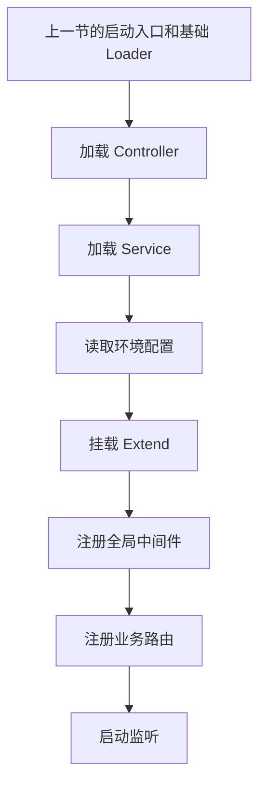
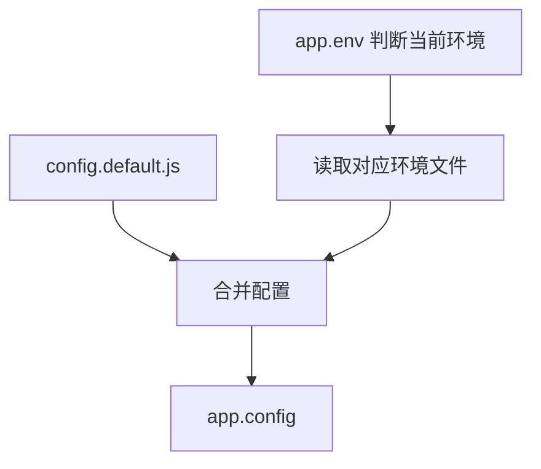
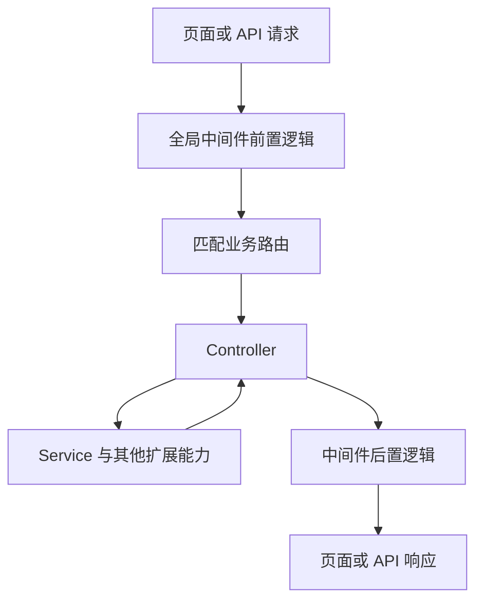

# elpis-core 引擎内核实现（2）

<MuxPlayer
  className="mt-8"
  playbackId="v3KGM02ETvDXaQr31YNbxCprXzG2UlTr38QMSDOO00A8E"
  title="elpis-core 引擎内核实现（2）"
/>

> [!NOTE]
>
> 本节继续上一节的 Loader 实现，完成 **Controller、Service、Config、Extend 和 Router** 的加载，并在路由注册之前增加全局中间件入口。
>
> 这一节需要分清不同模块的加载结果：Controller 和 Service 要实例化，Config 要根据环境合并，Extend 直接扩展 Koa 实例，Router 则把业务文件中的接口注册到路由对象上。
>
> 当这些环节全部接通，项目就具备了从入口初始化、扫描业务目录到启动服务的完整流程。此时业务目录还没有填充，真正的页面与接口验证会在后面的应用课中完成。

## 接着上一节往下走

上一节已经把项目入口切换为 `elpisCore.start(options)`，也建立了业务目录、环境识别器、中间件加载器和路由参数规则加载器。

这节继续沿着启动函数里的调用顺序，逐个实现剩下的 Loader。写代码时，老师不断回到前面已经实现的模块，检查哪些逻辑可以复用，哪些逻辑必须按新模块的职责调整。

这一点在 Controller 和 Service 的实现中尤其明显。它们都需要扫描目录、转换名称、建立对象层级，但文件导出的是“返回类的工厂函数”，不能照搬中间件的调用方式。

下面的代码是按课堂思路整理的实现示例，用于解释目录约定和执行过程。它与前一节的 Loader 设计衔接，不是对视频画面中源码的逐字转录。



## Controller 的加载目标

Controller Loader 要把 `app/controller` 目录下的文件，转换成 `app.controller` 上可以访问的实例。

例如，业务目录中有这样一个控制器：

```text filename="Controller 目录约定" copy
app/
└── controller/
    └── custom-module/
        └── custom-controller.js
```

加载完成后，业务代码希望通过下面的路径访问它：

```js filename="Controller 的访问方式" copy
app.controller.customModule.customController
```

这里发生了三次转换：先去掉业务目录前缀和 `.js` 后缀，再把横杠名称转为驼峰名称，最后根据目录层级创建对象。

文件路径不是一个可以直接使用的对象属性。Loader 的价值，就是把文件组织方式转换成运行时的访问方式，让业务开发者遵循目录约定即可。

| 文件中的位置 | 运行时含义 |
| --- | --- |
| `app/controller` | Controller 加载的根目录 |
| `custom-module` | 对象中的 `customModule` 层 |
| `custom-controller.js` | `customController` 属性对应的实例 |

## 目录层级如何变成对象

这一部分沿用上一节的扫描和名称转换思路。

先拿到文件相对于 Controller 根目录的路径，然后按目录分隔符拆开。例如：

```js filename="路径转换示意" copy
// 文件相对路径
"custom-module/custom-controller.js"

// 去掉扩展名，并将每一层转成驼峰名称
["customModule", "customController"]
```

遍历这组名称时，要区分最后一项和前面的目录项。

前面的项代表目录，如果对象上还没有这一层，就创建一个空对象。最后一项代表具体文件，在这一层挂载控制器实例。

可以用一个临时变量沿着对象不断向下移动：

```js filename="嵌套挂载的基本过程" copy
const controller = {}
const names = ["customModule", "customController"]
let current = controller

for (let i = 0; i < names.length - 1; i += 1) {
  const key = names[i]
  current[key] = current[key] || {}
  current = current[key]
}

// 此时 current 指向 controller.customModule。
// 最后一层交给后面的实例化逻辑处理。
```

`current` 只是移动了引用，并没有把最外层的 `controller` 丢掉。每次在 `current` 上新增属性，实际都是在完善同一棵对象树。

如果目录更深，例如 `a/b/c/example.js`，这个过程仍然成立：先走到 `a`，再走到 `b`、`c`，最后挂载 `example`。

> [!TIP]
>
> 理解这一段时，可以在每次循环后打印 `controller` 和 `current`。前者展示完整对象树，后者展示当前正在填充的那一层。两者的职责不同。

## Controller 为什么要分两步初始化

Controller 文件不是直接导出一个实例，也不是像普通中间件那样直接返回一个请求处理函数。

课程采用的约定，是先导出一个接收 `app` 的函数，再由这个函数返回一个类：

```js filename="app/controller/example.js" copy
module.exports = (app) => {
  return class ExampleController {
    async index(ctx) {
      ctx.body = { name: app.options.name }
    }
  }
}
```

因此 Loader 要先执行工厂函数得到类，再实例化这个类：

```js filename="Controller 的实例化过程" copy
const createController = require(filePath)
const Controller = createController(app)
const instance = new Controller(app)
```

这里传入 `app`，是为了让控制器能够访问框架上下文。例如后面业务方法会用到 `app.service`、`app.config` 等能力。

工厂函数中的 `app` 可以通过闭包被控制器方法使用；构造函数如果需要，也可以接收实例化时的参数。不要把“加载模块”“调用工厂”“实例化类”混成同一个动作。


## 串起 Controller Loader

把扫描、名称转换、嵌套挂载和实例化组合起来，就得到 Controller Loader 的基本流程。

以下示例沿用课程中的 CommonJS 和 `glob.sync` 调用方式：

```js filename="elpis-core/loader/controller-loader.js" copy
const path = require("path")
const glob = require("glob")

const toCamelCase = (name) =>
  name.replace(/-([a-z])/g, (_, letter) => letter.toUpperCase())

module.exports = (app) => {
  const root = path.resolve(app.businessPath, "controller")
  const files = glob.sync(path.join(root, "**/*.js"))
  const controller = {}

  files.forEach((filePath) => {
    const names = path
      .relative(root, filePath)
      .replace(/\.js$/, "")
      .split(path.sep)
      .map(toCamelCase)

    let current = controller

    names.forEach((name, index) => {
      if (index === names.length - 1) {
        const Controller = require(filePath)(app)
        current[name] = new Controller(app)
        return
      }

      current[name] = current[name] || {}
      current = current[name]
    })
  })

  app.controller = controller
}
```

课程中强调，复制上一节的代码后，需要从上到下逐行检查。目录变量、临时对象、挂载属性和注释都要改成 Controller 对应的名称。

只改函数名，很容易留下仍然指向中间件目录的路径，或者把实例挂到错误的属性上。后面的应用课就会暴露这种问题。

## Service Loader 的复用

Service Loader 与 Controller Loader 的结构基本相同。

它扫描 `app/service`，把路径中的横杠转换为驼峰名称，建立对象层级，然后调用 Service 工厂并创建实例，最终挂到 `app.service`。

```text filename="Service 文件与访问路径" copy
app/service/custom-module/custom-service.js
    ↓
app.service.customModule.customService
```

需要改变的是“扫描哪里”和“挂到哪里”，不是重新设计一套完全不同的加载机制。

| 项目 | Controller | Service |
| --- | --- | --- |
| 扫描目录 | `app/controller` | `app/service` |
| 导出形式 | 接收 `app`，返回类 | 接收 `app`，返回类 |
| 加载结果 | 控制器实例 | 服务实例 |
| 挂载位置 | `app.controller` | `app.service` |

老师在这一段反复启动服务，检查是否已经挂上对象。如果代码中还有复制后未修改的变量名，就根据报错回到对应文件继续修正。

需要注意，此时打印出一个空对象，只能说明 Loader 的初始化流程可以执行。还没有业务文件时，不能据此断言所有目录映射和业务调用都已经正确，后续必须放入真实文件验证。

## Config 的职责与其他 Loader 不同

Config Loader 不需要构建嵌套模块树。

它的目标是读取默认配置，再根据当前环境读取一份环境配置，用后者覆盖前者，形成最终的 `app.config`。

课程约定配置目录放在项目根目录：

```text filename="环境配置目录" copy
config/
├── config.default.js
├── config.local.js
├── config.beta.js
└── config.production.js
```

这里必须使用 `app.baseDir` 定位 `config`，不能沿用 Controller、Service 中的 `app.businessPath`。

`businessPath` 已经指向项目的 `app` 目录，如果再接 `config`，就会去找 `app/config`，与本节约定不符。

```js filename="配置目录的定位" copy
const configPath = path.resolve(app.baseDir, "config")
```

目录看似只是一个路径，实际也是框架对开发者的约定。后面的应用课会按这个约定创建配置文件，Loader 必须与使用端保持一致。

## 默认配置与环境覆盖

默认配置保存各环境共用的值，例如项目名称。环境配置保存当前环境需要改变的部分，例如测试服务地址。

合并过程如下：



假设默认配置和本地配置分别为：

```js filename="配置覆盖示例" copy
const defaultConfig = {
  name: "elpis",
  timeout: 5000,
}

const localConfig = {
  name: "elpis-local",
  debug: true,
}

const config = {
  ...defaultConfig,
  ...localConfig,
}
// { name: "elpis-local", timeout: 5000, debug: true }
```

同名字段以后展开的环境配置为准；默认配置中没有被覆盖的字段继续保留；环境配置独有的字段也会加入结果。

这里采用的是对象展开的浅合并。如果同名字段本身是一个对象，后面的对象会整体替换前面的值，不会自动逐层合并。理解这一点，有助于后面设计配置结构。

课程按 `isLocal()`、`isBeta()` 和 `isProduction()` 判断应读取的文件。最终业务层访问的是 `app.config`，不需要每个控制器再判断环境并读取文件。

## 可选配置文件的处理

Config Loader 还有一个与目录扫描不同的细节：它会主动拼出某个文件名，再尝试加载。

对于扫描得到的文件列表，路径来自已经找到的文件；对于 `config.default.js` 和环境配置，用户未必已经创建这些文件。

老师因此在加载位置加入 `try/catch`。缺少配置时给出提示，保留空配置，让当前阶段的服务能够继续启动。

```js filename="可选配置加载示意" copy
const fs = require("fs")

function readOptionalConfig(filePath) {
  if (!fs.existsSync(filePath)) {
    console.warn(`配置文件不存在：${filePath}`)
    return {}
  }

  return require(filePath)
}
```

上面的复盘示例用存在性判断突出“缺少可选文件”的边界。课堂的写法是在 `require` 外层捕获异常；实际排查时还应区分文件不存在和文件本身有语法错误，避免把两种问题都理解成“没有配置”。

完成后可以打印 `app.config`，检查当前环境的结果。课堂此时还没有实际配置文件，所以能够正常启动并提示文件缺失，是当前步骤的验证结果。

## Extend 直接挂在 app 上

Extend Loader 用于为框架上下文增加额外能力。

它与 Controller、Service 有两个明显区别：只处理 `app/extend` 下的一层文件，并且直接挂到 `app`，中间没有 `extend` 这一层属性。

```text filename="Extend 的映射关系" copy
app/extend/custom-extend.js
    ↓
app.customExtend
```

这意味着扫描时只需要匹配 `*.js`，不需要递归处理 `**/*.js`，也不需要前面那一套创建多层对象的循环。

示意实现如下：

```js filename="elpis-core/loader/extend-loader.js" copy
const path = require("path")
const glob = require("glob")

module.exports = (app) => {
  const root = path.resolve(app.businessPath, "extend")
  const files = glob.sync(path.join(root, "*.js"))

  files.forEach((filePath) => {
    const name = path
      .basename(filePath, ".js")
      .replace(/-([a-z])/g, (_, letter) => letter.toUpperCase())

    if (name in app) {
      console.warn(`扩展名称已存在，跳过加载：${name}`)
      return
    }

    app[name] = require(filePath)(app)
  })
}
```

重名检查很关键。`app` 本身已经有 Koa 的属性和方法，前面 Loader 也挂载了一些框架能力。如果扩展文件与它们重名，直接赋值就可能把原来的能力覆盖掉。

本节采用的处理方式是提示并跳过冲突扩展。开发者应修改扩展名称，而不是让 Loader 静默替换原有字段。

## Router Loader 负责注册

前面几个 Loader 大多围绕“读取文件，挂载对象”展开，Router Loader 则负责把接口注册到 `koa-router` 实例。

业务路由文件同样导出一个函数，不过它接收两个参数：`app` 和 `router`。

```js filename="app/router/example.js" copy
module.exports = (app, router) => {
  const controller = app.controller.example

  router.get(
    "/example",
    controller.index.bind(controller)
  )
}
```

`app` 提供前面已经加载好的 Controller、Service 等上下文；`router` 提供 `get`、`post` 等注册方法。

因此 Router Loader 扫描到一个路由文件后，只需要加载并执行它，文件内部就会把自己的接口添加到同一个路由实例上。

```js filename="路由文件加载过程" copy
const Router = require("koa-router")
const router = new Router()

files.forEach((filePath) => {
  require(filePath)(app, router)
})

app.use(router.routes())
app.use(router.allowedMethods())
```

这也是 Router Loader 要放在其他 Loader 后面的原因。路由文件执行时可能马上访问 `app.controller.example`，如果控制器尚未加载，这一步就无法完成。

## 兜底路由与首页配置

所有业务路由注册完成后，课堂增加一个兜底路由。

当访问路径没有匹配到业务路由时，把用户临时重定向到项目首页。课程使用的是 302 临时重定向，并从启动参数中读取 `homePage`。

```js filename="启动参数与兜底目标" copy
elpisCore.start({
  name: "elpis",
  homePage: "/view/page1",
})

// Router Loader 内确定回退目标的关键表达式
const homePage = app.options?.homePage || "/"
```

框架只约定存在这个配置项，不把每个项目的首页写死在内核中。这样同一个内核可以服务不同业务项目。

`options` 中的配置从项目入口传进来，再挂到 `app.options`，最后由 Router Loader 使用。这是本节很清楚的一条配置传递链。

> [!IMPORTANT]
>
> 兜底目标必须是实际能访问的页面。如果首页本身也没有对应路由，再把它重定向到自己，就会形成循环。后面的静态资源应用课会通过浏览器里的重复重定向现象，进一步说明路由与资源目录的关系。

此外，兜底路由处理的是“没有匹配到路径”，不能自动处理业务方法抛出的所有异常。后面的应用课还会为异常返回补充专门的逻辑。

## 全局中间件入口

只加载业务自定义中间件还不够。开发者还需要接入 Koa 生态里的现成中间件，例如后面要使用的模板渲染和请求体解析能力。

课程为这类注册工作约定了一个集中入口：`app/middleware.js`。

```text filename="两个不同的中间件位置" copy
app/
├── middleware.js       # 集中注册全局中间件
└── middleware/         # 存放自定义中间件模块
```

这两个位置虽然名字接近，但用途不同。

`middleware` 目录里的模块交给 Loader 加载，供业务路由按需要使用；`middleware.js` 则在启动时执行，通过 `app.use()` 把中间件加入全局请求链路。

```js filename="app/middleware.js" copy
module.exports = (app) => {
  // 后续在这里注册模板引擎、静态资源、请求体解析等中间件。
}
```

内核会在 Router Loader 之前加载这个文件，并把 `app` 传进去。课堂同样为它加入缺失文件时的提示，避免当前业务目录还未创建时直接无法启动。

顺序不是随意的。例如后续控制器需要从请求体读取参数，解析请求体的中间件就应该先于路由处理运行。

## 从启动过程回到请求过程

到这里，需要把两个阶段分开理解。

启动阶段负责建立运行环境：创建 Koa 实例、准备路径和环境信息、执行 Loader、注册中间件和路由，最后监听端口。

请求阶段才真正执行业务：请求经过中间件进入路由和 Controller，由 Controller 调用 Service，再沿中间件链返回响应。



文件放在目录中，只是静态组织。Loader 在启动时把它们连接起来，才有了请求到达时可以使用的对象和调用关系。

这一节结束时，服务能够启动并监听端口，但还没有完整验证页面与接口。下一组应用课将切换到框架使用者的角度，实际创建这些业务文件。

## 提交前的检查

课堂最后提交代码时，检查工具提示存在未使用变量。老师回到 Extend Loader 删除无用变量，再继续提交。

这个过程说明，写完 Loader 后还需要检查代码本身的完整性，而不是看到服务启动就立即结束。

本节适合按三个层次检查：

- 启动层：各 Loader 可以依次执行，缺少可选配置时有明确提示。
- 结构层：Controller、Service 和 Extend 挂在正确位置，目录层级和命名转换符合约定。
- 使用层：后续通过实际页面和 API 验证实例、路由、中间件能否协同工作。

前两层是本节主要完成的内容，第三层会在接下来的应用课继续推进。

## 本节小结

本节补齐了 elpis-core 的主要启动流程。

Controller 和 Service 通过扫描目录、转换名称、建立对象层级并创建实例，成为 `app` 上的业务能力；Config 根据默认配置和当前环境生成统一配置；Extend 在检查重名后直接扩展 Koa 实例；Router 则执行业务路由文件，把接口注册到同一个路由对象上。

此外，内核增加了全局中间件入口和可配置的首页兜底策略，使开发者能够继续接入 Koa 生态能力。

这节最需要掌握的，是每种文件的导出形式与 Loader 的调用方式必须配套。下一节将通过环境配置和页面渲染，把这套约定真正用起来，也进一步检查内核实现中的问题。
