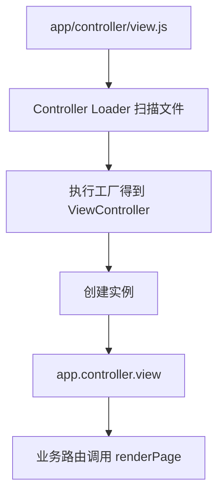
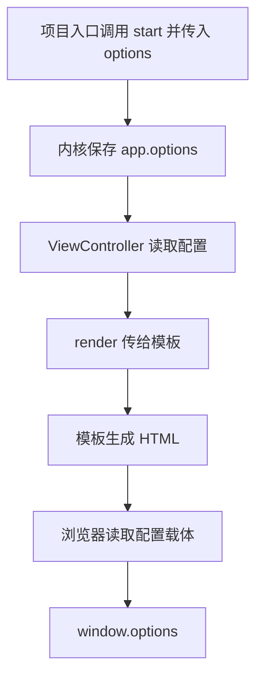

# elpis-core 引擎内核应用（1）

<MuxPlayer
  className="mt-8"
  playbackId="TwK7DY9rDRkIJikNjOfAy2T46Kb02dIui7eq01qp8rNhI"
  title="elpis-core 引擎内核应用（1）"
/>

> [!NOTE]
>
> 从本节开始，课程进入 **elpis-core 引擎内核的应用**。前两节写好了启动流程和 Loader，这一节换到使用者的角度，按照框架约定创建业务文件。
>
> 本节先补齐环境配置和全局中间件入口，再通过路由、Controller 和模板引擎渲染两个测试页面，最后把服务端的项目配置与环境信息传到浏览器。
>
> 实际使用还暴露了前面 Loader 中的命名错误。课程保留了定位、修复和检查同类代码的过程，这也是理解内核如何运作的重要部分。

## 从内核开发转向内核应用

此前的启动检查，只证明各 Loader 可以运行。现在要验证框架能否真正提供两类服务：页面响应和 API 响应。

本节先完成页面这条链路。API 的实现会在下一节继续展开。


整个过程仍在原来的内核功能分支上推进。需要补充业务代码时，先回看对应 Loader 的目录约定，再决定文件放在哪里、导出什么内容。

下面的示例依据字幕中的实现思路整理，重点展示模块之间的契约。示例配置值与测试页面文案用于复盘，不代表课程项目的完整源码。

## 先补齐启动所需的目录

上一节启动服务时，会出现默认配置不存在、全局中间件文件不存在的提示。

这两条提示对应两个不同位置：Config Loader 从项目根目录寻找 `config`；全局中间件入口则位于业务目录 `app` 下。

```text filename="本节新增的基础目录" copy
.
├── index.js
├── config/
│   ├── config.default.js
│   ├── config.local.js
│   ├── config.beta.js
│   └── config.production.js
└── app/
    └── middleware.js
```

配置文件导出一个对象；全局中间件文件导出一个函数。原因来自上一节内核的调用方式：配置会被直接读取和合并，中间件入口则会被传入 `app` 后执行。

```js filename="config/config.default.js" copy
module.exports = {}
```

```js filename="app/middleware.js" copy
module.exports = (app) => {
  // 接下来在这里注册模板引擎等全局能力。
}
```

文件建立后重新启动，缺失文件的提示消失，说明路径和导出形式已经与 Loader 对齐。

这里还有一个日志可读性问题。课堂把原来笼统的中间件缺失提示调整得更明确，用来区分“全局中间件入口缺失”和“自定义中间件模块缺失”。报错能指出是哪一层，后面的排查就容易得多。

## 通过启动命令区分环境

框架已经有环境识别器，但还需要在启动时传入环境变量。

课程分别准备本地、测试和生产环境命令，让同一个项目读取不同配置。延续前文笔记的 `ENV` 变量名，命令可整理为：

```json filename="package.json 的环境脚本示意" copy
{
  "scripts": {
    "dev": "ENV=local nodemon index.js",
    "beta": "ENV=beta node index.js",
    "production": "ENV=production node index.js"
  }
}
```

这里的变量名必须与 `env.js` 中读取的名称一致。脚本写入一个名称、代码读取另一个名称，就会造成始终进入默认环境的现象。

Mac 和常见类 Unix Shell 可以在命令前直接设置变量；课程同时提醒 Windows 的命令写法不同。例如在 Windows CMD 中可以写为：

```bat filename="Windows CMD 启动示意" copy
set "ENV=local" && node index.js
```

这一段的重点是区分“业务运行环境”和“当前操作系统”。`local`、`beta`、`production` 是项目自己的环境标记，不是电脑系统的名称。

## Nodemon 解决修改后重启

服务端代码修改以后，已经运行的 Node.js 进程不会自动重新执行入口。

如果每次修改都手动停止并重新启动服务，后续开发会非常繁琐。因此本地脚本使用 Nodemon 监听文件变化，并在变化后重启进程。


这里发生的是服务进程重启，不能与后面前端工程化里的模块热更新混为一谈。

课堂用保存文件后终端重新输出启动信息的现象验证它已经生效。后面修改中间件或 Controller 时，就可以直接观察新的运行结果。

## 验证配置覆盖是否正确

目录存在，只是最基本的一层验证。下一步要证明 Config Loader 的合并逻辑符合预期。

课堂在默认配置中放入名字和年龄，再在不同环境配置中覆盖名字，观察最后打印出的 `app.config`。

下面用等价数据说明：

```js filename="config/config.default.js" copy
module.exports = {
  name: "elpis",
  age: 33,
}
```

```js filename="config/config.local.js" copy
module.exports = {
  name: "elpis-local",
  debugAPI: "/debug",
}
```

这时本地环境应得到：

```json filename="本地环境合并结果" copy
{
  "name": "elpis-local",
  "age": 33,
  "debugAPI": "/debug"
}
```

这个结果同时证明三件事：同名字段被覆盖、默认字段得到保留、环境独有字段被补充进来。

随后切换测试和生产命令，再观察名称是否跟着变化。如果只有本地结果正确，仍不能确认环境识别部分完整可用。

验证完成后，应清理临时配置和打印。调试数据用于帮助理解 Loader，不应混进最终的业务配置。

## 为什么本地配置不提交

团队成员的本地配置往往不同，例如个人的调试地址和本地路径。

因此课程把 `config/config.local.js` 放入 `.gitignore`。共享的默认配置和环境约定继续由项目管理，个人开发配置留在各自电脑上。

```text filename=".gitignore" copy
config/config.local.js
```

这也意味着新同学克隆仓库后，需要按照约定创建自己的本地配置；不能因为仓库里没有这个文件，就直接判断 Config Loader 写错了。

这一阶段完成以后，课堂做了一次代码提交。把目录准备和环境配置作为一个独立阶段，后面检查历史时能看清每次提交解决了什么问题。

## 引入模板渲染能力

页面请求最终需要返回 HTML。课程选择通过 `koa-nunjucks-2` 接入 Nunjucks 模板引擎，用 `.tpl` 文件保存页面模板。

选择模板文件，是因为后续不仅要返回静态内容，还需要把服务端变量填入页面。

模板中间件放在刚刚创建的全局入口中：

```js filename="app/middleware.js" copy
const path = require("path")
const nunjucks = require("koa-nunjucks-2")

module.exports = (app) => {
  app.use(nunjucks({
    ext: "tpl",
    path: path.resolve(app.businessPath, "public"),
    nunjucksConfig: {
      trimBlocks: true,
      noCache: true,
    },
  }))
}
```

这里最重要的两个配置是模板扩展名和模板根目录。课堂在开发阶段关闭模板缓存，方便修改后观察结果。

注册完成后，请求上下文中会有 `ctx.render()`。Controller 不必自己读取文件、替换模板变量和拼接响应，而是通过这个方法完成页面渲染。

## 建立两个测试模板

课程先创建两个简单页面，用不同文字和颜色区分，验证路由能否选中不同模板。

```text filename="页面模板目录" copy
app/public/output/
├── entry.page1.tpl
└── entry.page2.tpl
```

`entry.` 是此时约定的文件名前缀，后面接页面名称。路径会与路由参数建立对应关系。

```html filename="app/public/output/entry.page1.tpl" copy
<!doctype html>
<html>
  <head>
    <meta charset="utf-8" />
    <title>page1</title>
  </head>
  <body>
    <h1 style="color: blue">page1</h1>
  </body>
</html>
```

第二个页面保持类似结构，改为 `page2` 并使用另一种颜色即可。此时重点是验证渲染链路，还没有引入 Vue 和 Webpack。

## 编写 View Controller

按照 Controller Loader 的约定，控制器文件需要导出一个接收 `app`、返回类的函数。

页面控制器提供 `renderPage` 方法，从路由参数中读取页面名称，再拼出模板路径：

```js filename="app/controller/view.js" copy
module.exports = (app) => {
  return class ViewController {
    async renderPage(ctx) {
      const page = ctx.params.page
      await ctx.render(`output/entry.${page}`)
    }
  }
}
```

`ctx.render()` 接收的路径相对于前面配置的模板根目录。配置已经指向 `app/public`，这里再接 `output/entry.page1`，就能找到对应模板。

所以路径需要从两端一起检查：模板中间件设置查找起点，Controller 提供起点之后的相对路径。重复写 `app/public` 或漏掉 `output` 都会导致查找失败。

## 把路由参数传给 Controller

接下来在 `app/router/view.js` 中注册页面路由：

```js filename="app/router/view.js" copy
module.exports = (app, router) => {
  const viewController = app.controller.view

  router.get(
    "/view/:page",
    viewController.renderPage.bind(viewController)
  )
}
```

当浏览器访问 `/view/page1` 时，`:page` 对应的值会成为 `ctx.params.page`；Controller 于是选择 `entry.page1.tpl`。

| 访问地址 | 路由参数 | 模板 |
| --- | --- | --- |
| `/view/page1` | `page1` | `output/entry.page1.tpl` |
| `/view/page2` | `page2` | `output/entry.page2.tpl` |

课程使用 `bind` 保留控制器方法的实例上下文。当前方法可能还没有访问 `this`，但后面继承 BaseController、调用公共方法时，这个绑定就会直接影响运行结果。

## 为什么可以直接访问 app.controller.view

路由文件并没有手动 `require` 页面控制器，却能通过 `app.controller.view` 拿到实例。

原因就在前一节编写的 Loader：它找到 `app/controller/view.js`，执行工厂函数得到类，创建实例，最后以 `view` 为属性名挂载到 `app.controller`。



这里把框架开发与框架应用连接了起来。文件名和导出形式不是随意写的，使用端遵守约定，加载端才能找到并初始化它。

## 实际暴露的 Loader 命名错误

第一次启动并没有直接成功。课堂在路由读取控制器时发现 `view` 不存在，于是回到 Controller Loader 打印中间结果。

预期挂载出的对象应该有 `view`，但实际出现了错误的属性名。继续检查循环后，发现代码遍历的是 `names` 数组，赋值时却写成了 `name[i]`。

```js filename="挂载名称的修正示意" copy
// names 是路径拆分后的名称数组。
const names = ["view"]

// 应读取数组中的完整名称。
const key = names[i]
```

这是很典型的复制代码后残留变量问题。只看 Loader 没有抛错，很难发现它；只有真正访问 `app.controller.view`，才会暴露对象结构不符合预期。

修正后，老师继续检查 Middleware Loader 和 Service Loader 中的同类代码，并搜索错误写法，避免其他位置保留相同问题。

随后还修正了业务路由里的控制器变量拼写，再启动服务，页面才真正渲染出来。

> [!TIP]
>
> 排查这种问题时，先确认运行时对象长什么样，再回看路径解析和赋值过程。一个错误修好后，要检查复制自同一段逻辑的其他模块。

## 页面成功与模板缺失是两种结果

课堂分别访问 `page1` 和 `page2`，确认不同模板可以被正确选中；访问尚未创建的 `page3` 则出现模板查找错误。

这几个请求帮助区分不同问题：

- 控制器取不到，说明加载或命名映射有问题。
- 控制器执行但模板找不到，说明模板目录、名称或参数需要检查。
- 两个页面均能显示，说明参数到模板的映射已经打通。

本节暂时以已有模板的成功渲染为阶段目标。缺失模板时如何统一处理，会在后面的异常中间件课程继续完善。

## 将服务端变量填入模板

能够渲染页面后，就可以继续验证模板变量注入。

`ctx.render()` 的第二个参数用来提供模板数据。课堂传入项目名、当前环境，以及序列化后的项目启动配置。

```js filename="ViewController 的渲染数据" copy
async renderPage(ctx) {
  await ctx.render(`output/entry.${ctx.params.page}`, {
    name: app.options.name,
    env: app.env.get(),
    options: JSON.stringify(app.options),
  })
}
```

这些值来自两个不同位置。项目名称和首页等启动选项来自 `elpisCore.start(options)`，环境标记则来自前面建立的环境识别器。

模板里可以在标题和表单元素中使用它们：

```html filename="entry.page1.tpl 的模板片段" copy
<title>{{ name }}</title>
<input id="env" value="{{ env }}" />
<input id="options" value="{{ options }}" />
```

刷新页面后，标题和输入框出现服务端传入的值，就证明“后端运行时数据 → 模板 → 浏览器”这条路径已经成立。

这里说的服务端渲染，是使用 Nunjucks 渲染 HTML 模板，不等于此时已经建立了 Vue 组件的服务端渲染与 hydration 流程。

## 从模板数据到浏览器全局配置

真实页面不需要把这些配置一直显示在输入框中。课堂随后把输入框隐藏，并在页面脚本里读取它们，挂到 `window` 上供前端代码使用。

```html filename="模板中的配置载体" copy
<input id="env" type="hidden" value="{{ env }}" />
<input id="options" type="hidden" value="{{ options }}" />
```

```js filename="浏览器读取配置" copy
window.env = document.getElementById("env").value

try {
  window.options = JSON.parse(
    document.getElementById("options").value
  )
} catch (error) {
  console.error("页面配置解析失败", error)
  window.options = {}
}
```

注意，环境标记本身是普通字符串，可以直接赋值；序列化后的配置对象才需要 `JSON.parse()`。

课堂在这里发生过一次错误：误把环境值拿去做 JSON 解析，结果 `local` 不是合法的 JSON 文本，于是触发异常。修正读取的元素之后，浏览器就能拿到配置对象。

这段代码依赖模板引擎对 HTML 属性值进行正确转义，不应为了传对象直接关闭所有转义。传给页面的也应限于前端需要的公开配置，例如项目名称、展示信息和首页路径。

## 重新串起配置的传递路径

项目入口中的配置，最终是如何来到浏览器里的？



这条链路很重要。它说明服务端不仅能提供一个 HTML 文件，还可以在返回页面时注入前端运行所需的初始信息。

后面建立真正的前端工程时，这些初始化能力仍然有用，只是页面内容和配置使用方式会继续抽象。

## 本节小结

本节把 elpis-core 从“能够启动的内核”推进到了“能够渲染页面的框架”。

首先按照 Loader 约定补齐配置目录与全局中间件入口，用不同启动环境验证配置覆盖，并通过 Nodemon 改善本地开发流程。随后接入模板引擎、创建页面 Controller 和业务路由，打通两个测试模板的访问。

实际应用还发现并修复了 Loader 的 `name`、`names` 混用，以及控制器变量拼写问题。最后，课程通过模板参数、隐藏输入框和浏览器全局变量，把项目配置与环境信息从后端传到前端。

下一节会继续引入静态资源，并实现第一条经过 Router、Controller、Service 的 API 请求链路。
