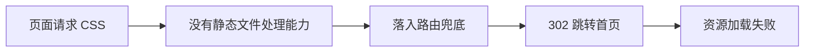
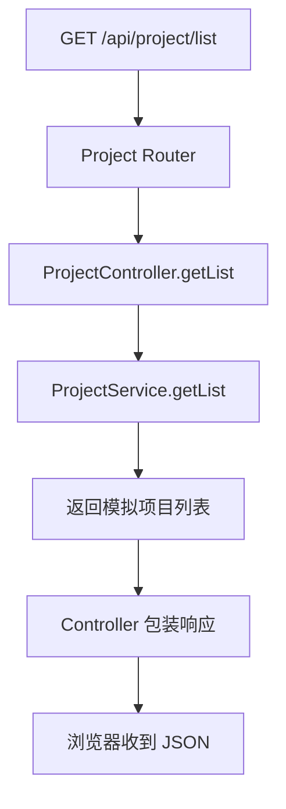
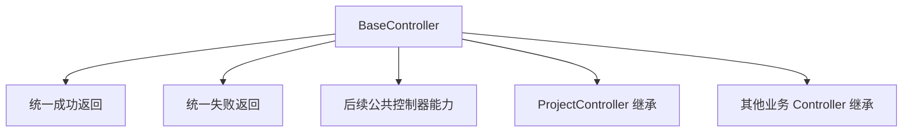
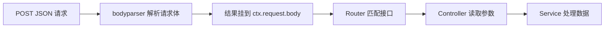

# elpis-core 引擎内核应用（2）

<MuxPlayer
  className="mt-8"
  playbackId="FiO00FK02vZVnmf01n1QfQJXl00Wu00n02ygNzfH1EhYFXTIs"
  title="elpis-core 引擎内核应用（2）"
/>

> [!NOTE]
>
> 上一节已经能渲染页面，本节继续让页面加载 CSS 和图标，并完成第一条 **Router → Controller → Service → API 响应** 的调用链。
>
> 在接口跑通后，课程进一步抽取 BaseController 和 BaseService，统一成功与失败返回，并接入请求体解析中间件，让服务能够读取 POST 参数。
>
> 本节既是对内核 Loader 的验证，也开始把重复的业务代码整理为可复用的基础能力。

## 页面能显示，还不等于资源能加载

上一节的页面只有简单 HTML。现在要加入公共样式和浏览器图标，课程把它们放在 `app/public/static` 目录下。

```text filename="页面与静态资源目录" copy
app/public/
├── output/
│   ├── entry.page1.tpl
│   └── entry.page2.tpl
└── static/
    ├── normalize.css
    └── logo.png
```

课堂使用的公共样式用于整理页面的基础表现，图标用于页面标签。模板里通过 `link` 标签引用资源：

```html filename="页面资源引用示意" copy
<link rel="stylesheet" href="/static/normalize.css" />
<link rel="icon" type="image/png" href="/static/logo.png" />
```

这里的 `/static/...` 是浏览器请求的 URL，不是电脑上的文件路径。服务端必须提供对应的资源查找和返回能力。

本节代码按课堂讲解整理成简化示例。路径、类和接口之间的关系保持一致，测试数据只是用于说明调用过程。

## 从浏览器 Network 定位问题

课堂先遇到了 `link` 属性拼写错误。修正后，浏览器开始请求资源，但又出现重复重定向。

这个现象与上一节的兜底路由有关：服务端还不知道应该从哪个目录返回静态文件，因此资源请求没有得到文件响应，反而进入兜底逻辑，重定向到首页。



检查资源时，不能只看页面“有没有变化”。要到 Network 中看请求是否发出、返回状态是什么、响应内容究竟是 CSS、图片还是一个页面。

这也是为什么模板目录配置不能替代静态目录配置。前者供 `ctx.render()` 找模板，后者负责浏览器单独发起的资源请求。

## 注册静态资源中间件

课程使用 `koa-static`，把 `app/public` 设为静态资源根目录。

```js filename="app/middleware.js 的静态资源配置" copy
const path = require("path")
const serve = require("koa-static")

module.exports = (app) => {
  // 与上一节的模板中间件一同放在全局入口中。
  app.use(serve(path.resolve(app.businessPath, "public")))
}
```

注册后，浏览器请求 `/static/logo.png`，服务端就会尝试返回 `app/public/static/logo.png`。

| 浏览器路径 | 静态根目录 | 实际文件 |
| --- | --- | --- |
| `/static/normalize.css` | `app/public` | `app/public/static/normalize.css` |
| `/static/logo.png` | `app/public` | `app/public/static/logo.png` |

静态中间件需要在路由兜底之前运行。请求能在这里拿到资源，就不应继续被当作未知页面重定向。

配置完成后刷新页面，检查图标和样式是否成功加载。这一步同时验证了资源目录和全局中间件入口。

## 开始验证 API 这条链路

页面链路已经跑通，接下来验证内核作为 BFF 服务的另一项能力：返回结构化数据。

课程选用项目列表作为第一个接口，按职责创建三份文件：

```text filename="项目列表相关文件" copy
app/
├── router/
│   └── project.js
├── controller/
│   └── project.js
└── service/
    └── project.js
```

这里没有立即接入数据库或外部服务，而是先返回一组模拟数据。这样可以先排除网络和存储因素，集中验证 Loader、路由与调用关系。



课程统一以 `/api` 作为接口路径前缀。后续签名和参数校验中间件会用这个前缀区分 API 与页面请求。

## 注册项目列表路由

路由文件依然导出接收 `app`、`router` 的函数，从已加载的控制器实例上取到方法，再完成注册。

```js filename="app/router/project.js" copy
module.exports = (app, router) => {
  const projectController = app.controller.project

  router.get(
    "/api/project/list",
    projectController.getList.bind(projectController)
  )
}
```

路由负责把 URL 与控制器方法对应起来。它不在这里组织项目列表，也不负责统一返回格式。

`bind` 保留控制器实例作为 `this`。后面控制器会调用继承来的公共方法，如果丢掉实例上下文，接口就可能在运行时失败。

## Service 提供数据

ProjectService 采用与 Loader 对应的类工厂结构。当前阶段先提供一个异步 `getList` 方法返回模拟数据：

```js filename="app/service/project.js" copy
module.exports = (app) => {
  return class ProjectService {
    async getList() {
      return [
        { id: 1, name: "项目一" },
        { id: 2, name: "项目二" },
        { id: 3, name: "项目三" },
      ]
    }
  }
}
```

即使此时没有真正的异步操作，仍用异步方法保持调用形式。后面加入文件读取、数据库访问或远程请求时，Controller 的等待方式可以继续沿用。

这一步也验证 Service Loader：把文件放入约定目录之后，运行时应该能通过 `app.service.project` 找到实例。

如果属性不存在，应先检查文件名、导出方式、路径转换和挂载过程，再检查业务方法本身。

## Controller 组织响应

Controller 调用 Service，取得结果后决定怎样返回给请求方。

```js filename="app/controller/project.js" copy
module.exports = (app) => {
  return class ProjectController {
    async getList(ctx) {
      const list = await app.service.project.getList()

      ctx.status = 200
      ctx.body = {
        success: true,
        data: list,
      }
    }
  }
}
```

`ctx.status` 控制 HTTP 状态，`ctx.body` 控制响应体。Koa 会把对象作为 JSON 响应返回。

Service 只返回业务数据，Controller 负责把数据包装为接口结构。这样多个控制器或不同的接口可以复用同一份 Service 能力，而不必让数据层关心具体 HTTP 响应。

| 层次 | 本节承担的职责 |
| --- | --- |
| Router | 将请求路径映射到控制器方法 |
| Controller | 调用服务，组织状态和响应结构 |
| Service | 提供项目列表数据 |

## 先直接访问，再从页面发请求

接口完成后，课堂先在浏览器里直接打开项目列表 URL，确认能看到 JSON。

随后回到测试模板，增加“发送请求”按钮，引入 Axios，在按钮点击时调用接口。这时还没有进入 Vue 工程化阶段，所以使用原生页面脚本验证。

```js filename="测试页面中的请求方法" copy
async function requestProjects() {
  const response = await axios.get("/api/project/list")
  console.log(response.data)
}
```

示例假定页面已经按课堂资料引入 Axios。这里没有把课程资料中的外链地址写成固定依赖，重点是请求和响应的数据位置。

Axios 的响应对象也有 `data` 字段，而接口业务结构内部同样有 `data`。因此两者需要区分：

```js filename="读取项目列表" copy
const response = await axios.get("/api/project/list")
const result = response.data
const projects = result.data
```

点击按钮后，在 Network 中确认状态为 200、响应体中有 `success` 和列表，页面控制台也能拿到相同内容。

至此，页面发请求、服务端处理、浏览器读取结果的完整流程已经成立。

## 重复返回逻辑开始出现

现在只有一个接口，直接写 `ctx.status` 和 `ctx.body` 看起来没有问题。但如果每个 Controller 方法都复制一遍，返回结构就很容易不一致。

课堂因此开始抽取 BaseController，把所有控制器都会用到的方法收拢起来。

采用类结构的一个价值，在这里显现出来：业务控制器可以继承基类，直接使用公共方法。



这一步的目标不是把所有逻辑都塞进一个基类，而是先抽取稳定重复的接口返回行为。

## BaseController 的成功与失败方法

课程为成功返回提供数据和附加数据参数，为失败返回提供错误信息与业务错误码。

下面是保留相同思路的简化版本：

```js filename="app/controller/base.js" copy
module.exports = (app) => {
  return class BaseController {
    success(ctx, data = null, extra = {}) {
      ctx.status = 200
      ctx.body = {
        success: true,
        data,
        metadata: extra,
      }
    }

    fail(ctx, message, code) {
      ctx.status = 200
      ctx.body = {
        success: false,
        message,
        code,
      }
    }
  }
}
```

本课程使用业务字段区分成功与失败，失败也可能返回 HTTP 200。学习时要把 HTTP 状态与业务错误码分开看，前端不能只凭 200 就认定操作成功。

附加数据放在 `metadata` 中，可以承载列表总数等信息；`success` 与 `data` 继续保持统一含义，便于后面的请求封装和表格组件读取。

后面出现更具体的错误处理需求时，还会继续调整失败方法。当前先把公共入口建立起来。

## 让业务控制器继承基类

基类文件同样导出工厂函数，所以使用时要先传入 `app` 得到类，再继承：

```js filename="app/controller/project.js" copy
module.exports = (app) => {
  const BaseController = require("./base")(app)

  return class ProjectController extends BaseController {
    async getList(ctx) {
      const list = await app.service.project.getList()
      this.success(ctx, list)
    }
  }
}
```

相比前面的版本，控制器现在只保留“取数据”和“返回成功”两个动作。统一结构由 BaseController 维护。

课堂在这里也遇到了上下文相关问题。把依赖挂到基类后，并不意味着所有方法调用都会自动拿到正确的 `this`；构造过程、实例状态和路由绑定都需要一致。

本节最终仍通过闭包中的 `app.service` 获取服务，先保证调用链清楚可用。`this.success()` 则依赖前面路由绑定好的控制器实例。

## BaseService 统一基础能力

同样的抽取思路也应用到 Service。

Service 往往需要请求外部系统或读取数据，如果每个业务 Service 都单独初始化相同工具，就会出现重复代码。课程为其增加 BaseService，并预留公共请求能力。

```js filename="BaseService 的结构示意" copy
module.exports = (app) => {
  return class BaseService {
    constructor() {
      this.app = app
    }
  }
}
```

业务 Service 再继承它：

```js filename="ProjectService 的继承结构" copy
module.exports = (app) => {
  const BaseService = require("./base")(app)

  return class ProjectService extends BaseService {
    async getList() {
      return [{ id: 1, name: "项目一" }]
    }
  }
}
```

字幕中展示了在基类挂载服务端请求工具、在子类打印验证的过程，但工具名称的识别不清晰，这里不把误识别的包名写成可执行安装指令。

需要掌握的设计是稳定的：公共请求工具在基类提供，具体项目列表、人员数据等调用在子类组织。当前模拟列表仍用于验证结构，还没有真正调用外部数据源。

## POST 参数为什么取不到

接口能返回数据之后，课堂临时把请求改为 POST，并在页面里传入请求体，用来检查服务是否能接收参数。

路由方法也要一起改为 `post`。只改前端请求，不改服务端路由，不是请求体解析问题，而是请求方法与接口注册不匹配。

当路由已经正确，但打印 `ctx.request.body` 仍为空时，说明服务还没有接入请求体解析能力。

Koa 的请求上下文存在，不代表 JSON 请求体已经被解析成 JavaScript 对象。这需要对应中间件完成。

## 接入 koa-bodyparser

课程在全局中间件中加入 `koa-bodyparser`，使请求到达 Controller 之前就完成包体解析。

```js filename="app/middleware.js 的请求体解析配置" copy
const bodyParser = require("koa-bodyparser")

module.exports = (app) => {
  app.use(bodyParser({
    enableTypes: ["json", "form", "text"],
  }))
}
```

这段配置要与现有模板、静态资源中间件合并到同一个入口，而不是用它覆盖掉此前已经注册的内容。

解析完成后，控制器从 `ctx.request.body` 读取传入值：

```js filename="POST 参数读取示意" copy
async getList(ctx) {
  const params = ctx.request.body
  console.log(params)
  const list = await app.service.project.getList(params)
  this.success(ctx, list)
}
```

这里示意的是读取位置，当前模拟 Service 不必立即使用这些参数。验证重点是前端提交的对象能否在后端被读到。

也要区分 `ctx.request.body` 与 `ctx.body`：前者属于请求参数，后者是服务端要返回的响应内容。

## 用中间件顺序理解解析过程

每增加一个中间件，就在请求处理链路上增加一层能力。



因此，解析中间件必须先于业务路由执行。控制器只负责消费解析结果，不需要每个接口再去读取原始请求流。

课堂验证成功后，把临时 POST 测试和打印恢复，保留请求体解析这一基础能力。调试动作完成后清理现场，是本节反复强调的开发习惯。

## 本节的阶段成果

本节完成了三组可观察的结果。

第一，模板引用的 CSS 和图标能够加载，资源请求不再落入页面兜底重定向。第二，项目列表接口能通过 Router、Controller 和 Service 返回数据，页面按钮也能请求并读取结果。第三，公共返回逻辑和请求体解析从业务方法中抽离，后续接口可以继续复用。

这三组结果分别对应资源服务、业务调用链和基础能力复用。检查时应分开验证，不能用“页面已经显示”替代所有环节的检查。

## 本节小结

本节在页面渲染基础上，加入了静态文件服务和第一条完整 API 链路。

`koa-static` 把浏览器 URL 映射到资源目录；Router 负责接口分发，Controller 组织调用和响应，Service 提供数据。接口跑通后，课程再通过 BaseController 和 BaseService 抽取共用能力，并用 `koa-bodyparser` 解析 POST 参数。

这些工作让内核应用从简单演示走向可继续扩展的服务结构。下一节将继续补充日志落盘、统一异常处理和请求签名校验。
