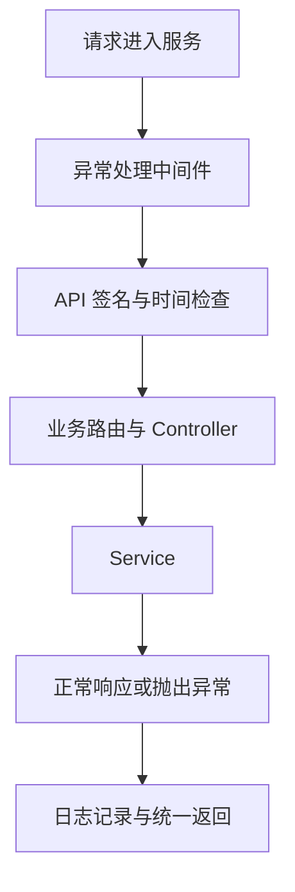
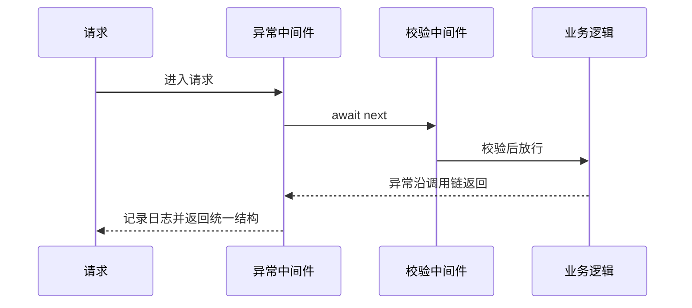
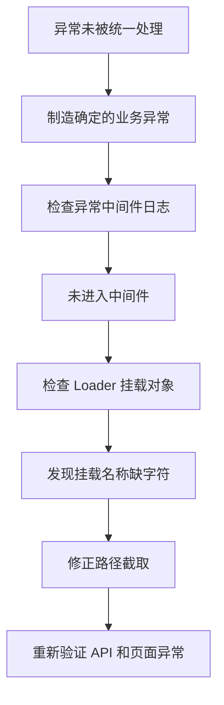

# elpis-core 引擎内核应用（3）

<MuxPlayer
  className="mt-8"
  playbackId="Aa5ir0200P1hLuaJzdgZGqK6OEx008SMQOVHWdGvLYMCFc"
  title="elpis-core 引擎内核应用（3）"
/>

> [!NOTE]
>
> 本节继续完善已经跑通的页面和接口，重点是 **日志落盘、统一异常处理和 API 签名校验**。
>
> 日志通过 Extend 接入，在本地输出到控制台，在测试和生产环境写入文件；异常处理放在中间件链外层，统一记录内部错误并组织对外响应；签名校验则根据约定的请求头和时间窗口拦截无效请求。
>
> 这一节仍然包含实际排错：异常中间件没有生效时，老师回到 Middleware Loader，发现路径截取多去掉了一个字符，导致挂载名称错误。

## 从“能够响应”走向“能够维护”

上一节已经能从页面发请求，经过 Controller 和 Service 返回项目列表。但是服务一旦部署出去，只能返回成功还不够。

出了问题，要知道什么时间、哪一个请求、在哪一层失败；服务内部的错误，也不能直接作为页面或 API 内容原样抛给用户。

本节围绕这两个问题增加基础能力，再通过签名与时效检查验证中间件如何在进入业务前拦截请求。



下面的代码按字幕中的流程整理为示例。字幕里的部分标识符识别不稳定，示例统一使用 `logger`、`s` 和 `st` 表达日志工具、签名摘要和时间戳，实际项目需要保证调用双方名称一致。

## 控制台日志为什么不够

开发时，`console.log()` 很方便。但终端里的输出并不等于已经形成可供之后检索的日志文件。

当进程重启、终端关闭，或者需要回查一段时间前的问题时，单靠当前控制台很难恢复现场。

课程因此引入日志落盘：把运行信息写入磁盘文件，之后可以按照时间和关键词检索。

| 场景 | 本节采用的输出方式 | 目的 |
| --- | --- | --- |
| 本地开发 | 控制台 | 及时观察当前调试信息 |
| 测试环境 | 日志工具输出并写文件 | 复查联调过程与异常 |
| 生产环境 | 日志工具输出并写文件 | 根据记录定位运行问题 |

不是每个 Controller 都自己判断环境，而是由统一日志工具处理环境差异。业务只调用相同的日志方法。

## 利用 Extend 注入日志工具

日志能力适合放进 Extend，因为它不属于某一个业务 Controller 或 Service，而是多处都可能使用的公共能力。

```text filename="日志扩展的映射示意" copy
app/extend/logger.js
    ↓ Extend Loader
app.logger
```

Extend Loader 执行文件导出的工厂函数，把返回结果直接挂到 `app` 上。前面实现的这个机制，现在就有了实际使用场景。

```js filename="app/extend/logger.js 的环境分支" copy
module.exports = (app) => {
  if (app.env.isLocal()) {
    return console
  }

  // 非本地环境在这里配置并返回 Log4js 的 logger。
}
```

本地返回 `console`，是因为它也提供 `info()`、`warn()` 和 `error()` 等方法。外部统一调用 `app.logger.info()`，不必知道内部究竟是哪一个实现。

这是一种接口保持稳定、内部按场景替换实现的做法。关键在于公共调用方式一致，而不是把每个库的所有功能都暴露给业务。

## 配置日志文件与切割

课程使用 Log4js，并介绍了 appender 和 category 的配置。

Appender 决定日志写到哪里；category 决定使用哪些输出方式、从什么级别开始记录。课堂还配置了按日期组织文件，避免服务长期运行时所有日志都堆在一个无限增长的文件中。

```js filename="Log4js 配置示意" copy
const path = require("path")
const log4js = require("log4js")

module.exports = (app) => {
  if (app.env.isLocal()) return console

  log4js.configure({
    appenders: {
      console: { type: "console" },
      file: {
        type: "dateFile",
        filename: path.resolve(app.baseDir, "logs/application.log"),
        pattern: "yyyy-MM-dd",
        keepFileExt: true,
      },
    },
    categories: {
      default: {
        appenders: ["console", "file"],
        level: "trace",
      },
    },
  })

  return log4js.getLogger()
}
```

这里的文件名用于说明配置关系；课堂重点是日志可以落到 `logs` 目录，并以日期规则切割。执行项目时，应使用与课程依赖版本匹配的配置项。

验证方法也分环境进行：先以本地环境启动并发起接口请求，观察控制台；再切换测试和生产环境，重复请求并检查日志文件。

只有文件里实际出现记录，才说明落盘能力已经接通，不能仅凭控制台出现输出就认定成功。

## 让日志能帮助定位问题

日志不只是打印一个“出错了”。它应包含能够把错误与请求联系起来的信息。

课堂在后续中间件中记录请求方法、路径、签名状态以及异常标识，用于从大量记录中筛选目标信息。

```js filename="异常日志的整理示意" copy
app.logger.error("EXCEPTION", {
  method: ctx.method,
  path: ctx.path,
  message: error.message,
  stack: error.stack,
})
```

普通对象可以按需序列化，但 `Error` 的 `message` 和 `stack` 不一定会被直接的 `JSON.stringify(error)` 保留下来。复盘时将这些字段显式取出，才能保证日志含有有用的错误内容。

日志用于服务端排查，对外响应则可以保持稳定、简短。两者面向的读者不同，承担的职责也不同。

## 用洋葱模型捕获下游异常

课程接下来实现自定义异常处理中间件。

Koa 中间件接收 `ctx` 和 `next`。执行 `await next()` 时，请求进入后续中间件和业务逻辑；后续执行完成后，又会回到当前中间件继续向外返回。

因此，只要把 `await next()` 放在 `try/catch` 中，就能处理这条下游异步调用链上传回的异常。

```js filename="app/middleware/error-handler.js" copy
module.exports = (app) => {
  return async (ctx, next) => {
    try {
      await next()
    } catch (error) {
      app.logger.error("EXCEPTION", {
        method: ctx.method,
        path: ctx.path,
        message: error.message,
        stack: error.stack,
      })

      ctx.status = 200
      ctx.body = {
        success: false,
        code: 50000,
        message: "网络异常，请稍后重试",
      }
    }
  }
}
```

这是课堂统一错误返回思路的整理。课程采用 HTTP 200 搭配业务失败字段，前端要检查 `success` 和业务码，不能只看网络状态。

`await` 很重要。若只是调用 `next()` 却不等待，当前 `try/catch` 就不能按这里的意图捕获异步链上的拒绝。

## 异常处理必须包住业务链路

这个中间件要在所需保护的业务逻辑之前注册，才能把后续执行包在自己的 `try/catch` 里。



异常中间件不是替代每个模块的业务判断。参数缺失、权限不满足等已知失败，可以在对应位置明确返回；这里主要兜住沿请求链冒出的运行时异常。

它也只覆盖被等待的请求处理链。与这条链无关的后台任务异常，不能因为注册了它就认为会自动被捕获。

## 模板不存在时如何处理

服务既处理 API，也处理页面。浏览器访问一个不存在的模板时，不能只返回一段 API 错误 JSON 就结束所有页面体验。

课堂针对模板引擎的“模板未找到”错误，增加临时重定向处理，把页面导航引回配置中的首页。

```js filename="模板缺失分支的核心逻辑" copy
const homePage = app.options?.homePage || "/"
ctx.redirect(homePage)
ctx.status = 302
```

这个分支应在识别到模板缺失错误时执行。普通 API 业务异常继续按统一错误结构返回，不应把所有异常都跳成首页。

课程解释了使用临时重定向的原因：当前不存在的页面，以后可能上线。如果使用永久重定向并被缓存，就可能影响之后对原路径的访问。

同时，`homePage` 应当配置为实际存在的页面。回退目标也不存在时，会继续触发错误或重定向循环。

## 异常中间件没有生效的排查

写好代码后，课堂并没有立刻得到预期结果。故意制造错误后，统一异常处理里的日志没有出现。

老师先把问题收窄：暂时不纠结模板错误的识别条件，而是在正常接口里制造一个确定会抛出的异常，确认请求是否进入了异常中间件。

仍未进入时，就要检查中间件是否真正完成加载和注册。

回到 Middleware Loader 打印挂载结果，发现期望的 `errorHandler` 名称不正确。进一步查看路径截取，发现前缀长度多计算了一个字符，导致文件名首部被截掉。



这个过程再次说明，Loader 的问题可能不会表现为启动失败，而是在使用端找不到某个能力时才暴露出来。

修正后重新验证：接口错误返回统一结构，模板不存在触发重定向，日志中也能够找到对应异常。完成验证后，再删除故意制造错误的测试代码。

## API 签名校验的课堂目标

接下来增加 API 签名中间件。课堂希望为请求附加一个时间窗口，让过期的请求信息不能直接一直重复使用。

示例使用前后端共同持有的一段字符串和请求时间戳，生成 MD5 摘要。前端把摘要与时间戳放进请求头，后端按相同规则重新计算，再检查二者是否一致、时间是否有效。

这里必须准确理解边界：MD5 是摘要算法，不是对称加密；公开在浏览器中的共享字符串也不能作为保密凭据。这一段用于演示中间件检查和过期拦截，并不构成可靠的身份认证或完整防爬机制。

课堂后面也指出，页面中的字符串可以被查看，有能力的调用方仍然可以模拟请求。因此不能把这一措施说成“加上之后接口就绝对安全”。

## 只检查 API 请求

页面请求同样会经过全局中间件，但浏览器直接打开页面时，并没有前端请求封装帮它添加这些请求头。

课程通过 `/api` 前缀区分接口和页面。不是 API 的请求直接放行，API 请求才继续检查。

```js filename="API 路径过滤示意" copy
const isAPI = ctx.path === "/api" || ctx.path.startsWith("/api/")

if (!isAPI) {
  await next()
  return
}
```

这又一次用到了前面建立的路由约定。所有需要进入该检查链路的接口，都应该采用统一前缀。

示例使用路径前缀匹配，避免因为普通页面路径中间碰巧包含 `api` 就被误判。

## 前后端需要遵循相同生成规则

示例统一以 `s` 表示签名摘要、`st` 表示生成时间戳，并将时间单位设为毫秒。

```js filename="前端请求签名示意" copy
const sharedText = "course-demo-shared-text"
const st = Date.now()
const s = md5(`${sharedText}_${st}`)

axios.request({
  method: "get",
  url: "/api/project/list",
  headers: { s, st },
})
```

这段示例假定页面已加载 Axios 和 MD5 工具。共享字符串、拼接顺序、分隔符以及时间单位，都必须与服务端一致。

服务端收到请求头后，用传来的 `st` 重新生成摘要，再与 `s` 对比。它不能拿自己的当前时间生成摘要再直接比较，因为前后两次取时间不可能保证完全相同。

当前时间只用于计算请求已经过去多久。

## 校验签名和时间窗口

课程最终使用 600 秒作为演示窗口。时间戳若使用毫秒，比较时就应使用 `600 * 1000`。

```js filename="签名中间件的核心检查示意" copy
const md5 = require("md5")
const sharedText = "course-demo-shared-text"
const maxAge = 600 * 1000

const signature = ctx.get("s")
const timestampText = ctx.get("st")
const timestamp = Number(timestampText)
const age = Date.now() - timestamp
const expected = md5(`${sharedText}_${timestampText}`)

const invalid =
  !signature ||
  !timestampText ||
  !Number.isFinite(timestamp) ||
  signature !== expected ||
  age < 0 ||
  age > maxAge

if (invalid) {
  ctx.status = 200
  ctx.body = {
    success: false,
    code: 40001,
    message: "请求签名无效或已过期",
  }
  return
}

await next()
```

示例业务码用于说明失败结构；`Number.isFinite` 和未来时间检查是复盘时补充的边界处理。课堂主要讲解的是缺少参数、摘要不一致与超过有效时间三种拒绝条件。

拒绝分支要结束当前请求，不再执行后面的业务逻辑；只有检查通过，才执行 `await next()`。

这个简单方案也没有唯一请求标识或服务端一次性消费记录，因此同一个有效签名在窗口内仍可能被重复使用。理解时间窗口与真正防重放之间的差别，才能正确评价本节的实现范围。

## 验证失败分支与恢复现场

课堂先发送正常请求，确认列表能够返回，再主动构造错误情况。

| 测试动作 | 预期观察 |
| --- | --- |
| 使用正确摘要和当前时间 | 请求进入 Controller，返回列表 |
| 修改摘要内容 | 在签名中间件返回失败 |
| 使用过期时间并配套生成摘要 | 因超出时间窗口返回失败 |
| 不传摘要或时间 | 因请求头不完整返回失败 |
| 打开页面地址 | 跳过 API 签名检查，正常渲染 |

测试过期时，应同时按旧时间重新生成摘要。否则请求可能只是在“摘要不匹配”这一项就失败，不能证明时间检查生效。

字幕中的临时时间数值并不稳定，复盘时应按选定时间单位，明确减去大于窗口的时长，例如 `maxAge + 1000` 毫秒。

测试结束后，把故意写错的摘要和旧时间恢复，再发送一次正常请求，确认功能没有停留在调试状态。

## 本节小结

本节为内核应用补充了维护和故障处理能力。

日志通过 Extend 统一注入，按环境决定是否落盘；异常处理中间件利用 `await next()` 包住下游逻辑，记录真实错误并返回稳定结构；模板缺失则按页面场景临时跳转到首页。

随后，课程通过时间戳和摘要演示 API 前置校验，并验证缺失、错误和过期请求的拦截过程。这个演示应与身份认证、完整防重放和系统安全体系区分开来。

下一节将继续把参数规则从 Controller 中抽出，使用 JSON Schema 和 Ajv 在业务执行前统一验证请求结构。
