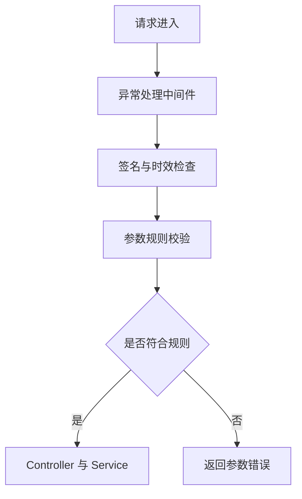
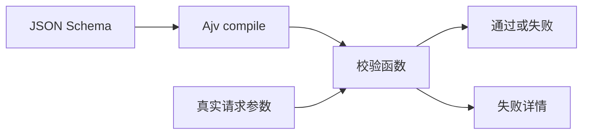
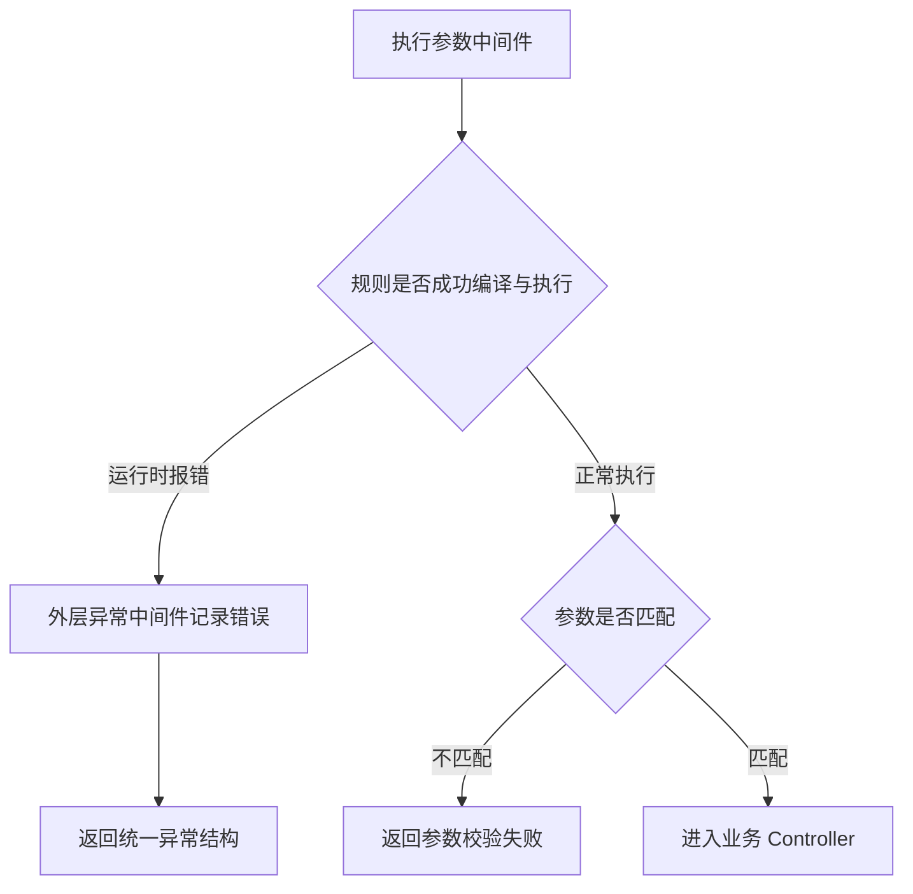
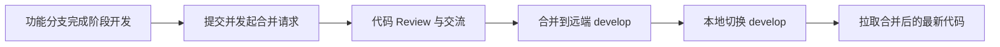

# elpis-core 内核引擎应用（4）

<MuxPlayer
  className="mt-8"
  playbackId="r55n48NeiUV67lsE8DZgOuDwyii3czq01YmxXJG9eSpM"
  title="elpis-core 内核引擎应用（4）"
/>

> [!NOTE]
>
> 本节为服务端内核应用补上 **接口参数校验**。请求在经过异常处理和签名检查后，还需要确认参数是否符合当前接口的约定，再进入 Controller。
>
> 课程使用 JSON Schema 描述参数结构，用 Ajv 执行校验，再通过 Router Schema Loader 把分散在文件中的规则收集起来。这样，控制器可以专注业务，而不必重复编写同一类类型与必填检查。
>
> 最后，课程回到 GitFlow，把这一阶段的内核开发与应用代码经过 Review 和合并流程接回 `develop`，为下一个工程化阶段做准备。

## 参数校验应该放在哪里

此前已经建立异常处理和 API 签名检查，但签名符合约定，不代表参数一定正确。

例如项目列表接口需要 `projectKey`，请求方却没有传；或者接口需要数字，提交的却是一个对象。这些情况应该在进入业务逻辑之前明确拒绝。

如果每个 Controller 都各自编写判断，不同接口会重复相同代码，错误结构也容易不一致。



本节把“这个接口要什么参数”与“怎样执行检查”拆成两部分：规则写在 Router Schema 文件中，通用流程写在中间件中。

## JSON Schema 描述数据结构

JSON Schema 可以理解为用一份结构化规则描述另一份 JSON 数据。

它可以描述对象中有哪些字段，每个字段是什么类型，哪些字段必须存在，数组中的每一项又应该符合什么结构。

```json filename="业务数据示意" copy
{
  "productId": 1,
  "productName": "示例商品",
  "price": 99,
  "tags": ["new", "demo"]
}
```

对应规则可整理为：

```json filename="JSON Schema 示例" copy
{
  "type": "object",
  "properties": {
    "productId": { "type": "integer" },
    "productName": { "type": "string" },
    "price": { "type": "number" },
    "tags": {
      "type": "array",
      "items": { "type": "string" }
    }
  },
  "required": ["productId", "productName"]
}
```

最外层的 `type` 说明整体是对象；`properties` 描述字段；数组通过 `items` 描述元素；`required` 说明哪些字段缺失时应判为不符合规则。

这里需要区分“字段存在时必须是什么类型”和“字段必须存在”。只写 `properties` 中的类型约束，并不自动让字段成为必填项。

## Ajv 执行规则检查

Schema 只是规则数据，本身不会主动拦截请求。Ajv 负责把规则编译成校验函数，再用这个函数检查真实数据。

```js filename="Ajv 的基本调用过程" copy
const Ajv = require("ajv")
const ajv = new Ajv()

const schema = {
  type: "object",
  properties: {
    projectKey: { type: "string" },
  },
  required: ["projectKey"],
}

const validate = ajv.compile(schema)
const valid = validate({ projectKey: "demo" })

if (!valid) {
  console.log(validate.errors)
}
```

这段代码对应三步：创建校验器、编译规则、检查数据。

编译结果 `validate` 是函数；执行这个函数得到的 `valid` 才是本次数据是否通过检查的布尔值。失败详情从校验函数的 `errors` 中读取。



## 为接口建立规则目录

前面的内核已经写了 Router Schema Loader，但还没有真正使用它。本节开始在 `app/router-schema` 下创建规则文件。

```text filename="接口规则目录" copy
app/
├── router/
│   └── project.js
├── router-schema/
│   └── project.js
└── middleware/
    └── api-params.js
```

规则文件按业务分组，加载后则按照 API 路径合并到同一个规则对象里。

Controller 和 Service 需要保留文件目录形成的对象树，Router Schema 在这里则通过路径键查找接口，不采用同样的嵌套访问方式。

```js filename="规则加载后的访问示意" copy
app.routerSchema["/api/project/list"].get
```

同一个路径可以有不同的 HTTP 方法，因此还需要下一层方法键。接口身份实际上由路径和方法共同确定，不能只看某一项。

## 规则的三层定位

课程约定规则按三个维度组织：第一层是 API 路径，第二层是 HTTP 方法，第三层是参数所在的位置。

```text filename="Router Schema 的组织方式" copy
API 路径
└── 请求方法
    ├── headers
    ├── body
    ├── query
    └── 路径参数规则
```

例如项目列表接口从 Query 中接收 `projectKey`：

```js filename="app/router-schema/project.js" copy
module.exports = {
  "/api/project/list": {
    get: {
      query: {
        type: "object",
        properties: {
          projectKey: {
            type: "string",
          },
        },
        required: ["projectKey"],
      },
    },
  },
}
```

这份规则表示：GET 请求访问该接口时，需要一个 Query 对象，其中必须包含字符串类型的 `projectKey`。

文件名用于开发者组织规则，接口路径用于运行时检索规则。二者不要混为一谈。

## 分清几种参数位置

接口参数不都来自同一个地方。

| 参数位置 | 示例 | 本节理解重点 |
| --- | --- | --- |
| Query | `/api/project/list?projectKey=demo` | URL 查询字符串 |
| Body | POST 提交的 JSON 对象 | 需要先经过请求体解析 |
| Headers | 自定义请求头 | 名称和值应与规则一致 |
| 路径参数 | `/api/project/1001` 中的 `1001` | 依赖路由参数匹配 |

本节实际演示围绕固定路径的 Query 参数展开，同时介绍其他参数位置可以用同样思路校验。

路径参数有一个实现边界：`ctx.params` 通常在路由匹配后才可用。若校验中间件作为全局前置逻辑在 Router 之前执行，就不能假定它已经拿到动态路由参数；直接使用 `ctx.path` 查规则，也不能自动把 `/api/project/1001` 对应到 `/api/project/:id`。

因此下面的完整流程以课程当前的固定路径接口为例。扩展动态路径校验时，需要让规则查找与路由匹配位置配套，不能只加一个参数字段就宣称已经支持。

## 中间件先过滤非 API 请求

与上一节签名检查相同，参数校验首先判断请求是否属于 API。

页面和静态资源没有对应的接口参数规则，应继续交给后续中间件处理。

```js filename="参数中间件的入口判断" copy
const isAPI = ctx.path === "/api" || ctx.path.startsWith("/api/")

if (!isAPI) {
  await next()
  return
}
```

这类提前返回的写法，是课堂专门提到的“卫语句”。把不需要处理的情况先退出，后面的主逻辑就不必包在多层 `if` 中。

这里的 `return` 不只是排版选择。已经放行的分支执行完 `next()` 后，如果不结束当前函数，还可能继续走下面不适用的 API 校验逻辑。

## 根据路径和方法取规则

拿到 API 请求后，读取路径和方法，查找对应 Schema。

```js filename="查找当前接口规则" copy
const method = ctx.method.toLowerCase()
const schema = app.routerSchema?.[ctx.path]?.[method]

if (!schema) {
  await next()
  return
}
```

HTTP 方法通常以大写形式出现在上下文中，而课程规则用小写键名，因此这里统一转换。

课堂对没有配置 Schema 的接口采用直接放行策略。这是当前框架的约定，意味着“接入了参数中间件”不等于“所有接口都有完整校验”。需要检查哪个接口，就要给它配置对应规则。

如果规则没生效，优先检查路径是否完全一致、方法大小写是否统一，以及 Loader 是否把规则正确挂到了 `app.routerSchema`。

## 按参数位置逐项校验

课堂按 Headers、Body、Query 和路径参数的思路展开检查，并用一个状态标识记录是否已经失败。一处失败后停止后续校验，直接返回错误。

下面将固定路径接口的前几个位置合并为循环，表达相同流程：

```js filename="参数校验核心示意" copy
const inputs = {
  headers: ctx.request.headers,
  body: ctx.request.body,
  query: ctx.request.query,
}

for (const location of ["headers", "body", "query"]) {
  const rule = schema[location]
  if (!rule) continue

  const validate = ajv.compile(rule)
  const valid = validate(inputs[location] ?? {})

  if (!valid) {
    ctx.status = 200
    ctx.body = {
      success: false,
      code: 40002,
      message: "请求参数不符合接口规则",
      errors: validate.errors,
    }
    return
  }
}

await next()
```

示例中的业务码用于说明错误结构，实际项目应沿用自己的统一约定。`ajv` 与前面示例一样，在中间件工厂中创建。

注意，判断是否需要校验，应主要看“是否配置了规则”，不能因为请求里没有某组参数就直接跳过。缺少必填参数本身就是需要被检查的情况，所以示例用空对象参与校验。

前一节接入的 Body Parser 也有了明确作用：Body 规则检查之前，必须先获得已解析的请求体。

## Schema 版本与校验器要配套

课程尝试为 Schema 添加版本声明，让 Ajv 知道当前采用哪一版规则。

JSON Schema 的 `$schema` 字段声明的是规则规范版本。不同版本可能有不同关键字和语义，不能只把字符串换成较新的版本号，就认为当前校验器已经支持。

本节实际遇到了两类错误：

- `compile` 方法拼写错误，导致方法不存在。
- 声明的 Schema 版本与当前 Ajv 初始化方式不匹配，出现找不到相应 Schema 的错误。

第一个属于代码调用问题，第二个属于规则与校验器支持范围不一致，两者都不是用户提交的业务参数不合法。

> [!IMPORTANT]
>
> 本节字幕约 27—39 分钟连续重复版本报错文本，缺少可靠的完整修复讲解。因此这里保留“发生过版本不匹配”的事实，不把未能确认的修复命令或最终版本写成课堂结论。上面的示例没有擅自添加较新的 `$schema` 声明，使用校验器默认支持的规则形式解释流程。

如果复现时遇到相同错误，要检查课程项目使用的依赖版本和初始化方式，再匹配规范版本。不要把框架编译 Schema 的错误包装成普通用户参数错误而忽略它。

## 异常处理与参数失败的区别

运行中拼错 Ajv 方法时，请求并没有把全部服务端堆栈直接返回前端，而是被上一节的异常中间件接住。

这个现象把前后两节联系起来：参数中间件自己也可能写错，它抛出的运行时异常仍然需要外层兜底。



“框架内部有错误”和“用户参数不符合规则”是两种不同状态。日志和返回信息应能帮助开发者区分它们。

## 怎样验证规则真正生效

本节把 `projectKey` 加到测试页面的请求参数里，并在 Controller 中读取它。

对于 Axios GET 请求，Query 参数通过 `params` 传入：

```js filename="测试页面的 Query 参数" copy
axios.request({
  method: "get",
  url: "/api/project/list",
  params: {
    projectKey: "demo",
  },
  headers: {
    s: signature,
    st: timestamp,
  },
})
```

这里的 `signature` 和 `timestamp` 沿用上一节生成的有效值。签名检查如果先失败，就不能用这个请求判断参数检查是否正确。

可以围绕当前规则安排几组检查：

| 输入 | 应检查的结果 |
| --- | --- |
| 存在 `projectKey=demo` | 参数通过并进入 Controller |
| 完全不传 `projectKey` | 必填规则应拒绝请求 |
| 请求到没有配置规则的接口 | 按课堂约定继续放行 |
| 页面请求 | 不进入 API 参数检查 |

如果要验证类型错误，需注意 Query 值经过 URL 解析后通常是字符串。不能仅把 URL 中的 `demo` 换成 `123`，就认为向校验器传入了 JavaScript 数字。

同样，`required` 只检查字段是否存在；若不允许空字符串，还需要在规则中声明对应长度约束。这些区别决定了测试到底验证了什么。

## 完成服务端内核阶段

参数规则接入后，可以回看这一阶段已经建立的组成部分。

| 组成 | 对应能力 |
| --- | --- |
| 启动入口与环境识别 | 为应用准备统一上下文 |
| Loader 体系 | 把约定目录里的文件转成运行时能力 |
| 页面 Controller 与模板引擎 | 处理页面请求并注入初始化数据 |
| Router、Controller、Service | 组织 API 调用与响应 |
| BaseController、BaseService | 收拢公共能力 |
| 日志与异常处理中间件 | 记录问题并组织稳定错误返回 |
| 签名与参数校验 | 在业务前处理约定的请求检查 |

这些能力并不是彼此孤立的文件。启动阶段把它们挂接起来，请求阶段再按中间件顺序调用，才形成完整服务。

## 从功能分支合回 develop

课程最后回到协同流程，对服务端内核这一阶段的代码进行检查、交流和合并。

功能开发在独立分支上完成，Review 后合并到 `develop`。远端合并成功后，本地也要切回 `develop` 并拉取更新。



课堂还提到，日常协作更适合围绕小任务形成便于审查的提交。课程按里程碑集中检查，是教学组织方式；不能由此推导出平时也应该积累大量改动后才让别人 Review。

关于合并后是否删除源分支，老师说明日常协作通常可以清理临时功能分支，教学场景为了保留阶段作品也可以暂时保留。重点是合并结果和本地工作基线要明确。

## 本节小结

本节把接口参数规则从 Controller 中抽离，建立了“路径 → 方法 → 参数位置 → JSON Schema”的组织方式，再用 Ajv 在业务执行前进行统一检查。

学习这一节，需要同时理解规则表达、Loader 合并、运行时查找和中间件顺序。缺少规则时的放行策略、Query 类型、动态路径参数可用时机，以及 Schema 版本兼容性，都是复现时需要准确区分的边界。

最后，课程通过 Review、合并和同步 `develop`，结束服务端内核建设与应用阶段。下一章将以这套服务为基础，开始 Webpack 5 工程化建设。
