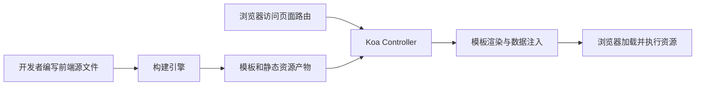
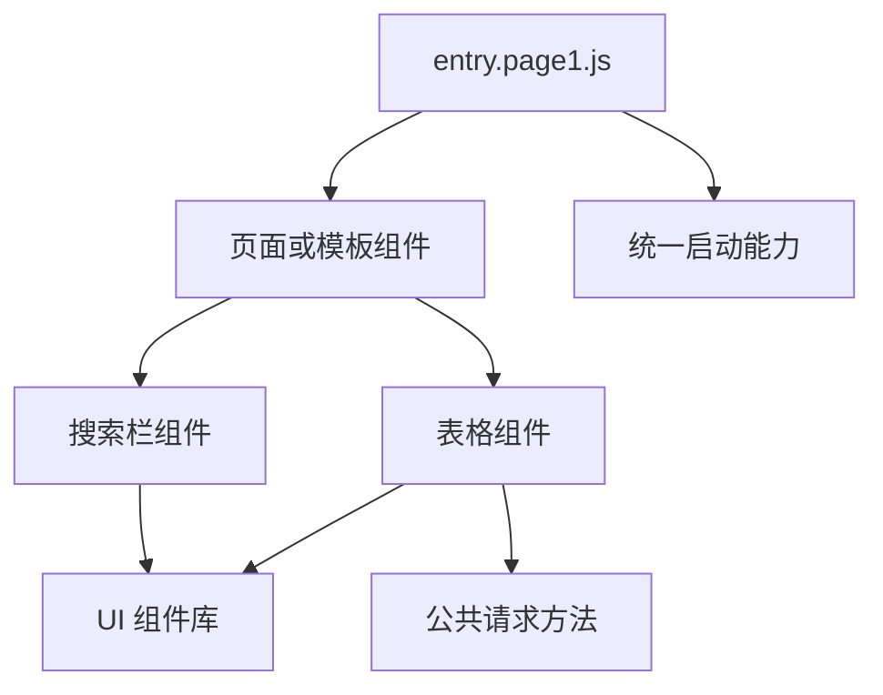
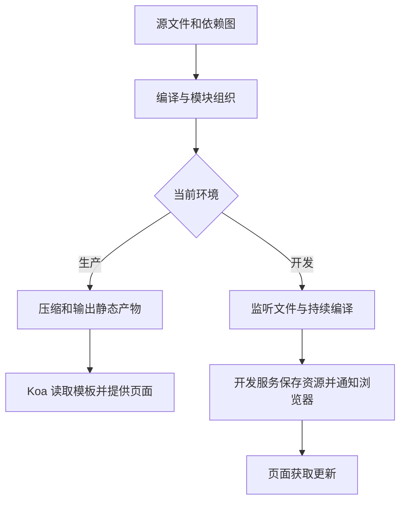

# webpack5 工程化设计

<MuxPlayer
  className="mt-8"
  playbackId="nDya00qOkQvbeIypISwL3foXggsZ8hwkcTxWuNqiWDBE"
  title="webpack5 工程化设计"
/>

> [!NOTE]
>
> 本节从已经能工作的 Koa 页面渲染链路出发，推导前端工程化要解决的问题：开发者编写 Vue、JavaScript、Less 和组件文件，构建工具把它们转换成浏览器能够使用的资源，再交给服务端选择模板、注入数据并返回页面。
>
> 课程先设计输入目录、依赖分析、编译、分包和环境分流，下一节才把这些步骤映射成 webpack5 配置。理解这条链路，才能判断每一项配置的目的，也能在以后换工具时保留自己的工程化思路。

## 从已经跑通的页面请求出发

前面服务端课程已经提供了页面入口。浏览器访问 `/view/page1` 一类地址，路由把请求交给负责页面渲染的 Controller，Controller 再选择 `app/public/output` 下的模板，并通过模板引擎返回 HTML。

当时的模板是手写的。模板里有页面结构、资源引用和服务端注入的数据，因此足以验证服务框架能不能把一个页面返回给浏览器。不过继续开发真实前端业务时，不适合把所有逻辑都写进这些模板。Vue 组件需要模板、脚本和样式的组织方式，公共工具要被多个地方引用，第三方依赖放在 `node_modules`，样式还可能使用 Less。

这时要解决的具体问题是：**怎样把方便开发和维护的源文件，变成现有服务端可以使用的产物？**



工程化接在服务端渲染之前。服务端仍然负责处理页面请求，只是它读取的模板从“人工编写的测试文件”变成了“构建系统生成的模板文件”。这也解释了为什么课程没有直接新建一个独立的 Vue 脚手架项目：当前目标是把前端工程接入已搭好的全栈框架。

## 先区分源文件和运行产物

源文件是开发者工作的对象，产物是运行系统消费的对象。两者不必具有相同的数量、格式和目录结构。

| 开发阶段的内容 | 构建阶段需要完成的工作 | 运行阶段使用的内容 |
| --- | --- | --- |
| `.vue` 单文件组件 | 解析模板、脚本和样式 | 浏览器执行的 JavaScript 与样式 |
| `.js` 与模块引用 | 分析依赖，按需要转换语法、组织模块 | 一个或多个 JavaScript 包 |
| `.less`、`.css` | 处理预处理语法和样式依赖 | CSS 文件或注入页面的样式 |
| 图片、字体 | 处理引用地址和输出方式 | 浏览器可以请求的资源 |
| 页面模板 | 注入当前入口所需资源 | 交给 Koa 渲染的 `.tpl` |
| 第三方依赖 | 纳入依赖图并参与分包 | 相关的第三方代码包 |

浏览器并非只认识 HTML、JavaScript 和 CSS，图片、字体等也是它能够加载的资源。课程先用这三类核心内容帮助建立认识，随后补充了其他资源类型。复盘时要保留这个边界，不能把简化讲解当成严格的格式限制。

同样，构建系统也不是把整个源目录原封不动复制过去。一个页面入口可能间接引用几十个模块，最终合并成几个包；多个入口也可能共享同一个公共包。文件数量的变化是构建过程的一部分。

## 前端目录为什么这样划分

课程把页面相关源文件放在 `app/pages` 下，再按职责区分公共工具、数据管理、组件和页面入口。下面是用于理解职责的目录示意，入口的具体扫描约定会在搭建课里落地。

```text filename="前端源目录示意" copy
app
├── pages
│   ├── common
│   ├── store
│   ├── widgets
│   ├── entry.page1
│   │   ├── entry.page1.js
│   │   └── page1.vue
│   └── entry.page2
│       ├── entry.page2.js
│       └── page2.vue
├── view
│   └── entry.tpl
└── public
    └── dist
```

`common` 存放工具方法和公共请求能力。`store` 承载页面的数据管理。`widgets` 存放可被模板和页面引用的组件。不同 `entry` 表示不同页面的启动入口，它们可以组合不同组件，也可以共同依赖同一批基础能力。

这个结构来自前面领域模型架构的需求。框架将来要提供多个模板页，一个模板可能包含头部、侧边栏、搜索栏、表格和表单，也可能组合自定义视图。模板数量无法在框架开发时提前写死，所以工程系统必须能够处理多个入口。

入口不等于每一个 Vue 子组件。页面内部引用的搜索栏、表格等组件，由入口的依赖关系向下找到即可，不需要各自成为一张独立 HTML 页面。先划清入口和组件，后面才能正确设置打包边界。

## 从入口建立依赖关系

构建系统不能只知道“项目里有很多文件”，还要知道“这个页面实际使用哪些文件”。因此它先找到入口，再沿着 `import`、`require` 等引用关系向下分析。

例如一个入口加载模板组件，模板组件引用搜索栏和表格，表格又引用请求方法。这个过程可以整理成：



图中的模块并不是靠文件夹名称自动获得关联，而是靠实际引用进入依赖图。把一个工具文件放进 `common`，不代表它一定会被所有页面使用；只有被入口直接或间接引用，它才与该入口发生关系。后续公共包拆分也要根据真实引用关系判断。

课程把这一过程解释为“一层一层找进去”，是为了先建立直观认识。实际工具会进行语法解析和模块分析，但复盘当前设计时，最需要抓住的是入口、依赖和产物之间的对应关系。

## 不同类型的文件交给不同解析能力

当依赖分析遇到一个 `.vue` 文件时，需要理解 Vue 单文件组件的结构；遇到 Less，需要把它转换成 CSS；遇到图片，需要处理这个引用应该怎样进入最终页面。这些工作不可能全靠同一种简单的字符串复制完成。

webpack 中用 Loader 承担一部分文件转换工作，插件则可以在构建过程的不同阶段介入。这里还没有要求记住某个 Loader 的全部配置，课程先强调的是：**按文件类型选择合适的处理方式，再把转换结果接回整个构建流程。**

这与前面服务端 Loader 的设计有相通之处。服务端内核为 Controller、Service、Middleware 提供不同的加载规则，前端构建也为不同源文件选择不同解析器。但两者的执行时机和结果不同：服务端 Loader 在服务启动时组装运行时对象，webpack Loader 在构建时转换模块，不能把它们当成同一个接口。

## 为什么还需要分包

只完成编译，仍可能得到一个包含所有页面逻辑的大文件。访问页面一时，用户就会同时下载页面二才用得到的代码。即使页面能够打开，资源加载和缓存利用也未必合理。

所以构建链路里还需要模块拆分。课程用 A、B、C 三段代码举例：可以根据它们的归属和引用关系，把一个大包划分成若干个包，再让不同页面只引用自己需要的部分。

分包并不意味着越碎越好。需要判断哪些模块共同使用、哪些改动频繁、哪些属于第三方依赖，再选择相应规则。后续课程会把第三方依赖、公共业务代码和入口业务代码分别处理。本节先确定分包是独立的设计问题，而不是把所有文件编译出来就算完成工程化。

| 要观察的情况 | 对分包设计的影响 |
| --- | --- |
| 多个入口依赖同一模块 | 可以考虑抽取共享包 |
| 某模块只属于一个页面 | 应保留入口的业务边界 |
| 第三方库升级频率较低 | 适合与高频变化的业务代码区分 |
| 模块很小且拆分过细 | 需要同时考虑请求数量与加载开销 |

课程把“编译、分包、压缩”画成前后相接的步骤，是为了让职责更清楚。真实构建内部可能交错执行分析和优化，并不要求工具源码严格按这张教学图逐项运行。

## 模板必须知道自己依赖哪些资源

产物中有 JavaScript 和 CSS 还不够，页面模板必须引用它们。此前手写模板时，可以人工写一个 `script`；但当打包文件名包含 hash、分包数量又会变化时，继续手动维护引用就很容易出错。

构建系统需要同时建立“入口与模板”的对应关系。页面一的模板应该引用页面一入口及其公共依赖，页面二的模板引用页面二入口及其公共依赖。这个过程后来由 `HtmlWebpackPlugin` 配合入口配置实现。

```text filename="产物之间的对应关系" copy
entry.page1.tpl
  -> vendor 的 JavaScript
  -> common 的 JavaScript
  -> entry.page1 的 JavaScript

entry.page2.tpl
  -> vendor 的 JavaScript
  -> common 的 JavaScript
  -> entry.page2 的 JavaScript
```

这里展示的是关系，不是要求在设计阶段写死最终文件名。文件名由构建配置生成，模板注入跟随本次构建结果。

有了这一步，Koa 才能继续原来的工作：选择一个入口模板、注入运行时数据、返回给浏览器。浏览器收到 HTML 后再请求模板引用的资源，执行 Vue 的初始化代码。

## 生产环境和开发环境为何分流

生产环境关心最终交付的资源：文件要能落到目标目录，代码和样式可以进行压缩，模板要指向正确的资源地址。运行服务不需要在每次请求时重新编译整个前端工程。

开发环境关心修改反馈和调试。开发者修改组件后，理想效果是保存即可看到页面更新，并且能在浏览器里定位源代码。每改一行就手动构建、重启服务、刷新页面，会让开发过程非常缓慢。



本节提出开发产物可以保存在内存中，通过开发服务提供给浏览器。后面的实作会进一步区分：模板仍需写到磁盘，供 Koa 的模板渲染链路读取；JavaScript 等资源通过开发服务器的内存文件系统提供。开发和生产共享入口与解析规则，但输出路径、优化策略和更新机制可以不同。

> [!TIP]
>
> 设计工程配置时，可以先写清楚每个环境的消费方：谁读模板、谁提供资源、浏览器请求哪个地址。明确这些关系后，再填写 `output`、插件和开发中间件，通常比逐项猜配置更容易排查问题。

## 工具选择要服务这条链路

课程提到以前自建构建工具的经历，是为了说明工程化需求早于某一款工具。即使没有现成的 webpack，也可以用 Node.js 扫描目录、调用转换器、组织资源并生成模板。成熟工具把这些工作变成了配置和插件生态。

因此本章选择 webpack5，是用它承载当前框架所需的能力。学习重点是能够解释每段配置完成了什么工作，哪些能力是项目必需的，哪些数值和插件是当前案例的选择。它并不要求以后所有项目都采用同一份配置。

工程化还包括持续集成、流水线和协作规范等更广的内容。本节集中讨论前端构建这一部分：从源文件组织到运行产物交付。先把这个范围讲透，后面再连接发布流程，会更清晰。

## 本节小结

本节把工程化放回 elpis 的完整链路中：开发者在 `app/pages` 编写模块化源文件，构建系统从多个入口分析依赖，为不同文件选择解析器，再完成模块组织、资源引用和产物输出。Koa 消费生成的模板，浏览器消费模板引用的静态资源。

目录约定、多页面入口、组件复用、模板注入和环境分流共同决定了后续 webpack 配置的形状。下一节将先创建两个可区分的 Vue 测试页，跑通最小构建闭环，再逐步加入自动发现、分包和开发体验优化。
