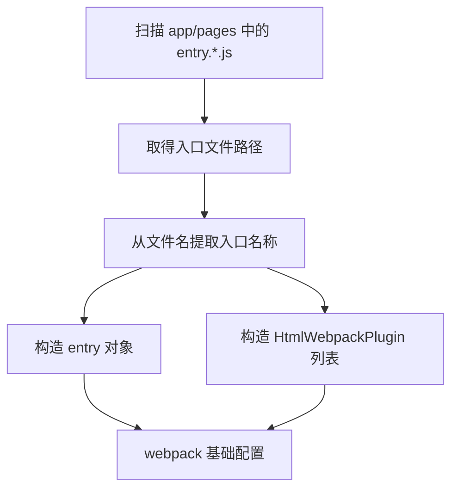
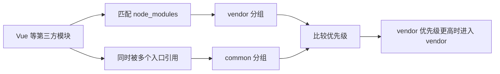

# webpack5 前端工程化搭建（2）

<MuxPlayer
  className="mt-8"
  playbackId="q02mewtlw2h02yreClwv02JgZy7amljAZNqUag00oyBA2z4"
  title="webpack5 前端工程化搭建（2）"
/>

> [!NOTE]
>
> 本节在两个页面已经能够访问的基础上，完成两项框架化改造：根据 `entry.*.js` 约定自动生成多页面配置；根据模块来源和引用关系拆出 vendor、common 与入口业务包。
>
> 课程还通过一次“构建成功但产物不符合预期”的问题，说明分包结果必须实际检查。vendor 优先级过低时，第三方模块可能被 common 分组接走，修复后才能得到设计中的三类包。
>
> 下列代码是便于复盘整理的简化示例，保留课程的目录约定和分包思路，不把演示用阈值当作通用最优值。

## 先确认上一节的链路

课程一开始启动 Koa，分别访问两个页面。Page1 显示红色标题和 `page1 init`，Page2 显示自己的标题与日志；输入框中的内容还能同步出现在页面上。这个验证说明入口脚本、Vue 组件、样式解析、模板引用和服务端路由已经连接起来。

只有这条最小链路稳定后，才适合开始抽象。如果页面尚未跑通就同时加入目录扫描、分包和多种优化，出错时很难判断究竟是文件没被发现、入口映射不对，还是资源加载失败。

当前代码仍有明显重复。`entry` 中为两个页面各写一条路径，插件中又分别写两个 `HtmlWebpackPlugin`。它们依赖的是同一批信息：入口名、入口文件、模板输出名以及模板要引用的 chunk。

## 框架不能预先知道所有页面

如果这是只有两张固定页面的业务应用，手写两个入口尚可接受。但 elpis 是框架，使用者后面可以新增模板页，页面数量和名称都不是内核开发时能够确定的。

每新增一页就要求使用者打开 webpack 配置增加两段内容，会让目录规范和配置维护形成两套信息。漏掉任何一处，都可能出现“有源码却没有产物”或“有产物却没有对应模板”的问题。

解决方式是把入口命名变成约定：页面代码放在 `app/pages` 中，入口文件以 `entry.` 开头、以 `.js` 结尾。构建时扫描所有符合约定的文件，再从同一份扫描结果构造 entry 与模板插件列表。



约定的价值在于消除重复输入。使用者只要按规则创建一个入口文件，构建系统就可以同时知道从哪里编译、生成哪个模板、模板引用哪个入口。

## 动态构造 entry 与模板

课程使用 `glob` 扫描文件，使用 `path.basename` 去掉 `.js` 后缀，得到诸如 `entry.page1` 的入口名称。

```js filename="app/webpack/config/webpack.base.js：入口扫描" copy
const path = require("path")
const glob = require("glob")
const HtmlWebpackPlugin = require("html-webpack-plugin")

const root = process.cwd()
const pageEntry = {}
const htmlWebpackPluginList = []
const files = glob.sync(
  path.resolve(root, "app/pages/**/entry.*.js")
)

files.forEach((filePath) => {
  const entryName = path.basename(filePath, ".js")

  pageEntry[entryName] = filePath
  htmlWebpackPluginList.push(
    new HtmlWebpackPlugin({
      filename: path.resolve(
        root, `app/public/dist/${entryName}.tpl`
      ),
      template: path.resolve(root, "app/view/entry.tpl"),
      chunks: [entryName],
    })
  )
})
```

这里每轮循环同步构造两种结果。`pageEntry[entryName]` 决定入口到源码的映射；插件中的 `filename` 决定生成的模板名；`chunks` 使用同一个 `entryName`，保证模板和代码属于同一页面。

基础配置再引用这两份结果：

```js filename="基础配置接入扫描结果" copy
module.exports = {
  entry: pageEntry,
  // module、output、resolve 沿用上一节已经验证的配置
  plugins: [
    // 前面的 VueLoaderPlugin、DefinePlugin 等保留
    ...htmlWebpackPluginList,
  ],
}
```

这个片段仅展示替换位置，不是要覆盖前面已完成的所有配置。自动化改造改变的是数据来源，Loader、输出规则和插件职责并没有因此发生变化。

## 入口名称也形成了约束

由于入口名从文件名提取，而不是从完整相对目录生成，所以不同目录里的入口文件名仍然要保持唯一。例如两个目录都存在 `entry.admin.js`，它们会使用同一个对象键，也会指向同一个模板输出名。

这不是 glob 的扫描问题，而是命名规则决定的结果。理解这一点，才能在框架使用说明里准确表达约束，也能在后续需要支持更复杂目录时判断该修改哪一层。

另一个容易混淆的地方是扫描时机。这里是在加载 webpack 配置时获取文件列表，已有入口内部修改组件可以交给后面的 watch 机制处理；新增顶层入口是否需要重新加载配置，应按实际构建进程的行为确认。不能仅凭使用了 glob，就认为运行中的开发服务一定能自动发现所有新增入口。

课程在实现时还遇到 `basename` 大小写书写错误。报错发生在配置构造阶段，应该先修正 Node.js API 调用，再检查构建结果。这与组件解析失败是不同层次的问题。

## 分包先从变更频率和共享关系考虑

动态入口解决了配置维护，接下来要解决产物组织。课程把 JavaScript 产物分成三类：

| 类型 | 内容 | 变化特征 |
| --- | --- | --- |
| `vendor` | Vue、UI 库等第三方依赖 | 通常随依赖升级而变化 |
| `common` | 被多个入口使用的业务公共模块 | 相对较少变化，但由项目维护 |
| `entry.page*` | 当前页面的业务差异代码 | 随页面开发较频繁变化 |

这个分类服务于缓存利用。页面业务改动时，尽量让不相关的公共模块与第三方模块保持独立，浏览器有机会继续复用已有资源。它也使产物更符合多页面边界，而不是每个页面都打入一份完全重复的依赖。

但 `common` 产物不等同于源码里的 `common` 目录。目录表达开发者的组织意图，产物分组要看真实引用。某工具虽然写在公共目录中，目前只被 Page1 使用，它未必需要成为 Page1、Page2 都加载的公共包。

课程用公共工具被一个或两个页面引用的情况，说明不能简单按目录名称强行划分所有业务模块。

## 用 splitChunks 表达规则

webpack 在 `optimization.splitChunks` 中提供模块拆分能力。课程对同步与异步模块都参与分析，并设置初始和异步加载的并行请求限制。具体分组放在 `cacheGroups`。

```js filename="app/webpack/config/webpack.base.js：分包示例" copy
const optimization = {
  splitChunks: {
    chunks: "all",
    maxAsyncRequests: 10,
    maxInitialRequests: 10,
    cacheGroups: {
      vendor: {
        test: /[\/]node_modules[\/]/,
        name: "vendor",
        priority: 20,
        enforce: true,
        reuseExistingChunk: true,
      },
      common: {
        name: "common",
        minChunks: 2,
        minSize: 1,
        priority: -10,
        reuseExistingChunk: true,
      },
    },
  },
}
```

`chunks: "all"` 表示这套拆分策略不只考虑异步模块。`maxAsyncRequests` 和 `maxInitialRequests` 是拆包时的请求数量约束，并不是业务 HTTP 客户端的并发控制。

vendor 通过路径匹配来自 `node_modules` 的模块。common 则使用 `minChunks: 2` 判断共享程度：达到多个 chunk 引用条件的模块，可以参与公共模块抽取。这种写法比“只要位于 common 文件夹就抽出”更接近课程的设计意图。

`reuseExistingChunk` 用来尽量复用已有符合条件的 chunk，减少重复生成。`enforce` 会影响常规阈值约束，课程把它用于第三方分组，保证示例能够呈现明确的 vendor 产物。

## 演示阈值不是性能结论

课程把 common 的 `minSize` 设置为 `1` 字节，是为了让很小的演示工具也能抽出来，方便看到效果。真实项目若照搬这个值，可能产生许多很小的公共片段，增加请求和管理成本。

同样，引用次数可以是二、三或更多，分组也未必只有 vendor、common 和入口三类。是否需要拆开某个较大的库、是否需要按页面群共享，取决于项目的依赖关系与访问方式。

> [!TIP]
>
> 先画出预期产物，再设置规则。课程的目标是“第三方依赖一类、共享业务一类、页面差异各自一类”，所以验证时应看模块最终进入了哪个文件，而不能只看到构建结束就停止检查。

## vendor 消失的原因：规则存在竞争

课程第一次配置 vendor 的优先级为 `-20`，common 为 `-10`。这时一个第三方模块如果同时被多个入口引用，就可能同时符合 vendor 和 common 的条件。

webpack 对重叠规则需要作选择。优先级数值越大，优先级越高，因此 `-10` 高于 `-20`。结果是公共分组先拿走部分第三方模块，预期的 vendor 包没有按设计出现。

这类问题不会必然触发语法错误。配置本身合法，构建也可能成功，但工程结果偏离设计。课程通过查看实际产物发现问题，再回到分组条件和优先级分析原因，最终将 vendor 优先级调整为 `20`。



修复的依据不是“把数值调大试试看”，而是明确归属优先级：第三方身份优先，其次才按业务共享关系划分。剩余没有被提取的模块留在入口产物里。

## 分包后模板应同步变化

分包之前，一张模板主要引用自己的入口 bundle。分包之后，一张页面需要公共依赖加自己的入口代码，模板中应出现对应的多个 `script` 引用。

```text filename="修正优先级后的预期引用" copy
entry.page1.tpl
  -> vendor_xxxxxxxx.bundle.js
  -> common_xxxxxxxx.bundle.js
  -> entry.page1_xxxxxxxx.bundle.js

entry.page2.tpl
  -> vendor_xxxxxxxx.bundle.js
  -> common_xxxxxxxx.bundle.js
  -> entry.page2_xxxxxxxx.bundle.js
```

两张模板共享的 vendor 和 common 应指向同一次构建生成的相同资源，入口资源则各自不同。`HtmlWebpackPlugin` 配合入口依赖图处理这些关联，所以不需要开发者在模板中手动列出每一个 hash 文件名。

课程重新运行 Koa，观察 Page1 与 Page2 的网络请求，确认各自都加载 vendor、common 和自己的 entry。再检查模板源码，确认共享资源的文件名一致。这同时验证了分包结果与页面引用关系。

## 用产物检验工程配置

本节的调试过程可以归纳为三个层次。先看配置能否被 Node.js 正确执行，再看 webpack 是否完成模块编译，最后看产物是否符合预期且能被浏览器加载。

| 检查层次 | 本节对应例子 | 判断依据 |
| --- | --- | --- |
| 配置执行 | `path.basename` 写错 | 启动时报错位置 |
| 编译完成 | 入口和 Loader 是否衔接 | 编译诊断与输出文件 |
| 产物正确 | vendor 是否被 common 吸收 | 包内容、模板引用、网络请求 |

第三层经常被忽略。构建工具只负责执行配置，它无法知道业务开发者原本想要哪几类包。预期由人定义，因此需要用实际产物反向验证。

课程也提醒在完成阶段后用自己的语言输出对工程化的理解。真正有价值的是能够解释为什么采用当前分包规则、遇到什么现象应检查哪段链路，而不是背下这一份 `splitChunks` 对象。

## 本节小结

本节把多页面配置从手工维护改为基于目录和命名约定自动生成，保证 entry、模板输出与 chunk 名称来自同一份信息。随后通过 `splitChunks` 区分第三方依赖、公共业务模块和入口差异代码，让多页面能够复用共享产物。

vendor 优先级问题说明，构建成功只是阶段结果，产物结构和浏览器引用关系才是工程配置是否实现目标的证据。下一节继续在这份基础配置上拆分环境，处理生产构建的落盘、压缩、样式提取与构建效率。
