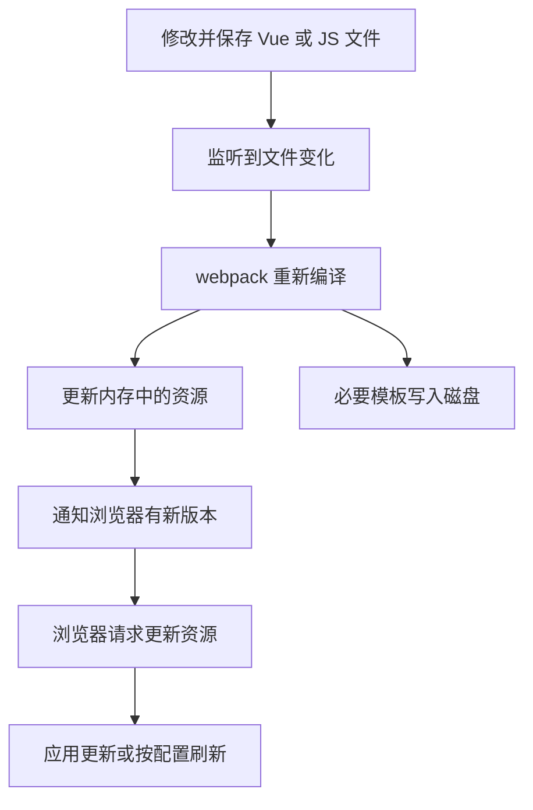
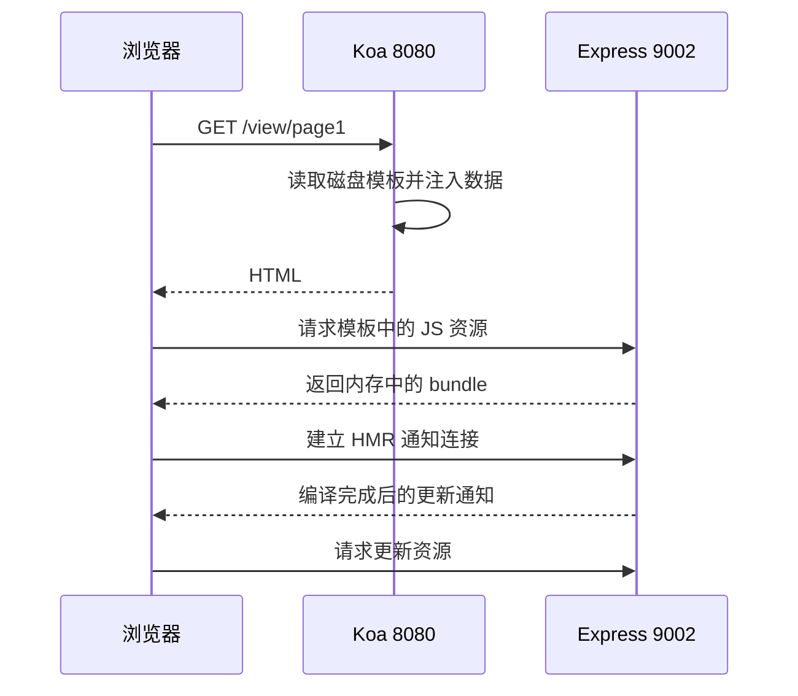

# webpack5 前端工程化搭建（4）

<MuxPlayer
  className="mt-8"
  playbackId="bnOLt5vX6ddh02vLRv2o6Tmqx5Qvx01N1LDmQ5Z0001grYk"
  title="webpack5 前端工程化搭建（4）"
/>

> [!NOTE]
>
> 本节完成开发环境的构建与热更新。Koa 继续提供页面和业务接口，另起 Express 开发服务监听前端文件、编译资源，并通过 HMR 通道通知浏览器获取更新。
>
> 最关键的设计是分开处理两类产物：`.tpl` 模板写入磁盘，供 Koa 读取；JavaScript 等资源保存在开发服务的内存文件系统中，由模板引用开发服务地址。
>
> 下列示例根据字幕中的链路整理。开发服务器端口、路径以及客户端查询参数必须成套对应，不能仅复制某一段配置而忽略其他位置。

## 开发环境需要什么能力

生产构建执行一次，生成文件，再部署并运行。开发过程则会不断修改文件，如果每次都手动构建、重启服务、刷新页面，反馈就太慢。

课程先把开发体验拆成三项能力。第一，知道源文件发生了变化。第二，重新执行编译并保存最新产物。第三，把变化通知给浏览器，让浏览器获取新内容。

这三件事分别对应监听、编译与通知。热更新不是单独加一个插件就自动出现的效果，而是服务端持续编译、资源交付和浏览器客户端共同配合的结果。



课程选择 Express、`webpack-dev-middleware` 和 `webpack-hot-middleware` 来实现。框架自身的线上服务仍是 Koa，两台服务承担的职责不同。

## 为什么模板仍然写到磁盘

Koa 的页面渲染链路已经建立：收到 `/view/page1` 请求后，找到 `dist/entry.page1.tpl`，经过模板引擎注入数据，再返回 HTML。为了保持这条链路，开发构建仍需把模板生成到它能读取的位置。

JavaScript、CSS 等资源则不必每次重新写成磁盘文件。开发中间件可把产物保存在内存文件系统，浏览器通过开发服务的 URL 获取。这能避免每次保存后都把整套静态文件反复落盘。

| 内容 | 开发时存放位置 | 消费者 |
| --- | --- | --- |
| `entry.page1.tpl` 等模板 | 项目 `app/public/dist` | Koa 模板渲染链路 |
| JavaScript 和相关构建资源 | 开发中间件的内存文件系统 | 浏览器资源请求 |
| HMR 通知 | 开发服务提供的连接 | 浏览器中的 HMR 客户端 |
| 业务 API | 原有 Koa 服务 | 前端业务请求 |

“内存里没有真实文件”是指没有写入对应磁盘目录，并不代表没有文件名、路径和资源内容。开发中间件仍通过虚拟路径管理产物，浏览器也仍然发起普通资源请求。

## 两个服务怎样共同完成页面

课程使用 `8080` 作为 Koa 服务示例端口，使用 `127.0.0.1:9002` 作为开发服务。浏览器地址栏打开的是 Koa 页面地址，HTML 里的脚本地址则指向开发服务。



这张图也是后续排错的依据。页面 404 应先看 Koa 路由与模板；脚本 404 应看开发资源 URL；页面能打开但不会更新，则继续看 HMR 通道和客户端。

## 开发配置继承基础配置

开发配置继续使用基础入口、Loader 与分包规则，显式设置 `mode: "development"`，然后定义开发服务地址和资源输出信息。

```js filename="app/webpack/config/webpack.dev.js：地址约定" copy
const path = require("path")
const webpack = require("webpack")
const merge = require("webpack-merge")
const baseConfig = require("./webpack.base")

const devServerConfig = {
  host: "127.0.0.1",
  port: 9002,
  hmrPath: "/__webpack_hmr",
  timeout: 20000,
}

const origin = `http://${devServerConfig.host}:${devServerConfig.port}`
const publicPath = `${origin}/public/dist/dev/`
```

这里的 `hmrPath` 是通知通道地址，`publicPath` 是构建资源地址，两者不应混为同一路径。课程让这些配置被构建配置和启动脚本共同使用，避免一个地方改了端口、另一个地方仍然使用旧值。

## 给每个页面注入 HMR 客户端

只有开发服务知道文件变了还不够，浏览器里必须有一段客户端代码去接收通知。因此课程把 hot middleware 的客户端模块加入每个页面入口。

```js filename="app/webpack/config/webpack.dev.js：入口增强" copy
const hotClient = [
  "webpack-hot-middleware/client",
  `?path=${origin}${devServerConfig.hmrPath}`,
  `&timeout=${devServerConfig.timeout}`,
  "&reload=true",
].join("")

const devEntry = {}
for (const [name, source] of Object.entries(baseConfig.entry)) {
  devEntry[name] = name === "vendor"
    ? source
    : [source, hotClient]
}
```

入口数组表示这个页面启动时还需要执行客户端模块。课程特意排除 vendor，表达第三方库不是当前业务热更新的主要对象。当前基础配置里 vendor 由 `splitChunks` 生成，并不一定是一个独立 entry，因此这个判断的作用应结合最终 entry 对象理解。

示例单独创建 `devEntry`，避免原地改写共享配置。无论采用哪种写法，最后都应检查每个业务入口确实包含自己的源文件与 HMR 客户端，且没有因配置合并重复追加。

查询参数中的第一个参数用 `?`，后续参数用 `&`。课程调试 HMR 404 时，就检查过这个细节。若拼错，服务器可能收到错误路径，或者 timeout、reload 被当成路径内容，而不是参数。

## 补齐 output 和热替换插件

```js filename="app/webpack/config/webpack.dev.js：导出配置" copy
const webpackConfig = merge.smart(baseConfig, {
  mode: "development",
  output: {
    filename: "js/[name]_[hash:8].bundle.js",
    path: path.resolve(process.cwd(), "app/public/dist/dev"),
    publicPath,
    crossOriginLoading: "anonymous",
  },
  plugins: [new webpack.HotModuleReplacementPlugin()],
  devtool: "eval-cheap-module-source-map",
})

// entry 已经包含基础入口，不再让数组合并重复追加。
webpackConfig.entry = devEntry

module.exports = { webpackConfig, devServerConfig }
```

输出中的磁盘路径用于定位产物，不表示所有资源最终都会落盘，是否写盘还由开发中间件的 `writeToDisk` 决定。`publicPath` 则会进入模板和模块运行时，告诉浏览器从哪台服务取资源。

课程以合并工具组成开发配置，再同时导出 webpack 配置与服务配置。启动文件因此不必自己再抄一份端口和 HMR 路径。

Source Map 是在本节后半段根据实际调试需求补上的。这里集中列在最终形态中，后文再说明它解决的问题。

## 用 Express 承载两个中间件

`webpack-dev-middleware` 接收 compiler，组织 watch 编译并对外提供内存资源；`webpack-hot-middleware` 结合同一个 compiler，向浏览器客户端推送构建状态与更新信息。

```js filename="app/webpack/dev.js：简化启动链路" copy
const express = require("express")
const webpack = require("webpack")
const devMiddleware = require("webpack-dev-middleware")
const hotMiddleware = require("webpack-hot-middleware")
const {
  webpackConfig,
  devServerConfig,
} = require("./config/webpack.dev")

const app = express()
const compiler = webpack(webpackConfig)

app.use(devMiddleware(compiler, {
  publicPath: webpackConfig.output.publicPath,
  writeToDisk: (filePath) => filePath.endsWith(".tpl"),
  stats: { colors: true },
  headers: {
    "Access-Control-Allow-Origin": "*",
    "Access-Control-Allow-Methods": "GET, HEAD, OPTIONS",
    "Access-Control-Allow-Headers": "Content-Type, X-Requested-With",
  },
}))

app.use(hotMiddleware(compiler, {
  path: devServerConfig.hmrPath,
}))

app.listen(devServerConfig.port, devServerConfig.host, () => {
  console.log("webpack dev server started")
})
```

示例只列出开发资源服务需要的基本响应头。课程演示了更多允许的方法和请求头，目的在于让开发页面顺利获取跨端口资源。这是本地开发服务的配置，不能把它当作所有业务接口通用的生产跨域策略。

两个中间件必须使用同一个 compiler，才能围绕同一次构建配合。一个负责提供编译后的资源，另一个负责通知；浏览器收到通知后仍需要请求真实的更新内容。

## writeToDisk 的返回值决定模板是否存在

本节最有代表性的错误之一，是服务启动后 `public/dist` 里没有模板。课程先检查入口对象，确认两个 entry 都存在，再检查 output 路径，最后定位到 `writeToDisk`。

错误形态类似：

```js filename="没有返回值的过滤函数" copy
writeToDisk: (filePath) => {
  filePath.endsWith(".tpl")
}
```

箭头函数使用花括号后，没有写 `return`，实际返回的是 `undefined`。即使表达式判断为真，调用者也拿不到结果，因此模板不会按预期写到磁盘。

修复可以使用表达式函数体，也可以显式返回：

```js filename="正确返回落盘判断" copy
writeToDisk: (filePath) => {
  return filePath.endsWith(".tpl")
}
```

修复后，磁盘上应看到两份模板，而不是和生产构建完全相同的一整套 JS 文件。模板中的脚本地址指向 `9002` 的虚拟资源路径，证明“模板落盘、资源在内存”的分流已经生效。

## HMR 404 要沿地址逐段检查

课程接着启动 Koa，在浏览器里看到资源已经从开发服务加载，但 HMR 连接报 404。这个现象说明页面链路和资源链路基本正常，问题可以收敛到通知地址。

检查时要把客户端生成的完整 URL，与 Express hot middleware 注册的路径逐段比较：协议、主机、端口、路径前导斜杠、路径本身、查询参数分隔符。

```text filename="双方必须一致的关系" copy
客户端：
http://127.0.0.1:9002/__webpack_hmr?...

服务端：
host = 127.0.0.1
port = 9002
path = /__webpack_hmr
```

课程通过修正参数连接符和路径斜杠解决问题。看到 `is not a function` 时，则回到入口对象访问代码，检查是否误把方括号取值写成了函数调用。不同报错提供了不同线索，不能只靠反复重启服务。

## 通知通道使用 EventSource

课程原理图提到 WebSocket 或 SSE 都能承担通知，但实际调试发现当前 `webpack-hot-middleware` 客户端使用 `EventSource`。因此本节实现应明确表述为 SSE 通知，而不是把所有 HMR 都说成 WebSocket。

SSE 负责服务器向浏览器推送变化信息，更新资源仍由浏览器发 HTTP 请求获取。原理讲解中的“双向配合”表示客户端和服务器共同参与，不代表 SSE 自身是双向消息协议。

另外，HMR 与整页刷新也应区分。模块能够接受更新时，可以应用模块替换；需要退回刷新时，客户端按 `reload` 等配置处理。课程从使用者角度观察“保存后页面变化”，不应据此承诺所有改动都能保留所有页面状态。

## 按三步验证保存后的更新

课程在 Vue 页面里新增一个响应式文本，保存后先看终端是否重新编译，再看浏览器是否出现新内容，最后把文本改成另一个值重复观察。

这一验证分别覆盖监听、编译、通知和应用更新。若终端没有动作，先检查文件是否属于当前依赖图以及开发服务是否运行；若编译有错误，先修复错误；若编译成功但浏览器不变，则检查 HMR 连接与更新资源请求。

开发时需要同时运行两个服务，停止其中任意一个都会影响对应能力。只运行 Koa 可能仍能读到旧模板，但脚本无法从开发服务获得；只运行开发服务则不能替代 Koa 的页面路由和动态数据注入。

## Source Map 让错误能回到源代码

热更新跑通后，课程点击初始化日志所在位置，发现生成代码不便定位。于是增加 `devtool` 配置，提供构建产物到源文件的映射关系。

`eval-cheap-module-source-map` 是课程开发场景采用的一种方式。重新启动构建后，再从控制台进入日志位置，就能更方便地看到组件源代码。不同 Source Map 选项在构建速度、重建速度和映射精度之间有取舍，不存在只背一个名称就适合所有工程的结论。

Source Map 也不是日志打印开关。保留 console 有助于观察行为，提供映射则帮助定位产生行为的源代码，两者作用不同。

## 构建完成后的代码整理

课程在本阶段结束时运行 lint，删除未使用的测试工具引用，把构建产物目录加入 Git 忽略。源文件与配置需要被版本管理，能够从源码重新生成的 `app/public/dist` 不需要在这个开发流程中反复提交。

这时仍在前端工程化功能分支提交阶段，完整里程碑的合并放到后面基础建设完成后处理。这里讲的是课程协作流程，并不意味着复盘文档会执行这些 Git 操作。

## 本节小结

本节把开发环境拆成 Koa 页面服务与 Express 构建服务，用 dev middleware 监听和提供内存产物，用 hot middleware 和入口客户端建立通知关系。模板通过 `writeToDisk` 选择性落盘，浏览器则从开发服务获取脚本与更新资源。

入口对象访问、过滤函数返回值、HMR URL 拼接和 Source Map 都通过实际现象逐项验证。到这里，前端构建同时具备生产交付和日常开发能力，下一步可以在稳定的工程底座上建设统一启动、UI 组件、状态管理、路由与请求方法。
