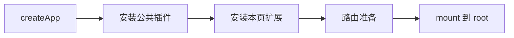

# elpis 前端基础建设（1）

<MuxPlayer
  className="mt-8"
  playbackId="PvKJyn01Xz6jo026t1ml00FiylEsYtIZYyOCPJMciXjGqM"
  title="elpis 前端基础建设（1）"
/>

> [!NOTE]
>
> 前面的课程已经解决“源代码怎样变成页面资源”，本节开始解决“每张页面怎样以一致方式启动”。课程把 Vue 初始化收拢到 `boot.js`，统一安装 Element Plus、Pinia、页面路由和公共样式，同时为不同入口保留扩展能力。
>
> 最值得复盘的细节是初始化顺序：插件必须在页面挂载之前安装；存在前端路由时，还要等待路由就绪再挂载。课程通过“热更新后出现、整页刷新又消失”的现象，定位了 Element Plus 安装顺序错误。

## 多个入口需要同一套启动规范

上一阶段的 `entry.page1.js` 与 `entry.page2.js` 都自己调用 `createApp`、创建实例并挂载。后面每个页面还会安装 UI 组件库、状态管理和路由，如果继续在各入口重复写，新增或调整一项公共能力就需要修改很多文件。

课程在 `app/pages` 下新增 `boot.js`。页面入口只负责提供页面根组件和本页配置，公共启动步骤由 boot 完成。这样入口的差异与框架统一行为就有了边界。

```js filename="app/pages/boot.js：最初形态" copy
import { createApp } from "vue"

export default function boot(PageComponent) {
  const app = createApp(PageComponent)
  app.mount("#root")
  return app
}
```

```js filename="app/pages/entry.page1/entry.page1.js" copy
import boot from "pages/boot"
import Page1 from "./page1.vue"

boot(Page1)
```

这里使用上一阶段配置的 `pages` 别名。框架内部目录调整时，可以集中处理别名和公共文件，而不是让每个入口堆满不同层级的相对路径。

课程先只做这一项替换，再启动开发服务和 Koa，分别验证两个页面。这样可以确认抽取本身没有改变原有功能，再继续引入新的库。

## Element Plus 要连同样式接入

本项目使用 Vue3，因此课程选择 Element Plus。注册插件让组件可以在模板中使用，引入样式则让这些组件具备正确视觉表现，这两件事不能只做一件。

```js filename="app/pages/boot.js：安装 UI 组件库" copy
import { createApp } from "vue"
import ElementPlus from "element-plus"
import "element-plus/dist/index.css"

export default function boot(PageComponent) {
  const app = createApp(PageComponent)
  app.use(ElementPlus)
  app.mount("#root")
  return app
}
```

课程把测试页的原生输入框换成 `el-input`，再分别设置不同宽度，观察两张页面是否都生效。

```vue filename="测试页中的组件验证" copy
<el-input v-model="content" style="width: 300px" />
```

这里的目的不是完整讲解输入框 API，而是确认公共入口安装的插件能够服务所有页面。只要 boot 里统一注册成功，页面无需再重复调用 `app.use(ElementPlus)`。

课程强调根据所使用版本的官方文档确认安装和接入方式。复盘保留该方法，但不替换课程时代的依赖版本，也不把某次文章中的用法当作所有版本都不变的接口。

## 为什么热更新正常，刷新却不正常

实作中先出现一个很有价值的现象：修改页面并保存后，`el-input` 能出现；但整页刷新后，又无法正常渲染。

如果只观察热更新，就可能误判组件库已经接好。课程根据“首次加载”和“已有应用中的模块更新”两种路径不同，回到 boot 检查初始化顺序。

错误顺序相当于：

```js filename="错误的启动先后关系" copy
const app = createApp(PageComponent)
app.mount("#root")
app.use(ElementPlus)
```

首次挂载执行时，组件库还没有注册到当前应用，因此模板解析时缺少对应组件。之后页面已经运行，HMR 又重新触发局部处理，现象可能看起来恢复正常。这并不能证明初始启动正确。

修复后应先注册，再挂载：



> [!TIP]
>
> 公共初始化改动后，同时验证整页刷新和保存触发更新。前者重新执行启动链路，后者可能复用当前运行状态；只有一种路径正常，不足以证明初始化逻辑正确。

## Pinia 的创建放进 store

数据管理也是多个页面会共享的基础能力。课程在 `store` 目录创建 Pinia 实例，再由 boot 安装，而不是把数据层初始化细节全部写进 boot。

```js filename="app/pages/store/index.js" copy
import { createPinia } from "pinia"

const pinia = createPinia()
export default pinia
```

```js filename="app/pages/boot.js：接入状态管理" copy
import pinia from "store"

// app 已由 createApp 创建，mount 尚未执行。
app.use(pinia)
```

`store` 别名需要与 webpack 配置对应。这个分工让 boot 只负责组装运行环境，数据模块的组织、初始化和后续领域状态仍然留在 store 目录。

当前是浏览器中每次页面加载创建自己的应用运行环境。不同服务端页面跳转通常会重新加载文档，不能因为源码中导出了同一个 Pinia 模块，就以为所有浏览器页面或所有用户共享一个状态实例。

## 两层路由分别解决什么问题

课程接着引入 Vue Router。这里容易产生疑问：服务端已经有 `/view/page1` 路由，为什么前端还需要路由？

两者负责不同层级。Koa 路由决定给浏览器哪一张页面模板；拿到页面并启动 Vue 后，Vue Router 再决定当前模板内部显示哪个子视图。例如进入一个后台模板后，左侧菜单可以切换列表、表单或其他功能，而不必每次都重新请求整张文档。

```text filename="页面路由与前端路由示意" copy
/view/page1#/list
     |          |
     |          +-- Vue Router 选择页面内部的列表视图
     +------------- Koa 选择 page1 模板

/view/page2#/detail
     |            |
     |            +-- Vue Router 选择详情视图
     +--------------- Koa 选择 page2 模板
```

课程用 SSR 与 CSR 的组合来讲这个思路。需要明确当前已经实现的边界：服务端渲染的是带动态数据的页面模板，Vue 组件仍通过浏览器里的 `createApp().mount()` 启动；这不自动等于已经实现完整的 Vue 服务端组件渲染和水合。

服务端返回了哪些实际内容，才决定这些内容能否直接被首屏或搜索引擎消费。不能仅因使用 `.tpl` 和 Koa，就保证全部 Vue 业务内容都已经在服务端渲染。

## tpl 表达的是动态模板约定

课程借此解释为什么产物后缀使用 `.tpl`。文件里有服务端需要注入的动态数据，采用 tpl 可以表达“这是等待模板引擎处理的模板”。最终返回给浏览器的内容仍是 HTML。

后缀本身并不会赋予渲染能力。是否执行模板处理，取决于 Koa 中间件、模板引擎与 Controller 的调用方式。使用 `.html` 也可以配置模板引擎；使用 `.tpl` 但没有正确渲染，也不会自动得到动态数据。

这个命名是框架规范的一部分，帮助开发者区分源模板、生成模板与普通静态资源。

## 页面路由由入口传入

boot 是公共方法，不能在内部写死所有页面的路由。Page1 和 Page2 可能拥有完全不同的子页面，因此课程让入口把 `routes` 传进来，boot 只负责创建和安装路由实例。

```js filename="创建本页路由" copy
import { createRouter, createWebHashHistory } from "vue-router"

const router = createRouter({
  history: createWebHashHistory(),
  routes,
})

app.use(router)
await router.isReady()
app.mount("#root")
```

课程选择 hash 模式。`#` 后面的片段由浏览器端路由处理，不会作为 HTTP 请求路径发送给服务端。这里应称为 URL fragment，而不是把它当作 JavaScript 或 HTML 注释。

使用这一模式，Koa 仍只需匹配原来的页面地址，页面内部路由切换由客户端处理。前端 router 配置与服务端页面路由并不互相替代。

## 没有路由的页面直接挂载

并不是每张页面都需要前端路由。有些页面只展示一个独立组件，没有内部菜单和视图切换。课程为这种情况保留直接挂载路径。

```js filename="有无路由的启动分支" copy
if (routes && routes.length) {
  const router = createRouter({
    history: createWebHashHistory(),
    routes,
  })
  app.use(router)
  await router.isReady()
}

app.mount("#root")
```

这减少了不必要的路由实例初始化。需要区分的是：如果在文件顶部静态 import 了 Vue Router，仅在运行时跳过创建实例，并不自动保证构建产物完全不包含路由库。课程当前实现主要体现初始化行为上的按需处理。

等待 `router.isReady()` 是为了让初始导航准备好，再挂载应用。它与 Element Plus 的先注册后挂载遵循同一个原则：页面首次渲染前，把依赖的运行环境准备完成。

## 给不同页面保留插件扩展

除了全站都用的 Element Plus 和 Pinia，某个页面可能还需要图表、地图或编辑器。若把所有可能用到的库都直接写进 boot，每个入口就可能承担不必要的依赖。

课程新增页面级参数，让入口把自己需要的扩展交给 boot。下面把参数形式整理成选项对象，名称用于说明职责，不伪装为视频逐字源码。

```js filename="app/pages/boot.js：整理后的完整启动示例" copy
import { createApp } from "vue"
import { createRouter, createWebHashHistory } from "vue-router"
import ElementPlus from "element-plus"
import pinia from "store"
import "element-plus/dist/index.css"
import "pages/assets/custom.css"

export default async function boot(PageComponent, options = {}) {
  const { routes = [], plugins = [] } = options
  const app = createApp(PageComponent)

  app.use(ElementPlus)
  app.use(pinia)

  for (let index = 0; index < plugins.length; index += 1) {
    app.use(plugins[index])
  }

  if (routes.length) {
    const router = createRouter({
      history: createWebHashHistory(),
      routes,
    })
    app.use(router)
    await router.isReady()
  }

  app.mount("#root")
  return app
}
```

这里的 `plugins` 应传入符合 Vue 插件接口的对象或函数。课程用地图、图表等举例说明页面差异，并不代表任意 npm 库都能直接交给 `app.use`；普通工具库仍应按其接口初始化或包装。

通过页面参数保留扩展点，公共 boot 可以稳定下来，入口负责选择需要的能力。后面领域模板和自定义页面就能共用统一启动链路。

## 公共样式也属于启动环境

课程在 `assets` 中新增自定义样式，处理根节点高度和输入框自动填充背景等基础展示问题。通过 boot 统一引入，就不用每个页面重复引用。

```css filename="app/pages/assets/custom.css：基础样式示意" copy
html,
body,
#root {
  width: 100%;
  height: 100%;
}

body {
  margin: 0;
}
```

Element Plus 提供组件样式，项目自己的公共样式处理应用容器与统一覆盖，两者职责不同。具有业务语义的特殊样式应继续留在页面或组件内，避免让公共入口不断积累只服务单一页面的规则。

## 维护性和性能要结合执行位置判断

课程讨论了服务启动时的循环与浏览器首屏启动循环。服务 Loader 在进程启动时执行，阅读和维护的成本很重要；boot 位于用户加载页面时的执行路径，开发者也应关心不必要的初始化与依赖。

不过不能仅凭采用 `for` 或 `forEach` 就断言有稳定的几十毫秒收益。这里更值得保留的方法是：知道代码在哪个阶段运行、是否重复执行、是否加载了本页不需要的内容，再根据实际情况优化。

本节真正减少重复工作的地方，是统一启动、按需传递页面能力，以及在挂载前完成清晰的初始化顺序。这些结构性的选择，比孤立比较一段小循环更能解释框架设计。

## 本节小结

本节把各入口中的 Vue 初始化收拢到 boot，统一接入 Element Plus、Pinia、公共样式和可选前端路由，并让入口传入自己的根组件和页面级插件。

Element Plus 的首次渲染问题说明初始化顺序必须通过整页刷新验证；Vue Router 的等待机制进一步明确“依赖准备完成后再挂载”的原则。到这里，页面已有稳定的运行底座，下一节将补齐前端请求服务端的公共桥梁。
