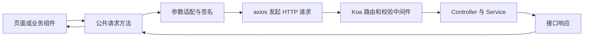

# elpis 前端基础建设（2）

<MuxPlayer
  className="mt-8"
  playbackId="rzx9Ky01PDqadjT4tzWhZlutcgFk301cZfszAJ3Cul017E"
  title="elpis 前端基础建设（2）"
/>

> [!NOTE]
>
> 本节补齐页面与服务端之间的请求能力。课程在 `common` 下封装请求方法，把 URL、方法、请求头、query、body、响应类型和超时等输入统一起来，并接入前面服务端已经实现的时间戳签名规则与通用错误提示。
>
> 封装的价值在于承载项目约定：页面只表达业务请求，公共层统一处理签名、参数适配和错误。字幕中部分错误处理代码存在长段重复转写，下面保留能够确认的分层与行为，不虚构完整错误码表。

## 请求方法是前后端的桥梁

前端工程化已能生成页面，boot 也安装了组件库、状态管理和路由，但页面仍需要调用 Koa 的业务接口。搜索、列表加载、提交表单等行为，都要经过 HTTP 请求把前端输入交给服务端，再把响应带回页面。

如果每个组件直接调用 axios，各自拼请求头、各自生成签名、各自判断失败，项目约定就散落在很多地方。服务端规则调整时，很容易漏改某个入口。

课程在公共目录中创建请求文件，使这条桥梁有一个统一入口。它属于前端基础建设，不是独立于整个框架的炫技功能。能否解释这个入口承担了哪些约定，比“封装过 axios”这个名称更有意义。



## 先设计调用者需要表达什么

课程先讨论 HTTP 请求需要哪些信息，再选择在内部怎样调用 axios。这让公共接口围绕业务表达，而不是仅仅把第三方 API 换个函数名。

| 输入 | 职责 | 课程中的默认思路 |
| --- | --- | --- |
| `url` | 请求地址 | 调用者提供 |
| `method` | HTTP 方法 | 默认 POST |
| `headers` | 调用者补充的请求头 | 默认空对象 |
| `query` | URL 查询参数 | 映射到 axios 的 params |
| `data` | 请求体内容 | 作为 body 发送 |
| `responseType` | 响应解析类型 | 默认 JSON |
| `timeout` | 请求超时 | 默认 60 秒 |
| `errorMessage` | 当前操作的兜底提示 | 由调用处按需补充 |

这些参数即使换成其他 HTTP 客户端，也仍然有意义。axios 负责具体发送，公共层负责把项目接口转换成它接受的配置。

`query` 与 `data` 要明确区分。query 进入 URL，data 进入请求体；不是因为 method 默认 POST，就把所有输入都一股脑放进 body。调用者应该根据服务端接口定义选择正确位置。

## 为公共方法准备依赖

课程在 webpack 的统一模块提供配置中加入 axios 与 lodash，并在请求封装里使用 MD5 工具。下面示例使用显式 import 表达依赖，避免把构建期模块注入与真正的浏览器全局对象混淆。

```js filename="app/pages/common/request.js：依赖与参数" copy
import axios from "axios"
import md5 from "md5"

export default function request(options = {}) {
  const {
    url,
    method = "post",
    headers = {},
    query = {},
    data,
    responseType = "json",
    timeout = 60 * 1000,
  } = options

  return axios({
    url,
    method,
    headers,
    params: query,
    data,
    responseType,
    timeout,
  })
}
```

这一版只展示参数适配，尚未包含项目约定。`timeout` 以毫秒传给 axios，因此一分钟写成 `60 * 1000`。这与后面签名使用的时间戳单位是两个独立问题。

如果公共方法到这里就结束，它与直接调用 axios 的差别很小。课程接着引入签名与错误处理，才让这个封装真正承担框架责任。

## 回到服务端已有的签名中间件

前面服务端课程已经实现请求签名校验。服务端从请求头中取出时间戳和摘要，根据共享字符串与时间戳计算结果，再校验摘要是否一致、时间是否仍在允许范围内。

前端因此不能只发送业务参数，还要按同一约定携带时间戳与摘要。最适合做这件事的位置，就是所有请求都会经过的公共方法，而不是每个按钮的点击函数。

字幕对摘要字段的转写不稳定。这里沿用服务端复盘的示意名称：`st` 表示时间戳，`s` 表示摘要。实际项目应以服务端中间件读取的字段名为准，前后端保持完全一致。

```js filename="生成请求头：按课堂方案整理" copy
function createHeaders(headers, sharedText) {
  // 示例约定以毫秒为单位，服务端使用同一单位。
  const st = Date.now()

  return {
    ...headers,
    st: String(st),
    s: md5(`${sharedText}_${st}`),
  }
}
```

这个片段的拼接方式用来说明双方需要同一算法。真实项目中的拼接顺序、分隔符、编码和单位都必须与服务端实现对齐，不能各自觉得“MD5 一下就行”。课堂中的具体共享字符串也不应写进通用文档作为默认值。

## 时间戳必须在每次请求时生成

签名的时间有效性意味着 `st` 应在发起当前请求时取得。如果把它放到模块顶层，只在页面加载时计算一次，页面停留一段时间后，后续请求仍会使用旧时间戳，最终因过期而被拒绝。

同样，浏览器的 `Date.now()` 是毫秒，前面服务端示例也以毫秒比较，十分钟窗口写成 `600 * 1000`。如果一端改用秒，另一端仍使用毫秒，两者相差一千倍就无法得到正确的时间窗口。课程的核心是时间与摘要共同校验，复盘时需要把单位写明，避免只有算法一致、时间计算却不同。

可以把一次请求的前置处理理解为：

```text filename="每次请求的前置步骤" copy
读取调用者 options
  -> 取得当前时间戳
  -> 按约定生成摘要
  -> 合并调用者 headers 与框架 headers
  -> 交给 HTTP 客户端发送
```

调用者原有请求头应被保留，框架签名字段则由公共方法统一生成。这样页面可以添加业务需要的头，又不会无意间跳过框架约定。

## 这类浏览器签名的能力边界

课程的方案让请求携带时间信息，服务端可以进行简单的过期检查和一致性校验。它并不因为使用了 MD5 就具备身份认证能力。

用于计算摘要的共享字符串存在于浏览器可获得的代码中，因此不能当作只有可信客户端知道的秘密。该示例也没有证明对所有重放行为、自动化请求或用户身份都提供保护。

> [!IMPORTANT]
>
> 这里复盘的是课堂的简单请求约定。时间戳与摘要可以帮助服务端拒绝不符合该约定的请求，但不能替代登录态、权限校验或真正的服务端凭据管理。不要把“前端能生成”写成“只有合法用户能生成”。

这个说明直接关系到本节封装的职责：公共请求层自动带上协议字段，服务端仍负责自己的业务校验与权限边界，两者不是相互替代。

## 把签名接回请求配置

下面集中展示参数适配和签名的组合。共享字符串通过函数参数注入，是为了让示例明确表达依赖，不把字幕中无法确认的项目常量伪装成可直接使用的真实值。

```js filename="app/pages/common/request.js：请求核心示意" copy
import axios from "axios"
import md5 from "md5"

export function createRequest(sharedText) {
  return function request(options = {}) {
    const {
      url,
      method = "post",
      headers = {},
      query = {},
      data,
      responseType = "json",
      timeout = 60000,
    } = options

    const st = Date.now()
    const requestHeaders = {
      ...headers,
      st: String(st),
      s: md5(`${sharedText}_${st}`),
    }

    return axios({
      url,
      method,
      params: query,
      data,
      headers: requestHeaders,
      responseType,
      timeout,
    })
  }
}
```

与服务端章节联读时，可用 `createRequest("course-demo-shared-text")` 创建请求方法；这个值只是两章共同使用的演示字符串，需与服务端示例一致。

这是便于复盘的整理形式，课程实际在公共文件里使用项目对应的签名配置。无论形式怎样变化，关键约束都是每次请求新建时间字段、保留调用者参数、在一个地方执行签名规则。

## 错误处理先分清发生在哪一层

课程接着处理超时、请求不合法和服务端错误，并允许调用者传入当前操作的默认错误提示。字幕无法完整支持每一个分支的具体状态码与返回类型，因此这里按已确认的职责说明，不补造一张“课程完整错误表”。

网络或超时错误意味着客户端没有按预期拿到正常响应。HTTP 失败可能有服务端响应，可以从 `error.response` 观察状态与内容。业务失败则可能通过一个 HTTP 成功响应承载，需要按本项目的响应协议判断。

这三种情况不能只靠同一个 `catch` 理解。axios 默认如何处理 HTTP 状态，与服务端业务结果是否成功，是不同维度。

| 情况 | 需要关注的内容 | 公共层应承担的工作 |
| --- | --- | --- |
| 超时 | 超时配置与错误信息 | 给出明确的请求超时提示 |
| 请求不符合约定 | 服务端约定的失败响应 | 统一提示请求不合法 |
| 服务端异常 | HTTP 状态或统一响应结构 | 展示可理解的服务异常信息 |
| 具体业务操作失败 | 调用者提供的上下文 | 使用本操作的兜底提示 |

## 提示给用户的信息与诊断信息分开

课程特意提到，签名不合法时面向用户显示“请求不合法”，而不是直接把内部签名校验细节当成产品提示。这让用户知道操作失败，又避免界面充满实现术语。

这种文案选择本身并不增加密码学强度。它的作用是明确展示边界：用户提示帮助用户理解操作结果，开发日志帮助开发者定位问题，两者不必完全相同。

调用者传入 `errorMessage`，则是为了让同一个请求工具服务不同操作。例如查询失败和保存失败，需要不同的业务上下文。公共层可以统一判断超时等确定错误，对无法进一步区分的情况使用调用者给出的兜底信息。

## 返回值必须形成明确约定

请求封装最终要把结果还给页面。可以返回完整 axios 响应，也可以返回响应体，还可以在业务层进一步抽取数据，但必须明确且一致。调用者要知道自己拿到的是 `response`、`response.data`，还是业务数据中的某个字段。

错误处理也一样。若在 `catch` 中只打印并结束，Promise 可能变成成功完成且值为 `undefined`，调用者就容易误以为请求完成了正常流程。若选择把错误向上传播，则应保留 reject；若选择返回统一结果对象，也应让调用者明确判断成功与失败。

下面只示意“提示后仍然抛出”的一种整理方式，不声称这是字幕中被重复转写遮蔽的完整源码：

```js filename="错误传播约定示意" copy
async function executeRequest(send, options, showError) {
  try {
    const response = await send(options)
    return response.data
  } catch (error) {
    const isTimeout = String(error.message || "")
      .toLowerCase()
      .includes("timeout")

    showError(isTimeout
      ? "请求超时，请稍后重试"
      : options.errorMessage || "请求失败，请稍后重试")

    throw error
  }
}
```

完整项目还需在明确服务端协议之后添加请求不合法、业务状态等分支。不能凭空猜一个数字，就把它写成前面 Koa 中间件已经采用的真实状态码。

## 联调时从请求本身寻找证据

公共请求方法接入后，应在浏览器 Network 里观察请求 URL、method、query、body 和 headers。服务端收到的字段与页面发送的字段一致，才能进一步判断签名算法或业务逻辑。

如果服务端报时间错误，先检查秒和毫秒、是否复用旧时间戳；若摘要不一致，检查共享字符串、拼接方式、字段名与编码；若请求没有进入业务 Controller，则继续看路由和前置中间件，而不是先改页面组件。

当页面已经能够获取数据，也要观察失败路径。超时或错误时是否出现合理提示，页面是否清理 loading，是否仍然错误地执行成功后的刷新动作，都取决于公共封装与调用者之间的返回约定。

这些是对本节链路的验证方法，不代表字幕已经提供了一套完整的自动化测试或所有错误类型实现。

## 前端工程里程碑与代码评审

本节后半段回到课程协作流程。完成前端工程化和基础建设后，提交 MR 并登记评审轮次。学习者修改次数与评审者已检查次数用两个数字记录，方便判断哪些变更还等待查看。

这部分方法的价值是让“我已经按意见修改”与“评审者已经看过修改”成为两个独立状态。只有提交代码而没有反馈闭环，不能确认问题已经解决。

工程代码的阶段成果包括构建配置、开发服务、统一 boot、公共样式与请求方法。它们共同为后面的领域模型和模板组件开发提供基础，不能把这一里程碑仅概括成“封装 axios”。

## 本节小结

本节建立公共请求入口，把业务参数适配成 HTTP 客户端配置，并在每次请求时按服务端约定生成时间戳和摘要。错误处理负责把底层失败转成页面可理解的结果，同时保留清晰的返回与传播约定。

至此，前端已经具备构建、热更新、统一启动、组件库、状态管理、页面路由和请求服务端的基础能力。后续业务组件可以围绕领域数据开发，把这些重复的运行约定交给框架公共层。
