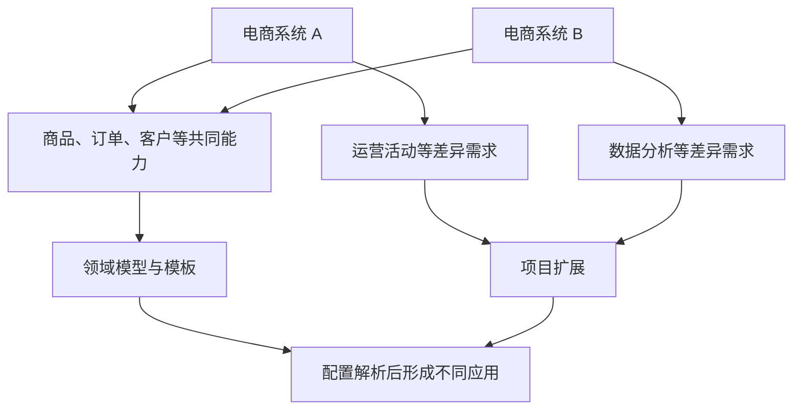
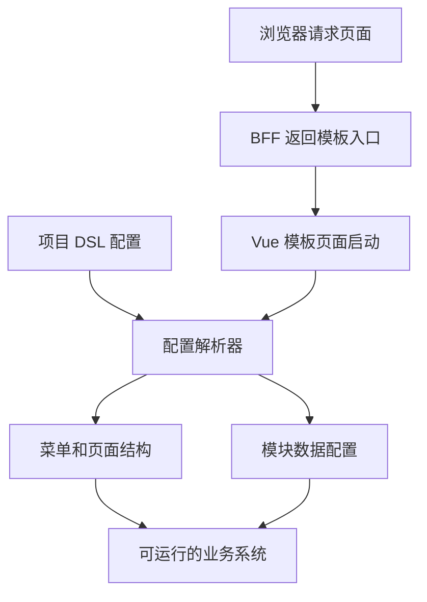
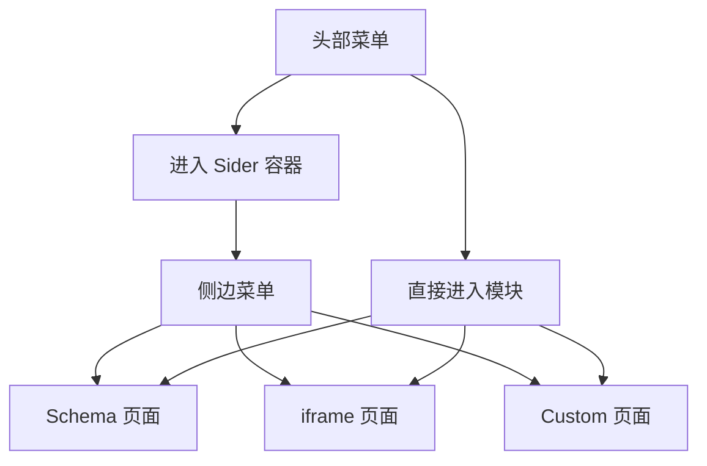
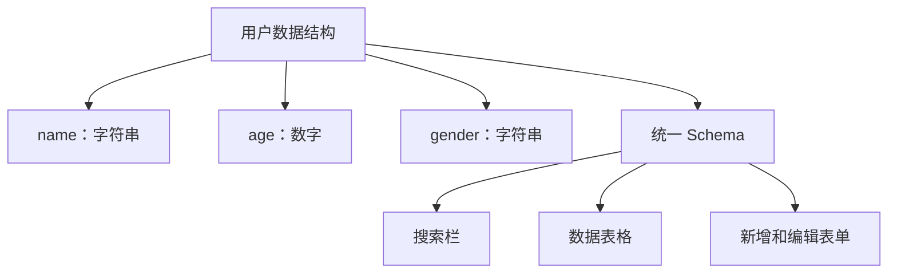
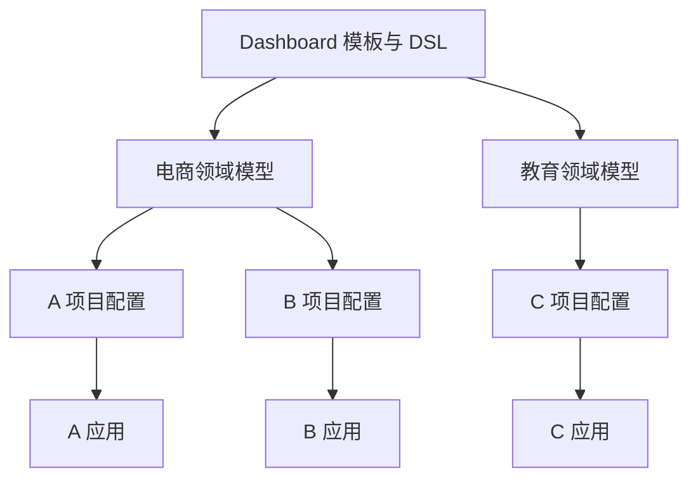

# 领域模型 DSL 设计

<MuxPlayer
  className="mt-8"
  playbackId="00mAH3hEVpIQtm9ftNI27TMz4v2aEHU3iAsirsjgu9OA"
  title="领域模型 DSL 设计"
/>

> [!NOTE]
>
> 本节开始设计 **Dashboard 领域模型 DSL**。前面已经具备 Node.js 服务内核和 Vue3 工程化能力，现在要在这些基础设施之上，约定一套能够描述整个管理后台的配置语言。
>
> 课程从两套电商系统的重复开发问题出发，逐步推导头部菜单、分组菜单、侧边栏、Schema 页面、iframe 页面和自定义页面所需的数据结构。重点不是把页面上的每个组件重新写进配置，而是找到业务共性，以一份数据模型驱动搜索、表格和表单。
>
> 本节产物主要是 DSL 描述文档。模板、领域模型、项目配置与最终应用是四个不同层次，先把它们之间的关系理清，后面实现解析引擎时才知道每一步在处理什么。

## 从重复需求推导配置语言

课程先建立一个具体场景：A 客户需要一套电商后台，包含商品管理、订单管理、客户管理，以及优惠券、限量购、节日活动等运营功能。B 客户也需要电商后台，前三个模块相同，但额外需求变成了数据分析和电商罗盘。

如果沿用复制项目再修改的方式，第二套系统虽然交付得快，却留下两份相似代码。以后商品管理发生变化，两边都需要维护。即使把某些按钮、表格抽成组件，项目中的菜单组合、业务字段、接口约定与交互流程仍然可能重复。

课程希望沉淀的，是这一整段可以复用的业务开发过程。



这里的“80% 共性、20% 定制”是一种设计目标：把反复出现的部分沉淀下来，同时保留足够的扩展入口。它不是说所有业务都能严格按同一个比例划分，更不是要求把全部功能塞进一种页面模板。

DSL 就是表达这些配置的专用语言。对当前课程而言，它以 JavaScript 对象的形式存在，描述选用什么模板、有哪些菜单、每个菜单对应什么模块，以及模块的数据与行为如何组织。

## 先写描述文档，再实现解析器

课堂从 `develop` 派生 DSL 功能分支，并在根目录下建立 `docs`。最初命名为文档文件，随后调整为 `dashboard-model.js`，用它记录 Dashboard 模板的数据结构约定。

```text filename="DSL 文档位置" copy
项目根目录
└── docs
    └── dashboard-model.js
```

这个文件暂时承担的是接口文档的职责。它记录某个字段表示什么、什么时候可以填写、有哪些枚举值，以及哪些结构允许递归。

先设计文档有一个实际好处：实现方与使用方可以围绕同一份结构讨论。如果一个页面需求无法用当前配置表达，应该先判断 DSL 是否缺少表达能力；如果结构已经能够表达，接下来才是如何编写解析代码的问题。

> [!TIP]
>
> 设计课的检查标准是“这份结构能否描述目标系统”。不要因为还没有写出 Vue 组件，就认定配置没有价值；也不要因为配置字段很多，就认定设计已经完整。

本节所有代码都按课堂推导整理为示意，目的是说明配置之间的关系。具体字段的最终取值与消费方式，会在后续实现中逐步收敛，不能把设计阶段的占位结构当成已经实现的全部 API。

## 在现有架构中增加配置解析层

前面的工程化方案已经支持多页面入口。服务端能够返回一个页面，进入页面之后，再由 Vue Router 组织页面内部的不同视图。

现在需要在模板页面与业务视图之间加入一层配置解析能力：读取一份项目配置，决定展示哪些菜单、使用哪类视图，再把对应的数据交给组件。



这和前面两部分课程存在相同的思路：elpis-core 把规范目录里的文件加载成运行时能力；工程化把源码解析成可运行资源；当前模板引擎则在应用运行时，把 DSL 转换成用户能够操作的页面。

三者的执行阶段不同，输入与输出也不同，但都是用明确的约定连接静态描述和实际行为。

尤其要注意，当前 DSL 描述的是一个项目或站点，并不只是某一张表格。菜单结构、模块切换、页面类型和业务数据都在它的描述范围内。

## Dashboard 是第一种模板类型

课程选择管理后台作为第一种模板。它具备常见的头部导航、可选的左侧菜单，以及中间内容区域，命名为 `dashboard`。

配置首先需要一个模板类型，告诉后续系统应该选择哪套解析规则与模板页面。

```js filename="docs/dashboard-model.js：模板入口示意" copy
module.exports = {
  template: 'dashboard',
  name: '电商管理系统',
  description: '商品、订单与客户的统一管理入口',
  icon: '应用图标地址',
  homePage: '/商品模块对应的路由',
  menu: [],
}
```

其中名称、描述、图标、首页等元信息，既可以服务于应用列表，也可以参与应用进入后的展示。后续实现会进一步明确首页路由如何与菜单 key 关联。

模板类型不等于业务领域。同样一个 Dashboard 模板，既可以承载电商管理，也可以承载教育管理。模板关注页面结构与通用能力，领域模型关注具体业务共性。

将来如果引入另一种完全不同的模板，它应当拥有与自身结构匹配的 DSL 和解析器。不能仅新增一个模板名称，就默认所有模板都能消费同一套字段。

## 菜单先区分模块与分组

头部菜单是进入各个业务板块的入口。每一项至少需要唯一标识与显示名称，再增加菜单类型，以区分直接进入模块的菜单和包含下级菜单的分组。

| 字段 | 表达的内容 | 设计原因 |
| --- | --- | --- |
| `key` | 菜单的唯一标识 | 供查找、路由、选中状态关联使用 |
| `name` | 用户看到的菜单名称 | 展示文案与内部标识分开 |
| `menuType` | `model` 或 `group` | 区分内容入口和菜单容器 |
| `subMenu` | 分组内的菜单项 | 允许重复使用同样的菜单结构 |

`menuType` 用 `model` 表示承载业务内容的菜单项，用 `group` 表示菜单分组；业务菜单再通过 `modelType` 指定具体视图类型。配置、校验与页面分发都要使用相同的字段和值。

```js filename="菜单与分组结构示意" copy
const menu = [
  {
    key: 'goods',
    name: '商品管理',
    menuType: 'model',
    modelType: 'schema',
    schemaConfig: {},
  },
  {
    key: 'operation',
    name: '运营活动',
    menuType: 'group',
    subMenu: [
      {
        key: 'coupon',
        name: '优惠券',
        menuType: 'model',
        modelType: 'schema',
        schemaConfig: {},
      },
    ],
  },
]
```

递归的关键在于：`subMenu` 的元素仍然是菜单项。描述一种菜单结构，就可以组合出多级菜单，而不是给一级菜单、二级菜单、三级菜单分别设计完全不同的字段。

不过菜单分组本身不必对应一个业务页面。点击分组主要是展开下级入口，真正要显示内容的是具体模块。这一差异会直接影响后续的路由生成。

## 一个模块需要三种内容来源

只有 Schema 页面并不足以承载实际项目。课程给普通模块设计了三种视图来源。

| 模块类型 | 页面如何产生 | 适用场景 |
| --- | --- | --- |
| `schema` | 根据数据结构与配置生成 | 常规搜索、列表、表单业务 |
| `iframe` | 在容器中打开外部页面 | 接入独立部署的系统或第三方页面 |
| `custom` | 加载开发者编写的 Vue 页面 | 模板无法直接表达的特殊需求 |

对于 Schema 模块，配置重点是数据源、字段与交互；对于 iframe 模块，首先需要的是页面地址；对于自定义模块，需要能够找到对应的自定义页面。

```js filename="模块内容配置示意" copy
const modules = [
  {
    key: 'users',
    name: '客户管理',
    menuType: 'model',
    modelType: 'schema',
    schemaConfig: {},
  },
  {
    key: 'report',
    name: '外部报表',
    menuType: 'model',
    modelType: 'iframe',
    iframeConfig: { path: 'https://example.com/report' },
  },
  {
    key: 'analysis',
    name: '电商罗盘',
    menuType: 'model',
    modelType: 'custom',
    customConfig: { path: '自定义页面路径' },
  },
]
```

这里的地址和路径仅用于说明配置含义。自定义组件路径如何与工程化目录对应，会在模板实现阶段处理。

这种设计把“复用”与“扩展”放在同一份协议内。常规业务使用框架能力，特殊页面也能通过规范入口进入整个系统，继续共享顶部导航与应用切换等外围能力。

## 用 Sider 模块表达第二层导航

管理后台还有一种常见情况：点击头部菜单后，不是立即出现业务页面，而是先出现左侧菜单，继续点击左侧菜单才切换中间内容。

为表达这一层结构，课堂在 `modelType` 中增加 `sider`，对应一份 `siderConfig`。它内部再次包含菜单。

```js filename="带侧边栏的模块示意" copy
const operation = {
  key: 'operation',
  name: '运营活动',
  menuType: 'model',
  modelType: 'sider',
  siderConfig: {
    menu: [
      {
        key: 'coupon',
        name: '优惠券',
        menuType: 'model',
        modelType: 'schema',
        schemaConfig: {},
      },
      {
        key: 'festival',
        name: '节日活动',
        menuType: 'model',
        modelType: 'custom',
        customConfig: { path: '自定义活动页面路径' },
      },
    ],
  },
}
```

这里有两种不同的递归，不能仅因为都包含数组就混为一谈。

分组菜单的递归解决同一块导航里的层级展开。Sider 配置则引入新的布局容器，意味着页面将出现左侧栏和该容器自己的内容区域。

课程对当前 Dashboard 设计加了一条边界：Sider 内的菜单可以继续使用分组，但不再嵌套 Sider 模块。这样既能描述目标管理后台，也避免无边界地增加侧栏层数。



## Schema View 的中心是一份业务数据

本节最重要的设计判断，发生在 Schema View 内部。

页面上虽然有搜索栏、表格、表单三个组件，但它们往往围绕同一个业务对象工作。例如用户管理，搜索的是用户，列表展示的是用户，新增或修改的仍然是用户。

如果从组件出发，可能会写三份字段列表：搜索栏配置一遍年龄，表格配置一遍姓名、年龄、性别，表单又配置一遍这些字段。这样只把模板代码搬到了配置文件，字段语义仍然重复。

课程希望从数据结构出发：先定义用户有哪些字段、每个字段是什么类型，再补充这个字段在搜索、展示、编辑场景中的规则。



这就是“数据驱动”的具体落点。框架不必知道每个项目的字段含义，但可以知道如何遍历字段结构，再根据字段附带的配置生成常见页面能力。

## 在 JSON Schema 上增加展示配置

课程采用 JSON Schema 表达业务数据结构，并在字段描述中扩展页面所需信息。标准的 `type`、`properties` 仍然承担数据描述职责，`label` 等扩展信息则提供页面展示语义。

```js filename="用户数据 Schema 示意" copy
const userSchema = {
  type: 'object',
  properties: {
    name: {
      type: 'string',
      label: '姓名',
    },
    age: {
      type: 'number',
      label: '年龄',
    },
    gender: {
      type: 'string',
      label: '性别',
    },
  },
}
```

字段是否参与搜索、在表格里如何展示、表单使用什么控件，是在这份结构基础上的扩展。课堂此时并未展开所有配置的最终格式，而是先约定还需要表格配置、搜索配置、表单配置和自定义组件配置等能力。

因此，设计阶段可以先把 Schema View 看成下面几个部分：

```js filename="schemaConfig 的职责示意" copy
const schemaConfig = {
  api: '/api/user',
  schema: userSchema,
  tableConfig: {},
  searchConfig: {},
  formConfig: {},
  components: {},
}
```

这段示意用于区分职责，并不意味着每个空对象里支持任意内容。后续实现哪个组件，就同步细化对应的 DSL 文档，让字段约定与实际行为保持一致。

> [!IMPORTANT]
>
> 字段的数据含义只描述一次，组件围绕同一份数据结构生成不同交互。页面层的布局、操作按钮和自定义组件仍然需要各自配置，两者不是互相替代的关系。

## 数据源 API 与 HTTP 动作配合

Schema 页面既要展示数据，也要新增、修改和删除数据，因此需要一个数据源 API。

课堂选择用 RESTful 思路统一这些操作：资源地址描述要操作什么，HTTP 方法描述执行什么动作。

| 请求方式 | 课程中的动作约定 |
| --- | --- |
| `GET` | 获取列表或按条件查询 |
| `POST` | 新增数据 |
| `PUT` | 修改数据 |
| `DELETE` | 删除数据 |

这样模板可以围绕同一个资源配置产生不同请求，避免每个页面都重新编写一套相似的请求逻辑。实际更新与删除所需的主键、参数位置和返回值格式，仍然需要在接口实现阶段约定，不能仅凭一个 URL 自动推断。

当前项目的 BFF 也由课程自己实现，因此前端 DSL 与后端接口可以一起设计。这里的价值是把端到端的约定收敛下来，而不是要求所有已有第三方接口天然符合当前模板。

## 为业务差异保留扩展位置

即使都是搜索加表格的页面，也可能需要在搜索栏与表格之间增加一个统计组件，或者点击行按钮后弹出特殊对话框。

课堂明确保留多种扩展位置：头部容器的插槽、Schema View 内的自定义组件、表格操作按钮、表单中的自定义控件，以及完全自定义的模块页面。

这些扩展层次承担不同规模的差异。只需要补一个按钮，就不必重写整个模块；模块结构完全不同，则可以使用 Custom View；已有独立系统，则可以通过 iframe 接入。

这一点也解释了为什么单纯抽公共组件不够。若组件不能表达真实变化，后面仍然会复制出多个相似组件。DSL 应该让共性与差异拥有明确位置，使维护者能判断该修改模型、项目配置还是某个自定义组件。

## 从模板进一步抽象领域模型

到此为止，一份 Dashboard 配置已经可以描述一个系统。但如果 A、B 两个项目分别维护完整配置，它们仍然会重复填写商品、订单和客户管理。

所以课程继续引入面向对象的继承思路：把电商领域的共同配置作为模型，把具体客户的配置作为派生项目。项目继承共同能力，只描述自己的新增或变化部分。



这里有四层概念：

| 层次 | 负责什么 | 例子 |
| --- | --- | --- |
| 模板 | 提供布局、解析协议和通用组件 | Dashboard |
| 领域模型 | 沉淀某个业务领域的共同配置 | 电商、教育 |
| 项目配置 | 继承模型并表达具体差异 | A 客户、B 客户 |
| 应用 | 配置被解析后可访问的运行结果 | 一个具体管理后台 |

模型与项目在结构上可以使用相同的 DSL，但它们在复用链路中的角色不同。后续服务端解析引擎会先合并模型和项目，前端模板再消费合并后的配置。

## 本节实现范围与复盘方法

本节完成的是设计文档和表达能力推导。还没有实现菜单组件、动态路由、表格解析，也没有实现从 Schema 自动创建数据库表。

课堂提到同一份业务结构将来还可以支持建表和接口生成，这是进一步扩展的方向；本课程先实现前面的模板与页面部分。复盘时应把已经约定的内容和未来可能扩展的内容分开。

可以拿 A、B 两个电商系统反向检查设计：共同菜单能否放入电商模型，A 的运营模块是否能够使用 Sider，B 的分析页面是否能够使用 Custom，外部系统是否能够通过 iframe 接入，用户管理是否能够围绕一份 Schema 生成多种交互。

如果这些问题都能用当前结构回答，说明已经理解 DSL 为什么这样设计。后续写解析代码时，每个分支都应当能回到这些业务场景上。

## 本节小结

本节从重复业务开发出发，为 Dashboard 模板设计了一套能够描述完整项目的 DSL。菜单先区分分组与模块，模块再区分 Schema、iframe、Custom 和 Sider，借助有边界的递归表达头部导航与侧边导航。

Schema View 的设计以业务数据为中心。搜索、表格和表单共享同一份 JSON Schema，再各自补充交互配置；数据源 API 通过 HTTP 方法承接查询、新增、修改和删除。

复用继续向上延伸后，形成“模板 → 领域模型 → 项目配置 → 应用”的关系。模板提供通用解析能力，模型沉淀领域共性，项目保留具体差异，最终由解析引擎把这些描述组织成可以运行的系统。
