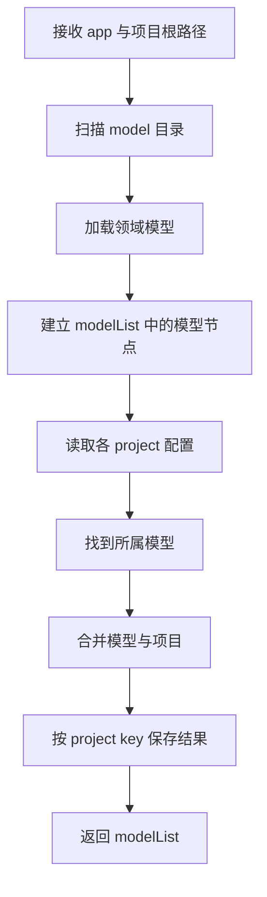
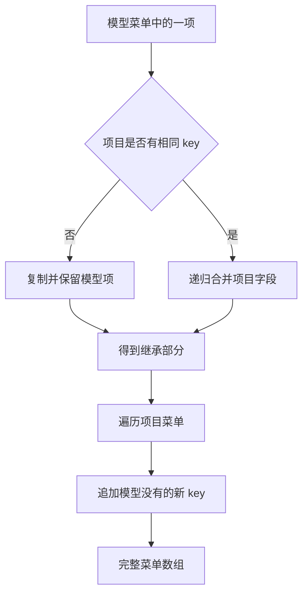

# 领域模型 DSL 解析引擎

<MuxPlayer
  className="mt-8"
  playbackId="nCYyEC4mgj02IIXBsoW521tD8PoA1zWYk2UyBRmORFoA"
  title="领域模型 DSL 解析引擎"
/>

> [!NOTE]
>
> 上节课定义了 Dashboard DSL，这节课把它放进真实目录，并实现 **模型与项目配置的解析引擎**。先用电商和课程管理两个领域、四个项目构造用例，再扫描文件、识别所属模型，输出已经完成继承与扩展的配置。
>
> 本节最重要的部分是合并规则：普通字段可以由项目覆盖，菜单数组则必须按 `key` 查找对应项。模型中已有而项目未修改的内容要保留，同一个 key 的配置要合并，项目新增的菜单要追加。
>
> 最终结果仍然是一份服务端可读取的数据结构。页面渲染与接口输出会在后面继续实现，当前的重点是让目录里的模型和项目变成正确、可消费的运行时配置。

## 先把模型和项目具象化

如果只说“一个模型派生多个项目”，很容易把它理解成几个普通对象。课堂先创建两组有差异的案例，让继承行为可以被具体检查。

第一组是电商领域。模型沉淀商品管理、订单管理和客户管理，下面派生淘宝和拼多多两个示例项目。淘宝增加运营活动，拼多多增加数据分析，还分别覆盖部分菜单的名称或模块类型。

第二组是课程领域。模型沉淀视频管理与用户管理，下面派生抖音课堂与 B 站课堂。抖音课堂增加流量管理，B 站课堂增加课程资料，并修改继承菜单的名称。

这些名称用于表现不同配置之间的关系，不代表课程已经实现这些平台的完整业务系统。

| 领域模型 | 模型中沉淀的共同菜单 | 项目差异示例 |
| --- | --- | --- |
| 电商 | 商品、订单、客户管理 | 运营活动、数据分析、信息查询 |
| 课程 | 视频、用户管理 | 学员流量、PDF / Excel / PPT 资料 |

课程要做的框架，是帮助使用者更快构建这些系统。具体商品规则、订单流程、教学业务等，不是本节的实现目标。

## 用目录表达继承关系

项目根目录新增 `model`，下面按领域放置配置。每个领域有模型文件，以及保存派生项目的 `project` 目录。

```text filename="model 目录约定示意" copy
model
├── index.js
├── business
│   ├── model.js
│   └── project
│       ├── taobao.js
│       └── pdd.js
└── course
    ├── model.js
    └── project
        ├── douyin.js
        └── bilibili.js
```

这套结构直接表达了父子关系。`business/project` 中的项目继承 `business/model.js`；`course/project` 中的项目继承 `course/model.js`。

因此使用者不必在每个项目中反复填写父模型路径。解析器根据所在目录找到模型，这延续了 elpis-core 中“约定大于配置”的思路。

目录名同时提供模型标识，项目文件名提供项目标识。显示名称可以改，内部 key 应保持稳定，否则后面的查询和路由就会找不到原来的应用。

> [!TIP]
>
> 目录层级不仅是代码组织方式，在这套框架里也是输入协议。新增模型、项目时，先遵循目录约定，再检查配置内容。

## 模型只描述共同能力

电商模型先配置三个最常见的入口。因为 Schema 页面尚未实现，课堂把许多模块暂时设为 Custom，并指向待办页面，用来验证数据解析。

```js filename="model/business/model.js：按课堂思路整理" copy
module.exports = {
  template: 'dashboard',
  name: '电商系统',
  menu: [
    {
      key: 'product',
      name: '商品管理',
      menuType: 'model',
      modelType: 'custom',
      customConfig: { path: 'todo' },
    },
    {
      key: 'order',
      name: '订单管理',
      menuType: 'model',
      modelType: 'custom',
      customConfig: { path: 'todo' },
    },
    {
      key: 'client',
      name: '客户管理',
      menuType: 'model',
      modelType: 'custom',
      customConfig: { path: 'todo' },
    },
  ],
}
```

这里的 `todo` 是阶段性的占位目标。大量 Custom 配置并不意味着未来所有页面都要手写；当前只是先把模型解析链路跑通，后面再逐步换成真正的 Schema 模块和业务页面。

模型也不需要知道每一个派生项目的差异。淘宝新增优惠券，并不应直接导致所有电商项目都出现优惠券入口；共性放模型，差异放项目，职责才能稳定。

## 项目配置只写变化部分

淘宝示例包含两类变化。第一类是增加运营活动，使用 Sider 容器再组织优惠券、限量购、节日活动等菜单。第二类是把原有订单管理由 Custom 改成 iframe，用来验证覆盖能力。

```js filename="model/business/project/taobao.js：差异配置示意" copy
module.exports = {
  name: '淘宝',
  description: '淘宝电商系统',
  menu: [
    {
      key: 'order',
      modelType: 'iframe',
      iframeConfig: { path: 'https://example.com/orders' },
    },
    {
      key: 'operating',
      name: '运营活动',
      menuType: 'model',
      modelType: 'sider',
      siderConfig: {
        menu: [
          {
            key: 'coupon',
            name: '优惠券',
            menuType: 'model',
            modelType: 'custom',
            customConfig: { path: 'todo' },
          },
        ],
      },
    },
  ],
}
```

这份配置没有再次写商品管理、客户管理，也没有为订单管理重复写名称和 `menuType`。它表达的是“继承以后，把这些地方改掉”。

合并后，订单管理应保留原来的 key、名称与菜单类型，但实际模块类型变成 iframe；运营活动应出现在原有三个菜单之后。

示意中的外部地址只用于说明字段用途。能否在 iframe 内正常访问，还取决于目标页面本身的嵌入限制，这不是当前配置继承的验证内容。

## 用不同修改方式覆盖合并场景

拼多多示例并不重复淘宝的全部逻辑，而是故意修改商品管理、客户管理的名称，保留其他字段，再新增数据分析和信息查询。数据分析内部还包含电商罗盘和另一项信息查询。

这里放置内外两层查询入口，是为了观察嵌套数组是否按正确层级处理。解析器应该在当前菜单数组中寻找相同 key，不能把所有层级拉平成一个对象后任意互相覆盖。

课程模型的两个项目继续覆盖另一组场景：B 站修改视频、用户菜单的名称并增加资料模块；抖音保留公共菜单，追加流量模块。这样可以同时看到“覆盖”和“完全不覆盖”两种路径。

这些配置相当于手工构造的测试用例。写解析器之前先想清楚输出，可以避免实现过程中凭感觉判断结果。

| 输入变化 | 预期结果 |
| --- | --- |
| 只改菜单名称 | 其余字段从模型继承 |
| 修改模块类型 | 使用项目中的新类型 |
| 增加模型没有的 key | 保留原菜单并追加新菜单 |
| 项目未提到某个菜单 | 原菜单继续存在 |
| Sider 内有多个菜单 | 内层数组保持完整结构 |
| 两个项目继承同一模型 | 一个项目的修改不污染另一个项目 |

## 先确定解析器的输出结构

在 `model/index.js` 中，课堂先明确函数职责与最终返回值，再写扫描逻辑。它接收包含根路径的 `app`，解析模型目录，返回按模型 key 组织的结果。

```js filename="model/index.js：输出结构示意" copy
const modelList = {
  business: {
    model: {
      // 电商领域的原始模型配置
    },
    project: {
      taobao: {
        // 淘宝与电商模型合并后的完整配置
      },
      pdd: {
        // 拼多多与电商模型合并后的完整配置
      },
    },
  },
  course: {
    model: {
      // 课程领域的原始模型配置
    },
    project: {
      douyin: {},
      bilibili: {},
    },
  },
}
```

`project` 使用对象而不是数组，是因为后续需要通过项目 key 直接取配置。这里的 key 与显示名称不是一回事，`taobao` 是检索标识，“淘宝”是展示信息。

保留原模型配置也有意义。调试时可以把模型和继承结果并排比较，确认项目只修改了它声明的部分。

## 扫描目录与提取标识

解析器的外层工作与前面的 Loader 很相似：从 `app.baseDir` 得到 `model` 目录，扫描模型文件和项目文件，再由路径识别所属层级。

课堂用文件扫描工具与 `path` 处理目录，并用路径匹配提取 model key、project key。对于模型文件，关键是模型目录名；对于项目文件，需要同时识别 `model` 与 `project` 之间的目录，以及 `project` 后面的文件名。

```text filename="路径与标识对应关系" copy
model/business/model.js
      └ business 是 model key

model/business/project/taobao.js
      └ business 是 model key
                       └ taobao 是 project key
```

下面用 `path` 方法表达同一处理思路，便于说明输入输出；它是整理后的示意，不是字幕中路径正则的逐字还原。

```js filename="提取目录标识示意" copy
const path = require('path')

function getProjectKeys(modelRoot, filePath) {
  const relativePath = path.relative(modelRoot, filePath)
  const parts = relativePath.split(path.sep)
  return {
    modelKey: parts[0],
    projectKey: path.basename(filePath, '.js'),
  }
}
```

扫描阶段就应该检查提取结果。若 model key 多出斜杠、project key 包含 `.js`，后面即使合并算法正确，也会把配置挂到错误位置。

课程沿用不同操作系统的路径分隔符处理思路。正则里的转义、文件后缀与目录边界容易出错，因此课堂多次打印匹配结果，再继续下一步。

## 模型先就绪，再处理项目

项目的合并依赖原模型已经可用。无论扫描函数按什么顺序返回文件，组织逻辑都应该保证合并时能够找到对应模型。

按这个依赖关系，流程可以整理为：



这里的解析工作发生在服务端。项目配置可以保留为开发者容易编写的结构，解析器负责把继承关系提前处理掉。后面的接口和页面不必重复猜测一个字段究竟来自模型还是项目。

## 普通字段覆盖不等于菜单数组覆盖

模型和项目都可能存在 `name`。最终应用应展示项目名，因此项目中的普通字段可以覆盖模型值。

菜单则不能直接用浅拷贝覆盖。假设模型有商品、订单、客户三个菜单，项目只写了一项订单修改，若直接覆盖整个 `menu` 数组，另外两个菜单就丢失了。

同样，简单数组拼接也不正确：订单菜单会同时出现两份，一份旧配置，一份新配置。

```js filename="两种不能表达需求的合并方式" copy
// 浅覆盖：会丢掉项目没有重复声明的菜单
const shallowResult = { ...modelConfig, ...projectConfig }

// 拼接：同一个 key 可能产生两份菜单
const concatenatedMenu = [
  ...modelConfig.menu,
  ...projectConfig.menu,
]
```

通用深合并工具能够处理对象层级，却不知道数组里的 `key` 是业务标识。它可能按索引合并或采用其他默认规则，无法自动推断“项目第二项应该覆盖模型第一项”。

因此，本节在使用合并工具的基础上，重点增加针对数组的自定义处理。字幕中具体代码段存在较多重复识别，但结尾明确验证了按 key 继承、覆盖和新增这三种行为。

## 菜单按 key 合并的三个步骤

第一步遍历模型菜单。对于每一项，去项目菜单中查找相同 key。如果找不到，保留模型项。

第二步处理找到的项。把项目声明的变化递归合并进模型项，这样只改名称时还能保留模块类型，只改模块类型时还能保留名称。

第三步遍历项目菜单。若某一项的 key 不存在于模型菜单，则把它追加到结果中。



下面的函数仅演示菜单数组层面的业务规则。`mergeNode` 代表能够继续处理嵌套对象和菜单数组的合并函数，`clone` 代表深复制能力。

```js filename="菜单数组合并：按课堂思路整理" copy
function mergeMenu(modelMenu, projectMenu, mergeNode, clone) {
  const result = modelMenu.map((modelItem) => {
    const projectItem = projectMenu.find(
      (item) => item.key === modelItem.key,
    )
    return projectItem
      ? mergeNode(modelItem, projectItem)
      : clone(modelItem)
  })

  projectMenu.forEach((projectItem) => {
    const exists = modelMenu.some(
      (modelItem) => modelItem.key === projectItem.key,
    )
    if (!exists) result.push(clone(projectItem))
  })

  return result
}
```

这样会保留模型菜单原有顺序，再追加项目新增项，符合课堂展示结果。它没有定义删除、显式排序或重复 key 冲突的额外协议；如果未来需要这些能力，应继续扩展 DSL，而不是把“项目没写某项”解释成删除。

## 递归合并需要明确数组语义

本节强调递归，是因为 Sider 配置和菜单分组里还有菜单数组。只处理最外层 `menu`，内层结构仍可能被整个替换。

但是“所有数组都按 key 合并”也不天然成立。菜单项有 key，普通字符串数组或枚举数组不一定有。整理算法时，应把适用对象说清楚：本节主要针对当前 DSL 中以 key 标识的菜单配置。

```text filename="递归关注的结构" copy
项目配置
└── menu
    └── sider 模块
        └── siderConfig
            └── menu
                └── 具体模块配置
```

另外，不能原地修改共享模型。两个项目都引用同一个基础对象时，如果合并淘宝后模型已经被改成淘宝配置，再合并拼多多就会产生交叉污染。

课堂最终会分别查看 model 和 project 的输出，这也是检查这一问题的有效方式：原模型仍应是最初的商品、订单、客户配置，每个项目拥有独立的合并结果。

## 逐项目检查运行结果

解析代码写完后，课程运行并观察输出，先处理依赖缺失问题，再核对四个项目。这里的依赖报错与算法错误应分开看：模块未能加载时，还没有真正进入业务合并验证。

随后课堂发现拼多多配置里残留了淘宝名称，这是复制配置时忘记修改造成的。这个例子说明，即使代码运行正常，也必须核对业务数据本身。

电商结果重点检查：拼多多的商品与客户名称被修改，订单保持原样，数据分析和外部查询被新增；淘宝的订单变成 iframe，商品与客户保持继承，运营活动被追加。

课程结果重点检查：B 站的名称覆盖生效，课程资料包含 PDF、Excel、PPT；抖音保留视频和用户管理，并新增学员流量。

这些检查比只打印“解析完成”更有价值。每个结果都对应实现前定义的一条预期，能证明新增、继承和覆盖确实同时成立。

## 当前能力的边界

解析引擎完成后，使用方可以引入 `model/index.js`，得到按模型和项目组织的配置。它还没有把配置直接变成 Vue 页面，也没有在这里创建数据库或生成全部业务接口。

下一步会把这个结果接入 BFF 的 Service 和 Controller，再输出应用列表。后续进入某个应用时，才会根据项目模板选择 Dashboard 页面，并由前端模板消费菜单与模块配置。

这个分层可以避免让一个函数同时处理文件扫描、业务接口、路由渲染和 DOM 展示。每层都有清晰输入输出，也能在出错时缩小排查范围。

## 本节小结

本节把 Dashboard DSL 落到 `model` 目录，用电商与课程管理两个模型、四个派生项目验证领域复用。解析器依据目录识别 model key 与 project key，组织成可供服务端使用的模型列表。

继承的核心不在文件读取，而在合并语义。普通字段由项目覆盖，菜单按 key 找到对应项并递归合并；未修改的模型项保留，项目新增项追加，而且各项目不能互相污染。

有了这一层，使用者可以只填写项目差异，接口与页面拿到的则是完整配置。后面的课程将沿着这份输出继续实现模型应用。
