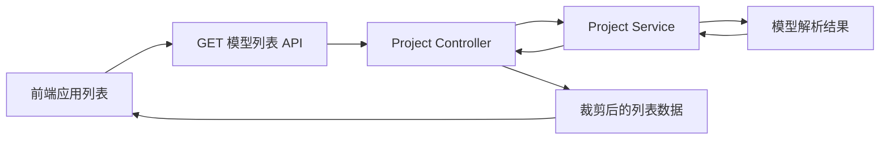

# 模型应用 - API 实现

<MuxPlayer
  className="mt-8"
  playbackId="J02EVbDxaeFrxh011gLlv00t1op8AEehVw00JwIHDJ2CWFc"
  title="模型应用 - API 实现"
/>

> [!NOTE]
>
> 上节课已经把领域模型和派生项目合并成结构化配置。本节开始提供 **模型应用列表 API**，让前端能够展示模型分类以及每个分类下的应用入口。
>
> 实现沿用 elpis-core 的分层：Router 接收请求，Controller 按列表页需要裁剪字段，Service 提供底层模型数据。完整配置不会直接作为列表接口响应返回。
>
> 后半节重点补上接口验证。课程使用 Mocha、Node.js 的 `assert` 与 Supertest 发起带签名的请求，在保留中间件的情况下检查响应，避免每次调试都临时注释签名校验。

## 从内存配置走向可访问接口

上一节得到的 `modelList` 只在服务端可用。前端应用列表需要通过 HTTP 获取数据，才能把电商、课程等领域显示出来，并为淘宝、拼多多、抖音课堂、B 站课堂等示例项目提供入口。

这一步要解决的不是页面排版，而是先建立稳定的数据协议。接口可独立验证以后，前端只需要消费约定字段，不再关心文件从哪里扫描、模型怎样继承。

课堂先清理之前验证 Loader 和解析器时留下的示例路由、Controller、Service 与临时输出。这样正式接口的调用链更清楚，也避免测试接口与业务接口同名。

清理的目的是移除阶段性调试代码，现有的路由加载、统一响应和签名机制仍然保留。



## 以资源和请求方式定义接口

课堂把接口放到 `/api/project` 这一组路径下，以 GET 方法获取模型列表，后续示例调用使用 `/api/project/model_list`。

`/api` 前缀并非装饰。前面服务端已经按照路径组织 API 请求与页面请求，一些签名和响应处理逻辑也依赖这一约定，所以新增接口要进入已有的处理链路。

```text filename="本节接口约定" copy
GET /api/project/model_list

请求用途：获取应用列表需要的模型与项目元信息
请求参数：当前阶段没有业务查询参数
响应主体：按模型分组的应用列表
```

课堂再次说明 RESTful 的基本思路：把 URL 对应的对象视为资源，通过 HTTP 方法区分获取、新增、修改和删除。这里需要读取数据，因此使用 GET，而不是所有操作都使用 POST。

当前路径仍按课程实现保留。复盘重点是资源与动作的职责划分，不需要为了引入另一套命名风格而改写课堂接口。

| 方法 | 课堂约定的基本用途 |
| --- | --- |
| GET | 获取数据 |
| POST | 新增数据 |
| PUT | 修改数据 |
| DELETE | 删除数据 |

## 接入 Router 与 Controller

Router 的职责是把 URL 和请求方式连接到处理方法。当前没有查询条件，参数规则可以保持简单，但仍然遵循项目已有 Router Schema 与 Router 的组织方式。

```js filename="Project 路由：按课堂思路整理" copy
// 省略当前项目中已有的路由导出包装。
router.get(
  '/api/project/model_list',
  projectController.getModelList,
)
```

Controller 方法接收请求上下文，调用 Project Service 读取结构化配置，再生成供列表页使用的返回值。

```js filename="app/controller/project.js：职责示意" copy
async function getModelList(ctx) {
  const modelList = await projectService.getModelList()
  const result = buildModelListDTO(modelList)
  ctx.body = result
}
```

这里的 `projectService`、函数包装方式和 `ctx.body` 赋值，应接入前面内核已经建立的服务注入与响应机制。代码用于展示处理关系，不应额外再包一层与现有中间件重复的 `success` 对象。

这也是复用基础设施的意义：业务 Controller 只处理本接口需要的数据，最终响应中的通用字段交给既有机制统一处理。

## Service 保留基础数据能力

Service 中的 `getModelList` 负责返回模型配置。它处于更底层，后续可能被列表接口、应用详情接口以及其他能力复用。

因此，Service 不应该因为当前列表页面只显示几个字段，就把完整配置中的菜单和模块永久删掉。否则下一个调用方需要详情时，又不得不重新扫描文件或者增加一套重复逻辑。

```js filename="app/service/project.js：职责示意" copy
function getModelList() {
  return modelList
}
```

示例中的 `modelList` 表示上一节解析器产出的数据。它如何在服务初始化时引入，应沿用当前项目的 Loader 和模块初始化约定。

Service 返回完整领域配置，Controller 选择当前接口需要的投影，两层有明确分工。

| 层次 | 本节承担的工作 |
| --- | --- |
| 模型解析器 | 读取文件，合并模型与项目 |
| Service | 提供模型列表这一基础能力 |
| Controller | 选择列表页字段，组织响应结构 |
| Router | 将请求分发到 Controller |
| 中间件 | 承担签名、通用响应等横向能力 |

## 为什么列表接口不能返回全部配置

完整项目配置可能包含菜单层级、Schema、接口地址和组件描述。应用列表只需要展示名称、说明、图标等信息，并保存后续跳转所需标识。

如果整个配置直接输出，一方面传输体积大，另一方面接口暴露了当前页面根本不需要的内部信息。更重要的是，前端容易直接依赖偶然出现的字段，造成后续协议难以维护。

因此，课堂在 Controller 中构造 DTO，也就是为当前接口整理出来的数据对象。这里无需把 DTO 理解成复杂的独立框架，它首先是一种明确选择字段的做法。

```text filename="完整配置与列表数据的区别" copy
完整项目配置
├── template
├── name / description / icon / homePage
├── menu
│   ├── modelType
│   ├── schemaConfig
│   └── siderConfig
└── 其他模板运行所需配置

应用列表数据
├── model：领域标识与展示信息
└── project：项目标识与展示、跳转信息
```

列表需要哪些字段，就有意识地挑选哪些字段。以后页面新增一个真实需求，再同步调整 Controller 和测试，比把所有数据一次性暴露出去更容易保持边界。

## 把模型映射转换为列表结构

解析器的输出按模型 key 组织，便于服务端查找；页面则更适合遍历数组，逐组展示模型与项目。

课堂使用 `reduce` 构造新的返回值。它的思想与“先定义结果数组，再循环 push”相同，只是把初始值与累积过程放进一个表达式里。

```js filename="模型列表 DTO：按课堂思路整理" copy
function buildModelListDTO(modelList) {
  return Object.keys(modelList).reduce((result, modelKey) => {
    const item = modelList[modelKey]
    const model = item.model

    const dtoModel = {
      key: modelKey,
      name: model.name,
      description: model.description,
    }

    const dtoProject = Object.keys(item.project).reduce(
      (projects, projectKey) => {
        const project = item.project[projectKey]
        projects[projectKey] = {
          key: projectKey,
          name: project.name,
          description: project.description,
          icon: project.icon,
          homePage: project.homePage,
        }
        return projects
      },
      {},
    )

    result.push({ model: dtoModel, project: dtoProject })
    return result
  }, [])
}
```

代码是围绕课堂说明整理的示意。关键在于模型与项目都带稳定标识，并且只返回列表使用的字段；不是要求所有项目在当前阶段都已经配置图标或首页。

## 两次 reduce 对应两个层级

第一层 `reduce` 的初始值是数组，它把每个领域转成一组页面数据。第二层的初始值是对象，它保留项目 key 到项目元信息的映射。

```js filename="列表响应中的 data 示意" copy
[
  {
    model: {
      key: 'business',
      name: '电商系统',
    },
    project: {
      taobao: { key: 'taobao', name: '淘宝' },
      pdd: { key: 'pdd', name: '拼多多' },
    },
  },
]
```

每层回调末尾都要返回累积器。漏掉外层 `return result`，下一轮无法继续累积；漏掉内层 `return projects`，项目映射就会出问题。

课堂强调先把代码骨架写出来：取模型和项目、构造模型关键数据、构造项目关键数据、放入结果、返回累积器。先明确步骤，再填字段，比边写边改变目标更容易看清数据流。

`reduce` 只是表达这种转换的一种方式。真正需要掌握的是输入对象、输出数组和内部项目映射之间的关系，而不是为了使用某个方法把简单逻辑写复杂。

## 第一次联调暴露了两个不同问题

接口写好后，课堂先尝试在浏览器里访问。第一个反馈是签名校验失败，因为手动打开 URL 没有携带客户端正常请求时的签名信息。

随后为了观察结果临时调整中间件，又出现 302 跳转。沿着路由查找后发现，请求没有进入预期 Controller，而落到了前面配置的页面兜底逻辑；保存相关文件并重新启动后，路由才按预期工作。

这两个现象要分开判断。

| 现象 | 先检查什么 |
| --- | --- |
| 签名校验不通过 | 请求头、时间戳、签名规则是否一致 |
| 302 跳到首页 | URL、路由注册、文件保存与服务重启 |
| 接口返回但字段不对 | Controller 的 DTO 构造与输入配置 |
| 服务根本无法启动 | 依赖、语法和端口占用 |

不能看到接口没返回预期数据，就直接修改模型合并代码。先判断请求停在哪一层，才能缩小范围。

## 保留中间件，用测试客户端构造请求

课堂随后把临时调整恢复，介绍更可重复的验证方式：使用测试程序模拟客户端，按照项目既有签名规则发出请求。

临时注释签名检查有两个问题。第一，忘记恢复后可能把缺少保护的代码提交出去。第二，肉眼看一遍输出不等于建立了可重复的验证，下次修改其他接口后，还得重新手工检查。

这里引入三种工具：

| 工具 | 本节用途 |
| --- | --- |
| Mocha | 组织测试场景和测试用例 |
| Node.js `assert` | 判断结果是否满足预期 |
| Supertest | 对 HTTP 服务发起测试请求 |

它们各有职责。Mocha 决定运行哪些用例，Supertest 发出请求，assert 检查响应。签名仍由测试代码按现有规则构造，服务端中间件照常执行。

## 建立与业务目录对应的测试目录

根目录新增 `test`，本节选择按 Controller 模块组织测试。

```text filename="测试目录示意" copy
test
└── controller
    └── project.test.js
```

以后 Project 相关接口可以继续放进同一个测试场景，通用 Service 则可以建立对应的 Service 测试文件。目录结构尽量与被验证的业务结构对应，便于定位。

Mocha 中，`describe` 描述一组场景，`it` 描述其中的一条用例。课堂先建立 Project 接口场景，再启动服务并验证模型列表。

```js filename="test/controller/project.test.js：场景结构示意" copy
const assert = require('assert')
const supertest = require('supertest')

// elpisCore 与签名工具沿用当前项目中的实际模块。
describe('Project 相关接口', function () {
  this.timeout(60 * 1000)

  it('获取模型与项目列表', async function () {
    // 1. 取得 Koa app 并建立测试请求客户端
    // 2. 按签名中间件规则设置请求头
    // 3. 请求模型列表接口
    // 4. 对响应进行断言
  })
})
```

场景函数使用普通函数，是为了使用 Mocha 提供的 `this.timeout`。这里适当放宽超时，是考虑到服务初始化也包含在验证流程中。

## 让内核返回 Koa app

前面的 `elpisCore.start` 负责启动服务，但没有把 Koa 实例返回给调用者。测试需要拿到这个实例，才能交给 Supertest 建立请求客户端。

因此课堂在 `start` 末尾增加返回 app 的能力。

```js filename="elpis-core/index.js：返回实例示意" copy
function start(options = {}) {
  const app = createAndInitializeApp(options)
  // 保留课程中已有的服务启动逻辑。
  return app
}
```

`createAndInitializeApp` 在这里是说明性名称，代表前面已经实现的创建 Koa、挂载配置和运行 Loader 的过程，不是本节要求新增的真实 API。

课堂通过 `app.listen()` 配合 Supertest 模拟请求。实际整理测试时，要区分已经监听的服务与为了测试创建的监听句柄，避免重复占用同一端口，并在测试结束时关闭自己创建的服务句柄。

课程运行测试时也遇到原开发服务仍在运行的问题，停止冲突的进程后才继续。这属于测试环境准备，不应被误判成列表接口失败。

## 签名必须复用已有协议

测试请求要带上签名所需时间信息与摘要。课堂使用前面项目已有的 MD5 签名规则，不在测试里另造一种算法。

```js filename="签名请求步骤示意" copy
const timestamp = Date.now()
const headers = buildHeadersByExistingSignRule(timestamp)

const response = await request
  .get('/api/project/model_list')
  .set(headers)
```

`buildHeadersByExistingSignRule` 是用于说明职责的占位函数。真正的请求头名称、拼接顺序、密钥来源和摘要方式，应与本项目签名中间件一致。

这里不列出一个凭空推断的签名表达式，是因为只要其中一个细节不一致，请求就会被拒绝。复盘时应直接对照前面已实现的客户端签名逻辑，而不是复制一个看上去相似的 MD5 调用。

## 断言接口契约，不把样例数量写死

请求成功后，先检查统一响应中的成功标记，再检查 `data`。课堂通过故意把成功预期写反，观察断言失败信息，确认测试确实能够发现不符合预期的结果。

```js filename="模型列表响应断言示意" copy
assert.strictEqual(response.body.success, true)

const data = response.body.data
assert.ok(Array.isArray(data))
assert.ok(data.length > 0)

for (const item of data) {
  assert.ok(item.model)
  assert.ok(item.model.key)
  assert.ok(item.model.name)
  assert.ok(item.project)

  for (const projectKey of Object.keys(item.project)) {
    const project = item.project[projectKey]
    assert.ok(project.key)
    assert.ok(project.name)
  }
}
```

当前已有两种模型，但课堂不把长度断言为 2。将来新增模型是正常变化，不应该因此使“接口结构正确”这条测试失败。

名称和 key 是页面展示与跳转所需的关键字段，因此需要检查。描述等可选信息可以缺省，不必把所有字段都强制成必填。

这组断言成立的前提是课程的样例模型目录确实存在至少一项。如果未来允许空目录，应为该场景单独定义预期，不能把当前样例测试当成所有部署状态的通用约束。

## 把测试变成后续修改的回归入口

课堂在 `package.json` 中增加测试命令，由 Mocha 扫描 `test` 下的测试文件，并设置本地环境。不同系统设置环境变量的语法有所差别，应沿用项目已经采用的方式。

测试的价值不只是“现在能请求到数据”。后面修改 Loader、统一响应或 Project Service 时，都可能影响这个接口。再次运行用例，就能够确认关键结构是否仍然成立。

需要临时查看响应时，也可以在测试文件里打印 `response.body` 或 `response.body.data`。观察完再移除输出，仍然不必修改业务中间件。

至此，一条完整接口链路应当同时具备路由定义、必要参数约定、Controller 的数据组织、Service 的数据读取，以及能够独立发起请求的验证用例。

## 本节小结

本节把模型解析结果接入 BFF，提供应用列表所需的模型与项目信息。Service 保留基础数据能力，Controller 显式裁剪字段，并把服务端映射转换为前端容易消费的列表结构。

接口验证使用 Mocha、assert 与 Supertest，保留签名中间件，通过构造正常请求来检查返回值。调试中需要区分签名失败、路由兜底、文件未保存和端口冲突，不能把所有现象都归因于业务逻辑。

完成这一步后，前端不必等待完整模板实现，就能开始根据接口数据展示模型应用入口。下一节将把这份数据真正渲染到页面中。
