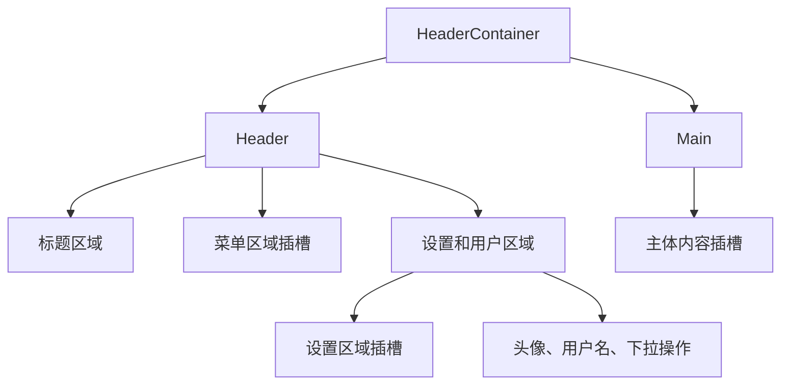
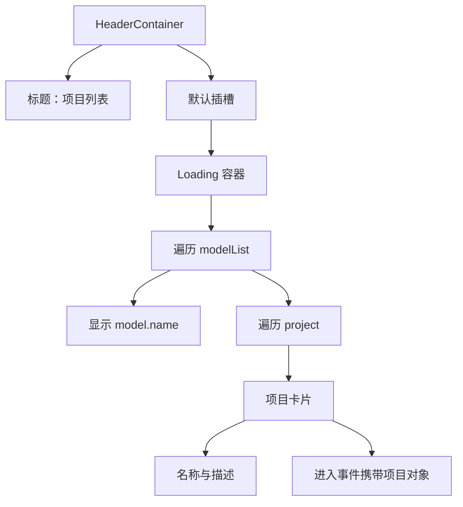

# 模型应用 - 页面实现

<MuxPlayer
  className="mt-8"
  playbackId="aGtgeeKqGUYVKAwCRBBEWpVoDTeFOBmDd02YC8kEksg4"
  title="模型应用 - 页面实现"
/>

> [!NOTE]
>
> 本节把上一节的模型列表接口接到 Vue3 页面，完成第一个能看见的 **项目列表页**。页面按领域模型分组，以卡片展示每个派生项目的名称和说明。
>
> 实现分为两块：先沉淀可复用的 `HeaderContainer`，提供标题、用户区域和插槽；再在 `project-list` 页面请求模型数据，组织分组、卡片、加载状态与进入按钮。
>
> 本节的进入按钮仍然只是打印对应项目，真正进入 Dashboard 应用的路由链路留到后面实现。这里验证的是接口数据是否正确映射到页面，以及公共容器能否承接后续扩展。

## 先建立独立页面入口

前面的工程化已经支持按页面生成入口。应用列表不是 Dashboard 内部的某个模块，而是进入各个应用之前的独立页面，因此需要自己的页面组件和 entry。

课堂新增 `project-list` 页面，同时在 entry 目录增加对应的入口文件，让构建流程能够识别它。

```text filename="项目列表页面结构示意" copy
前端源码目录
├── entry
│   └── project-list.js
├── pages
│   └── project-list.vue
└── components
    └── header-container
        └── index.vue
```

具体路径应接到前面工程化已经约定的目录中。这里关注的是职责对应：入口负责创建与挂载应用，页面负责项目列表业务，公共组件负责可复用的布局。

课堂同时清理之前的测试页面内容，并把界面调整为深色模式。深色主题属于展示选择，不能替代功能验证；数据、布局和事件仍然需要逐步接通。

```js filename="页面入口示意" copy
import { createApp } from 'vue'
import ProjectList from '../pages/project-list.vue'

const app = createApp(ProjectList)
// Element Plus 与公共样式沿用前面工程化中的接入方式。
app.mount('#app')
```

如果项目已经封装了统一初始化函数，应复用现有入口逻辑，而不是在这个页面重新注册所有插件。

## HeaderContainer 的职责从布局推导

项目列表页首先需要一个公共外壳。课堂把它分成头部与主体，头部又分为左、中、右三个部分。

左侧显示应用图标与标题，中间预留菜单，右侧容纳设置、应用切换与用户操作。主体则显示具体页面内容。



这种拆分来自后续使用场景。项目列表没有业务菜单，但 Dashboard 会有；右上角当前只有用户信息，以后还要加入应用切换等功能；主体区域既可能是卡片列表，也可能是整个模板视图。

如果把这些内容全部写死在容器里，公共组件会很快和某一个页面绑定。使用插槽后，容器负责稳定布局，外部页面填充变化内容。

## 区分 prop 与 slot

标题适合通过 prop 传入，因为它是一个明确的值；菜单和业务主体适合通过 slot 传入，因为它们可能包含复杂结构和交互。

课堂使用标题参数，并为菜单、设置和主体提供插槽。按这一思路，组件骨架可以整理为：

```vue filename="HeaderContainer：结构示意" copy
<template>
  <el-container class="header-container">
    <el-header class="header">
      <div class="title-panel">
        
        <span class="title">{{ title }}</span>
      </div>

      <div class="menu-panel">
        <slot name="menu-container" />
      </div>

      <div class="setting-panel">
        <slot name="setting-container" />
        
        <span class="username">{{ userName }}</span>
      </div>
    </el-header>

    <el-main class="main-container">
      <slot />
    </el-main>
  </el-container>
</template>

<script setup>
defineProps({
  title: { type: String, default: '' },
})
// logo、avatar 与 userName 在实际组件中按课程资源接入。
</script>
```

这段代码省略了下拉操作和资源导入，重点展示三个扩展位置与布局层级。插槽名称要与实际使用处保持一致，不能定义一个名称、调用时又写成另一个名称。

组件接收标题后，页面需要真正传入。课堂调试标题不显示时，回到使用位置补充正确的 title 传值，再检查渲染结果。

## 用户区域先搭交互结构

右上角用户区域包含头像、用户名和下拉箭头。下拉中先加入退出登录项，未来可以继续增加其他默认操作。

这里使用 Element Plus 下拉组件自身提供的插槽。公共容器对外提供 slot，容器内部也消费 UI 组件的 slot，两种插槽处于不同层次。

```vue filename="用户下拉区域示意" copy
<el-dropdown @command="handleUserCommand">
  <span class="username">
    {{ userName }}
    <span class="arrow">⌄</span>
  </span>
  <template #dropdown>
    <el-dropdown-menu>
      <el-dropdown-item command="logout">
        退出登录
      </el-dropdown-item>
    </el-dropdown-menu>
  </template>
</el-dropdown>
```

```js filename="用户区域状态与事件示意" copy
import { ref } from 'vue'

const userName = ref('管理员')

function handleUserCommand(command) {
  console.log('用户操作：', command)
}
```

当前用户名是占位值，退出登录也只是事件入口，并没有在这节接入登录态或完成注销流程。把这些边界说清楚，才能准确判断当前组件完成到了哪一步。

点击事件能够触发，说明组件交互已经接通；它不等于认证流程已经可用。

## 先完成结构，再逐步调整样式

课堂特意展示从空组件到可用布局的过程：先写容器层级，再补标题、插槽与用户下拉，发现模板需要变量后再补脚本，最后沿着结构编写样式。

这样做的好处是每个样式名都能对应一个明确区域。`title-panel` 负责左侧，`menu-panel` 负责中间，`setting-panel` 负责右侧，后续排查也可以按区域定位。

```css filename="HeaderContainer 样式思路示意" copy
.header {
  display: flex;
  align-items: center;
  height: 60px;
}

.title-panel,
.setting-panel {
  display: flex;
  align-items: center;
}

.menu-panel {
  flex: 1;
  min-width: 0;
}

.setting-panel {
  margin-left: auto;
}

.avatar {
  width: 32px;
  height: 32px;
  border-radius: 50%;
}

.username {
  cursor: pointer;
  line-height: 60px;
}
```

这里的尺寸是帮助理解布局的示意，不是对课堂画面像素的逐项复刻。头像设成圆形要使用 `border-radius: 50%`，元素是否正常居中，则应检查父容器布局与高度。

深色模式还需要配套的主题样式。只在根元素设置暗色标识，而不引入相应主题变量，UI 组件不会自动变成预期效果。

## 页面业务从数据开始

公共容器完成后，课程进入 Project List。此时重点顺序发生变化：先请求数据，观察真实返回结构，再按数据形状写模板。

这是因为接口已经规定，每一项包含 `model` 与 `project`。如果先凭想象写一套数组结构，接接口时还要额外转换，容易把层级弄错。

```js filename="project-list.vue：请求流程示意" copy
import { onMounted, ref } from 'vue'

const modelList = ref([])
const loading = ref(false)

async function loadModelList() {
  loading.value = true
  try {
    const response = await requestModelList()
    modelList.value = response.data
  } finally {
    loading.value = false
  }
}

onMounted(loadModelList)
```

`requestModelList` 在这里表示前面已封装的带签名请求能力。实际接入时要确认请求封装返回的是整个 HTTP 响应、业务响应体，还是已解包的 data，不能凭示意代码再多取或少取一层。

课堂拿到的数据包含模型和项目，说明从文件配置、解析器、Service、Controller 到浏览器的链路已经贯通。

## Loading 表达异步请求状态

列表数据来自接口，在响应到达之前页面需要加载反馈。课堂在内容外层使用 `v-loading`，并专门观察加载效果是否出现、是否消失。

```vue filename="列表加载容器示意" copy
<HeaderContainer title="项目列表">
  <div v-loading="loading" class="project-list-page">
    <!-- 模型分组与项目卡片 -->
  </div>
</HeaderContainer>
```

状态与请求生命周期对应：请求前开启，结束后关闭。若只在成功分支关闭，异常时遮罩可能一直存在，因此整理示例使用 `finally` 表达收尾职责。

Loading 不是判断请求成功的依据。遮罩消失只能说明流程结束，是否得到正确列表仍要查看数据和错误处理。本节主要验证正常请求场景，统一错误反馈可继续复用前面请求层的约定。

## 第一层循环展示模型

外层遍历 `modelList`。每个元素是一组领域数据，先展示模型名称，再展示它的项目。

```vue filename="领域模型分组示意" copy
<section
  v-for="item in modelList"
  :key="item.model.key"
  class="model-section"
>
  <div class="model-panel">
    <h2 class="title">{{ item.model.name }}</h2>
    <div class="divider" />
  </div>

  <div class="project-list">
    <!-- 当前模型下的项目 -->
  </div>
</section>
```

这里使用 `item.model.key` 作为渲染标识，对应上一节接口测试中必须存在的字段。名称用来展示，key 用来识别，两者不能互相代替。

模型标题和分隔线组成一个明确的分组区域。页面上出现“电商系统”和“课程系统”以后，就可以先确认外层数据没问题，再继续处理内部卡片。

这种逐层验证比一次写完所有模板再找错误更直接。如果标题重复，先检查外层数据与 key；如果标题正确而卡片错位，再检查内层 project。

## 第二层循环展示项目卡片

`item.project` 是按项目 key 组织的对象。Vue 的 `v-for` 可以遍历对象值，每一个值对应一张项目卡片。

卡片又分成三块：头部显示名称，中间显示描述，底部显示进入按钮。

```vue filename="项目卡片结构示意" copy
<el-card
  v-for="project in item.project"
  :key="project.key"
  class="project-card"
>
  <template #header>
    <span class="title">{{ project.name }}</span>
  </template>

  <div class="content">
    {{ project.description || '-' }}
  </div>

  <div class="footer">
    <el-button @click="onEnter(project)">进入</el-button>
  </div>
</el-card>
```

课堂通过 Card 的区域结构组织内容。示意将底部写成普通容器，不假定课程所用组件版本具备某个新增插槽；需要使用组件插槽时，以项目当前版本支持的接口为准。

描述缺省时使用横杠占位，使卡片仍然有稳定结构。标题则是关键展示信息，上一节已经通过接口断言检查它存在。

## 卡片布局服从内容结构

课堂给项目列表设置左右留白，卡片之间保留横向与纵向间距，每张卡片保持固定宽度，标题强调显示，描述区域限制高度并允许滚动。

```css filename="项目卡片样式思路示意" copy
.project-list {
  display: flex;
  flex-wrap: wrap;
  gap: 20px 30px;
  margin: 0 50px;
}

.project-card {
  width: 300px;
}

.project-card .title {
  font-size: 17px;
  font-weight: bold;
}

.project-card .content {
  min-height: 70px;
  max-height: 100px;
  overflow: auto;
}

.project-card .footer {
  display: flex;
  justify-content: flex-end;
}
```

这些样式服务于几个具体目的：多个项目能横向排列，空间不够时换行；不同描述长度不至于让按钮位置差异过大；进入动作在卡片底部容易找到。

颜色、间距和字号可以调整，但不要在样式调试中掩盖数据层问题。例如卡片名称重复，应检查项目配置是否复制后忘记改名，而不是通过隐藏文字“修复”。

## 进入按钮先确认项目绑定正确

本节的点击逻辑仍然很简单：传入当前项目，输出它的名称。课堂原本想使用首页字段，但当前示例首页尚为空，所以先用名称验证绑定。

```js filename="本节进入事件示意" copy
function onEnter(project) {
  console.log(`跳转到 ${project.name}`)
}
```

依次点击拼多多、淘宝、抖音课堂、B 站课堂，打印结果应与卡片一致。这样可以确认内层循环的项目对象没有串用，事件也没有错误地捕获外层模型。

这里并没有完成真实页面跳转。后续需要确定模板入口、项目标识与首页路径，再把这些信息组成完整地址。

> [!IMPORTANT]
>
> “按钮能触发”与“能进入应用”是两个阶段。本节完成前者，后面的 Dashboard 模板课程继续完成后者。

## 用组件边界重新看整页

最终页面可以分成两层。HeaderContainer 沉淀通用外壳，Project List 通过默认插槽填入自己的业务区域。

业务区域内部又和接口结构一一对应：加载容器包住列表，模型循环生成分组，项目循环生成卡片，卡片中的按钮绑定当前项目。



这个结构也为后面复用容器做好准备。Dashboard 可以继续使用同一个 HeaderContainer，只是填入菜单插槽、应用切换插槽与不同的主体视图。

## 提交前检查运行代码与设计文档

课堂最后运行规范检查，发现 `docs` 中的 DSL 描述文件触发错误。设计文档可能包含占位描述，它并不一定是可执行源码，因此课程调整检查范围，将这类文档目录排除在当前源码校验之外。

这个处理有明确前提：确认文件确实承担描述用途。真正运行的页面、组件和解析器仍然需要通过检查，不能遇到报错就把整个业务目录排除。

随后课程回顾本次分支包含的三项工作：DSL 描述、DSL 解析器、项目列表页面，并按前面的协作流程检查改动、提交和合并回 `develop`。

文档复盘到这里，应当能够分别说清数据从哪里来、接口返回什么、页面如何循环，以及哪些按钮只是阶段性占位。

## 本节小结

本节完成项目列表页，把模型应用 API 的数据按领域分组，以卡片展示派生项目。页面具备加载状态、名称与描述显示，以及能够识别当前项目的进入事件。

公共 HeaderContainer 沉淀标题、头像、用户下拉与布局，同时提供菜单、设置和主体插槽。它把稳定外壳与页面业务分开，为后面 Dashboard 的头部实现打下基础。

当前已打通“模型文件 → 解析器 → API → 列表页面”的链路。应用内部菜单、模板入口和真实跳转仍需继续实现，下一阶段会把列表中的项目真正接入 Dashboard。
