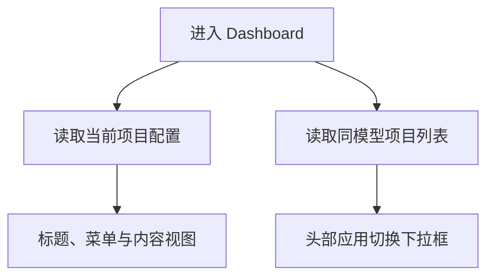

# 模板引擎 - dashboard 应用列表接口实现

<MuxPlayer
  className="mt-8"
  playbackId="NFKSqThWd3FOAAAWTxlO3EaMM94LC4OL5uKeMJnGFR00"
  title="模板引擎 - dashboard 应用列表接口实现"
/>

> [!NOTE]
>
> 从本节开始进入 Dashboard 模板页面的开发。项目列表已经能展示各个应用，接下来进入某个应用后，需要读取当前项目配置，并在头部支持同一领域模型下的应用切换。
>
> 本节先完成其中的 **应用列表接口**：不传 `projectKey` 时获取全部项目，传入时获取该项目所属模型下的同级项目。Controller 只输出切换列表需要的关键字段。
>
> 课程用两组测试分别验证有参数与无参数的分支，并实际发现了项目配置缺少 `modelKey`、测试选值错误以及 `reduce` 分支没有返回累积器等问题。接口的设计、实现和验证在这一节形成完整闭环。

## Dashboard 需要两类数据

前面的 Project List 是独立入口页，它展示所有领域模型与应用。Dashboard 则是进入某个项目之后使用的模板，需要知道“我是谁”以及“同一类应用还有谁”。

“我是谁”对应当前项目的完整配置，包含标题、菜单、模块类型等。“还有谁”对应一个精简的项目列表，供头部下拉框切换应用。



这两份数据不宜混为同一接口。完整配置较大，切换列表只需要标识、名称和入口信息；把其他项目的全部菜单都传给当前页面，既增加体积，也让调用方承担无关数据。

本节先实现项目列表，下一节再实现单个项目配置。

## 继续使用 HeaderContainer 的扩展位置

上一节公共容器已经保留三个区域：中间的菜单插槽、右侧的设置插槽、下方的主体插槽。

Dashboard 会在菜单插槽中放入顶层导航，在设置插槽中放入应用切换，在主体中展示路由对应的内容。

当前应用如果是拼多多，切换列表应包含同属电商模型的淘宝；如果当前是抖音课堂，列表应包含同属课程模型的 B 站课堂。

由此可以推导，后端不能只按项目名模糊搜索，也不能固定返回四个示例应用。它需要根据当前项目确定所属模型，再取这个模型下的项目集合。

## 先明确有参数与无参数的行为

课堂新增列表接口 `/api/project/list`，请求方式为 GET，接受可选的字符串参数 `projectKey`。

```text filename="应用列表接口约定" copy
GET /api/project/list
  返回所有模型下的全部项目。

GET /api/project/list?projectKey=pdd
  找到 pdd 所属模型，返回该模型下的项目。
```

示例名称只是用于理解规则，实际实现必须从模型配置中查找，不能把电商、课程或某个项目 key 写死在接口里。

| 输入 | 当前样例中的预期 |
| --- | --- |
| 不传 `projectKey` | 淘宝、拼多多、抖音课堂、B 站课堂 |
| 传电商项目 key | 电商模型下的项目列表 |
| 传课程项目 key | 课程模型下的项目列表 |

本节重点验证的是不传参数与传有效 key。无效 key 的行为需要以实际实现为准，不能把它误当成“未传参数”后悄悄返回所有项目；下一节单项目接口会进一步处理找不到项目的结果。

## 参数规范既是文档也是校验输入

参数类型写进 Router Schema 后，既说明接口接受什么，也供前面的参数校验中间件消费。

```js filename="应用列表 Query Schema 示意" copy
const querySchema = {
  type: 'object',
  properties: {
    projectKey: {
      type: 'string',
    },
  },
}
```

当前 `projectKey` 可选，所以不应把它放进必填列表。请求不传该字段是一条正常业务路径，而不是输入错误。

这一步先于实现很有价值。Controller 和 Service 都围绕同一个分支约定工作，测试也可以直接从接口定义中推导场景。

Router 再把这个 GET 请求连接到 Project Controller 的列表方法，沿用已有签名、参数处理和响应中间件。

## Service 把模型集合展开成项目集合

上一节的结构按模型分组：每个模型节点内部有 `project` 映射。本节需要把项目取出来，形成数组。

不传 key 时遍历所有模型，把每个模型的项目加入结果；传 key 时只保留包含这个项目的模型，然后取该模型的项目。

```js filename="Project Service 列表处理：按课堂思路整理" copy
function getProjectList(modelList, projectKey) {
  return Object.keys(modelList).reduce((list, modelKey) => {
    const projects = modelList[modelKey].project

    if (projectKey && !projects[projectKey]) {
      return list
    }

    Object.keys(projects).forEach((key) => {
      list.push(projects[key])
    })

    return list
  }, [])
}
```

这个示意表达课堂的核心分支，前提是项目 key 能够定位所属模型。若允许不同模型重复使用同一个 project key，接口还需要模型标识消除歧义；当前课程的样例按可唯一查找的项目标识使用。

Service 仍然返回相对完整的项目数据。列表页具体要展示哪些字段，由 Controller 再选择。

## Controller 使用 map 裁剪数据

当 Service 已经返回数组时，Controller 的工作变成“一项项目配置转换成一项列表数据”，使用 `map` 比手动创建数组再 push 更直接。

```js filename="Project Controller 列表 DTO 示意" copy
const projectList = await projectService.getProjectList(projectKey)

const dtoProjectList = projectList.map((item) => ({
  modelKey: item.modelKey,
  key: item.key,
  name: item.name,
  description: item.description,
  homePage: item.homePage,
}))
```

这里和上一节使用 `reduce` 的场景不同。上一节要把对象映射组织成新的分组结构，本节已经拿到数组，只需要逐项变换。

方法选择服务于数据形状。不要机械地认为所有构造列表都要用 reduce，也不必因为 map 更短就把筛选、查找和分组全部挤进一个表达式。

列表中保留 `modelKey`，是为了明确项目归属。名称、描述和首页可以服务于展示与跳转，项目 key 则是后续请求配置的身份标识。

## 扁平化后需要显式保留 modelKey

原来的项目藏在 `modelList.business.project` 下面，所属模型可以通过父级结构看出来。展开成独立数组后，这个信息就不再自动存在。

因此，每一项项目配置需要带上 `modelKey`。

```js filename="项目配置中的身份字段示意" copy
{
  key: 'pdd',
  modelKey: 'business',
  name: '拼多多',
  // 其余字段来自模型与项目合并结果
}
```

课堂首次运行测试时，正是在这一点失败：Controller 想返回 model key，但解析器只注入了项目 key，没有记录项目属于哪个模型。

修复位置回到 `model/index.js`。解析器本来已经从目录中识别出模型 key，因此在构造项目配置时将它一并写入，不必让每一个 Controller 重新倒查目录。

```js filename="模型解析阶段补充身份信息示意" copy
const resolvedProject = {
  ...mergedProjectConfig,
  key: projectKey,
  modelKey,
}
```

身份字段由目录约定产生，与显示名称不同。放在最终组装阶段可以明确其来源，避免项目内容偶然覆盖解析器识别出的归属关系。

## 测试数据从真实模型配置中取得

课堂没有把“应该有四个项目”写成常量，而是在测试准备阶段读取当前模型解析结果，构造一份模型集合与一份全量项目集合，作为预期数据的来源。

```js filename="测试准备数据示意" copy
const modelList = parseModelConfig(app)
const allProjects = Object.values(modelList).flatMap((item) => {
  return Object.values(item.project)
})
```

`parseModelConfig` 在这里表示前面已经实现的解析入口。示意使用 `flatMap` 表达展开关系，课堂本身通过循环构造列表，二者的目的相同。

这样以后新增项目、更改示例名称，接口测试仍然可以根据当前配置计算期望值，不必同步修改固定数量和固定名称。

同时也要理解这种测试的范围：它主要验证接口的筛选、字段裁剪与响应链路，不能仅凭同源数据比较就证明底层模型解析器完全没有错误。前面已经通过四个项目的继承结果单独检查解析逻辑。

## 无参数用例检查全量列表

第一条用例不传 `projectKey`，按既有签名规则发起 GET 请求，检查成功标记、返回数量与关键字段。

```js filename="全量项目列表断言示意" copy
const response = await signedGet('/api/project/list')
assert.strictEqual(response.body.success, true)

const data = response.body.data
assert.strictEqual(data.length, allProjects.length)

for (const item of data) {
  assert.ok(item.modelKey)
  assert.ok(item.key)
  assert.ok(item.name)
  assert.notStrictEqual(item.description, undefined)
  assert.notStrictEqual(item.homePage, undefined)
}
```

`description` 与 `homePage` 在课堂样例中可以是空字符串，因此不能直接用真假值判断。空字符串是“字段存在但尚未填写”，`undefined` 则可能意味着接口没返回这个字段。

这条用例暴露缺少 `modelKey` 后，课程修复解析器，再次运行通过。它证明测试不只验证页面当前直接使用的字段，还能提前发现协议缺口。

## 有参数用例检查同模型范围

第二条用例从真实项目集合中选出一个项目，传入它的 key。随后根据该项目的 `modelKey` 计算同模型项目集合，与接口返回的数量比较。

课堂通过随机索引选择项目，避免始终只测淘宝这一种样例。

```js filename="按所属模型验证列表：课堂思路示意" copy
const index = Math.floor(Math.random() * allProjects.length)
const selectedProject = allProjects[index]

const expectedProjects = allProjects.filter((item) => {
  return item.modelKey === selectedProject.modelKey
})

const response = await signedGet('/api/project/list', {
  projectKey: selectedProject.key,
})

assert.strictEqual(response.body.success, true)
assert.strictEqual(response.body.data.length, expectedProjects.length)
```

有两点不能混淆。请求参数是项目 key；期望分组依据是模型 key。把 model key 当成 project key 传入，会导致 Service 查找不到对应项目。

课堂中也出现了抽取值时拿到整个对象、却把它当作 key 使用的问题。排查时先打印选中的项目和最终发送参数，确认请求输入正确，再分析后端结果。

随机选取适合展示动态用例思路，但一次运行只覆盖其中一个项目。需要稳定覆盖所有分组时，可以在当前真实数据上逐项执行同一验证逻辑；这属于对测试组织方式的进一步完善。

## reduce 中跳过一项也必须返回累积器

带参数用例随后触发另一处问题：Controller 对 `projectList` 调用 `map`，却收到 `undefined`。

顺着调用链往上找，发现 Service 在跳过不相关模型时直接写了 `return`。这种写法在普通循环回调中可能只是跳过当前项，但在 reduce 回调里，返回值会成为下一轮的累积器。

```js filename="reduce 分支错误与修正" copy
// 错误：返回 undefined，下一轮累积器也变成 undefined。
if (shouldSkipCurrentModel) {
  return
}

// 正确：不增加内容，但保留已有结果。
if (shouldSkipCurrentModel) {
  return list
}
```

本节无参数用例之所以没有暴露，是因为它遍历所有模型，不会进入这一跳过分支。有参数用例恰好覆盖了被遗漏的路径。

这说明测试应该由业务分支推导。只有“请求成功一次”不能证明两个分支都正确；有参数与无参数看起来只差一个字段，却执行了不同的 Service 路径。

## 先判断失败发生在测试还是接口

课堂调试过程中既有测试自身的拼写和取值问题，也有真实接口逻辑问题。两者都会让测试报错，但修复位置不同。

| 失败表现 | 对应排查方向 |
| --- | --- |
| 变量未定义 | 测试代码拼写与作用域 |
| 请求参数变成对象 | 随机选值后是否取了 `.key` |
| 关键字段缺失 | DTO 与模型解析阶段的字段来源 |
| `map` 读取失败 | Service 返回值是否为数组 |
| 只有带参数用例失败 | 筛选分支与 reduce 返回值 |

可靠的做法是沿数据流检查：先看测试发送什么，再看路由拿到什么，然后看 Service 返回什么，最后看 Controller 输出什么。

不能为了让用例通过就把断言删除，也不能只因为测试失败就假定测试框架有问题。每次失败都应该能够解释原因，并通过原来的场景重新验证。

## 五个环节共同构成一条接口

课堂最后再次归纳接口开发的完整过程：定义参数和行为，配置路由，在 Controller 处理业务，在 Service 处理数据，再用测试验证。


当前数据源是模型文件，因此 Service 的逻辑比较轻。以后数据来自数据库或缓存，数据访问细节仍放在 Service；Controller 可以组合多个 Service，形成当前接口需要的结果。

这里需要掌握的是职责与流程，不只是 Koa 某一个调用方法。语言或框架变化以后，这种输入定义、分层实现、结果验证的思路仍然有价值。

## 本节小结

本节实现 Dashboard 的应用列表接口。不传项目 key 时获取全量项目，传入有效项目 key 时获取同一领域模型下的项目，Controller 使用 map 裁剪为切换列表所需的关键数据。

测试按真实配置构造预期，并分别覆盖两个分支。验证过程推动解析器补充 `modelKey`，也发现并修复了 reduce 跳过分支返回 undefined 的问题。

完成列表接口后，Dashboard 已经有了构建应用切换下拉框的数据基础。下一节继续提供单个项目的完整配置，用于驱动模板标题、菜单和页面内容。
