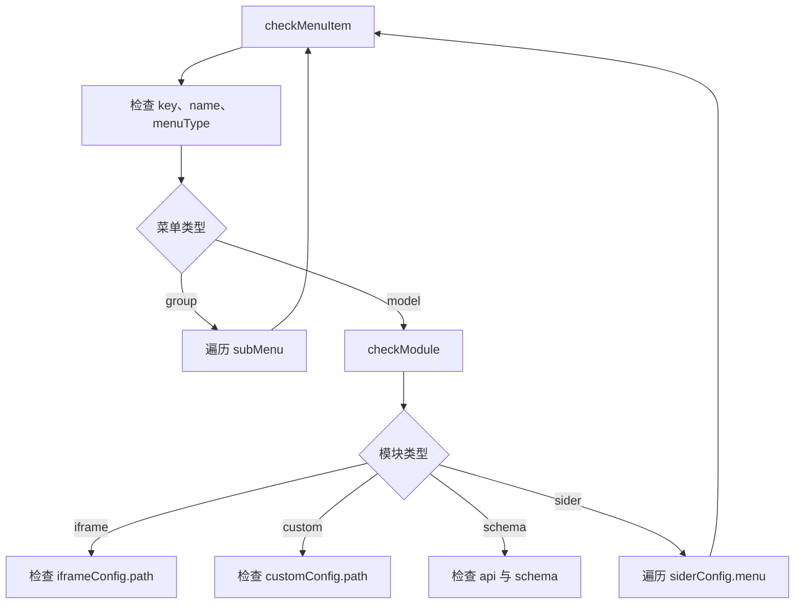

# 模板引擎 - dashboard 应用配置接口实现

<MuxPlayer
  className="mt-8"
  playbackId="Q7clWEeDOzsRguW00mPmX02J3JQiRUeuWkAXyrzVak02Fs"
  title="模板引擎 - dashboard 应用配置接口实现"
/>

> [!NOTE]
>
> 本节完成 Dashboard 的第二个基础接口：根据 `projectKey` 获取 **单个项目的完整配置**。与上一节列表接口不同，这里的项目 key 必须传入，因为模板必须明确自己正在渲染哪个应用。
>
> Controller 和 Service 的代码并不多，主要工作是参数约定、配置查找和失败反馈。课程把更多篇幅放在验证上：分别检查缺少参数、项目不存在和正常项目，并遍历所有项目，递归验证菜单是否符合 DSL。
>
> 这套验证不仅能发现接口错误，也实际找出了前面人工填写配置时遗漏的 `menuType`、`modelType` 和 `name`。项目配置是框架的输入，同样需要被认真检查。

## 单项目接口与列表接口的区别

上一节 `/api/project/list` 的 `projectKey` 可选，不传表示获取全部应用。当前接口要返回一个具体项目的菜单和模块配置，缺少 key 就无法确定目标。

课程定义 GET `/api/project`，在 query 中要求 `projectKey`。

```text filename="单项目配置接口" copy
GET /api/project?projectKey=pdd

输入：当前项目 key
输出：该项目继承模型后的完整配置
缺少参数：由参数校验处理
找不到项目：由 Controller 返回业务失败
```

这两种失败发生在不同层次。缺少参数连请求契约都没有满足；参数存在但项目不存在，则需要进入业务逻辑查找后才能判断。

正常返回的配置已经完成模型继承，前端不需要再去拼基础模型和项目差异。模板引擎可以直接消费 `menu`、`template`、名称与其他配置。

## 用 required 表达必传约束

Router Schema 仍采用 JSON Schema，并通过已有 AJV 校验链路检查请求参数。

```js filename="项目配置 Query Schema 示意" copy
const querySchema = {
  type: 'object',
  properties: {
    projectKey: { type: 'string' },
  },
  required: ['projectKey'],
}
```

`required` 写在对象层，列出必填字段。只为属性写 `type: 'string'` 并不等于它必须出现，两者分别表达类型与存在性。

课堂还提出一个后续扩展方向：既然 Router Schema 已经包含参数定义，就可以考虑配合工具生成在线 API 文档。但这一节并未实现文档生成，当前仍直接维护并阅读规则文件。

这个想法的价值在于减少重复描述，让接口定义既能被程序校验，也能被开发者理解。

## Controller 区分成功与找不到配置

Controller 从请求中提取项目 key，调用 Project Service 的查找方法。如果没有得到配置，调用已有失败响应能力，返回“获取项目异常”；找到时交给已有成功响应链路。

```js filename="Project Controller：按课堂思路整理" copy
async function get(ctx) {
  const { projectKey } = ctx.query
  const projectConfig = await projectService.get(projectKey)

  if (!projectConfig) {
    ctx.fail('获取项目异常')
    return
  }

  ctx.body = projectConfig
}
```

示意沿用课程已有的 `fail` 能力含义，具体参数与包装以此前实现为准。不要在找不到项目后继续走成功分支，否则错误结果可能被后续赋值覆盖。

当前接口返回的是配置详情，所以没有像列表接口一样只选几个展示字段。这种差异来自调用场景：模板渲染确实需要菜单、模块类型及其内部配置。

## Service 在模型集合中定位项目

底层数据仍是按模型组织的对象。Service 遍历模型节点，检查该节点的 `project` 中是否存在目标 key，找到后返回对应配置。

```js filename="Project Service 查找逻辑示意" copy
function getProject(modelList, projectKey) {
  let projectConfig

  Object.values(modelList).forEach((modelItem) => {
    if (modelItem.project[projectKey]) {
      projectConfig = modelItem.project[projectKey]
    }
  })

  return projectConfig
}
```

课堂先确定输入、局部结果变量与返回值，再补中间查找过程。这种从函数边界向内展开的写法，有助于保持目标明确。

课程也留下优化思考：能否使用 `find`？关键并不是方法名称，而是现有结构不是一维项目数组。直接在原始对象上调用 find 不成立；若先把模型节点或项目映射转换成合适的数组，再选择查找方式，才有明确语义。

当前示意可以完成课程样例中的查找。若项目规模继续增大，可以在解析阶段建立按项目 key 索引的映射，但那属于进一步优化，不是本节已经完成的内容。

## 测试由三条业务路径推导

接口写完以后，课程立即补测试。三种输入对应三类结果：

| 场景 | 请求输入 | 预期 |
| --- | --- | --- |
| 缺少参数 | 不传 `projectKey` | 参数校验失败 |
| 无效项目 | 传入不存在的 key | 获取项目的业务失败 |
| 有效项目 | 传真实项目 key | 返回对应的完整配置 |

所有请求仍通过正常签名逻辑发送，不能为了测试这个接口而关闭中间件。

这三条用例分别验证接入层、业务分支和正常输出。只检查成功请求，无法证明 required 真正生效，也无法确认找不到项目时的响应行为。

## 缺少参数时检查真实错误结构

第一条用例不带 key。因为 Schema 设置了 required，请求应该在参数校验阶段失败，Controller 的查找逻辑不应成为主要处理者。

课堂最初按成功响应习惯去取 `body.data`，发现没有数据。打印后确认，当前失败响应把 `code` 与 `message` 直接放在 body 上。

```js filename="缺少参数用例：结构示意" copy
const response = await signedGet('/api/project')

assert.strictEqual(response.body.success, false)
assert.ok(response.body.code)
assert.ok(response.body.message.includes('projectKey'))
```

实际测试应与项目已有错误码保持一致。课堂参数校验使用自身约定的业务错误码，不能把它误写成 HTTP 状态码；错误内容还包含 required 校验的提示。

这里的调试要点是先看实际响应，再写准确断言。成功响应有 data，并不意味着所有失败也会包在同样的 data 层级里。

## 无效 key 应触发业务失败

第二条用例传入一个配置中不存在的字符串。它满足参数类型与必填要求，可以进入 Controller，但 Service 找不到项目。

课堂检查失败标记、项目已有的业务失败码，以及“获取项目异常”这条消息。

```js filename="不存在项目用例示意" copy
const response = await signedGet('/api/project', {
  projectKey: '__missing_project__',
})

assert.strictEqual(response.body.success, false)
assert.strictEqual(response.body.message, '获取项目异常')
```

示意使用容易识别的无效 key，实际运行时应保证它确实不在当前配置中。

这条用例与缺少参数不能合并。前者证明参数校验生效，后者证明业务查找失败能够被正确处理。两者都失败，但失败原因和执行路径不同。

## 成功不代表返回了正确项目

第三条用例最初只检查 `success` 为 true，但课程进一步追问：请求淘宝，返回拼多多配置也可能被包装成成功，这样的测试显然不够。

因此首先检查返回配置的 key 与请求 key 相同，再检查模型归属、名称、描述、首页等基础字段。

```js filename="有效项目基础断言示意" copy
assert.strictEqual(response.body.success, true)

const config = response.body.data
assert.strictEqual(config.key, projectKey)
assert.ok(config.modelKey)
assert.ok(config.name)
assert.notStrictEqual(config.description, undefined)
assert.notStrictEqual(config.homePage, undefined)
```

描述和首页允许阶段性为空，所以检查“是否存在”与“是否为非空值”需要区别对待。项目 key 与名称则承担身份和展示职责，应该有可用值。

这一步确认的是返回对象属于当前项目，后面还要检查对象内部是否符合 DSL。

## 对所有项目逐个验证

上一节项目列表用例可以随机选择一个项目观察分组。本节需要同时发现人工配置中的错误，所以课程改成循环所有项目，每个项目都请求一次详情。

```js filename="逐项目请求验证示意" copy
for (const projectItem of allProjects) {
  const projectKey = projectItem.key
  const response = await signedGet('/api/project', { projectKey })

  assert.strictEqual(response.body.success, true)
  assert.strictEqual(response.body.data.key, projectKey)

  response.body.data.menu.forEach(checkMenuItem)
}
```

`allProjects` 来自测试准备阶段解析出的真实配置，因此用户增加、删除或改名项目后，遍历范围会相应变化。

这里同时检查两个对象：接口实现与配置输入。如果返回错误项目，是接口查找有问题；如果返回的项目包含缺少名称的菜单，则可能是配置本身不符合规范。测试需要把两者都暴露出来。

## 把 DSL 文档变成菜单检查规则

课堂打开 Dashboard DSL 文档，对照字段逐步写断言。每个菜单至少需要 key、name、menuType，后续再根据类型进入不同分支。

菜单存在两种基本形态：group 承载下级菜单，model 承载一个实际模块。模块又有 Sider、iframe、Custom、Schema 四类。



这张图说明为什么不能只在最外层写几个断言：Sider 内部还会出现菜单，菜单分组内部也会出现菜单。重复结构应该交给函数递归处理，而不是手写固定的第二层、第三层检查。

## 拆分菜单检查与模块检查

课堂在实现过程中调整了函数职责，最终把通用菜单检查与具体模块检查分开。

```js filename="菜单检查：按课堂思路整理" copy
function checkMenuItem(item) {
  assert.ok(item.key)
  assert.ok(item.name)
  assert.ok(['group', 'model'].includes(item.menuType))

  if (item.menuType === 'group') {
    assert.ok(Array.isArray(item.subMenu))
    item.subMenu.forEach(checkMenuItem)
    return
  }

  checkModule(item)
}
```

课堂推导中一度讨论 group 下是否限定 model，随后回到“遇到菜单结构就交给菜单检查函数”的统一关系。复盘时应以 DSL 的实际层级约束与最终实现保持一致，避免在不同函数中放入互相矛盾的规则。

这里额外明确枚举集合，是为了说明未知菜单类型不应悄悄通过；若只写两个 if，传入其他值时可能两边都不执行。

## 四类模块分别检查必要字段

iframe 与 Custom 都需要自己的配置对象及路径。Schema 至少需要数据源 API 和数据结构。Sider 则需要菜单数组，并再次调用菜单检查。

```js filename="模块检查示意" copy
function checkModule(item) {
  const supportedTypes = ['sider', 'iframe', 'custom', 'schema']
  assert.ok(supportedTypes.includes(item.modelType))

  if (item.modelType === 'iframe') {
    assert.ok(item.iframeConfig)
    assert.notStrictEqual(item.iframeConfig.path, undefined)
  }

  if (item.modelType === 'custom') {
    assert.ok(item.customConfig)
    assert.notStrictEqual(item.customConfig.path, undefined)
  }

  if (item.modelType === 'schema') {
    assert.ok(item.schemaConfig)
    assert.notStrictEqual(item.schemaConfig.api, undefined)
    assert.ok(item.schemaConfig.schema)
  }

  if (item.modelType === 'sider') {
    assert.ok(item.siderConfig)
    assert.ok(Array.isArray(item.siderConfig.menu))
    item.siderConfig.menu.forEach(checkMenuItem)
  }
}
```

代码是按课堂思路整理的测试骨架。Schema 的内部字段约束还会随着后续组件实现继续细化；当前仅检查已有设计阶段确定的关键结构。

同样，路径字段存在不代表目标页面一定可加载。配置结构校验与真实页面联调是不同层次，后面仍然需要浏览器验证。

## 通过项目 key 与菜单 key 定位错误

一旦循环所有项目并递归菜单，单纯看到“断言为 false”还不够，需要知道失败出在哪个项目、哪一项菜单。

课堂在请求前打印 project key，在进入菜单检查时打印 menu key。这样报错前最后一个标识就能指向对应配置。

```js filename="配置验证日志示意" copy
console.log('[get project] projectKey:', projectKey)
console.log('[check menu] menuKey:', menuItem.key)
```

这里的日志不是随意留下的数字或临时字符串，而是带明确上下文的诊断信息。确定长期有用后，可以规范命名保留；无意义的调试输出则应清理。

递归本身也能从日志观察：进入 data 后继续出现 analyze、sider search，说明检查确实走到了内部菜单，而不是只检查最外层。

## 本节实际发现的配置错误

测试首先在拼多多的 Sider 查询项失败，发现缺少 `menuType`。补上以后，最外层的信息查询又暴露相同问题。

接下来淘宝运营模块中的优惠券项缺少 `modelType`，其他同类活动项也需要补齐。最后 B 站课程资料配置把名称放错位置，缺少独立的 `name`，于是调整为稳定 key 和展示名称两个字段。

| 配置位置 | 暴露的问题 | 修正方向 |
| --- | --- | --- |
| 拼多多侧栏查询 | 缺少 `menuType` | 明确其为模块菜单 |
| 拼多多顶层查询 | 同样缺少菜单类型 | 补全当前层级字段 |
| 淘宝活动子项 | 缺少 `modelType` | 明确使用 Custom 占位页面 |
| B 站课程资料 | 缺少 `name` | 将 key 与显示名称分开 |

这些问题都来自手写配置，和 HTTP 接口能否返回成功不是同一回事。只有拿 DSL 规则检查每一份输入，才能提前发现它们。

测试通过后，还应确认每个项目、每个嵌套菜单都实际参与了检查。否则只因某个分支没被遍历而“通过”，并不能提供有效保障。

## 当前验证覆盖到哪里

本节证明的内容包括：必传参数能够被拦截，不存在的项目能够返回失败，有效 key 能获取相应项目，每份配置的核心菜单结构符合当前 DSL。

它没有证明外部 iframe 地址可嵌入、自定义页面文件一定存在、Schema 接口返回数据一定正确。那些属于后面的模板加载、业务接口和页面交互验证。

这种边界不削弱测试价值，反而让结果更清楚。遇到下一阶段问题时，可以先知道当前已经验证过哪些输入，再沿新增加的链路继续排查。

## 本节小结

本节通过 GET `/api/project` 提供项目详情，使用必传 `projectKey` 定位合并后的配置，并区分参数缺失与项目不存在两种失败路径。

测试覆盖所有项目，不仅检查返回身份，还将 DSL 约定整理成菜单与模块两层检查函数。递归检查发现并修复了前面样例配置中遗漏的菜单类型、模块类型和显示名称。

至此，Dashboard 的应用列表与应用配置两个接口都已具备。接下来可以让前端 HeaderView 使用它们，生成标题、应用切换和菜单导航。
