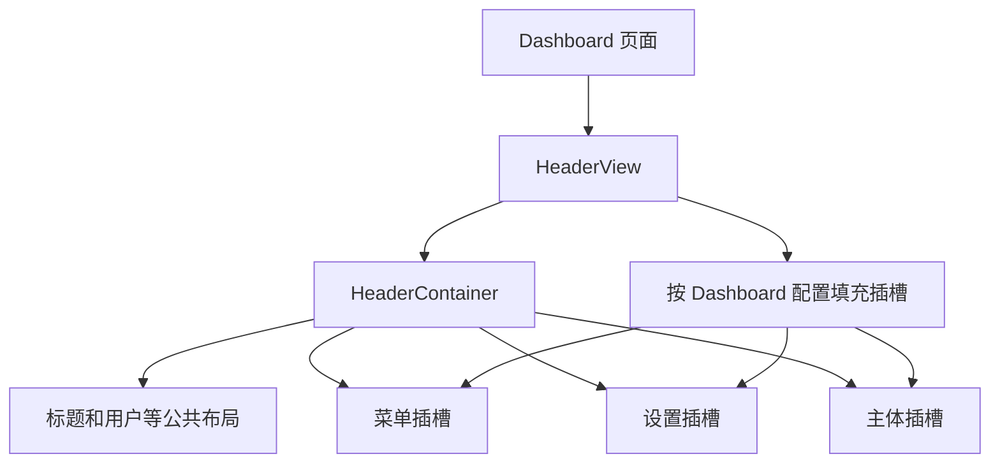
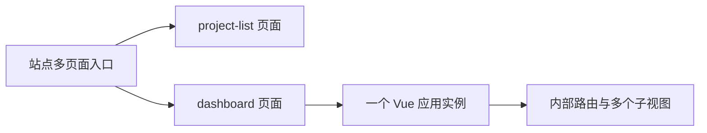
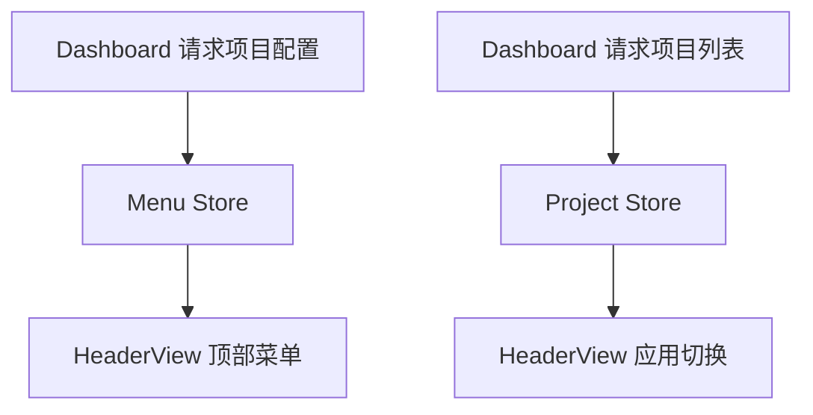

# 模板引擎 - dashboard headerView 实现

<MuxPlayer
  className="mt-8"
  playbackId="x9J2FGrpkjpYLKFSnye18xjtm7c7zgTachW9AkIs01n8"
  title="模板引擎 - dashboard headerView 实现"
/>

> [!NOTE]
>
> 两个 Dashboard 基础接口完成后，本节开始实现前端 **HeaderView**。它在已有 HeaderContainer 之上增加 Dashboard 的业务含义：显示当前项目名称、按 DSL 渲染顶部菜单，并展示同一模型下的应用切换列表。
>
> 页面入口负责获取项目配置和项目列表，Pinia 的 Menu Store 与 Project Store 负责保存共享状态，HeaderView 读取状态完成响应式渲染。菜单中的分组交给独立的 SubMenu 子视图处理。
>
> 这一节重点搭起头部视图与数据传递关系。后面的主入口课程还会继续完善配置解析、路由配置和应用跳转，因此不能把头部菜单可见理解成全部模板能力已经完成。

## HeaderContainer 与 HeaderView 分别做什么

上一节项目列表使用 HeaderContainer，它提供标题、用户区域和三个插槽，本身不需要知道领域模型、项目接口或 Dashboard 菜单。

HeaderView 则属于 Dashboard。它知道哪个插槽应该显示菜单，哪个插槽应该显示项目切换，以及菜单数据来自哪个 Store。



这样公共组件不会因为某一个模板的业务需求不断膨胀。以后另一种模板也需要同样的头部布局，可以继续使用 HeaderContainer，再编写自己的业务视图。

组件复用和模板复用在这里形成两层：底层复用布局，上层复用围绕 DSL 的业务解析与展示。

## Dashboard 新增自己的页面入口

Dashboard 与 Project List 是两个独立页面，因此需要在 entry 中增加 `dashboard` 入口，并创建 Dashboard 页面组件。

课堂回顾前面的 Webpack 配置：构建流程扫描 entry 文件，组织页面入口，再生成相应资源与页面模板。新增入口能够进入这套流程，而不是手工复制一整套构建配置。

```text filename="Dashboard 页面组织示意" copy
前端源码目录
├── entry
│   └── dashboard.js
└── pages
    └── dashboard
        ├── dashboard.vue
        └── complex-view
            └── header-view
                ├── index.vue
                └── complex-view
                    └── sub-menu.vue
```

课堂把页面内部相对完整的子视图放在 `complex-view` 中，HeaderView 自己专用的 SubMenu 再放在它的内部目录。目录表达归属，避免仅供一个页面使用的视图全部堆进全局组件目录。

示意路径用于说明层次，具体入口和别名应沿用项目已经建立的规范。

## 多页面中仍然可以运行单页面应用

整个项目有多个 entry，所以从站点层面看是多页面应用。进入 Dashboard 之后，又由 Vue 创建一个应用实例，内部模块交给 Vue Router 切换，因此这个入口内部仍然可以按单页面应用组织。



课程通过已有 `boot` 初始化能力启动 Dashboard，统一处理 Vue、路由、Pinia、Element Plus 等基础接入。

```js filename="entry/dashboard.js：启动关系示意" copy
import boot from '../boot'
import Dashboard from '../pages/dashboard/dashboard.vue'

boot(Dashboard)
```

这里的 import 路径应以项目实际目录为准。关键是复用同一份启动能力，而不是在 Dashboard 入口重新写一套插件初始化。

服务端返回页面入口，与 Vue 在浏览器中渲染内部视图是不同环节。课堂沿用前面 BFF 输出页面的方案，这里并未单独实现 Vue 组件树的服务端渲染流程。

## HeaderView 先接收当前项目名称

Dashboard 获取当前项目配置后，把名称传给 HeaderView，HeaderView 再传给 HeaderContainer 的 title。

```vue filename="Dashboard 使用 HeaderView 示意" copy
<template>
  <HeaderView :project-name="projectName">
    <!-- 后续放置 Dashboard 内容视图 -->
  </HeaderView>
</template>
```

```vue filename="HeaderView 基础骨架示意" copy
<template>
  <HeaderContainer :title="projectName">
    <template #menu-container>
      <!-- 顶部菜单 -->
    </template>

    <template #setting-container>
      <!-- 同模型应用切换 -->
    </template>

    <slot />
  </HeaderContainer>
</template>

<script setup>
defineProps({
  projectName: { type: String, default: '' },
})
</script>
```

这段结构体现了插槽转接：HeaderView 消费公共容器的插槽，同时也可以向 Dashboard 暴露主体插槽。外层负责具体内容，内层负责固定外壳。

如果实际 HeaderContainer 使用具名主体插槽，转接时也应使用对应名称。组件定义与调用必须一致，不能一端叫 main-container，另一端只填未被消费的默认插槽。

## 异步数据为什么进入 Pinia

课堂计划把请求放在 Dashboard 页面中。页面拿到完整配置后需要解析菜单，HeaderView 负责显示菜单；页面拿到项目列表后，HeaderView 还要显示切换项。

这些数据不是组件创建时立即存在，而是在异步请求完成后写入。使用 Pinia，可以让入口负责写入，视图负责响应，而不必把所有中间状态沿多层组件逐个传递。



这里并不是说父子组件不能使用 props。简单的项目名称仍通过 props 表达，菜单和列表作为后续其他子视图也会使用的共享状态进入 Store。

状态放在哪里，应由作用范围决定。不要因为引入 Pinia，就把所有局部显示状态都变成全局状态。

## Menu Store 保存菜单列表

课堂采用 Pinia 的 setup 风格：在 `defineStore` 的函数中用 Vue 的 ref 声明状态，再定义 setter，最后返回对外暴露的成员。

```js filename="store/menu.js：按课堂思路整理" copy
import { defineStore } from 'pinia'
import { ref } from 'vue'

export const useMenuStore = defineStore('menu', () => {
  const menuList = ref([])

  function setMenuList(list) {
    menuList.value = list
  }

  return {
    menuList,
    setMenuList,
  }
})
```

`menuList` 初始为空数组，让 HeaderView 在请求尚未完成时仍然能够安全遍历。请求成功后调用 setter 替换列表，依赖它的模板自动更新。

setter 的价值在于明确写入入口，后面如果菜单还需要预处理或同步其他状态，可以集中放在这里。当前阶段不需要提前加入大量尚未使用的抽象。

## Project Store 保存应用列表

Project Store 使用相同的基本形式，但负责的数据不同。

```js filename="store/project.js：按课堂思路整理" copy
import { defineStore } from 'pinia'
import { ref } from 'vue'

export const useProjectStore = defineStore('project', () => {
  const projectList = ref([])

  function setProjectList(list) {
    projectList.value = list
  }

  return {
    projectList,
    setProjectList,
  }
})
```

两个 Store 不应因为写法相似就合成一个无边界的大对象。菜单描述当前应用的功能结构，项目列表描述可切换的应用，它们来自不同接口，也有不同消费者。

后续主入口会继续管理当前项目配置、选中状态与模块配置。本节先建立两个明确的数据通道。

## 入口写入，视图读取

Dashboard 请求完成后，将得到的数据写入 Store。此时要区分完整项目配置中的 menu，与列表接口直接返回的项目数组。

```js filename="Dashboard 数据写入关系示意" copy
const menuStore = useMenuStore()
const projectStore = useProjectStore()

const projectConfig = await getProjectConfig(projectKey)
const projectList = await getProjectList(projectKey)

menuStore.setMenuList(projectConfig.menu)
projectStore.setProjectList(projectList)
```

示意省略请求封装的响应解包，实际应沿用已实现的 HTTP 工具。后续解析器还会对菜单做标准化处理，不能把这段关系示意当成最终主入口的全部实现。

HeaderView 则读取相同 Store 中的状态。直接在模板中访问 store 属性可以保留响应性；若需要解构成变量，应使用 `storeToRefs`。

```js filename="HeaderView 读取状态示意" copy
import { storeToRefs } from 'pinia'

const menuStore = useMenuStore()
const projectStore = useProjectStore()

const { menuList } = storeToRefs(menuStore)
const { projectList } = storeToRefs(projectStore)
```

这能避免把初始空数组普通解构出来后，Store 替换值时视图仍然停留在旧引用上。

## 菜单项与分组菜单使用不同组件

DSL 已经区分 `menuType: 'model'` 和 `menuType: 'group'`。HeaderView 不能只循环普通菜单项，否则分组下的内容无法展开。

课堂因此创建 SubMenu 子视图，用 Element Plus 的子菜单承接分组。普通模块渲染菜单项，分组渲染可展开结构。

```vue filename="HeaderView 顶部菜单示意" copy
<el-menu mode="horizontal" class="header-menu">
  <template v-for="item in menuList" :key="item.key">
    <SubMenu
      v-if="item.menuType === 'group'"
      :menu-item="item"
    />
    <el-menu-item v-else :index="item.key">
      {{ item.name }}
    </el-menu-item>
  </template>
</el-menu>
```

菜单的 index 与 DSL 的 key 建立关联，名称只参与展示。后面加入路由与选中状态时，就能依靠稳定 key 确定当前项。

这一节的重点是菜单结构能够显示。模块怎样变成路由配置、点击后使用什么视图，会在下一节继续展开。

## SubMenu 接收一个菜单配置

SubMenu 不必再请求接口，它只需要接收当前分组项，显示分组名称，并遍历 `subMenu`。

```vue filename="SubMenu：结构示意" copy
<template>
  <el-sub-menu :index="menuItem.key">
    <template #title>{{ menuItem.name }}</template>

    <el-menu-item
      v-for="item in menuItem.subMenu"
      :key="item.key"
      :index="item.key"
    >
      {{ item.name }}
    </el-menu-item>
  </el-sub-menu>
</template>

<script setup>
defineProps({
  menuItem: { type: Object, required: true },
})
</script>
```

这个示意覆盖课堂最直接的“分组包含模块”结构。若 DSL 允许分组中继续包含分组，子项处需要再次按 menuType 分发，并复用子菜单视图；不能用只能渲染一层的代码宣称支持任意深度。

课程在设计阶段讨论递归，在具体组件阶段仍需对照 UI 组件的嵌套方式。数据能够描述一种层级，不等于页面已经自动实现该层级。

## 设置插槽中渲染项目切换

右上角切换控件使用当前 `projectName` 作为触发文本，配合下拉箭头，展开后遍历 Project Store 中的项目列表。

```vue filename="HeaderView 应用切换结构示意" copy
<el-dropdown @command="handleProjectCommand">
  <span class="project-switch">
    {{ projectName }}
    <span class="arrow">⌄</span>
  </span>

  <template #dropdown>
    <el-dropdown-menu>
      <el-dropdown-item
        v-for="project in projectList"
        :key="project.key"
        :command="project"
      >
        {{ project.name }}
      </el-dropdown-item>
    </el-dropdown-menu>
  </template>
</el-dropdown>
```

事件可以携带项目对象，也可以携带稳定 key 后再查找对应对象。无论选哪种，调用方与处理函数应当约定一致。

本节字幕重点呈现下拉结构、名称来源与 command 回调。最终跳转地址会在主入口实现时统一处理，因此这里先保留 `handleProjectCommand` 作为入口，不凭空补出一套不同的跳转协议。

## 当前项目名称有两个展示位置

项目名称一方面传给 HeaderContainer，用于标题区域；另一方面作为应用切换下拉框的当前值。

这两个位置应该来自同一份项目配置。若一个使用 props，另一个手工从列表里猜测，很容易出现标题已经切换而下拉仍显示旧名称的情况。

```text filename="名称数据来源" copy
项目配置.name
  → Dashboard 的 projectName
  → HeaderView 的 projectName
    → HeaderContainer title
    → 项目切换触发文本
```

异步请求期间，名称可以先为空；配置到达后统一更新。先使用占位项目完成布局调试，也应在真实接口接入后确认占位值已经移除。

## 用开发者工具定位样式来源

课堂专门演示了头部菜单底边的处理。发现一条不符合预期的边框后，先在浏览器中定位真实 DOM，再检查生效的 CSS，而不是直接猜一个 class 名追加样式。

过程可以分为：选中元素，查看计算样式与规则来源，临时取消边框确认影响，再将有效覆盖写回组件。

因为菜单内部 DOM 属于 Element Plus，局部 scoped 样式可能无法直接命中，需要使用深度选择器。

```css filename="HeaderView 局部覆盖示意" copy
.header-view :deep(.el-menu--horizontal) {
  border-bottom: 0;
}
```

选择器必须以当前页面实际 DOM 为准。课程强调的是定位方式：确认是哪条规则产生效果，再做局部覆盖，避免对所有菜单全局修改造成其他页面变化。

## 按数据链路检查头部渲染

如果菜单不显示，先检查配置接口是否成功，再检查 Store 中的 menuList 是否写入，最后检查 HeaderView 的循环和类型判断。

如果下拉列表为空，检查请求是否携带当前 projectKey，以及列表接口返回的是否为同模型项目。若名称正确但选项不对，问题更可能位于项目列表的数据流，而非标题传参。

| 现象 | 优先核对 |
| --- | --- |
| 标题为空 | 配置名称、Dashboard 状态与 props 链路 |
| 菜单为空 | menuList 写入和读取是否为同一个 Store |
| 分组不展开 | menuType、subMenu 与子菜单组件 |
| 下拉显示其他领域项目 | projectKey 与列表接口筛选结果 |
| 菜单底边异常 | 真实 DOM 上生效的样式来源 |

这种检查顺序沿着请求、状态、视图推进，避免同时修改接口、Store 和模板后反而不知道是哪一步起了作用。

## 本节小结

本节创建 Dashboard 页面入口，在 HeaderContainer 上封装 HeaderView，让通用布局获得当前模板的菜单和项目切换能力。

数据流由 Dashboard 发起请求，经 Menu Store 和 Project Store 保存，HeaderView 响应式读取；标题通过 props 传递，分组菜单交给专属 SubMenu 子视图。

头部结构成立后，下一节继续完成 Dashboard 主入口的配置解析与路由注册，把“菜单可见”推进为“点击菜单可以进入对应模块”。
