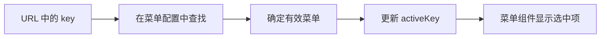

# 模板引擎 - dashboard 主入口实现

<MuxPlayer
  className="mt-8"
  playbackId="8bAuzEc13HoI3Wd88Sq02nk1HkY9z5suDc7aQD5Q2zuE"
  title="模板引擎 - dashboard 主入口实现"
/>

> [!NOTE]
>
> 上节课已经显示 Dashboard 的头部菜单，本节让菜单真正驱动内容区域。先准备 iframe、Schema、Sider 和自定义待开发页面，再配置 Vue Router，通过 `router-view` 展示对应视图。
>
> 入口地址带上 `projectKey` 与菜单 `key`，分别决定读取哪个应用、选中哪个菜单。HeaderView 根据 URL 和菜单数据同步选中状态，点击时查找真实菜单并向 Dashboard 发出事件。
>
> 当前几个视图仍以占位内容为主，本节验证的是应用进入、菜单切换、选中状态和同模型项目切换。懒加载的实际分包效果，以及 Sider 内部的菜单渲染，会在后续课程继续完成。

## 先搭视图骨架，再实现内部细节

本节面对的是一条完整切换链路：用户点击菜单，判断模块类型，更新路由，在主区域加载对应组件。

如果直接开始实现 Schema 表格或 iframe 细节，很难先确认外围结构是否正确。因此课堂先创建几个占位视图，用简单文字区分它们。

```text filename="Dashboard 视图结构示意" copy
dashboard
├── dashboard.vue
├── complex-view
│   ├── header-view
│   ├── iframe-view
│   ├── schema-view
│   └── sider-view
└── todo.vue
```

iframe、Schema、Sider 是模板能够解释的固定模块类型，放在模板子视图中。`todo.vue` 代表用户自定义页面的当前占位实现，与这些模板内部视图处于不同归属。

待开发页面此时只需显示明确标识：切到它时能看到“待开发”，切到 iframe 时看到 iframe 占位内容，便于判断路由是否分发正确。

## 自定义页面是架构中的扩展入口

Custom 模块并不对应一个永远固定的 Custom View。它表示开发者可以写自己的页面，再通过配置中的路径接入 Dashboard。

本节用 `todo` 作为示例，未来可以替换为完全不同的业务页面。它仍然共享应用头部和导航，但页面内部不需要强行符合搜索、表格、表单的结构。

iframe 提供另一种扩展方式：把已经独立部署的页面嵌入当前容器。Schema 则沉淀可配置的通用页面，Sider 提供第二层导航布局。

| 类型 | 模板承担的部分 | 使用者提供的部分 |
| --- | --- | --- |
| Schema | 搜索、表格、表单等通用解析 | 业务数据与交互配置 |
| iframe | 页面容器 | 外部页面地址 |
| Custom | 导航与接入协议 | 自定义页面组件 |
| Sider | 侧栏和内容布局 | 内部菜单及模块配置 |

可扩展性来自这些入口在 DSL 和解析流程中都有明确位置。仅仅使用了 slot 或动态组件，还不足以说明框架能够支持哪些业务变化。

## 通过已有 boot 接入路由

前面的启动能力允许传入路由配置，并在路由准备完成后挂载应用。本节开始给 Dashboard 提供路由表，课程当前采用 hash 模式。

```js filename="Dashboard 路由初始化关系示意" copy
import { createRouter, createWebHashHistory } from 'vue-router'

const router = createRouter({
  history: createWebHashHistory(),
  routes: dashboardRoutes,
})

app.use(router)
await router.isReady()
app.mount('#app')
```

这段代码说明 boot 内部的初始化关系，不是要求在页面中再创建一套重复的 Vue 实例。应用入口、Router 和 Pinia 应继续由已有启动流程统一接入。

hash 模式下，`#` 后面的路径由浏览器端路由处理，前面的页面路径仍由 BFF 负责返回 Dashboard 入口。两个路径层次共同组成完整地址。

## 路由先按模块类型组织

当前阶段不是把每一个业务菜单都生成独立组件。多个菜单可以共享同一种视图，具体使用哪份业务配置则由 query 中的菜单 key 决定。

因此课堂先注册 iframe、Schema、todo 等类型路由。

```js filename="头部模块路由示意" copy
const routes = [
  {
    path: '/iframe',
    component: () => import('./complex-view/iframe-view/index.vue'),
  },
  {
    path: '/schema',
    component: () => import('./complex-view/schema-view/index.vue'),
  },
  {
    path: '/todo',
    component: () => import('./todo.vue'),
  },
]
```

路径与文件名是按课堂思路整理的示意。具体组件所在目录应与当前项目保持一致。

这里使用动态 import，为后面的按需加载保留边界。写了动态 import 只是第一步，构建产物是否真的独立分包，还需要检查 Webpack 的分包规则，下一节会专门验证。

## Sider 的内容应该使用子路由

左侧菜单属于某一个头部 Sider 模块。点击其他头部菜单后，当前侧栏也应一起变化，因此左侧内容天然属于该头部模块的下一层。

课堂为 Sider 注册父路由，并在它下面配置 iframe、Schema、自定义待开发页面等子路由。

```js filename="Sider 父子路由示意" copy
const siderRoute = {
  path: '/sider',
  component: () => import('./complex-view/sider-view/index.vue'),
  children: [
    {
      path: 'iframe',
      component: () => import('./complex-view/iframe-view/index.vue'),
    },
    {
      path: 'schema',
      component: () => import('./complex-view/schema-view/index.vue'),
    },
    {
      path: 'todo',
      component: () => import('./todo.vue'),
    },
  ],
}
```

父组件负责侧栏，子组件负责右侧业务内容。Sider 内部需要自己的 router-view，才能显示 children 对应组件；这一点会在 Sider 实现课中进一步完成。

课堂还考虑侧栏内容无法匹配时的兜底：保留侧栏容器，避免整个页面消失。整理具体路由时，应确保兜底不会把 Sider 再次递归嵌入自身，核心目标是让父布局在无有效子内容时仍然存在。

## Project List 的进入按钮开始真实跳转

之前进入按钮只打印项目名称，本节将它替换为打开项目首页。

列表页与 Dashboard 是不同页面入口，所以不能只在列表页当前 Vue Router 里 push 一个内部模块路径。需要先进入正确的 Dashboard 页面，再携带其 hash 路由。

```js filename="项目列表进入应用：地址组成示意" copy
function onEnter(project) {
  if (!project.homePage) return

  const dashboardPage = '/dashboard'
  const target = `${window.location.origin}${dashboardPage}${project.homePage}`
  window.open(target)
}
```

`dashboardPage` 在这里代表项目实际约定的模板入口，具体是否带扩展名应与前面的页面路由一致。示意重点是区分“页面入口”和“入口内部的 homePage”，不要只拼 origin 后就丢掉 Dashboard 路径。

课堂随后为四个项目补充首页，替换之前的空字符串。

## 首页同时携带项目与菜单标识

一个 Dashboard 首页至少要能回答两件事：请求哪个项目配置，以及进入后默认显示哪个菜单。

```text filename="Dashboard 首页参数示意" copy
/dashboard#/todo?projectKey=pdd&key=product
/dashboard#/todo?projectKey=bilibili&key=video
```

`projectKey` 决定 API 请求目标，`key` 决定菜单上下文。路径 `/todo` 决定使用什么视图，query 则决定这份视图属于哪个应用、哪个模块。

同样是 todo 页面，商品管理和视频管理可以对应不同 key。以后替换成 Schema View 后，也能通过同样的协议读取不同字段和接口配置。

| 地址部分 | 作用 |
| --- | --- |
| Dashboard 页面路径 | 进入正确的多页面入口 |
| hash 路由 path | 选择 iframe、Schema、Sider 或 Custom 视图 |
| `projectKey` | 读取具体项目配置 |
| `key` | 识别当前头部菜单 |

## 让 URL 保存当前菜单状态

如果只把选中菜单存在组件本地变量中，刷新后它就可能回到第一个菜单。把 key 放在 URL 中，刷新、复制链接和重新打开时都能恢复当前位置。

这是课堂强调的直接访问能力：用户分享当前页面，接收方打开同一地址，不需要重新从首页逐级点击才能进入相同模块。

但 URL 上有 key 还不够，HeaderView 需要主动读取并同步选中状态，而且要等菜单数据已经到达。



路由、菜单数据、组件初始化这三个时间点可能不同，因此只在 mounted 执行一次还不够。

## findMenu 统一查找菜单

课堂在 Menu Store 中补充查找方法，按指定属性与值，在菜单结构中查找对应项。菜单包含分组或 Sider 时，需要递归进入内部数组。

```js filename="菜单递归查找：按课堂思路整理" copy
function findMenu(field, value, list = menuList.value) {
  for (const item of list) {
    if (item[field] === value) return item

    const children = item.menuType === 'group'
      ? item.subMenu
      : item.modelType === 'sider'
        ? item.siderConfig?.menu
        : undefined

    if (Array.isArray(children)) {
      const matched = findMenu(field, value, children)
      if (matched) return matched
    }
  }

  return undefined
}
```

这是整理后的递归示意，不是字幕中被重复识别遮挡的代码逐字还原。重点是按层级查找，找到后及时返回，找不到时明确返回空结果。

当前 key 应与菜单协议保持唯一或具有明确作用范围，否则跨层查找会产生歧义。后面的 Sider 课程会继续区分头部 key 与侧栏 key。

## 先查找，再更新 activeKey

HeaderView 不直接把任何 URL 参数写成选中值，而是先在当前菜单集合中确认存在。

```js filename="HeaderView 选中状态示意" copy
const activeKey = ref('')

function setActiveKey() {
  const key = route.query.key
  const menuItem = menuStore.findMenu('key', key)
  activeKey.value = menuItem ? menuItem.key : ''
}
```

这样无效 key 不会被当作合法菜单状态。课堂还把这一查找作为未来权限过滤的衔接点：如果当前用户可见菜单中没有某项，前端就不应仅凭 URL 把它当成已授权入口。

需要明确边界：前端菜单查找只是展示与导航校验，不能替代服务端权限控制。真正的数据接口仍需依据登录用户检查访问权限，不能因为隐藏了菜单就认为资源已经安全。

## 在三个时机同步选中状态

课堂在初始化、路由变化和菜单列表变化时都调用选中同步逻辑。原因分别对应三种情况：页面首次进入、用户切换菜单、异步配置到达。

```js filename="HeaderView 同步触发示意" copy
onMounted(setActiveKey)
watch(() => route.query.key, setActiveKey)
watch(() => menuStore.menuList, setActiveKey)
```

如果只监听 route，首次请求还未返回时查找失败，之后菜单到达却不会重新选中。如果只监听 menuList，点击其他菜单时 URL 变了，但选中状态可能仍停留在之前。

后续可以根据实际状态设计合并 watch，但这三个变化来源必须被覆盖。模板里的菜单选中属性再绑定 activeKey，完成状态到界面的最后一步。

## HeaderView 只发出菜单选择事件

用户点击菜单后，HeaderView 收到菜单 key，再通过 findMenu 得到配置对象，把该对象向 Dashboard 发出。

```js filename="HeaderView 菜单事件示意" copy
const emit = defineEmits(['menu-select'])

function onMenuSelect(menuKey) {
  const menuItem = menuStore.findMenu('key', menuKey)
  if (!menuItem) return
  emit('menu-select', menuItem)
}
```

HeaderView 负责展示和选择，Dashboard 负责决定路由跳转。这样的边界让头部视图不必承担所有模块路径规则。

事件传出的内容决定接收方的参数。这里传的是完整 menuItem，所以 Dashboard 可以直接读取 modelType、key 和 customConfig，不必再重复查找一次。

## Dashboard 根据模块类型选择路径

Dashboard 接收 menu-select。先判断是否已经是当前头部菜单，避免重复导航，再根据模块类型决定目标路径。

```js filename="Dashboard 点击菜单回调示意" copy
function onMenuSelect(menuItem) {
  if (menuItem.key === route.query.key) return

  const path = menuItem.modelType === 'custom'
    ? menuItem.customConfig.path
    : `/${menuItem.modelType}`

  router.push({
    path,
    query: {
      projectKey: route.query.projectKey,
      key: menuItem.key,
    },
  })
}
```

Custom 路径来自配置，其他类型按约定映射到 `/iframe`、`/schema` 或 `/sider`。配置中的 customConfig.path 必须与已经注册的自定义路由匹配；它不是任意文件路径自动可执行的机制。

跳转时保留 projectKey，更新当前菜单 key。否则点一次菜单就丢掉项目身份，刷新后无法重新请求正确配置。

## 主体内容交给 router-view

Dashboard 在 HeaderView 的主体插槽中放 router-view，路由匹配结果就能进入主要内容区域。

```vue filename="Dashboard 主体结构示意" copy
<template>
  <HeaderView
    :project-name="projectName"
    @menu-select="onMenuSelect"
  >
    <router-view />
  </HeaderView>
</template>
```

如果 HeaderView 对外使用具名主体插槽，应把 router-view 放进相应 template。这里使用默认插槽展示关系。

到此，路径负责选择组件，query 负责保存业务上下文，HeaderView 负责菜单状态，router-view 负责呈现结果。这几层组合起来，才形成可用的模板入口。

## 同模型应用切换采用页面级重新进入

项目下拉 command 传项目 key，处理函数从 Project Store 中找到对应项，再使用它的 homePage 生成目标地址。

课堂对不存在项目或缺少首页的情况直接返回，避免拼出无意义地址。随后使用 `location.replace` 进入目标，并通过刷新确保当前项目的配置重新加载。

```js filename="项目切换处理关系示意" copy
function handleProjectCommand(projectKey) {
  const project = projectStore.projectList.find(
    (item) => item.key === projectKey,
  )
  if (!project?.homePage) return

  const { origin, pathname } = window.location
  window.location.replace(`${origin}${pathname}${project.homePage}`)
  window.location.reload()
}
```

这是课堂当前的页面级切换方式。若仅修改同一页面的 hash，浏览器不一定重新启动 Vue 应用；刷新可以让当前阶段的初始化逻辑重新读取 projectKey。以后也可以改成监听项目变化并完整重置 Store 的方式，但不能只换标题而继续使用旧项目数据。

课堂实际验证时发现 `replace` 和 `reload` 拼写问题，修正后再检查电商项目互切与课程项目互切。

## 验证时把几条链路分别走通

首先从 Project List 进入具体项目，确认名称和菜单正确。然后点击不同类型的菜单，观察 hash 路径与占位视图是否一一对应。

再刷新当前地址，检查菜单选中状态能否保持；复制当前 URL 重新打开，也应当恢复同一个项目与菜单上下文。

最后验证应用切换。电商项目应切到同模型的另一个项目，课程项目同理，切换后标题、列表和菜单都应更新。

| 验证动作 | 观察结果 |
| --- | --- |
| 点击 Custom 菜单 | 显示待开发页面 |
| 点击 iframe 菜单 | 显示 iframe 占位视图 |
| 点击 Sider 菜单 | 显示 Sider 占位容器 |
| 刷新当前页面 | URL 中的菜单 key 恢复选中 |
| 切换应用 | 重新读取目标项目配置 |

当前视图尚未完成内部业务，验证结果应停留在导航链路这一层。下一步会继续把占位容器变成真实模板能力。

## 本节小结

本节建立 Dashboard 主入口：按模块类型配置路由，使用 router-view 显示内容，并让 Project List 的进入按钮打开真实应用。

URL 中的 projectKey 与 key 分别保存项目身份和菜单上下文。HeaderView 通过递归查找同步选中项，点击时向 Dashboard 发出菜单配置，Dashboard 再执行类型对应的路由跳转。

同模型项目切换也完成了真实验证。接下来需要检查动态 import 是否形成有效懒加载，并继续实现 Sider 等模块的内部展示。
