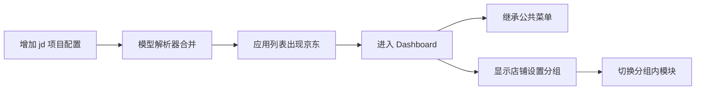
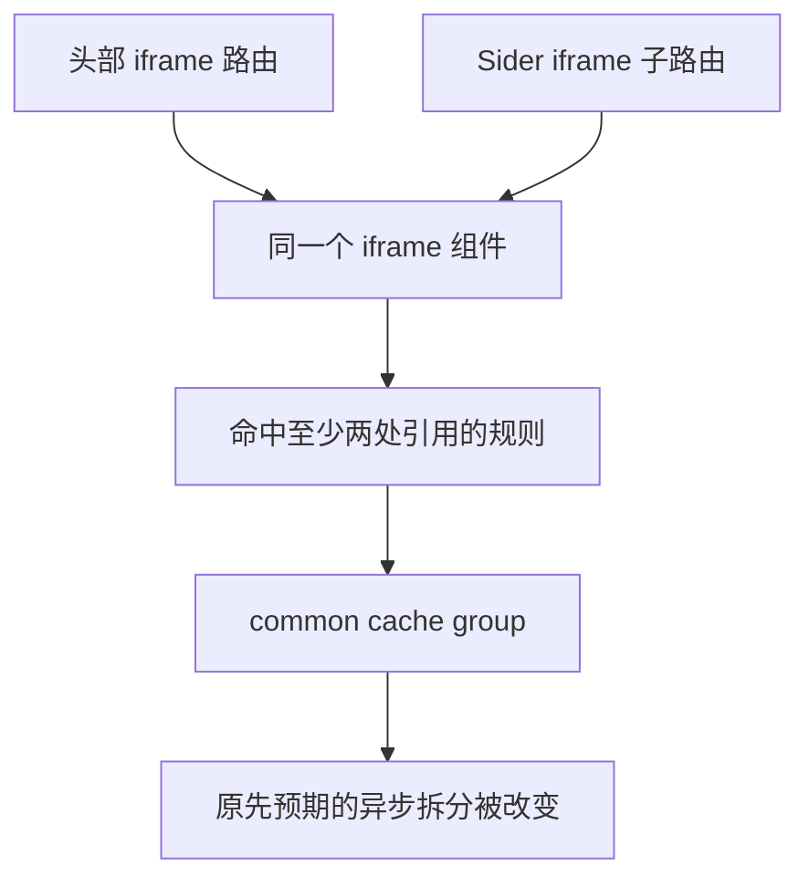

# 模板引擎 - dashboard 懒加载实现

<MuxPlayer
  className="mt-8"
  playbackId="8FcO1xP83L01SMgGqOfyALZe00b9IkjIHm00XSY0001qB8W4"
  title="模板引擎 - dashboard 懒加载实现"
/>

> [!NOTE]
>
> 本节对已经完成的 Dashboard 主入口做进一步验证。首先补充一个带 group 菜单的京东示例项目，检查前面尚未真正运行到的 SubMenu 分支；随后构建生产包，确认路由动态 import 是否达到了预期的懒加载效果。
>
> 课堂发现，虽然路由写了动态 import，iframe、Schema、todo 等视图仍被已有 common 分包规则合并。原因是这些视图在头部和侧栏路由中重复引用，命中了优先级更高的公共包条件。
>
> 本节需要掌握的核心是：懒加载要同时检查构建阶段的拆包结果与运行阶段的加载时机。不能只看代码里出现 import()，就认定性能目标已经实现。

## 先补上没有覆盖的 group 场景

前面的电商和课程项目已经验证过普通模块与 Sider，但顶层 `menuType: 'group'` 还没有真正进入页面运行。

这意味着即使接口测试和已有页面都正常，SubMenu 仍可能存在只有使用时才暴露的错误。课堂因此增加京东项目，既作为新的模型派生例子，也作为分组菜单的验证场景。

京东继续继承电商模型，所以天然拥有商品、订单和客户管理。项目配置只增加店铺设置分组，下面包含店铺信息与店铺资质两个入口。

```js filename="model/business/project/jd.js：按课堂思路整理" copy
module.exports = {
  name: '京东',
  description: '京东电商系统',
  homePage: '#/todo?projectKey=jd&key=product',
  menu: [
    {
      key: 'shopSetting',
      name: '店铺设置',
      menuType: 'group',
      subMenu: [
        {
          key: 'infoSetting',
          name: '店铺信息',
          menuType: 'model',
          modelType: 'custom',
          customConfig: { path: '/todo' },
        },
        {
          key: 'quality',
          name: '店铺资质',
          menuType: 'model',
          modelType: 'iframe',
          iframeConfig: { path: 'https://example.com/qualification' },
        },
      ],
    },
  ],
}
```

示例 key、路径按课堂含义整理。新增配置之后，模型解析器与列表接口应自动把它纳入结果，不需要另外手写一张京东列表卡片。

## 新增项目检验了整条配置链路

页面出现京东卡片，说明目录扫描和项目列表已识别新配置。进入应用后显示京东名称与继承菜单，说明项目详情、模型合并和 HeaderView 都消费到了新项目。

最后展开店铺设置，点击两个子项，才真正验证到 group、SubMenu 与菜单事件的组合。



这里能看到领域模型开始发挥作用：新增同领域系统，只需要写差异配置。基础菜单、模板布局和路由处理继续复用已有实现。

这种复用效果不是靠复制更多页面获得的，而是前面已经把目录约定、合并规则和模板协议连接起来。

## 真正运行到 SubMenu 才发现拼写错误

课堂第一次进入分组场景，SubMenu 报错。检查后发现 props 声明存在拼写问题，修正 `defineProps` 后才能正常渲染。

之前没有任何项目使用 group，所以这个组件分支没有被实际触发。页面在其他项目中能正常运行，不能证明所有模块都没有问题。

这也说明接口结构测试与浏览器组件验证互相补充。后端检查可以确认 `subMenu` 存在、菜单字段齐全，但无法替代 Vue 组件运行时对声明和渲染的检查。

随后课堂又发现默认菜单没有选中。沿首页 query 检查后，确认菜单 key 必须与继承模型中的实际 key 一致，再重新打开页面验证。

| 观察现象 | 课堂定位方向 |
| --- | --- |
| 一进入 group 场景就报错 | SubMenu 的脚本声明 |
| 菜单可见但默认不选中 | homePage 中的菜单 key |
| 分组内点击后视图不对 | modelType 与配置路径 |

修复后，再分别检查店铺信息进入待开发页、店铺资质进入 iframe 占位视图，确认分组场景完整走通。

## 懒加载需要单独验证

上一节路由中已经使用动态 import。

```js filename="路由中的动态 import 示意" copy
{
  path: '/iframe',
  component: () => import('./complex-view/iframe-view/index.vue'),
}
```

它表达“访问这个路由时再取得组件模块”的意图。但最终浏览器到底请求什么文件，由构建结果共同决定。

如果构建阶段把多个视图重新聚合到同一个 common 包，而这个 common 包又被入口提前引用，那么路由写法并不能独自保证每个视图都是独立按需加载。

所以课堂不满足于查看源代码，而是主动构建生产产物，检查视图被放到了哪里。

## 为什么观察生产包

开发环境中的资源由开发服务生成并保存在内存，重点服务于快速编译和热更新。生产环境会应用正式的优化与分包规则，两者需要区分。

课堂运行项目已有的构建命令：

```bash filename="构建生产资源" copy
npm run build
```

然后进入产物目录查看 JavaScript 文件。既有构建清理插件会在重新构建前清理旧目录，所以连续构建时看到的是当前规则下的新结果，不必靠手工猜测哪些文件属于上一轮。

这里不只是数文件个数，还要判断各个包承担什么职责。

| 产物类别 | 当前工程中的主要意义 |
| --- | --- |
| runtime | Webpack 加载与运行模块所需代码 |
| vendor | 第三方依赖相关代码 |
| entry | 页面入口相关代码 |
| common | 按共享规则提取的公共代码 |
| 异步视图 chunk | 预期在访问相应模块时加载的代码 |

名称能提供线索，但不能单凭文件名证明内容归属，还需要继续查看代码或构建分析结果。

## 用已知文本查找视图落在哪个包

课堂期待 iframe、Schema、todo 等视图分别形成可识别的异步产物，但输出中没有看到预期结果。

为了定位，先在产物中搜索待开发页面的固定文字“待开发”，发现它进入了 common 包；再搜索 iframe 占位文字，发现同样的情况。

这种办法利用了自己刚写过、容易识别的内容，快速把源码模块和生成文件关联起来。

```text filename="产物定位思路" copy
源码中的 todo.vue
  包含：待开发

在构建产物中搜索这段文字
  找到：common 相关文件

结论
  todo 视图并未保持为期望的独立视图产物
```

生产压缩可能改变变量名，但模板中的可见文本通常仍能提供有效线索。若需要更精确的归属和依赖关系，可以进一步使用构建统计数据；课堂此处先用最直接的方法定位。

## 公共包规则为什么吸收了视图

回到 Webpack 配置，课堂发现现有 cache group 具有不同优先级。第三方包规则优先级较高，common 规则次之；common 会提取被至少两个位置引用、达到最小体积条件的模块。

此前为了尽可能复用代码，common 的最小体积设得很小。只要模块有内容，并在多个位置被引用，就容易进入该分组。

路由表恰好同时存在两处相同视图引用：头部模块路由引用 iframe，Sider 子路由又引用 iframe；Schema 和 todo 也有相似结构。Sider 本身还可能在正常路由和兜底规则中再次出现。



这里要注意，具体模块最终归属取决于整个 chunk graph 和 cache group 配置，不能把“源码出现两次 import”机械地当成所有工程都相同的结论。当前课堂通过产物内容与现有规则相互印证，才定位到这一原因。

## 临时移除重复引用是诊断实验

为验证判断，课堂临时减少重复路由引用，再构建一次。结果中出现原先期待的独立视图文件，说明 common 提取条件确实影响了这些模块的拆分。

这个实验改变了一个相关条件：重复引用不再满足，模块归属随之改变。它比同时修改多个分包选项更容易解释因果关系。

不过，删除正常需要的路由并不是最终解决方案。头部与侧栏都需要使用 iframe、Schema 和 Custom，因此正式方案应在保留页面能力的前提下调整分包边界。

```text filename="实验与最终目标的区别" copy
诊断实验：暂时减少重复引用，观察是否独立拆包。
最终目标：保留复用关系，同时让目标视图按预期加载。
```

做完诊断要恢复所需路由，再继续验证。不然“产物变好看”可能只是因为把真实功能移除了。

## 分包策略要服务于加载目标

课堂明确提出，要同时考虑公共代码提取和页面按需加载。共同代码不必重复打包，但也不能因为一个过宽的 common 规则，把所有业务视图提前聚到一起。

沿着本节已经定位的原因，调整方向是让异步视图拥有合适的匹配范围与优先级，或收窄 common 的适用范围，避免它无差别吸收需要保留加载边界的模块。

字幕后段存在较长重复识别，无法可靠还原最终配置修改的逐字细节。因此这里保留课堂确认过的原因、实验和目标，不把某一段推测的 Webpack 配置当作课程最终源码。

可以用下面的职责约定帮助理解，而不急于记忆一个固定配置：

```text filename="分包职责整理" copy
第三方依赖：按 vendor 规则提取。
真正的共享基础能力：进入公共包。
按路由访问的业务视图：保留可按需加载的边界。
入口资源：只依赖首屏启动所需部分。
```

最终采用哪一条 cache group，需要看项目的实际目录、引用关系、chunks 范围与 priority。仅仅提高某个数字，若匹配范围不对，仍然可能改变不该改变的模块。

## 加载验证包含构建与浏览器两步

本节已经通过构建产物确认问题来源。完整复盘时，还应把最终产物放回页面运行，观察文件何时被请求。

构建阶段回答“拆成了什么”，浏览器阶段回答“什么时候加载”。独立文件即使存在，也可能被页面提前引用；反过来，几个视图共享一个异步包，也不必然意味着完全没有延迟加载，只是加载粒度与原先目标不同。


为了避免缓存影响判断，可以在开发者工具中观察首次请求，记录首屏和进入相应菜单后分别新增哪些资源。测试时既看功能，也看网络请求，才能知道优化是否改变真实加载行为。

## 生产运行还要检查资源路径

课堂在生产包运行过程中注意到图片没有正常加载。字幕未保留完整修复过程，因此不能据此直接断定某一个 loader 或 publicPath 配置有问题。

这个现象提醒的是另一个验证层次：JavaScript 分包正确，并不代表生产页面所有资源都正常。图片地址、输出目录与服务端静态资源映射也需要对应。

复盘遇到相同情况时，先看 Network 中真实请求的 URL、状态码和生成文件位置，再沿页面引用、构建输出、服务端映射这条链路定位。

不要为了修一个图片 404，随意修改已经验证过的路由分包条件。这两类问题可能在同一次生产验证中出现，但不必共享同一个原因。

## 合并后再检查主开发分支

课程结束前按前面的分支流程合并 Dashboard 工作，回到 `develop` 拉取最新代码，并重新运行页面做一轮检查。

单人开发时，这一步可能看起来与功能分支验证重复；多人协作时，合并结果可能同时包含其他人的修改，因此需要确认合并后的整体仍然可运行。

检查不必每次重新手工遍历所有代码，而应围绕关键链路：项目列表能否打开、新项目是否出现、菜单分组是否工作、项目是否能切换、生产资源是否正常加载。

这也是本节反复强调的工程习惯：配置完成、编译成功、分支合并，都只是过程节点，最终还要回到实际运行结果。

## 本节小结

本节先补充京东项目，覆盖此前遗漏的 group 菜单场景，发现并修复 SubMenu 声明与默认菜单 key 的问题，也验证了新增项目仅需差异配置的效果。

随后通过生产构建检查懒加载，发现多处引用的视图被 common 规则吸收。动态 import、cache group 匹配范围、优先级与实际引用关系共同决定模块如何分包，必须结合产物验证。

理解懒加载时，要同时回答代码被拆到哪里、浏览器在何时请求它。完成配置以后再验证构建、页面与合并结果，才能确认这次工程化调整达到了预期。
