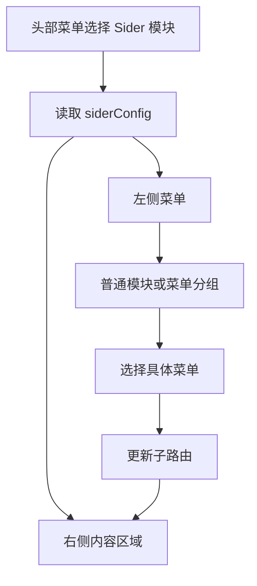
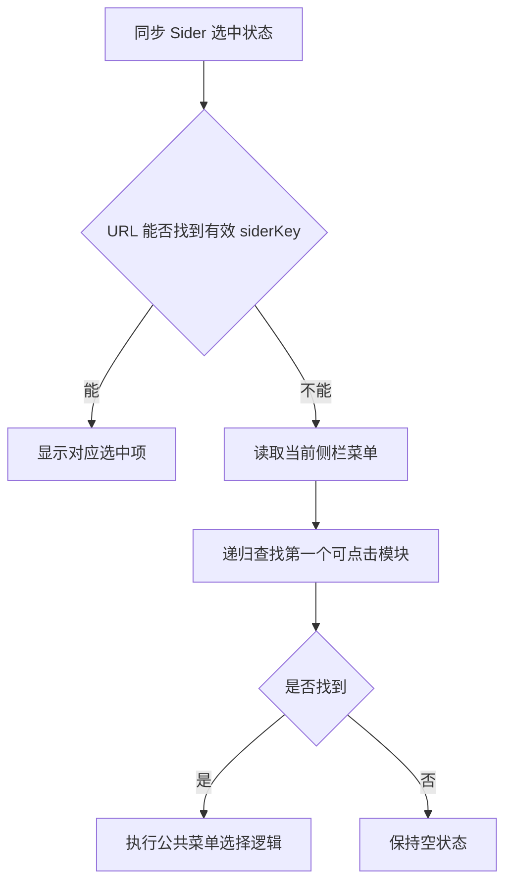

# 模板引擎 - SiderView 实现

<MuxPlayer
  className="mt-8"
  playbackId="ZSe5GRtbTmqIWI4abiqBXVSmiCl100e0001J6QZN4Z00Ae00"
  title="模板引擎 - SiderView 实现"
/>

> [!NOTE]
>
> 本节把 SiderView 从占位页面变成可用的侧栏模块。实现分成公共的 **SiderContainer 两列布局**、解释 DSL 的 **SiderView**，以及处理分组菜单的 SubMenu。
>
> 路由中的头部 `key` 决定当前侧栏来自哪个模块，新增的 `siderKey` 决定侧栏中选中了哪一项。首次进入没有 siderKey 时，需要递归找到第一个可点击菜单，并主动进入对应子路由。
>
> 课程同时调整组件命名、拆分用户点击与公共选择逻辑，并通过普通菜单、分组菜单、默认选择和页面高度逐步验证实现。iframe 与 Schema 的内部内容仍留到后续课程继续完成。

## 从占位视图进入 DSL 解释阶段

前面的主入口已经能够在 todo、iframe、Schema、Sider 等视图之间切换，但 Sider 页面只显示一行占位文本。

现在需要根据 `siderConfig.menu` 真正生成左侧菜单，并在右侧显示选中菜单对应的子页面。



课程从 `develop` 创建子视图功能分支。这个分支会继续承载后面的 iframe 与 Schema 实现，本节先完成 SiderView，再做阶段性提交。

## 先统一已经出现的组件命名

正式写新视图前，课堂先回看已有代码，修正组件导入与模板使用上的命名不一致。

课程采用的约定是：JavaScript 中组件变量使用大写开头的驼峰形式，template 中使用小写加横杠，传入 props 时也采用横杠连接，接收时仍使用驼峰字段。

```vue filename="组件与 props 命名示意" copy
<script setup>
import HeaderView from './complex-view/header-view/index.vue'
</script>

<template>
  <header-view :project-name="projectName" />
</template>
```

```js filename="组件内部接收 prop" copy
defineProps({
  projectName: { type: String, default: '' },
})
```

这是课程项目的统一风格，而不是说 Vue 只允许一种组件标签写法。重点是团队在同一项目里采用一致约定，使阅读者容易识别组件与参数。

课堂同时检查 Project List、Dashboard、HeaderView 与 SubMenu，避免新增代码遵循规范，而已有调用继续混用。

## SiderContainer 只负责两列布局

和 HeaderContainer 相同，侧栏也先拆成公共布局组件。SiderContainer 不请求项目配置，不判断菜单类型，只提供左侧菜单区域和右侧主体区域。

```vue filename="SiderContainer：按课堂思路整理" copy
<template>
  <el-container class="sider-container">
    <el-aside class="aside">
      <slot name="menu-container" />
    </el-aside>

    <el-main class="main">
      <slot name="main-container" />
    </el-main>
  </el-container>
</template>

<style scoped>
.sider-container {
  height: 100%;
}

.aside {
  width: 200px;
}

.main {
  min-width: 0;
  overflow: auto;
}
</style>
```

左侧保持可识别的导航宽度，右侧承载具体内容，超出时允许滚动。背景与边框沿用暗色主题，课堂还调整了部分默认白边。

这里的样式是结构示意。宽度、间距可以根据项目视觉需要调整，但组件职责不变：提供布局与插槽，让外部视图填内容。

## SiderView 负责消费 siderConfig

Dashboard 内的 SiderView 引入公共容器，在菜单插槽中渲染列表，在主体插槽中放入 router-view。

```vue filename="SiderView 布局骨架示意" copy
<template>
  <sider-container>
    <template #menu-container>
      <el-menu
        :default-active="activeKey"
        @select="onMenuSelect"
      >
        <!-- 普通菜单与分组菜单 -->
      </el-menu>
    </template>

    <template #main-container>
      <router-view />
    </template>
  </sider-container>
</template>
```

右侧使用 router-view，是因为上一节已经给 `/sider` 配置 children。父级 SiderView 保留侧栏，子路由切换右边的 iframe、Schema 或自定义页面。

若把右侧写成固定组件，即使路由变了也不会显示新内容；若跳到顶层 `/iframe`，又会离开 Sider 布局。父子路由和两列布局需要一起理解。

## 先从头部 key 找到当前侧栏

整个项目可能有多个 Sider 模块。拼多多的数据分析、淘宝的运营活动都可以有左侧菜单，因此不能在 SiderView 里固定使用某一份配置。

路由中的 `key` 仍然代表头部菜单。先用它在 Menu Store 中找到当前项，再读取该项的 `siderConfig.menu`。

```js filename="读取当前侧栏菜单示意" copy
const menuList = ref([])

function getCurrentSiderMenus() {
  const headerMenu = menuStore.findMenu('key', route.query.key)
  return headerMenu?.siderConfig?.menu || []
}

function setMenuList() {
  menuList.value = getCurrentSiderMenus()
}
```

示意把读取过程提取成函数，表达同一个数据来源。找不到配置时返回空数组，可以让模板安全地保持空状态，避免直接读取 undefined 的 menu。

课堂在多个同步方法中重新查询当前头部配置，是为了避免依赖另一个方法必须先执行。这种独立性可以通过重复查找实现，也可以通过无副作用的公共读取函数表达。

## 不让方法依赖隐含的调用顺序

课堂专门讨论：设置默认菜单时，为什么不直接读取刚刚由另一个函数赋值的 menuList？

因为这些同步逻辑可能被初始化或 watch 分别触发。如果一个方法只有在另一个方法先执行后才成立，后来调整调用顺序时就容易出错。

```text filename="两种依赖关系" copy
隐含顺序：
setMenuList 先执行 → 局部变量被赋值 → setActiveKey 才能工作

更清晰的输入来源：
setMenuList → 从当前路由和 Store 读取
setActiveKey → 从当前路由和 Store 读取
```

当前配置数量有限，重复查找的成本很小。首先保证函数逻辑独立、状态来源明确，比为减少一次小循环引入隐藏耦合更重要。

这不意味着任何地方都应该复制逻辑。若查找过程稳定，可提取公共函数，让两个调用方共享算法，同时保持独立执行能力。

## 侧栏菜单也需要支持 group

`siderConfig.menu` 仍然使用统一 Menu Item 结构，所以它可能是直接可点击的模块，也可能是包含 `subMenu` 的分组。

课堂在渲染时检查子菜单结构，非空的分组交给 SubMenu，普通项使用 el-menu-item。

```vue filename="侧栏菜单分发示意" copy
<template v-for="item in menuList" :key="item.key">
  <sub-menu
    v-if="item.subMenu && item.subMenu.length"
    :menu-item="item"
  />
  <el-menu-item v-else :index="item.key">
    {{ item.name }}
  </el-menu-item>
</template>
```

这里的 `item.name` 必须真正输出。课堂调试中就遇到菜单可点击但文本为空的问题，最后发现模板里漏了名称显示。

分组的 DSL 类型仍然应该在前面的配置校验中得到保障。页面按结构判断是渲染实现，不应成为允许任意缺失 menuType 的理由。

## SubMenu 的递归与目录归属

SiderView 使用自己的 SubMenu 子视图，放在它的 `complex-view` 目录中。课堂坚持按文件夹组织子视图，即使当前只有一个 Vue 文件，未来的资源和辅助逻辑也能继续归在同一处。

```text filename="SiderView 子视图组织示意" copy
sider-view
├── index.vue
└── complex-view
    └── sub-menu
        └── index.vue
```

子菜单接收 menuItem，展示分组标题，并继续判断内部子项是否需要递归。能使用同一份菜单协议，是递归成立的前提。

```vue filename="侧栏 SubMenu 递归骨架示意" copy
<el-sub-menu :index="menuItem.key">
  <template #title>{{ menuItem.name }}</template>
  <template v-for="item in menuItem.subMenu" :key="item.key">
    <sub-menu
      v-if="item.subMenu && item.subMenu.length"
      :menu-item="item"
    />
    <el-menu-item v-else :index="item.key">
      {{ item.name }}
    </el-menu-item>
  </template>
</el-sub-menu>
```

自引用的组件命名与注册要遵循当前 Vue 单文件组件方式。模板写出 `<sub-menu>` 并不自动证明运行环境已经识别它，仍需通过真实分组场景验证。

## 头部 key 与 siderKey 各管一层

进入 Sider 后，头部选中项不能因为侧栏切换而改变，所以需要新增 `siderKey` 表达当前侧栏菜单。

```text filename="带侧栏的路由示意" copy
/dashboard#/sider/todo?projectKey=pdd&key=data&siderKey=analyze
```

| 参数 | 含义 |
| --- | --- |
| `projectKey` | 当前项目 |
| `key` | 当前头部模块，例如 data |
| `siderKey` | 当前侧栏模块，例如 analyze |

头部 key 用来找到 siderConfig，siderKey 用来找到内部菜单。两者不能交换，否则切一次侧栏，头部就可能失去正确选中状态。

刷新时，两个 key 一起恢复布局与内容。分享这个 URL，也能让接收方进入同一个侧栏子页面。

## 首次进入为什么不能只读 siderKey

用户第一次点击头部 Sider 菜单时，URL 通常只有项目 key 与头部 key，还没有点击过任何侧栏项，所以 siderKey 不存在。

如果仅根据 siderKey 设置 activeKey，左侧菜单会显示出来，但右侧保持空白，必须让用户再点一次。课堂认为这不是合适的默认体验。

因此首次进入时，需要选择第一个可点击菜单，并执行一次公共导航逻辑，使右侧立即出现内容。



“第一个菜单”不一定是数组第一项本身。若第一项是 group，还要继续进入它的 subMenu，直到找到真正可点击的模块。

## findFirstMenuItem 做成通用能力

课堂在 Menu Store 中新增查找首个菜单的方法。虽然当前需求来自 Sider，但函数接收任意符合菜单结构的列表，不把名称写成只服务侧栏的特殊方法。

```js filename="查找首个可点击菜单：课堂思路示意" copy
function findFirstMenuItem(list = menuList.value) {
  const first = list?.[0]
  if (!first) return undefined

  if (first.menuType === 'group') {
    return findFirstMenuItem(first.subMenu)
  }

  return first
}
```

它体现的是沿第一条分支向下递归的思路。当前配置应保证非空分组最终可以到达模块；如果未来允许首个分组为空、但后面仍有可用项，可以继续扩展为逐项寻找有效叶子。

这里要区分已经实现的规则与额外能力。不能用只检查第一项的代码宣称已经处理所有异常配置。

公共方法只依赖传入菜单结构，未来头部默认入口等场景也可以复用。抽象的关键是找到稳定的数据协议，而不是提前增加大量参数。

## 默认选择与用户点击共用导航处理

首次进入会触发默认选择，用户点击也会选择菜单。两者最终都需要更新子路由，因此应该复用同一段处理逻辑。

课堂把公共逻辑命名为 `handleMenuSelect`，保留 `onMenuSelect` 作为真实点击事件入口。

```js filename="事件与公共处理分开示意" copy
function onMenuSelect(menuKey) {
  // 这里可以增加只针对真实用户点击的统计。
  handleMenuSelect(menuKey)
}

function selectFirstMenu() {
  const firstMenu = menuStore.findFirstMenuItem(getCurrentSiderMenus())
  if (firstMenu) handleMenuSelect(firstMenu.key)
}
```

如果默认选择直接调用带埋点的点击回调，用户没有点击也会被统计为点击。提前把两种触发来源分开，后面增加行为统计时就不必重构整条逻辑。

当前 onMenuSelect 即使只有一行转发，也有明确语义：它代表用户事件，公共函数代表一次菜单导航。

## 子路由跳转保留父级上下文

公共处理先查找目标侧栏菜单，确认存在，再按 modelType 决定子路径。Custom 使用配置路径，其他类型使用约定路径，最终都挂在 `/sider` 下面。

```js filename="SiderView 公共导航示意" copy
function handleMenuSelect(menuKey) {
  const item = menuStore.findMenu('key', menuKey, getCurrentSiderMenus())
  if (!item) return
  if (item.key === route.query.siderKey) return

  const childPath = item.modelType === 'custom'
    ? item.customConfig.path
    : `/${item.modelType}`

  router.push({
    path: `/sider${childPath}`,
    query: {
      projectKey: route.query.projectKey,
      key: route.query.key,
      siderKey: item.key,
    },
  })
}
```

示意假定 customConfig.path 以 `/` 开头，与前面的自定义路由约定一致。实际实现要统一路径格式，避免产生缺少斜杠或重复前缀的地址。

相同侧栏 key 再次点击时可以跳过导航。头部 key 与 projectKey 原样透传，只更新 siderKey，确保侧栏始终属于当前头部模块。

## 路由与异步配置共同触发同步

SiderView 需要在创建时、路由参数变化时、菜单 Store 更新时重新计算列表与选中项。尤其首次直接打开一个侧栏 URL 时，路由可能已经准备好，项目配置还在请求中。

```js filename="侧栏状态同步示意" copy
function syncSiderState() {
  setMenuList()

  const current = menuStore.findMenu(
    'key',
    route.query.siderKey,
    getCurrentSiderMenus(),
  )

  activeKey.value = current?.key || ''
  if (!current && menuList.value.length) selectFirstMenu()
}

onMounted(syncSiderState)
watch(() => [route.query.key, route.query.siderKey], syncSiderState)
watch(() => menuStore.menuList, syncSiderState)
```

代码按课堂意图整理，实际 watch 范围应与 Store 更新方式一致。默认导航后 route 会再次变化，下一次同步应能找到已经写入的 siderKey，不能无限重复 push。

空菜单时不执行默认导航，避免没有目标却仍然尝试生成路径。

## 运行错误按发生位置逐项处理

课堂联调时依次遇到 props 声明拼写、ref 未导入、路由对象使用错误、参数大小写以及菜单名称未输出等问题。

排查从控制台第一处错误开始，定位对应组件与行号，修复后重新运行。若最早的异常让 setup 中断，后续页面空白不一定还有独立原因。

| 现象 | 本节中的排查重点 |
| --- | --- |
| `defineProps` 相关错误 | SubMenu 脚本声明拼写 |
| `ref` 未定义 | 是否从 Vue 正确引入 |
| 读取 query key 失败 | 区分 route 状态对象与 router 导航实例 |
| 找不到菜单参数 | menuKey 等变量的拼写和大小写 |
| 菜单能点但没有字 | template 是否输出 `item.name` |
| 子内容不出现 | 子路由、router-view 与实际路径是否匹配 |

源码里只差一个字母，也可能表现为整个视图不显示。沿着错误信息和数据来源检查，比反复大幅调整布局更有效。

## 两列布局的高度依赖父容器

功能可以切换之后，课堂发现左侧没有铺满可用高度。SiderContainer 虽然写了 `height: 100%`，但父级高度没有完整传递，百分比无法得到预期结果。

于是继续检查 Dashboard、HeaderContainer 主体及全局样式，补齐高度链路，并处理 main 区域默认 padding，使侧栏贴合内容区域。

```text filename="高度检查链路" copy
页面根节点
  → Vue 挂载节点
  → Dashboard / HeaderContainer
  → 主体区域
  → SiderContainer
  → 左侧菜单与右侧内容
```

这里没有一个孤立的 `height: 100%` 能解决所有情况。应在开发者工具中从当前元素向父级逐层检查实际尺寸，确认哪一级没有得到预期高度。

暗色边框、主体留白和滚动区域也在这一步调整，但不要把视觉问题和路由问题混在一起。先确认点击与视图对应，再完善布局。

## 用普通项和 group 项完成回头验证

拼多多的数据分析模块先验证电商罗盘与信息查询：前者进入 todo，后者进入 iframe 占位视图，且头部仍保持数据分析选中。

随后课程在侧栏配置中增加一个分组，用它测试 SubMenu 是否真的被渲染。此前只验证普通项，会遗漏递归组件中的名称输出或 props 问题。

还要检查首次进入自动选择是否生效，点击其他侧栏项后 siderKey 是否更新，刷新后是否保持相同位置。

```text filename="本节回头验证顺序" copy
进入 Sider 模块 → 自动选中第一个有效菜单。
点击普通菜单 → 子路由与右侧内容切换。
展开 group → 子项名称和点击均可用。
刷新页面 → 头部 key 和 siderKey 恢复状态。
检查布局 → 两列占满主体区域，内容可滚动。
```

验证完成后，课程回看本次变更：公共 SiderContainer、SiderView、侧栏 SubMenu、通用首项查找方法，以及必要的样式和命名调整，再做阶段性提交。

## 本节小结

本节完成 SiderView 的实际结构。公共 SiderContainer 提供两列插槽，SiderView 根据当前头部菜单读取 siderConfig，左侧递归渲染菜单，右侧通过子路由显示内容。

路由使用 key 保存头部模块、siderKey 保存侧栏模块。首次进入缺少 siderKey 时，递归查找第一个可点击项，并复用公共导航逻辑；真实点击事件单独保留，为后续埋点和扩展提供明确入口。

经过普通菜单、分组菜单、默认选择、刷新恢复和高度检查，侧栏模块已经能够承接后面的 iframe 与 Schema 页面。下一节继续实现 iframe 视图内部能力。
