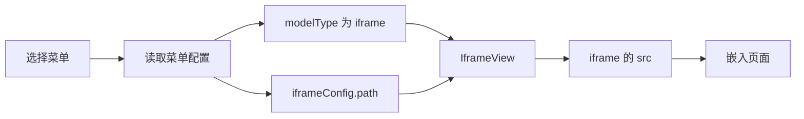

# 模板引擎 - IframeView 实现

<MuxPlayer
  className="mt-8"
  playbackId="srmZ6H5JxbZLYobVWWwH3DswC00aFdl5sKLCTGrH3zxY"
  title="模板引擎 - IframeView 实现"
/>

> [!NOTE]
>
> 本节实现模板引擎的第二种页面承载方式 **IframeView**。前面的侧边栏和视图分发已经能决定当前显示哪一种页面，现在需要把 `modelType: "iframe"` 对应的视图从占位内容变成真正的嵌入页面。
>
> 核心链路很短：菜单 DSL 配置 `iframeConfig.path`，IframeView 取得这个地址，将其绑定到 `iframe` 的 `src`。外层系统继续负责菜单和布局，嵌入页面负责展示自己的内容。
>
> 本地字幕从约 00:01 开始出现长段重复转写，能够可靠确认的实现信息主要集中在开头。下面围绕这些信息解释数据流，代码是按课堂思路整理的简化示例，不作为视频源码逐行还原。

## 课程位置

模板引擎中的不同 View，解决的是不同来源的页面如何进入同一个管理后台。

前面已经有布局容器、菜单以及视图选择逻辑。IframeView 不需要重新实现一套菜单，也不需要把第三方页面的业务代码搬进来。它只在已经分配好的内容区域中，提供一个浏览器原生的页面容器。

课程一开始强调，这节相对简单。简单的原因在于它要解析的 DSL 很少：页面类型决定进入 IframeView，配置中的地址决定打开哪个页面。和后面通过 Schema 生成搜索栏、表格和表单相比，这里没有字段到组件的复杂映射。



## DSL 中需要表达什么

对于 iframe 页面，配置者至少要表达两件事：这是哪一种页面，以及页面地址在哪里。

课程已有的约定是 `modelType` 取 `iframe`，对应配置放在 `iframeConfig` 中，使用 `path` 描述第三方地址。将类型和类型专属配置分开，是前面 DSL 设计的延续。

按课堂思路整理的简化配置如下，地址仅用于说明字段关系：

```js filename="iframe 菜单配置示意.js" copy
const menuItem = {
  key: "external-page",
  name: "外部页面",
  modelType: "iframe",
  iframeConfig: {
    path: "https://example.com/",
  },
}
```

`key` 是菜单身份，`name` 用于展示菜单文字，`modelType` 交给视图分发逻辑，`iframeConfig.path` 才是 iframe 实际需要消费的内容。把这些职责区分开之后，就能理解为什么 IframeView 不应直接把菜单 key 当成 URL，也不应依赖某个固定菜单名称。

将来同一个系统中存在多个 iframe 菜单时，可以复用同一个 IframeView。每一份菜单配置只提供不同的 `path`，组件的基本结构保持一致。这就是本节体现出的配置驱动：页面差异通过数据表达，通用承载方式沉淀在组件中。

## 从占位视图变成页面容器

课程打开 IframeView 时，它已经存在，但还处于开发占位状态。现在需要把占位内容替换为 `iframe` 元素，并为页面地址建立响应式变量。

这里最容易混淆的是配置字段名和浏览器属性名。DSL 中叫 `path`，不代表浏览器元素也有一个用于加载页面的 `path` 属性。组件需要把配置中的 `path` 转换成 `iframe` 的 `src`。

| 位置 | 名称 | 职责 |
| --- | --- | --- |
| 菜单 DSL | `iframeConfig.path` | 声明要嵌入的页面地址 |
| 组件内部 | `path` | 保存当前需要展示的地址 |
| 浏览器元素 | `src` | 触发嵌入文档的加载 |

下面用父组件传入当前菜单的方式演示这段映射。它是对可确认课堂思路的简化说明；项目中的当前菜单也可以由既有菜单解析链路提供。

```vue filename="IframeView.vue（简化示例）" copy
<template>
  <iframe
    v-if="path"
    class="iframe-view"
    :src="path"
    title="嵌入页面"
  />
</template>

<script setup>
import { computed } from "vue"

const props = defineProps({
  menuItem: {
    type: Object,
    default: () => ({}),
  },
})

const path = computed(() => props.menuItem.iframeConfig?.path || "")
</script>

<style scoped>
.iframe-view {
  display: block;
  width: 100%;
  height: 100%;
  border: 0;
}
</style>
```

这段代码中真正支撑业务的数据转换只有一行：从当前菜单中取出 `iframeConfig.path`。其他部分为页面容器提供基本结构和尺寸。空地址时先不渲染，是示例对初始化状态的明确处理，避免把“配置尚未取得”和“已经有目标页面”混成一个状态。

示例使用计算属性表达当前地址。它强调的是地址必须随当前配置变化，不能把初始化时的一次读取误认为整个页面生命周期中的最终值。

## 外层布局与内部页面

IframeView 所处的层级，是后台布局的内容区域。外层菜单切换之后，当前视图可以变为 IframeView；IframeView 再把地址交给浏览器去加载。

因此有两个不同的显示过程：一个是框架显示 IframeView 组件，另一个是浏览器加载 iframe 中的文档。组件已经出现，并不自动代表内部文档已经加载成功。复盘这段代码时，应先检查地址有没有正确从配置传入，再判断地址指向的页面是否能够显示。

本节能够确认的目标是完成“嵌入一个第三方链接”的基本承载。字幕没有提供可靠的跨页面消息通信、统一登录或错误页实现过程，不能把这些能力写成本节已经完成的功能。

## 和其他 View 的关系

IframeView 的价值在于它给模板引擎增加了一条页面来源通道。系统不要求所有页面都由同一种方式编写。

| 视图 | 本阶段的理解重点 |
| --- | --- |
| IframeView | 通过地址承载一个已有页面 |
| CustomView | 为项目中的定制页面保留扩展入口 |
| SchemaView | 根据 Schema 渲染通用业务页面，后续重点实现 |

视图分发统一了页面进入系统的入口，但不同视图可以有不同的内部实现。IframeView 的专属参数是地址，SchemaView 的专属参数则会包含接口、字段结构和组件配置。将它们分开，也使每个视图只需要理解与自己有关的 DSL。

## 本节小结

本节把 IframeView 从开发占位变为可承载页面的视图。它消费 `modelType: "iframe"` 对应的配置，读取 `iframeConfig.path`，再将这个地址交给 iframe 的 `src`。

这条链路展示了模板引擎的一个基本组织方式：上层菜单描述“要显示什么”，视图分发决定“使用哪个 View”，具体 View 完成“如何呈现”。下一节进入 SchemaView 后，这个模式会继续保留，但视图内部需要解析的信息和沉淀的能力会明显增多。
