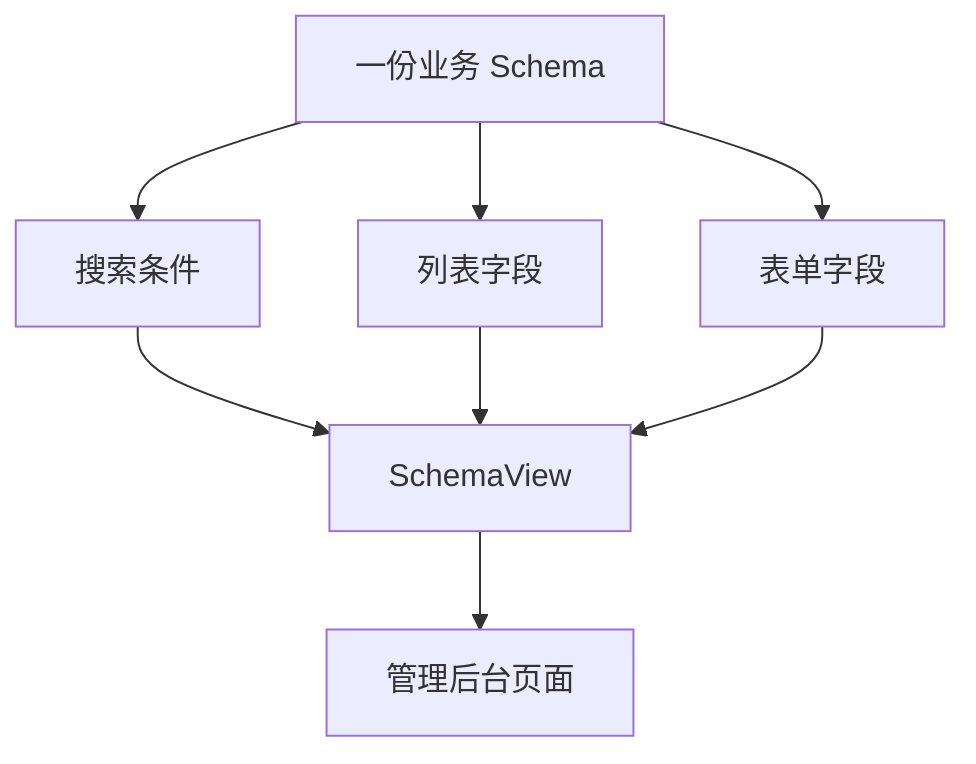
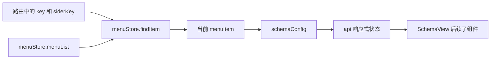
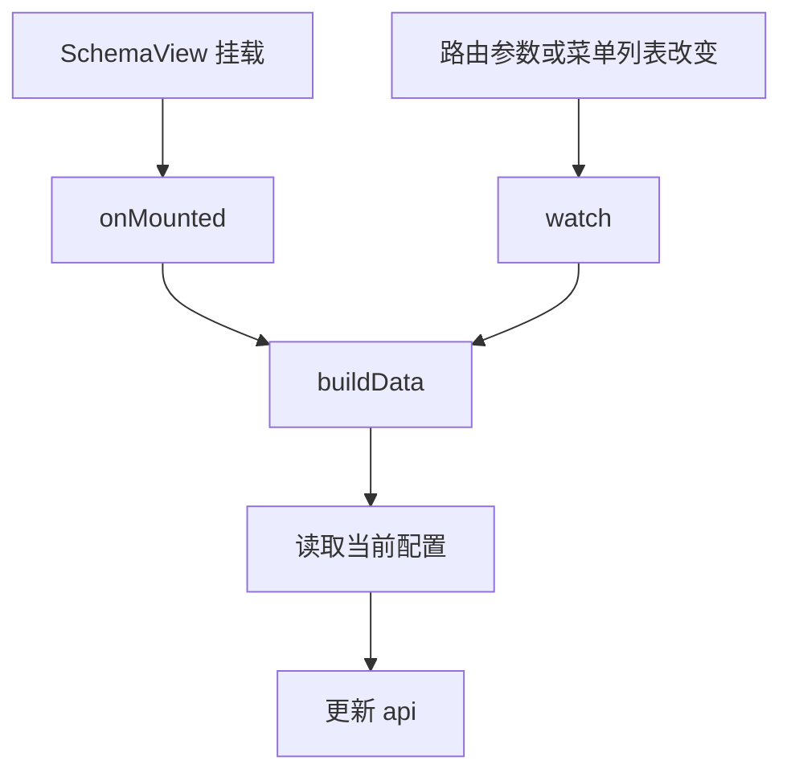

# 模板引擎 - SchemaView 实现

<MuxPlayer
  className="mt-8"
  playbackId="wfn2bGE1LzUvXDtARyNLYVEFRAy7qxAthWnC1EG2KTA"
  title="模板引擎 - SchemaView 实现"
/>

> [!NOTE]
>
> 本节搭建 **SchemaView 的基础框架**：页面上先分出 SearchPanel 和 TablePanel，逻辑上建立 `useSchema`，从当前菜单的 `schemaConfig` 中取得 API 地址。
>
> 重点是理解初始化与菜单切换的不同触发时机。只在 `setup` 中读取一次配置不够，只监听后续变化也不够；课程通过 `onMounted` 与 `watch` 配合，让首次刷新、配置返回、菜单切换和组件重新挂载都能重新构建数据。
>
> 本节尚未完成搜索栏、表格与表单的具体能力。中段字幕存在重复转写，以下重点整理可确认的布局、Hook 与调试过程，示例代码按课堂思路简化。

## 为什么 SchemaView 是模板引擎的核心

课程从常见管理后台的页面形态切入：一份业务数据通常会同时出现在列表、搜索栏以及新增或编辑表单中。例如姓名、年龄、性别既可以成为表格列，也可以成为表单项，其中一部分字段还可以成为搜索条件。

如果每个页面都独立编写这三套结构，就会反复描述同一份业务字段。SchemaView 希望让字段结构成为共同来源，再根据不同组件的需求提取不同配置。

这里所说的“沉淀 80% 重复工作量”是课程对通用管理场景的设计目标，并不是所有业务都能直接套入固定页面。定制部分仍然有扩展入口。当前要先把重复出现的页面结构组织起来，让后续功能有明确的落点。



## 先搭页面骨架

本节采用的开发顺序是先确定组件边界，再逐步填入功能。SchemaView 至少包含两个区域：上方搜索区和下方表格区，因此先创建 SearchPanel 与 TablePanel。

TablePanel 的含义比一个原生表格更大。后续它不仅会包含 SchemaTable，还会承接操作按钮与分页。SearchPanel 也会成为搜索组件与页面逻辑之间的组织层。现在先建立 Panel，可以避免以后把布局、请求、字段解析以及按钮行为全都放进一个大文件。

按课堂思路整理的目录如下，名称用于表达组件关系：

```text filename="SchemaView 组件结构" copy
schema-view/
├── schema-view.vue
├── hooks/
│   └── use-schema.js
└── components/
    ├── search-panel/
    │   └── search-panel.vue
    └── table-panel/
        └── table-panel.vue
```

父组件先完成引入与排列，子组件可以暂时只有占位结构。

```vue filename="schema-view.vue（骨架示例）" copy
<template>
  <div class="schema-view">
    <SearchPanel />
    <TablePanel />
  </div>
</template>

<script setup>
import SearchPanel from "./components/search-panel/search-panel.vue"
import TablePanel from "./components/table-panel/table-panel.vue"
</script>

<style scoped>
.schema-view {
  display: flex;
  flex-direction: column;
  width: 100%;
  height: 100%;
}
</style>
```

课堂在这里先处理宽高与 Flex 布局。样式的作用是给后续搜索区和表格区提供布局空间，并不意味着课程已经确定全部视觉细节。先把区域建立起来，后续写具体能力时才能立即看到其所在位置。

## DSL 会随组件实现逐步完善

前面的 SchemaView 配置还比较粗略，`schemaConfig` 中只有基础轮廓。本节明确说到，后面实现具体组件的过程，也会反过来推动 DSL 增加字段。

这不是先随意写组件、最后再拼配置，而是在已有模型边界内迭代细节。例如当前知道需要 API，先把 API 读取链路建立起来；下一步需要表格列属性和按钮配置，再补充相应 DSL 并扩展解析逻辑。

本阶段可以把当前菜单理解为：

```js filename="当前菜单的 SchemaView 配置示意.js" copy
const menuItem = {
  key: "user-list",
  modelType: "schema",
  schemaConfig: {
    api: "/api/user",
    schema: {
      type: "object",
      properties: {},
    },
    tableConfig: {},
  },
}
```

其中 `api` 是业务资源的接口配置；`schema` 用于描述字段结构；`tableConfig` 留给表格整体的配置。当前一节重点是取得 `api`，不会提前完成后续所有配置解析。

## 将解析逻辑放进 useSchema

页面模板负责摆放组件，菜单配置解析放在 `useSchema` 里。这样组件的结构和“当前菜单对应哪份配置”的计算可以分开演进。

Hook 最初提供一个响应式 `api`，并定义 `buildData`。`buildData` 的工作是根据当前路由中的菜单 key 与侧边栏 key 查找菜单，再读取它的 `schemaConfig`。

前面菜单 Store 已经提供了查找能力，当前直接复用。这个细节说明，通用方法的价值往往在后续功能中不断出现：当菜单查找集中在 Store 中，SchemaView 就不用重新遍历一遍菜单树。



下面把 Store 和路由对象作为参数传入，以便突出本节的依赖关系。实际项目可以在 Hook 内使用已有的路由与 Store 入口。

```js filename="hooks/use-schema.js（简化示例）" copy
import { onMounted, ref, watch } from "vue"

export function useSchema(route, menuStore) {
  const api = ref("")

  function buildData() {
    const key = route.query.key
    const siderKey = route.query.siderKey
    const menuItem = menuStore.findItem(key, siderKey)
    const config = menuItem?.schemaConfig

    api.value = config?.api || ""
  }

  watch(
    [
      () => route.query.key,
      () => route.query.siderKey,
      () => menuStore.menuList,
    ],
    buildData,
  )

  onMounted(buildData)

  return { api }
}
```

示例中的查找参数顺序表达的是“由两级菜单身份定位当前项”，应与项目中已定义的 `findItem` 约定保持一致。复盘时重点不是记住临时变量名，而是确认当前配置由哪些输入共同决定。

## 为什么监听三个来源

课程专门解释了路由参数和菜单列表的变化分别意味着什么。

`key` 与 `siderKey` 的变化通常来自用户选择了不同菜单。菜单变化后，SchemaView 需要重新确定自己当前应该消费哪份配置。

`menuList` 的变化则可能来自页面初始化时获取模型配置的请求。刷新页面时，组件可能先创建，菜单配置随后才返回。如果只看路由参数，地址栏虽然已经有 key，数据源却还没有准备好，配置回来时就缺少重新构建的触发点。

| 输入 | 典型变化来源 | 为什么重新执行 buildData |
| --- | --- | --- |
| `key` | 主菜单选择改变 | 当前业务菜单可能变化 |
| `siderKey` | 侧边栏选择改变 | 当前子菜单可能变化 |
| `menuList` | 模型配置异步返回 | 查找所依赖的数据源更新 |

将这些来源共同监听起来，才能让解析结果跟随真实输入更新。这也为后续扩展 `tableSchema`、`tableConfig` 等状态建立了统一入口。

## 首次为空不一定是解析失败

课堂调试时，SchemaView 一开始打印出来的 API 是空值。老师用一个临时字符串作为初值，再用延时打印观察后续变化，目的是确认拿到的是“初始化那一刻的值”，还是异步变化后的值。

需要把这两种情况分开：初始 `ref("")` 是合法的初始状态；配置已经回来但状态仍不更新，才需要继续检查监听与构建链路。

组件 `setup` 同步执行时，模型请求可能还没有完成。因此直接 `console.log(api.value)` 只能证明当时的状态。它不能证明后续 Watch 从未执行，也不能证明网络返回的配置不存在。

课堂的 `setTimeout` 是观察手段，不是最终解决方案。真正的业务依赖应该由响应式监听与生命周期表达，而不应该假定“一秒后请求一定完成”。

> [!TIP]
>
> 看到初始化空值时，沿着“配置请求返回 → menuList 更新 → watch 触发 → buildData 查找菜单 → api 赋值”逐步检查，比不断延长定时器更容易找到原因。

## 为什么还要 onMounted

课堂随后发现，切换到其他视图再回来时，仅靠已有 Watch 仍然有空值问题，于是补上 `onMounted(buildData)`。

其原因是：组件重新创建时，菜单列表与路由参数可能已经是正确值，但它们并没有在这个组件挂载后再次变化。普通 Watch 等待后续变化，不能自动代替这一次初始化读取。

于是形成两条互补链路。



刷新页面时，挂载逻辑可能先执行，取得空值；等菜单请求完成，Watch 再构建一次。切出后再进入时，配置可能已经存在，挂载逻辑就可以直接读到正确 API。

这里不能把 `onMounted` 理解成异步配置的万能保障。它只表示组件挂载到了某个阶段，并不表示外部请求一定返回。因此课程保留了挂载与监听两种触发来源，让它们共同覆盖不同场景。

## 调试验证的三个场景

本节的完成标准是骨架能显示、Hook 能正确取得当前 API。验证时需要结合课堂出现过的场景，而不仅看首次进入一次。

首先直接刷新页面，观察初始状态和模型配置返回后的状态。API 应该在菜单数据具备后更新。

然后切换到其他菜单，确认当前路由身份发生变化后会重新查找配置。不同菜单即使都使用 SchemaView，也不应该长期沿用上一份 API。

最后从其他类型 View 切回 SchemaView，确认组件挂载时会主动构建数据，不依赖一次实际上不会再发生的参数变化。

这三种场景分别覆盖异步数据、持续存在的组件和重新创建的组件。它们解释了为什么本节花时间调试一个看似简单的 API 字符串：这个时序基础会影响后面所有 Schema 子组件。

## 本节小结

本节完成的是 SchemaView 的框架搭建。页面层面引入 SearchPanel 与 TablePanel，逻辑层面建立 `useSchema` 与 `buildData`，由当前菜单的 `schemaConfig` 取得 API。

最重要的实现点是把首次构建与后续变化都纳入同一条数据链路：挂载时执行一次，路由参数或菜单列表变化时再次执行。后续加入表格 Schema、表格整体配置和搜索 Schema 时，都可以沿着这条已经建立好的链路继续扩展。
