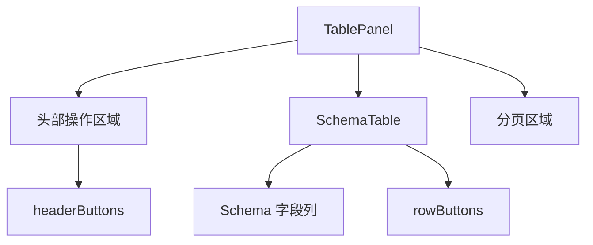
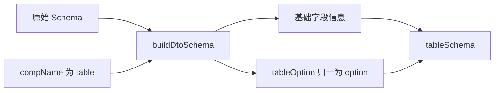

# 模板引擎 - SchemaTable 实现（1）

<MuxPlayer
  className="mt-8"
  playbackId="yJWF36E6yCZj00UB5o3CEKGauBdq7zqQqT8aUuJTZW01k"
  title="模板引擎 - SchemaTable 实现（1）"
/>

> [!NOTE]
>
> 本节开始设计 SchemaTable 所需要的数据协议，但实现重点仍在 **DSL 与解析层**：为字段增加 `tableOption`，为表格整体增加 `headerButtons`、`rowButtons`，再由 `useSchema` 生成表格专用的 `tableSchema` 和 `tableConfig`。
>
> 关键方法是 `buildDtoSchema`。一份原始 Schema 可以同时描述表格、搜索栏和表单，真正交给某个组件时，则只保留基础字段信息以及属于该组件的 `option`，避免每个组件都面对整份配置。
>
> 本节还把 SchemaView 的共享状态通过 `provide/inject` 交给后代组件，为下一节实现 TablePanel 做准备。

## TablePanel 不只是一个表格

课程先从最终页面形态出发。一个常见列表区域，通常包含上方操作按钮、中间数据表格和下方分页控制。操作按钮又可以分成对整个列表生效的按钮，以及针对某一行数据生效的按钮。

新增、导出、批量删除属于整体操作的例子；每条记录后面的编辑、删除则属于行操作。这些例子用于帮助界定配置位置，本节还没有实现完整动作。



因此需要先回答两个问题：某个字段如何描述自己在表格中的表现，以及整个表格区域如何描述操作能力。第一个问题对应字段内部的 `tableOption`，第二个问题对应 `tableConfig`。

## 通用能力与产品规范

正式写代码前，课程用了较长篇幅解释框架的边界。一个管理系统可能把新增按钮放左边，另一个放右边；分页也可能有不同排列。如果把每一种随意差异都当成必须支持的独特需求，通用框架会越来越难以形成稳定的能力。

这里的设计目标是沉淀大量重复的后台功能，同时为实际定制需求留出扩展点。统一布局与组件约定也可以帮助产品和设计形成规范，让相似需求用一致方式表达。

这一点与当前代码有直接关系：课程选择先提供统一的头部操作区、数据列表区和分页区，再逐步开放真正有意义的配置。DSL 不只是技术实现的参数表，也是在表达这个框架支持怎样的业务页面。

当产品可以描述“新增一个模块，包含哪些字段、哪些操作”时，研发就可以把需求对应到配置，而不必为每一张相似表格重新搭结构。反过来，实际使用中发现稳定的差异，也可以继续推动 DSL 演进。

## 以字段为中心增加 tableOption

原始 Schema 的每个 property 表示一个业务字段。要把它渲染为一列，需要字段本身的信息，也需要表格专属配置。

基础信息包括类型与显示名称；表格专属信息包括列宽、最小列宽、固定列、排序、对齐等。课程对照 Element Plus 的 Table Column 配置，决定保留底层组件已有的可配置能力，而不是逐个再发明一套同义字段。

按课堂思路整理的简化 DSL 如下：

```js filename="schemaConfig 示例.js" copy
const schemaConfig = {
  api: "/api/user",
  schema: {
    type: "object",
    properties: {
      name: {
        type: "string",
        label: "姓名",
        tableOption: {
          visible: true,
          minWidth: 160,
          align: "left",
        },
      },
      age: {
        type: "number",
        label: "年龄",
        tableOption: {
          visible: true,
          width: 100,
        },
      },
    },
  },
  tableConfig: {
    headerButtons: [],
    rowButtons: [],
  },
}
```

`tableOption` 中既包含框架扩展字段，也可以直接包含底层列组件的属性。后续通过 `v-bind` 将这些属性绑定到列组件，框架再单独解释显示控制等扩展语义。代码用于说明课堂设计关系，不是视频源码的逐行复刻。

`visible` 属于框架扩展的语义。它决定这个字段是否参与表格展示；列宽、对齐等属于底层表格列的表现属性。解析器需要先处理参与展示的问题，再把适合透传的属性交给表格列。

> [!IMPORTANT]
>
> 字幕在说明 `visible` 默认值时存在口误与转写冲突，不能据此写出相互矛盾的规则。后续实现会明确区分“没有配置对应 Option”与“已经配置 Option、其中 visible 没有显式关闭”两种情况。本节先记住：Option 决定字段参与哪个组件，visible 再控制该组件中的显示。

## 字段配置和整体配置的边界

`tableOption` 应当放在某个 property 内，因为它只影响一列。`tableConfig` 则放在 `schemaConfig` 中，因为头部按钮与行按钮属于整个表格能力。

| 配置位置 | 描述对象 | 本节新增内容 |
| --- | --- | --- |
| `schema.properties.name` | 业务字段 | `type`、`label` 等基础信息 |
| `schema.properties.name.tableOption` | 该字段在表格中的表现 | 显示控制、底层列属性 |
| `schemaConfig.tableConfig` | 整个表格区域 | `headerButtons`、`rowButtons` |

这种层级关系也方便以后扩展。同一个字段还可以拥有 `formOption` 或 `searchOption`，但搜索项不应被迫理解表格的列宽配置，表格也不应关心表单使用哪种输入控件。

## 扩展 useSchema 的输出

上一节 `useSchema` 只提供 API。本节继续沿用 `buildData` 入口，新增两个响应式结果：`tableSchema` 和 `tableConfig`。

`tableSchema` 是字段级描述，决定列从哪里来；`tableConfig` 是整体描述，决定表格区域有哪些操作。两者来源于同一份当前菜单配置，但后续消费者不同，因此在 Hook 中分开输出。

课程同时注意到，解析时如果直接修改 Store 中的原始配置，可能污染后续其他组件需要使用的数据。因此先复制 Schema，再在副本上加工。

```js filename="复制 Schema（课堂思路简化）.js" copy
const configSchema = JSON.parse(JSON.stringify(schemaConfig.schema || {}))
```

这里的 JSON 序列化复制，适用于课程当前这种可序列化的配置数据。它并不是适用于任意 JavaScript 对象的通用深拷贝方案；同样，`Object.assign` 只复制一层，不能因为语法简短就把它当作深拷贝。课程借这个步骤提醒学习者思考对象引用和副本之间的区别。

复制的目的并不是“用了副本代码就一定更好”，而是确定修改边界：模型配置是输入，表格 DTO 是输出。对输出做整理，不应改变输入在其他用途中的含义。

## 为什么还需要 DTO Schema

如果直接将整个 Schema 放入 `tableSchema`，表格就会收到 `tableOption`、`formOption`、`searchOption` 等全部信息。它可能暂时不用这些额外数据，但每一层组件都会携带它们，后续还可能逐渐依赖不属于自己的配置。

课程把这些无关配置称为“噪音”，并提出 `buildDtoSchema(schema, compName)`：通过组件名称，提取该组件真正需要的数据。



这里的 DTO 可以理解为传递给组件的数据形态。它没有新增一份业务模型，只是在已有模型上形成面向某个使用场景的结果。

## buildDtoSchema 的处理步骤

这个方法先创建一个包含 `type` 与 `properties` 的结果对象，再遍历原始字段。对于每个字段，检查是否存在当前组件对应的 Option，例如 `compName` 为 `table` 时，检查 `tableOption`。

如果没有对应 Option，就不把这个字段纳入当前组件的 DTO。若存在，则先复制非 Option 的基础信息，再将选中的 Option 统一放到 `option` 字段下。

下面是按课堂思路整理的自洽简化实现：

```js filename="build-dto-schema.js（简化示例）" copy
export function buildDtoSchema(schema = {}, compName) {
  const dtoSchema = {
    type: schema.type || "object",
    properties: {},
  }

  const optionKey = `${compName}Option`

  for (const [key, property] of Object.entries(schema.properties || {})) {
    if (!Object.prototype.hasOwnProperty.call(property, optionKey)) {
      continue
    }

    const dtoProperty = {}

    for (const [propertyKey, value] of Object.entries(property)) {
      if (!propertyKey.endsWith("Option")) {
        dtoProperty[propertyKey] = value
      }
    }

    dtoProperty.option = property[optionKey] || {}
    dtoSchema.properties[key] = dtoProperty
  }

  return dtoSchema
}
```

课堂通过判断属性名是否包含 `Option` 去掉组件专属配置，示例使用后缀约定使规则更明确。两者都依赖 DSL 已经约定好各类配置以 `Option` 命名。

以姓名字段为例，输入可能同时包含 `tableOption` 和 `formOption`；提取表格 DTO 后，输出保留 `type`、`label` 以及来自 `tableOption` 的 `option`。表格组件于是只需要读取 `property.option`，不需要在内部再写一遍“当前是 table，所以找 tableOption”。

```js filename="DTO 转换结果示意.js" copy
const input = {
  type: "object",
  properties: {
    name: {
      type: "string",
      label: "姓名",
      tableOption: { visible: true },
      formOption: { placeholder: "请输入姓名" },
    },
  },
}

// buildDtoSchema(input, "table") 的结果
const output = {
  type: "object",
  properties: {
    name: {
      type: "string",
      label: "姓名",
      option: { visible: true },
    },
  },
}
```

## 清空与重新赋值的时序

课程在构建新配置前先清空 `tableSchema`、`tableConfig`，再通过 `nextTick` 赋入新的结果。这是在当前组件渲染链路中，让旧配置与新配置之间形成明确的更新阶段。

这一写法不能概括为“Vue 更新对象前必须先清空”。响应式赋值本身不要求这么做。这里需要理解的是课程当时希望避免旧组件结构残留，并为后续依赖 Schema 的渲染逻辑提供一个重新建立的过程。

```js filename="buildData 中的表格数据构建片段.js" copy
import { nextTick, ref } from "vue"
import { buildDtoSchema } from "./build-dto-schema"

const tableSchema = ref({})
const tableConfig = ref({})

async function buildTableData(schemaConfig) {
  const copiedSchema = JSON.parse(
    JSON.stringify(schemaConfig.schema || {}),
  )

  tableSchema.value = {}
  tableConfig.value = {}

  await nextTick()

  tableSchema.value = buildDtoSchema(copiedSchema, "table")
  tableConfig.value = schemaConfig.tableConfig || {}
}
```

这段片段仅突出本节新增部分。实际 `buildData` 仍由上一节的菜单定位逻辑取得 `schemaConfig`，仍然会响应挂载以及路由、菜单配置的变化。

## 通过 provide/inject 共享数据

有了 API、tableSchema、tableConfig 后，还需要把它们交给实际组件。直接通过 Props 可以实现，但组件层级逐渐变深：SchemaView 下有 TablePanel，TablePanel 下还有操作区和 SchemaTable；搜索区也有自己的后代组件。

如果每一层都只为下一层转发同一组数据，会产生大量重复传参。因此本节选择在 SchemaView 中 `provide` 一组共享状态，需要的后代组件自行 `inject`。

```js filename="SchemaView 中提供共享状态.js" copy
import { provide } from "vue"

// 以下状态来自 useSchema 的返回结果。
provide("schemaViewData", {
  api,
  tableSchema,
  tableConfig,
})
```

```js filename="后代组件读取共享状态.js" copy
import { inject } from "vue"

const { api, tableSchema, tableConfig } = inject("schemaViewData")
```

这里传递的是响应式对象本身，后代才能跟随其变化。如果提前取出 `.value` 再将某一时刻的普通值当作最终配置传递，就容易丢失本节已经建立的数据更新关系。

Props 和依赖注入分别适合不同场景。课程没有要求所有组件通信都改成注入；当只是父组件给直接子组件提供少量参数时，Props 依然很自然。当前选择依赖注入，是因为多个较深的后代需要共享一组页面上下文。

## 本节小结

本节为 SchemaTable 建立了数据基础。字段使用 `tableOption` 描述列相关配置，整体通过 `tableConfig` 预留头部按钮与行按钮。`useSchema` 继续承担当前菜单配置到页面状态的转换，新增 `tableSchema` 与 `tableConfig`。

`buildDtoSchema` 是本节的核心：从同一份模型中提取组件需要的字段，去掉其他组件的 Option，再把选中的配置归一为 `option`。最终由 SchemaView 使用 `provide/inject` 将这些状态交给后代，下一节就可以在 TablePanel 内真正消费这些结果。
