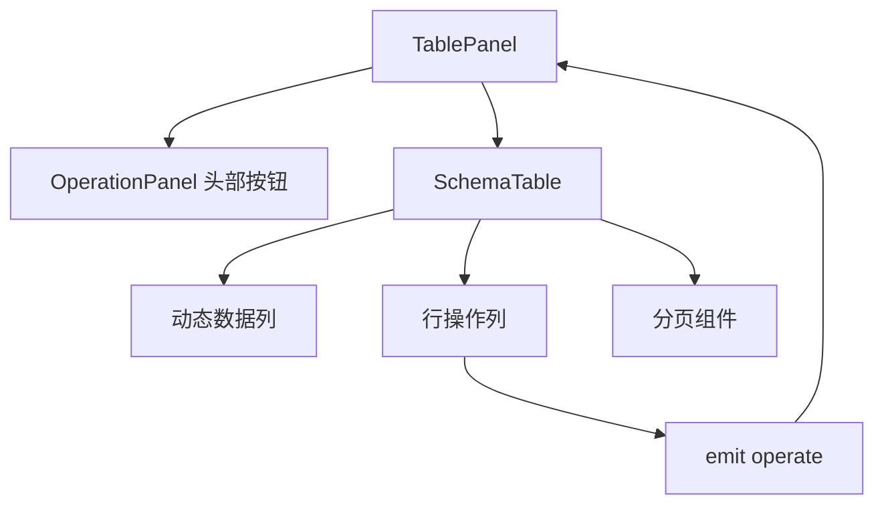

# 模板引擎 - SchemaTable 实现（2）

<MuxPlayer
  className="mt-8"
  playbackId="1AU2svUP1B00kKYSs5jCtny8iixa6VMX3j4CFIGriRPw"
  title="模板引擎 - SchemaTable 实现（2）"
/>

> [!NOTE]
>
> 本节实现可复用的 **SchemaTable**。它接收 Schema、资源 API 和行按钮配置，在内部完成列表请求、字段预处理、动态列渲染与分页，并向外发出操作事件。
>
> 本节的重点不仅是把 Element Plus Table 包起来，还包括组件边界：接收哪些属性、发出什么事件、暴露哪些方法，以及哪些业务应当留给 TablePanel。课堂还讨论了多次初始化造成重复请求的问题，并用延迟合并的方式处理。
>
> 以下代码均为按课堂思路整理的简化示例。字段与方法名尽量保留课程约定，对转写造成的术语错误和容易误用的边界条件作必要说明。

## 从 TablePanel 中拆出 SchemaTable

TablePanel 包含头部操作区和表格区域。SchemaTable 放在公共 `widgets` 中，对 Element Plus Table 做二次封装，增加按 Schema 工作的能力。

这个拆分决定了两者的职责：TablePanel 组织页面业务，SchemaTable 组织表格展示。头部按钮属于 TablePanel；每一行的操作按钮出现在 SchemaTable 内，但点击后的具体业务仍然交给外层处理。



课程先搭出容器、Table 区和 Pagination 区，再定义逻辑。这样结构清晰之后，后面的状态、请求与事件都有明确落点。

## 继续完善按钮 DSL

上一节仅预留 `headerButtons` 和 `rowButtons`，本节为每个按钮增加更明确的协议。

| 字段 | 作用 |
| --- | --- |
| `label` | 按钮显示文字 |
| `eventKey` | 点击后要触发的事件标识 |
| `eventOption` | 当前事件所需的配置 |
| Element Plus Button 属性 | 按钮类型、颜色表现、是否禁用等外观与交互属性 |

课程将原先较泛的 `option` 改为 `eventOption`，目的是让它的职责更明确：这部分配置属于事件，不是按钮全部属性的统称。

```js filename="按钮 DSL（简化示例）" copy
const button = {
  label: "删除",
  eventKey: "remove",
  eventOption: {},
  type: "danger",
}
```

按钮不需要再区分 `tableOption`、`formOption` 等不同使用场景，因此底层按钮属性可以直接与 `label` 等字段处于同一层。使用时再通过 `v-bind` 传给按钮组件。

此时 `eventOption` 只建立结构，具体删除参数和动态组件配置将在后续课程继续展开。不能把预留字段等同于已经完成全部行为。

## 先定义组件对外协议

SchemaTable 接收三个核心属性：`schema`、`api`、`buttons`。

`schema` 已经过上一节的 DTO 处理，字段中直接使用 `option`，不再使用 `tableOption`。`api` 是资源接口基础地址。`buttons` 是当前表格的行操作配置，由外层把 `tableConfig.rowButtons` 传进来。

```js filename="SchemaTable 属性与事件.js" copy
import { toRefs } from "vue"

const props = defineProps({
  schema: { type: Object, default: () => ({}) },
  api: { type: String, default: "" },
  buttons: { type: Array, default: () => [] },
})

const { schema, api, buttons } = toRefs(props)
const emit = defineEmits(["operate"])
```

课堂使用 `toRefs` 将 Props 中的字段拆出，保留响应式联系。这里的目的不是改变父组件传入的值，而是让后面监听 Schema 与 API 变化时仍然能够追踪到它们。

同时先定义 `operate` 事件，就等于提前确定：点击行按钮只向外报告配置和行数据，组件不直接写入具体业务。

## 一个 API 如何支持多种操作

课程专门解释，DSL 只有一个 `api` 并不代表它只能支持一个请求。框架约定以一个基础地址描述业务资源，再通过 HTTP 方法与列表子路径表达不同操作。

| 动作 | 课堂采用的接口约定 |
| --- | --- |
| 获取单条记录 | `GET /api/user` |
| 新增记录 | `POST /api/user` |
| 修改记录 | `PUT /api/user` |
| 删除记录 | `DELETE /api/user` |
| 获取列表 | `GET /api/user/list` |

这是课程在自身 BFF 层上统一的资源接口约定。列表加 `/list` 是项目的具体设计，不能把它写成所有 REST 接口必须采用的形式。

BFF 的意义也在这里体现出来：页面面对的是自己能够统一管理的 Node.js 接入层，下游真实服务即使有不同形式，也可以在服务端适配。页面端的通用组件因此可以依赖稳定协议，而不用分别接入每个后端的特殊写法。

## 建立内部状态

SchemaTable 内部需要加载状态、当前列表、当前页、每页条数和总条数。课程默认当前页为 1，每页 50 条，总条数为 0。

```js filename="SchemaTable 内部状态.js" copy
import { ref } from "vue"

const loading = ref(false)
const tableData = ref([])
const currentPage = ref(1)
const pageSize = ref(50)
const total = ref(0)

function showLoading() {
  loading.value = true
}

function hideLoading() {
  loading.value = false
}
```

这里要区分列表数据与总条数：列表是数组，`total` 是数字。下一节联调时就会遇到错误分支把 `total` 设为数组而导致分页组件属性校验失败的问题。

`showLoading` 和 `hideLoading` 虽然只包了一次赋值，但它们会成为组件向外提供的方法。外部执行删除或其他操作时，可以控制表格的等待状态，而不必知道组件内部状态变量叫什么。

## 初始化与普通刷新不同

`initData` 将分页恢复到初始状态，再触发数据加载。普通 `loadTableData` 则只重新加载当前查询条件下的数据。

这两个动作看似相近，但对用户感知不同：初始化会回到第一页；刷新可以保留当前页。课程先把它们区分出来，下一节删除成功后的页面行为就会用到这个差别。

```js filename="初始化表格数据.js" copy
import { nextTick } from "vue"

async function initData() {
  currentPage.value = 1
  pageSize.value = 50
  await nextTick()
  loadTableData()
}
```

这里的 `loadTableData` 会再调用真正发送请求的 `fetchTableData`。额外这一层用于合并短时间内的重复触发，而不是把所有逻辑都放进初始化方法。

## 请求列表并处理返回结果

请求地址由资源 API 拼接 `/list`，查询参数使用 `page` 与 `size`。响应成功后，列表数据需要经过预处理，总条数从元数据中取得。

```js filename="获取列表数据（简化示例）.js" copy
async function fetchTableData() {
  if (!api.value) return

  showLoading()
  try {
    const result = await curl({
      method: "get",
      url: `${api.value}/list`,
      query: {
        page: currentPage.value,
        size: pageSize.value,
      },
    })

    if (!result?.success || !Array.isArray(result.data)) {
      tableData.value = []
      total.value = 0
      return
    }

    tableData.value = buildTableData(result.data)
    total.value = Number(result.metadata?.total || 0)
  } finally {
    hideLoading()
  }
}
```

示例假定 `curl` 是项目已有的公共请求封装，遵循课程的请求选项与返回协议。错误提示由公共层统一处理，表格层主要负责把渲染数据恢复到合理状态，避免重复弹出同一种错误。

空 API 的检查对应异步初始化场景。组件挂载时模型配置可能尚未到达，这时不应该拼出一个无意义的列表地址去请求。

## 数据返回后为什么还要 buildTableData

后端返回的数据未必适合直接展示。课程先以枚举值转换为可读文本举例，随后实际增加了 `toFixed` 配置，演示如何在 Schema 中声明格式要求，再在表格数据预处理阶段执行。

例如价格字段希望保留两位小数，可以在原始 `tableOption` 中配 `toFixed: 2`。经过 DTO 转换后，SchemaTable 从 `option.toFixed` 读取这个要求。

```js filename="buildTableData（简化示例）.js" copy
function buildTableData(listData) {
  const properties = schema.value.properties
  if (!properties) return listData

  return listData.map((sourceRow) => {
    const rowData = { ...sourceRow }

    for (const key of Object.keys(rowData)) {
      const digits = properties[key]?.option?.toFixed
      const value = rowData[key]

      if (
        Number.isInteger(digits) &&
        digits >= 0 &&
        digits <= 100 &&
        typeof value === "number" &&
        Number.isFinite(value)
      ) {
        rowData[key] = value.toFixed(digits)
      }
    }

    return rowData
  })
}
```

示例显式接受 `toFixed: 0`，并检查数据确实为数字，避免把 `0` 当作“没有配置”，或对字符串直接调用数字方法。格式化后的结果为字符串，目的是展示；不要把这种展示值误认为原始数值。

这里重要的是扩展路径：DSL 增加一项能力，解析渲染层同步增加对它的处理。仅在配置中写出 `toFixed`，不会让浏览器自动理解其语义。

## 监听与挂载可能导致重复请求

Schema 与 API 都是从模型配置中解析出来的，因此 SchemaTable 既需要在挂载时初始化，也需要监听这些输入后续变化。

```js filename="SchemaTable 初始化触发.js" copy
import { onMounted, watch } from "vue"

onMounted(initData)
watch([schema, api], initData)
```

这与上一节 SchemaView 的时序问题一致，但这里又多了一个后果：每次初始化都会发请求。挂载、Schema 更新、API 更新发生得很近时，可能连续发出相同列表请求。

用 `loading` 当锁可以阻止一个请求尚未结束时再发请求，但它限制的是请求进行中的区间。如果接口响应很快，两次输入变化之间前一个请求已经完成，仍然会重复发送。

课程因此在 `loadTableData` 中使用清除旧定时器、重新等待 100 毫秒的方式合并触发。

```js filename="loadTableData 合并重复触发.js" copy
import { onBeforeUnmount } from "vue"

let timerId = null

function loadTableData() {
  if (timerId !== null) clearTimeout(timerId)

  timerId = setTimeout(() => {
    timerId = null
    void fetchTableData()
  }, 100)
}

onBeforeUnmount(() => {
  if (timerId !== null) clearTimeout(timerId)
  timerId = null
})
```

> [!IMPORTANT]
>
> 课堂把这段逻辑称为“节流”，但从行为上看，它是防抖：每次新触发都会重新计算等待时间，停止连续触发一段时间后才执行。固定时间窗口内按频率执行才是通常所说的节流。

100 毫秒是课堂示例值。它以很短的延迟换取同一轮配置变化只触发一次加载。定时器执行后置空有助于让状态准确表达“当前没有待执行任务”；浏览器定时器标识通常是数字，不能把“未置空”直接等同于一定发生闭包内存泄漏。示例同时补充卸载清理，使定时器生命周期完整。

## 用 Schema 渲染动态列

表格数据来自请求，列结构来自 `schema.properties`。这两个输入合起来，才构成完整的列表。

每个字段的 key 对应列的 `prop`，`label` 对应表头，`option` 通过 `v-bind` 透传到底层列组件。显示条件采用 `visible !== false`，意味着字段已经进入表格 DTO 后，只有显式关闭才隐藏。

```vue filename="SchemaTable 动态列模板.vue" copy
<el-table
  v-if="schema?.properties"
  v-loading="loading"
  :data="tableData"
>
  <template v-for="(item, key) in schema.properties" :key="key">
    <el-table-column
      v-if="item.option?.visible !== false"
      v-bind="item.option"
      :prop="key"
      :label="item.label"
    />
  </template>
</el-table>
```

课程实际采用的是 `option` 内直接放置底层列属性，例如 `width`、`align`，再整体绑定；不需要再嵌套另一层配置容器。`visible`、`toFixed` 等扩展字段由框架解释，底层列属性则发挥原有能力。

`v-if` 控制是否建立组件；`v-show` 通过 CSS 切换显示，隐藏时同样不占正常布局空间。选择 `v-if` 的重点在于未满足条件时不创建当前表格结构，不能用“一个占位、一个不占位”简单概括两者。

## 操作列为什么需要单独实现

业务字段列通过 Schema 动态生成，操作列则是一个固定结构。只有存在行按钮时才显示，列名为“操作”，通常固定在右侧。

列宽不能简单按按钮个数乘固定宽度，因为“修改”和“查看信息”的文字长度不同。课程用每个按钮 `label.length` 乘一个经验像素值，再通过 `reduce` 累加，得到操作列宽。

```js filename="操作列宽度.js" copy
import { computed } from "vue"

const operationWidth = computed(() =>
  buttons.value.reduce(
    (width, button) => width + String(button.label || "").length * 18,
    50,
  ),
)
```

这个估算服务于课堂布局，并非精确的文字测量。`computed` 的价值在于它依赖按钮配置，配置不变时复用计算结果，配置变化时重新求值。

## 通过插槽渲染行按钮

每一行按钮需要知道它所在的行，因此使用 Table Column 的默认作用域插槽取得 `row`，再把按钮配置和行数据一起交给事件处理函数。

```vue filename="SchemaTable 行操作列.vue" copy
<el-table-column
  v-if="buttons.length > 0"
  label="操作"
  fixed="right"
  :width="operationWidth"
>
  <template #default="{ row }">
    <el-button
      v-for="(button, index) in buttons"
      :key="index"
      v-bind="button"
      link
      @click="operationHandler(button, row)"
    >
      {{ button.label }}
    </el-button>
  </template>
</el-table-column>
```

```js filename="SchemaTable 操作事件.js" copy
function operationHandler(buttonConfig, rowData) {
  emit("operate", buttonConfig, rowData)
}
```

这段逻辑没有直接删除记录，也没有直接打开商品编辑窗口。通用表格只报告“用户对哪一行点击了什么配置的按钮”。外层根据 `eventKey` 决定具体行为，才能保持组件在不同业务资源之间复用。

## 分页与外部方法

分页组件绑定 `currentPage`、`pageSize` 和 `total`，提供总条数、条数选择、上一页、页码、下一页与跳转入口。课程给出每页 10、20、30、50、100、200 条等选项。

页码或条数变化时，先更新本地状态，再调用有防抖处理的 `loadTableData`，而不是直接绕过它调用请求函数。

```js filename="分页事件与组件方法.js" copy
function onPageSizeChange(value) {
  pageSize.value = value
  loadTableData()
}

function onCurrentPageChange(value) {
  currentPage.value = value
  loadTableData()
}

defineExpose({
  initData,
  loadTableData,
  showLoading,
  hideLoading,
})
```

这四个方法让外部具备重新初始化、当前页刷新、显示等待和隐藏等待的能力。组件对外协议于是完整形成：Props 输入配置，事件输出用户动作，方法允许外部驱动必要的组件状态。

## 本节小结

SchemaTable 在本节完成了基本封装：解析 Schema 生成列，根据资源 API 获取列表，按配置预处理数据，渲染行操作与分页，并通过防抖合并相邻的重复加载。

更重要的是边界已经清楚。表格组件管理自己的数据展示与分页状态，具体业务操作由外层响应 `operate` 事件完成。下一节将把 SchemaTable 接入 TablePanel，真正串起头部按钮、删除操作和页面联调。
