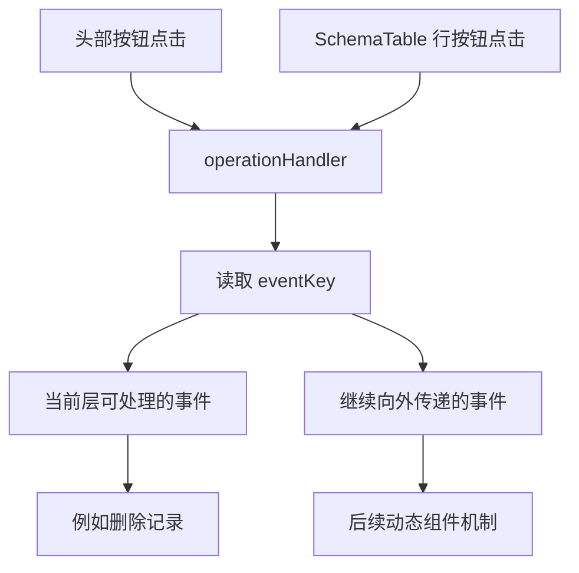
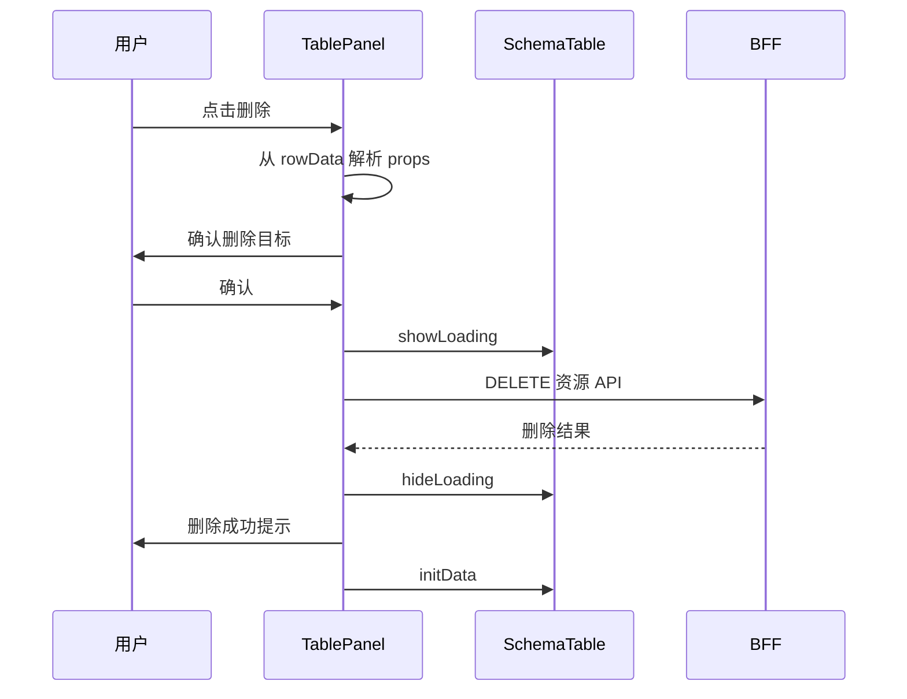

# 模板引擎 - SchemaTable 实现（3）

<MuxPlayer
  className="mt-8"
  playbackId="7jLtBCceVTthy8C3QNrMSzdgjs9II7jQhwxh95PeYzU"
  title="模板引擎 - SchemaTable 实现（3）"
/>

> [!NOTE]
>
> 本节将已经实现的 SchemaTable 接入 **TablePanel**，把表格组件协议变成可用的页面：注入 SchemaView 数据、传递属性、渲染头部按钮、处理操作事件，并实现删除后的刷新流程。
>
> 课程继续完善 DSL，使用 `eventOption.props` 描述事件参数，使用 `schema::字段名` 从当前行动态取值。随后以商品管理配置进行联调，逐项解决暂时性死区、命名不一致、属性类型、按钮文字和分页布局等问题。
>
> 本地字幕多段出现重复转写，服务端测试接口的部分细节无法可靠还原。以下保留能够确认的实现链路，代码为按课堂思路整理的简化示例。

## TablePanel 如何使用 SchemaTable

上一节写完的 SchemaTable 是通用组件。本节需要一个页面组织层，把模型解析结果交给它，同时响应它发出的操作事件。

SchemaView 已通过 `provide("schemaViewData", ...)` 提供 API、tableSchema 与 tableConfig，因此 TablePanel 使用同名 key 注入这些状态。共享数据不需要再经过多个父子层级重复转发。

```vue filename="TablePanel.vue（接入片段）" copy
<template>
  <div class="table-panel">
    <div
      v-if="tableConfig.headerButtons?.length > 0"
      class="operation-panel"
    >
      <el-button
        v-for="(button, index) in tableConfig.headerButtons"
        :key="index"
        v-bind="button"
        @click="operationHandler(button)"
      >
        {{ button.label }}
      </el-button>
    </div>

    <SchemaTable
      ref="schemaTableRef"
      :schema="tableSchema"
      :api="api"
      :buttons="tableConfig.rowButtons || []"
      @operate="operationHandler"
    />
  </div>
</template>

<script setup>
import { inject, ref } from "vue"
import SchemaTable from "@/widgets/schema-table/schema-table.vue"

const { api, tableSchema, tableConfig } = inject("schemaViewData")
const schemaTableRef = ref(null)
</script>
```

片段中的路径代表公共组件的归属，具体别名使用项目已有约定。最重要的映射是：`tableSchema` 传给 `schema`，`tableConfig.rowButtons` 传给 `buttons`。原始 DSL 的字段名和通用组件属性名可以不同，连接它们正是 TablePanel 的职责。

## 头部操作和行操作共享入口

头部按钮与行按钮都包含 `label`、`eventKey`、`eventOption` 以及底层按钮属性。区别在于行按钮有当前行数据，头部按钮通常没有。

因此可以统一进入 `operationHandler(buttonConfig, rowData)`。头部点击时只传按钮配置，SchemaTable 发出事件时则同时传配置与行数据。



课程中 `remove` 在当前 TablePanel 中实现。`showComponent` 等事件先保留向外传递的入口，为后面的动态组件铺路。不能因为按钮已经能发出 `showComponent`，就认定新增或编辑表单已经在本节完成。

下面用事件映射表达这个结构，函数声明也避开了课堂后面遇到的声明顺序问题：

```js filename="TablePanel 操作分发（简化示例）.js" copy
const emit = defineEmits(["operate"])

const eventHandlers = {
  remove: removeData,
}

function operationHandler(buttonConfig, rowData) {
  const handler = eventHandlers[buttonConfig.eventKey]

  if (handler) {
    return handler(buttonConfig, rowData)
  }

  emit("operate", buttonConfig, rowData)
}

async function removeData(buttonConfig, rowData) {
  // 删除逻辑在后续片段展开。
}
```

## 为什么删除参数不能写死

删除操作必须知道删哪一条记录。不同业务可能使用 `userId`、`productId` 或其他字段作为标识，TablePanel 不能硬编码只接受某一个字段。

另一方面，按钮配置本身是静态描述，而真正被删除的记录由用户点击的那一行决定。因此需要让静态 DSL 表达“到当前行里取一个值”的规则。

课程为此采用 `schema::字段名`：双冒号前的 `schema` 表示从数据记录解析，后面的名称指定要读取的字段。

```js filename="商品删除按钮配置.js" copy
const removeButton = {
  label: "删除",
  eventKey: "remove",
  eventOption: {
    props: {
      productId: "schema::productId",
    },
  },
  type: "danger",
}
```

这里要区分两个 key。`props` 对象中的 `productId` 是请求参数名；字符串 `schema::productId` 中的 `productId` 是当前行中的取值字段名。它们可以在简单场景中相同，但承担的职责不同。

## 静态参数与动态参数

事件参数既可能是固定常量，也可能来自当前行。课程在解释 DSL 时明确提出这两种情况，所以解析时不能把所有字符串都当作字段名。

例如固定的来源标识可以直接保留；只有符合约定的 `schema::...` 才到行数据中取值。这个规则让 DSL 可以表达差异，却无需在配置中嵌入 JavaScript 回调。

```js filename="事件参数取值（简化示例）.js" copy
function resolveValue(value, rowData = {}) {
  if (typeof value !== "string") return value

  const prefix = "schema::"
  if (!value.startsWith(prefix)) return value

  const field = value.slice(prefix.length)
  return rowData[field]
}

const row = { productId: "product-001", productName: "示例商品" }

resolveValue("schema::productId", row) // "product-001"
resolveValue("manual", row) // "manual"
resolveValue(1000, row) // 1000
```

本节删除场景主要使用一个关键参数。先通过 `Object.keys(props)` 取得参数名，再解析对应值。后续其他事件可能需要多个参数，那时可以进一步复用或扩展相同规则。

> [!TIP]
>
> 配置中的动态表达式只是一个约定，必须由解析代码主动处理。直接将 `schema::productId` 发给后端，后端收到的只会是这个字符串，而不是用户点击行里的真实 ID。

## 删除前增加二次确认

解析出删除标识后，课程没有立刻发出删除请求，而是先使用确认弹窗。提示信息带上关键参数和值，让用户知道即将操作哪条记录。

删除流程可以拆成明确阶段：解析参数、确认、显示等待、发送请求、处理结果、隐藏等待、刷新表格。



下面的实现沿用课程的资源 API 与请求封装，突出各阶段的职责。确认取消应结束流程，不应被误报为删除接口失败。

```js filename="TablePanel 删除操作（简化示例）.js" copy
import { ElMessageBox, ElNotification } from "element-plus"

async function removeData(buttonConfig, rowData = {}) {
  const props = buttonConfig.eventOption?.props
  if (!props) return

  const [removeKey] = Object.keys(props)
  if (!removeKey) return

  const removeValue = resolveValue(props[removeKey], rowData)
  if (removeValue === undefined || removeValue === null) return

  try {
    await ElMessageBox.confirm(
      `确认删除 ${removeKey} 为 ${removeValue} 的数据？`,
      "删除确认",
      {
        type: "warning",
        confirmButtonText: "确认",
        cancelButtonText: "取消",
      },
    )
  } catch {
    return
  }

  schemaTableRef.value?.showLoading()

  try {
    const result = await curl({
      method: "delete",
      url: api.value,
      query: { [removeKey]: removeValue },
      errorMessage: "删除失败",
    })

    if (!result?.success) return

    ElNotification.success({ message: "删除成功" })
    initTableData()
  } finally {
    schemaTableRef.value?.hideLoading()
  }
}
```

请求参数到底通过 Query 还是请求体传递，需要与服务端删除接口约定一致；本段采用课堂按动态 key 拼参数的思路，重点在于真实参数已经由 DSL 与行数据共同生成。

## 通过 ref 调用子组件方法

上一节 SchemaTable 暴露了 `showLoading`、`hideLoading`、`loadTableData` 与 `initData`，本节正式用到这些方法。

TablePanel 持有组件 ref，不需要直接修改 SchemaTable 内部状态。它只调用组件对外承诺的方法，这样表格内部如何管理 Loading、分页或数据数组，都可以继续封装在表格里。

```js filename="TablePanel 对外方法.js" copy
function loadTableData() {
  schemaTableRef.value?.loadTableData()
}

function initTableData() {
  schemaTableRef.value?.initData()
}

defineExpose({
  loadTableData,
  initTableData,
})
```

TablePanel 再向外暴露一层方法，是因为后续搜索区、动态表单提交等行为也需要刷新列表。外层页面可以操作 TablePanel，不必跨过它直接查找更深处的 SchemaTable。

这与数据向下、事件向上的关系形成互补：Props 给数据，事件报告动作，方法用于明确的外部命令。三者都应该有清楚语义。

## 删除后为什么回到第一页

课程在这里停下来讨论一个具体边界：当前列表有三页，第三页只剩一条记录。如果删掉它后仍加载第三页，页面就会显示空列表，看起来像出了故障。

直接调用 `loadTableData` 会保留当前页，因此可能遇到这个问题。调用 `initData` 则恢复第一页，可以避免停留在已经不存在的末页。

本节选择删除成功后调用初始化方法。代价是用户在中间页删除记录后也会回到第一页，但在现阶段，这个行为更明确。

课程也提到更细致的后续优化：如果当前已经是末页，删除后再判断是否需要回退到前一页。它属于提出的改进方向，并不是本节已经实现的功能。

| 方法 | 保留当前页 | 本节的典型用途 |
| --- | --- | --- |
| `loadTableData` | 是 | 重新获取当前页数据 |
| `initTableData` | 否 | 删除后恢复有效的起始页 |

理解这段讨论，重点是将方法名称与用户行为对应起来。两种方法都能重新发请求，但它们对分页状态的影响并不相同。

## 用商品管理配置验证完整链路

代码接好之后，课程在业务模型中加入具体商品 Schema，包含商品 ID、商品名称、价格、库存和创建时间。

列宽、溢出提示等配置用于验证底层属性是否真的通过 `v-bind` 生效。头部增加“新增商品”按钮，事件暂时为 `showComponent`；行按钮增加删除配置，参数从当前商品行中解析。

```js filename="商品 Schema 联调示意.js" copy
const schemaConfig = {
  api: "/api/product",
  schema: {
    type: "object",
    properties: {
      productId: {
        type: "string",
        label: "商品 ID",
        tableOption: { width: 300, showOverflowTooltip: true },
      },
      productName: {
        type: "string",
        label: "商品名称",
        tableOption: { width: 200 },
      },
      price: {
        type: "number",
        label: "价格",
        tableOption: { width: 200 },
      },
      stock: {
        type: "number",
        label: "库存",
        tableOption: { width: 200 },
      },
      createTime: {
        type: "string",
        label: "创建时间",
        tableOption: {},
      },
    },
  },
  tableConfig: {
    headerButtons: [
      { label: "新增商品", eventKey: "showComponent", type: "primary" },
    ],
    rowButtons: [removeButton],
  },
}
```

课程同时调整项目首页指向，让从 ProjectList 进入后能直接定位商品对应的 Schema 页面。否则模型虽然写好了，入口仍指向旧的占位页面，就无法验证这条渲染链路。

## 联调中先处理编译与运行错误

本节一次写入了多个组件与配置，联调并非立即成功。课程逐个处理错误，这个过程本身展示了配置框架如何分层定位问题。

首先处理服务端配置语法，再处理前端编译错误，例如分页属性拼写和 Watch 写法。编译通过后，才进入浏览器观察运行时异常。

最有代表性的错误是：`Cannot access removeData before initialization`。当 `const removeData = ...` 尚未执行，就在上方事件映射对象中读取它，会进入暂时性死区。解决方式可以是调整声明顺序，或使用函数声明。单纯改成 `var` 并不能保证行为正确，因为提前读到的可能只是 `undefined`。

另一个反复出现的问题是 `table` 拼成 `tabel`，以及 SchemaTable 引入名称与模板使用不一致。此类错误不属于架构设计失败，而是同一条数据链路上名字没有对齐。需要根据报错位置沿定义、返回、注入、使用几处一起检查。

## 区分配置问题、展示问题和接口缺失

课程随后遇到分页 `total` 类型警告。错误分支将它赋为空数组，分页组件却要求数字。把 `total.value` 恢复为 `0`，与状态最初的定义保持一致，才能消除这个错误。

头部按钮显示了外形却没有文字，原因是模板没有输出 `button.label`。这说明“绑定按钮配置”与“渲染按钮插槽文字”不是同一个动作，`v-bind` 不会替代模板内的文本。

分页没有靠右，则继续检查容器布局，使用 Flex 对齐解决。布局问题需要看容器如何排列子元素，不能只盯着文字对齐属性。

最后页面已经出现，但请求报网络异常。此时课程确认列表接口还没实现，转到 BFF 增加 Router、Router Schema 与 Controller 的测试接口。这里应把错误分类：前端已经发出预期资源请求，缺的是服务端响应能力，继续改表格模板不会让接口自动出现。

## 本节小结

本节把 SchemaTable 与 TablePanel 连接起来。TablePanel 注入页面数据，将表格 Schema、API 和行按钮交给通用组件，统一接收头部与行操作，并使用 `eventOption.props`、`schema::字段名` 完成删除参数的动态提取。

删除流程覆盖了二次确认、Loading、结果提示和初始化刷新。商品模型联调则验证了配置、解析、组件与接口之间的实际连接，同时修正了声明时序、名称拼写、属性类型及布局问题。

这一阶段已经能用同一套页面框架驱动商品列表和基础操作。动态表单还只是事件入口，后续课程会继续把它实现为完整能力。
