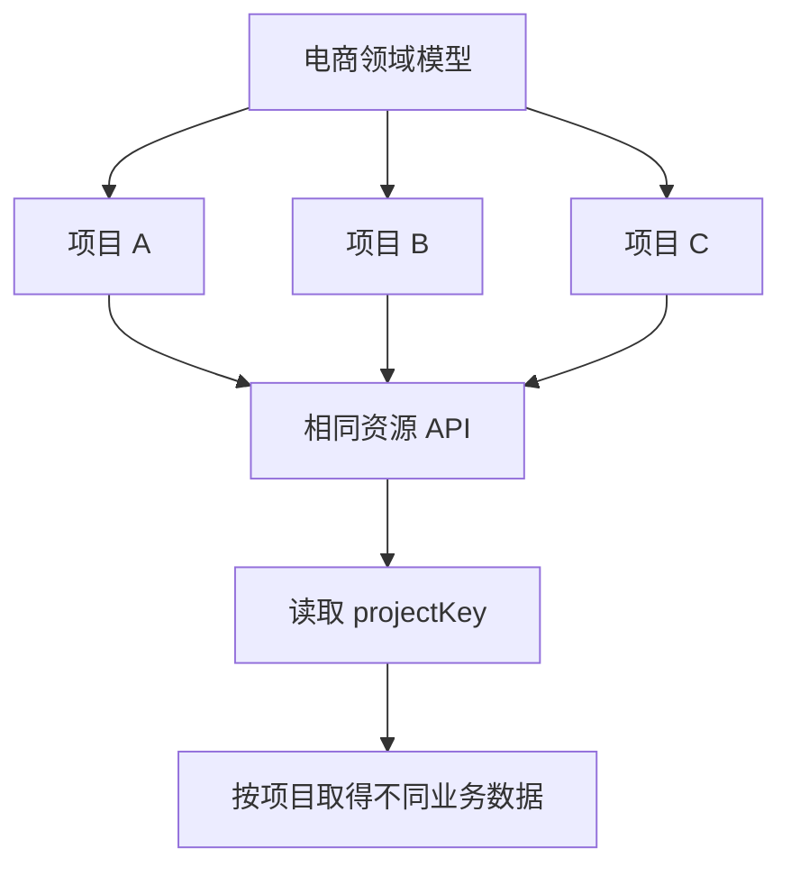

# 模板引擎 - SchemaTable 实现（4）

<MuxPlayer
  className="mt-8"
  playbackId="P94mTy9yvgLa441ExwqXd02fWdlwV8Dzyu200SV3D6CSE"
  title="模板引擎 - SchemaTable 实现（4）"
/>

> [!NOTE]
>
> 本节从一个真实问题出发：多个项目复用同一个领域模型和 API，如果请求没有项目身份，它们就会拿到相同数据。因此本节把 **projectKey 贯穿页面、公共请求层与服务端上下文**，让业务接口天然具备项目维度。
>
> 这个需求还推动了一次轻量重构：前端路由由 Hash 改为 History，页面请求可以把项目参数交给服务端，再由页面模板注入浏览器；`curl` 将它放入请求头，`projectHandler` 中间件统一解析到 `ctx.projectKey`。
>
> 重点是顺着需求找到缺失的基础能力，并在影响范围仍小的时候完成调整。以下代码按课堂思路简化，路径和协议应与项目当前版本对齐。

## 为什么共享模型不等于共享数据

前面用电商模型派生京东、拼多多和淘宝等项目，模型描述共同菜单、字段和交互，项目可以覆盖名称或增加定制配置。

但列表 API 定义在模型中，所以这些项目会请求同一个地址。如果服务端只根据这个地址返回列表，没有任何项目标识，它就无法知道请求来自哪个项目。

课程通过同时打开三个项目演示这个问题：页面标题可以不同，列表却返回同一批数据。这说明页面配置的复用已经完成，而业务数据的区分还没有建立。

正确的数据关系应该是：同一模型定义共同结构，不同项目传入自己的 projectKey，服务端再根据这个维度查询对应数据。模型可以共享，记录仍然有归属。



## 把项目身份做成公共能力

最直接的做法是每个请求都手动增加 projectKey，每个 Controller 再手动从参数中取出它。这样可以工作，但所有业务代码都要重复记住这件事，也容易出现遗漏。

课程希望达到的使用体验是：前端业务只需要调用公共 `curl`，项目参数自动携带；服务端业务只需要使用 `ctx.projectKey`，不必知道它最初在 Header、Query 还是 Body 中。

| 层级 | 应当负责的内容 |
| --- | --- |
| 页面入口 | 确定当前项目 |
| 页面模板 | 把当前项目身份交给浏览器 |
| 公共 curl | 给项目业务请求附加公共参数 |
| projectHandler | 校验并挂载请求上下文 |
| 业务 Controller | 使用 projectKey 组织查询或其他业务 |

这条链路把运输细节留在框架层，把业务决策留在业务层。后续如果调整项目参数的传递位置，不应要求每个业务接口一起改写。

## 比较获取 projectKey 的方案

课程没有立刻写代码，而是比较几种能够取得当前项目的方法。

第一种是解析 `window.location.hash`。原来的路由使用 Hash 模式，projectKey 在井号后面，浏览器端可以读取，但公共请求层需要额外理解路由字符串。

第二种是改用 History 路由，再从 URL 查询参数读取。它减少了 Hash 内嵌查询的层次，但请求工具仍然依赖地址结构。

第三种是将 Vue Router 引入公共请求层，通过路由对象拿参数。这个方案也可行，但让本来通用的网络工具直接依赖客户端路由。

第四种是利用现有服务端页面渲染：服务端收到页面请求时取得 projectKey，将它注入 HTML，页面内形成统一入口，例如 `window.projectKey`。

课程选择第四种，因为项目身份贯穿整个系统，值得作为页面初始化上下文提供。这里的取舍是依赖组织方式，不是宣称 URL 参数天然不可靠而全局变量天然可信。

## Hash 为什么影响服务端页面注入

原来的入口大致形如：

```text filename="路由模式对比" copy
Hash：
/view/dashboard#/schema?projectKey=jd&key=product

History：
/view/dashboard/schema?projectKey=jd&key=product
```

浏览器发送 HTTP 请求时不会把 URL fragment，也就是 `#` 后的部分，发送给服务端。因此第一种地址到达服务端时，后端无法直接从这次页面请求读取 Hash 中的 projectKey。

History 形式把页面路径与查询参数放在服务器可见的位置，Controller 才能取得它们并参与页面渲染。

字幕将 Hash 后的内容类比为“注释”，准确说法是它属于 URL 片段标识，通常由浏览器端处理。并不是客户端不能使用这些参数，而是服务端不会自动在页面请求中收到它们。

课程还用登录后的回跳地址说明这种影响：如果服务端需要根据请求参数做重定向，就必须明确哪些信息实际能够到达服务端。Hash 模式并非不能实现登录回跳，但需要额外把片段内容传过去；本项目选择通过 History 简化服务端参与的链路。

## 轻量重构的改动范围

本节将前端创建路由的入口由 `createWebHashHistory` 改为 `createWebHistory`。但仅修改这一行不够，所有依赖旧地址结构的位置也要同步调整。

```js filename="路由创建示意.js" copy
import { createRouter, createWebHistory } from "vue-router"

export const router = createRouter({
  history: createWebHistory(),
  routes: [
    { path: "/view/dashboard/schema", component: SchemaView },
    { path: "/view/dashboard/iframe", component: IframeView },
    { path: "/view/dashboard/custom", component: CustomView },
  ],
})
```

这里组件视图仅示意已有路由条目的迁移。课程实际逐个检查了入口路由、Dashboard 菜单跳转、SideView 子菜单跳转、ProjectList 打开项目的地址，以及服务端承接页面请求的路由。

原来只需要在 Hash 内切换 `/schema`，现在完整客户端路径需要包含 `/view/dashboard`。ProjectList 中原先拼接的 `#` 也应去掉。代码变了之后注释同步修改，避免注释仍在描述 Hash 行为。

| 位置 | 迁移时要检查的点 |
| --- | --- |
| 路由创建 | History 实现是否替换 |
| 路由表 | 是否包含完整页面前缀 |
| 主菜单与侧边栏 | push 的目标路径是否一致 |
| 项目入口 | 是否还拼接旧的井号 |
| 服务端 View Router | 能否承接带子路径的页面请求 |

下一节还会发现 Header 中切换项目的入口遗漏了迁移。这说明检查路由不能只看当前页面的主路径，还要覆盖其他导航入口。

## 服务端必须承接 History 子路径

原来服务端页面路由只匹配 `/view/:page`。History 模式下浏览器可能直接访问 `/view/dashboard/schema`，甚至出现更深的子路径。

此时需要扩展匹配规则，让请求仍然交给页面 Controller，并让 `page` 继续识别为 `dashboard`。客户端子视图路径不应被误当成独立模板文件名。

本节强调的是路由匹配范围：服务端需要接受页面入口后面剩余的子路径。具体通配符写法依赖项目使用的路由库版本，笔记不将某一种库语法写成通用标准。

迁移后要验证两种访问：在已经打开的页面内点击菜单，以及把完整子路径放进地址栏直接刷新。前者可以由客户端路由完成，后者必须先被服务端接住。

## 从页面请求注入浏览器上下文

路由迁移完成后，页面 Controller 就可以读取 `ctx.query.projectKey`，再把它加入模板渲染参数。课程同时为页面请求补充日志，因为之前通用参数日志主要面向 API 请求。

```js filename="View Controller 逻辑示意.js" copy
async function renderPage(ctx) {
  const projectKey = ctx.query.projectKey || ""

  await renderDashboard(ctx, {
    projectKey,
  })
}
```

示例中的 `renderDashboard` 代表项目已有的模板渲染入口。课程在模板中增加隐藏输入，再由页面脚本取得它并放到全局变量上。

```html filename="页面模板注入示意.html" copy
<!-- value 由模板引擎使用属性转义方式填入 projectKey。 -->
<input id="project-key" type="hidden" value="服务端填入的项目标识" />
<script>
  window.projectKey = document.getElementById("project-key").value
</script>
```

隐藏输入只是传递页面初始化值的载体，并不意味着这个值无法被修改。它仍属于客户端可控制的数据。服务端后续的数据权限应结合登录身份与项目授权判断，本节的 projectKey 链路主要完成项目上下文传递。

## 为什么还要划分业务 API 与全局 API

项目列表页面还没有进入任何项目，它请求的是全局项目列表。如果中间件强制所有 API 都带 projectKey，就会使这个入口也报缺少参数。

所以课程新增路径约定：项目业务接口使用 `/api/project/...` 前缀，全局接口则不进入这套项目身份处理。页面请求以 `/view/...` 开始，也不属于项目业务 API。

```text filename="请求类型约定" copy
/view/dashboard/schema       页面请求
/api/project/list            全局项目列表接口（按既有项目路由约定区分）
/api/project/product/list    项目内商品列表接口
```

课堂在最初的字符串匹配中仍存在边界问题，下一节通过补充分隔符、对齐实际业务前缀处理这个问题。复盘时应记住本节的意图：全局项目列表与项目内业务必须能够被规则区分，不能仅凭路径中出现 `project` 就认定一定要项目身份。

为了避免示意路径混淆，下面的中间件代码假定 `isProjectApi` 已按项目实际路由表正确识别业务接口。这个谓词需要同时满足业务接口命中和全局项目接口不命中。

## projectHandler 挂载上下文

中间件统一读取请求头中的 projectKey。如果当前请求不属于项目业务，直接进入下一层；如果属于项目业务但缺少标识，则返回业务错误并终止；合法时挂载到 `ctx.projectKey`。

```js filename="project-handler.js（简化示例）" copy
module.exports = () => async (ctx, next) => {
  if (!isProjectApi(ctx.path)) {
    await next()
    return
  }

  const projectKey = ctx.get("projectKey")

  if (!projectKey) {
    ctx.status = 200
    ctx.body = {
      success: false,
      code: 446,
      message: "缺少必要参数",
    }
    return
  }

  ctx.projectKey = projectKey
  await next()
}
```

本段按课程的中间件工厂约定返回实际 Koa 中间件。课堂联调时也修正了这一层返回结构，说明 Loader 如何调用中间件，必须与中间件文件导出形态一致。

HTTP 状态 200 与业务 `success: false` 是课程已有的统一响应协议。它不表示业务操作成功，而是这次 HTTP 交互有响应，业务失败由响应体表达。

## 公共 curl 自动补请求头

浏览器中已经有 projectKey 后，公共请求方法先复制调用方传入的 Header，再对项目业务接口增加公共字段。最终发请求时使用处理后的 Header。

```js filename="curl 中构造请求头（简化示例）.js" copy
function buildHeaders(url, headers = {}) {
  const dtoHeaders = { ...headers }

  if (isProjectApi(url) && window.projectKey) {
    dtoHeaders.projectKey = window.projectKey
  }

  return dtoHeaders
}
```

客户端与服务端应使用语义一致的业务接口识别规则。客户端少加，后端会报缺参；客户端多加，未必立刻报错，却说明边界没有统一。模型中配置的 API、Router Schema 和实际 Router 也要一起改成新的业务路径。

业务 Controller 此后可以直接使用：

```js filename="业务 Controller 使用项目上下文.js" copy
async function getProductList(ctx) {
  const projectKey = ctx.projectKey
  const list = await productService.getList({ projectKey })
  ctx.body = { success: true, data: list }
}
```

课程本节用测试数据回显项目标识，证明三个项目请求能够携带不同身份；没有在这里完成真实数据库建表和完整数据权限系统。上面的 Service 调用只用于说明最终业务使用方式。

## 缺参测试发现的控制流问题

课堂主动移除 projectKey，验证中间件错误路径。最初仍然显示删除成功，原因不是校验条件没有执行，而是写完错误响应后缺少 `return`，请求继续进入后续处理，业务响应又覆盖了前面的错误。

因此中间件有两个不同概念：给 `ctx.body` 赋值，以及停止当前请求继续流入业务。前者只是设置响应内容，后者需要明确的控制流。

课堂还发现通过组件 ref 调用 `initData` 时遗漏 `.value`，造成方法不存在的错误。这与服务端缺参是两个独立问题，应根据调用栈分别解决，不能因为都在删除时触发就混成同一个原因。

最后还需要在公共请求层识别新增业务错误码。面向用户的提示应能说明操作未完成，详细字段名、调试上下文则留给开发排查。课程强调区分用户信息与程序调试信息，不要把内部变量名称直接当成产品提示。

## 本节小结

本节补齐了项目维度的数据链路。模型和 API 可以复用，但请求必须携带当前 projectKey，服务端才能根据项目取得不同数据。

为支持服务端页面注入，路由从 Hash 迁移到 History，并同步调整菜单跳转、项目入口与服务端页面路由。随后由公共 curl 携带 Header，projectHandler 校验并挂载 `ctx.projectKey`，业务代码获得统一上下文。

课堂通过多个项目和缺参分支验证功能，也展示了轻量重构的实际节奏：发现基础假设不适合后续场景，梳理受影响的入口，在功能继续增长前把边界调整清楚。
