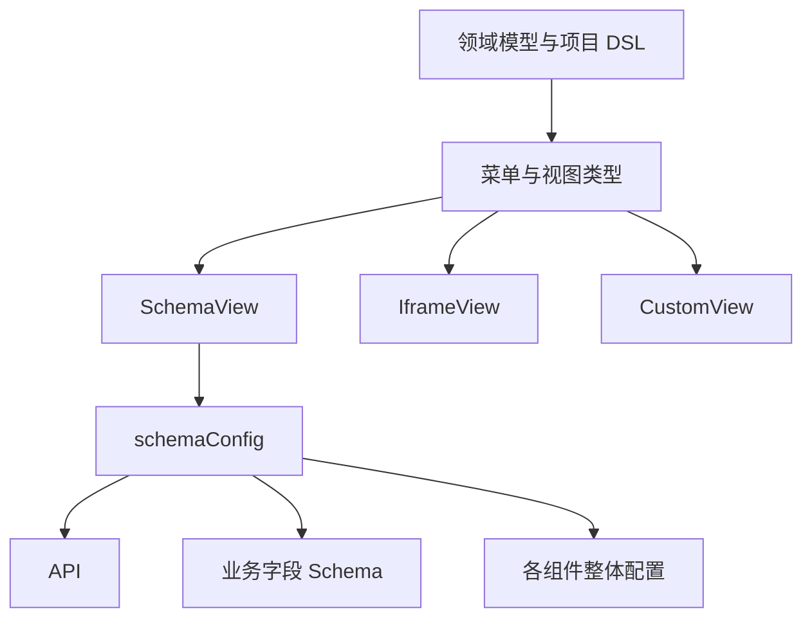
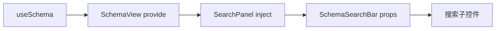
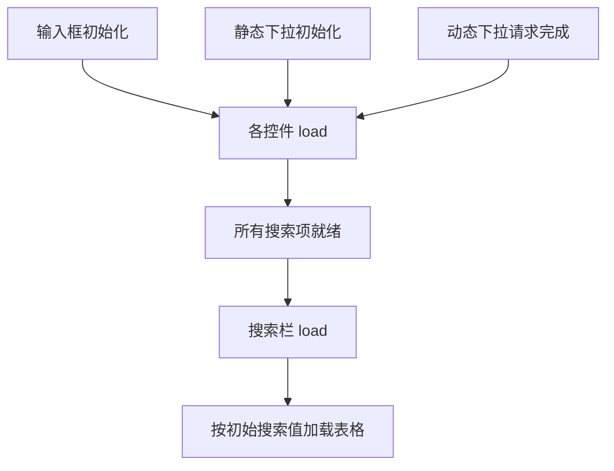

# 模板引擎 - SchemaSearchBar 实现（1）

<MuxPlayer
  className="mt-8"
  playbackId="E2r6m7N9Dj4vKVDRN1ED96k5q6nc009p0100LlnKecU0101E"
  title="模板引擎 - SchemaSearchBar 实现（1）"
/>

> [!NOTE]
>
> 本节开始实现 **SchemaSearchBar**。先修复上一节路由迁移和业务 API 匹配的遗漏，再回到数据驱动的设计：同一个业务字段可以同时拥有表格、搜索和表单配置，搜索能力从 `searchOption` 中提取。
>
> 实现链路包括扩展 DSL、生成 `searchSchema`、用路由参数覆盖搜索默认值、通过 SearchPanel 连接页面上下文，以及定义搜索栏与子控件的统一协议。
>
> 字幕后段存在较长转写缺失与循环文本，以下聚焦能够确认的结构和接口。示例代码按课堂思路整理，下一节会完整接通搜索与表格联动并扩展控件。

## 先修复上一节的两个遗漏

第一个问题出现在 ProjectList：它还没有进入项目，却被要求提供 projectKey。原因是业务 API 匹配条件过宽，某些全局项目接口也被字符串前缀误匹配。

课程在项目中间件和公共 curl 两处补充路径分隔符，让业务路径判断更严格，同时检查通用 API 参数处理处的类似判断。这里的经验是，前缀不只是几段字母，还应包括路径边界。

例如 `/api/project` 与 `/api/project/` 的匹配集合并不相同；如果全局接口本身也位于后一前缀下，还需要明确例外或进一步划分命名空间。实际规则必须用项目路由表验证，不能只凭字符串看起来像业务接口。

第二个问题出现在页面 Header 的项目切换。上一节已经迁移主菜单和项目列表入口，但 Header 里仍保留旧的 Hash 跳转地址，因此切换项目失败。本节同步修改该入口，让它使用当前 History 页面地址结构。

这两个修复都不是搜索栏内部的问题，却会阻碍后续验证，所以课程先把现有链路恢复到一致状态。

## 重新理解领域模型描述的范围

课程在写搜索栏之前再次强调：DSL 描述的是整个业务系统的组织方式，不只是接口列表。模型定义共同结构，项目基于模型覆盖或扩展，解析器再将它们转成可运行页面。

同一模型可以派生多个项目，例如电商模型下的不同电商项目，课程模型下的不同课程项目。每个项目拥有自己的名称、菜单覆盖与数据身份，但不必重写共同页面能力。

进入某个菜单后，`modelType` 决定使用 SchemaView、IframeView、CustomView 或带侧边栏的视图结构。只有进入 SchemaView 这一支，才会继续解释 `schemaConfig` 中的 API、Schema 和各类组件配置。



不能因为最近几节都在写表格，就把 Schema 本身改称“列配置”。同一个字段到了表格里是列，到了搜索栏里是搜索项，到了表单里又是录入项。业务字段比任何一个展示位置都更基础。

## JSON Schema 与项目 DSL 的边界

课程使用 JSON Schema 的基本结构表达数据类型，例如外层 `type: "object"`、字段集合 `properties`、字段的 `string` 或 `number` 类型。

在这些数据描述之外，又增加 `label`、`tableOption`、`searchOption` 等 UI 扩展。这些是项目自己的 DSL 约定，不应把所有字段都说成 JSON Schema 的标准关键字。

```js filename="数据结构与 UI 扩展示意.js" copy
const productSchema = {
  type: "object",
  properties: {
    productName: {
      type: "string",
      label: "商品名称",
      tableOption: { width: 200 },
      searchOption: { comType: "input" },
    },
    price: {
      type: "number",
      label: "价格",
      tableOption: { toFixed: 2 },
    },
  },
}
```

这份配置先说明商品数据有哪些字段、每个字段是什么类型，再说明字段分别怎样参与 UI。只有商品名称配置了 `searchOption`，搜索栏就只提取商品名称；价格仍然可以在表格中展示。

课程以常见 CRUD 模块与数据库表的关系解释这种抽象：许多普通后台模块围绕一份数据结构展开，列表、搜索与表单都在处理同一组字段。复杂联表和定制流程仍然存在，但不妨碍先沉淀常见部分。

至于由 Schema 反向生成数据库表，是课程提出的扩展方向，本阶段并没有完成自动建表能力。

## searchOption 与 searchConfig

本节为字段增加 `searchOption`。它描述的是“这个字段在搜索栏中如何表现”，主要包含组件类型、默认值，以及对应底层表单控件的属性。

| 配置 | 作用 |
| --- | --- |
| `comType` | 选择 input、select 等搜索控件 |
| `default` | 设定初始搜索值 |
| 底层控件属性 | 透传 placeholder、clearable 等配置 |
| `searchConfig` | 预留整个搜索区域的配置位置 |

`searchConfig` 与 `searchOption` 的区别，和前面的 `tableConfig`、`tableOption` 一致。前者描述整个区域，后者描述某个字段。当前搜索区的整体选项不多，也可以先保留扩展位置。

```js filename="搜索字段配置.js" copy
const nameProperty = {
  type: "string",
  label: "商品名称",
  tableOption: { minWidth: 200 },
  searchOption: {
    comType: "input",
    default: "",
    placeholder: "请输入商品名称",
    clearable: true,
  },
}
```

默认值不仅是装饰。例如日期筛选可能希望默认最近一段时间，页面初始化时就应该带着该条件加载数据。因此后续搜索栏必须能明确报告“值已经准备好”，而不是表格一挂载就假定所有搜索条件都已存在。

## 复用 buildDtoSchema 提取搜索数据

前面写出的 DTO 方法现在开始体现价值。传入 `"search"`，它就选择含有 `searchOption` 的字段，保留通用字段信息，并把 `searchOption` 改为统一的 `option`。

```js filename="useSchema 中构建搜索数据.js" copy
const dtoSearchSchema = buildDtoSchema(configSchema, "search")
searchSchema.value = dtoSearchSchema
searchConfig.value = schemaConfig.searchConfig || {}
```

这样 SchemaSearchBar 不会收到无关的 `tableOption`，也不会收到没有配置搜索能力的字段。它不需要自己扫描一份巨大配置，判断哪些字段与自己有关。

这里有两层过滤不能混淆：DTO 层根据是否存在对应 Option 决定字段是否参与这个组件；组件内部再根据具体 Option 决定如何展示。表格的 `visible !== false` 与搜索字段是否存在，不是完全相同的判断。

## 路由参数如何变成默认搜索条件

有些页面不是从菜单直接进入，而是从其他业务页面跳转，并在 URL 上带着搜索条件。例如从另一处点击某个商品名称，期望打开列表后已经按该名称筛选。

本节在构建搜索 DTO 后遍历其中的字段。如果当前路由 Query 中有同名值，就用它覆盖这个搜索项的 `option.default`。

```js filename="将路由条件写入搜索默认值.js" copy
function applyRouteDefaults(searchSchema, query) {
  for (const [key, property] of Object.entries(
    searchSchema.properties || {},
  )) {
    if (Object.prototype.hasOwnProperty.call(query, key)) {
      property.option = {
        ...property.option,
        default: query[key],
      }
    }
  }

  return searchSchema
}
```

示例显式判断属性存在，避免合法的 `0` 或空字符串被简单真值判断忽略。具体控件仍然需要处理 URL 参数与字段类型之间的转换，本节主要建立默认值覆盖的入口。

处理顺序也很重要：先提取搜索 DTO，再遍历 DTO 字段，只对实际搜索项应用路由条件。这样 URL 中其他页面参数不会被随意加入搜索栏。

## SearchPanel 作为业务与组件的连接层

`useSchema` 输出 `searchSchema`、`searchConfig`，SchemaView 再把它们加入 `schemaViewData`。SearchPanel 注入自己需要的状态，然后通过 Props 传给 SchemaSearchBar。



课程特别解释，为什么不直接让公共 SchemaSearchBar 注入页面上下文。因为 `schemaViewData` 是当前页面的约定，公共组件如果依赖它，就和具体业务页面绑定了。

Panel 是这种绑定应该出现的位置。它知道页面上下文来自哪里，也知道应该怎样连接公共组件；Widget 只接收明确参数、发出事件和暴露方法。这样以后把 SchemaSearchBar 放到其他页面，仍然可以通过普通 Props 使用。

## 搜索栏的三个对外事件

本节定义搜索栏的 `load`、`search`、`reset` 事件。

`search` 对应用户点击搜索，向外提供当前搜索值；`reset` 对应恢复控件状态；`load` 则表示搜索项已完成初始化，可以取得初始搜索值。

```js filename="SchemaSearchBar 对外协议.js" copy
const props = defineProps({
  schema: { type: Object, default: () => ({}) },
})

const emit = defineEmits(["load", "search", "reset"])

function onSearch() {
  emit("search", getValue())
}

function onReset() {
  resetItems()
  emit("reset")
}

defineExpose({ reset: onReset })
```

以上片段突出协议，`getValue` 与 `resetItems` 在子组件集合建立后实现。课程优先暴露 Reset 方法，因为外部新增记录等操作可能需要清空或恢复搜索条件，再让表格重新加载。

## 为什么 load 不能只看父组件 mounted

一个静态输入框可以很快完成初始化，但动态下拉框可能需要先请求接口取得选项。如果表格在搜索栏尚未准备好时就加载，可能出现搜索框显示一个值，列表却没有按这个值查询的情况。

因此搜索栏中的每个子控件也需要 `load` 事件。父搜索栏知道每个控件都准备好后，再向外报告整个搜索区加载完成。



这使“搜索配置存在”和“搜索控件可读取有效值”成为两个明确阶段。后续增加异步控件时，就不必改变外层页面的联动协议。

## 动态子控件的统一接口

课程先实现最常见的 Input。虽然不同控件模板不同，它们都应遵循共同约定：接收当前字段 key 与该字段 Schema，初始化完成时发出 load，提供 getValue 与 reset 方法。

| 接口 | 解决的问题 |
| --- | --- |
| `schemaKey` | 返回结果应该使用哪个字段名 |
| `schema` | 读取 label、type、option 等配置 |
| `load` 事件 | 告诉父级当前控件已准备好 |
| `getValue()` | 取得当前搜索条件对象 |
| `reset()` | 恢复该控件的默认状态 |

下面是按课堂思路整理的 Input 示例。它返回对象而不是单个值，方便父级把多个控件结果合并；日期范围等控件以后还可以一次返回多个 key。

```vue filename="search-items/input.vue（简化示例）" copy
<template>
  <el-input v-model="value" v-bind="schema.option" />
</template>

<script setup>
import { onMounted, ref } from "vue"

const props = defineProps({
  schemaKey: { type: String, required: true },
  schema: { type: Object, required: true },
})
const emit = defineEmits(["load"])
const value = ref()

function reset() {
  value.value = props.schema.option?.default
}

function getValue() {
  return value.value === undefined
    ? {}
    : { [props.schemaKey]: value.value }
}

onMounted(() => {
  reset()
  emit("load")
})

defineExpose({ getValue, reset })
</script>
```

示例保留 `undefined` 的含义：没有搜索值时不必凭空造一个条件。空字符串、数字 0 等具体值该怎样提交，则应由控件与接口约定决定。

## 动态组件映射与实例收集

搜索栏根据 `option.comType` 找到对应组件，并在 `el-form-item` 中动态渲染。输入框等控件放在搜索栏自己的组件目录中，通过配置映射暴露出来。

```js filename="search-item-config.js（简化示例）" copy
import Input from "./search-items/input.vue"

export const searchItemConfig = {
  input: { component: Input },
}
```

父级还需要保存子组件实例，才能在搜索时依次调用 `getValue`，在重置时调用 `reset`。课程后段提到使用函数 ref 收集实例到 `searchComponentList` 中，再遍历这些实例构建 DTO 对象。

示例采用按字段 key 存储的 Map，让实例与字段之间的关系更明确：

```js filename="收集搜索项与取值（简化示例）.js" copy
const itemRefs = new Map()

function setItemRef(key, instance) {
  if (instance) itemRefs.set(key, instance)
  else itemRefs.delete(key)
}

function getValue() {
  const result = {}
  for (const instance of itemRefs.values()) {
    Object.assign(result, instance.getValue())
  }
  return result
}

function resetItems() {
  for (const instance of itemRefs.values()) {
    instance.reset()
  }
}
```

这段整理补齐了实例移除分支，避免更新或卸载后仍保留旧控件。它表达课堂“统一方法协议 + 遍历实例”的机制，不改变控件各自负责取值的分工。

## 布局与 key 的准确理解

搜索栏使用横向 `el-form`，通过 `inline` 让搜索项与操作按钮横向排列。课程将子控件的一些样式放在父搜索栏统一管理，以便多个搜索控件保持一致尺寸。

字段循环使用稳定的 key，使 Vue 能够追踪同一个搜索项在列表更新前后的身份。字幕中“没有 key 就没有 DOM diff”的说法过于绝对：无 key 的列表仍会进行更新比较，只是身份匹配与复用方式不同。这里采用字段 key，是为了让动态控件状态与字段身份一致。

## 本节小结

本节为搜索能力建立了完整扩展入口：字段通过 `searchOption` 声明搜索表现，`useSchema` 提取专用 DTO，并将路由传入的条件应用为默认值；SearchPanel 连接页面上下文与公共搜索组件。

SchemaSearchBar 与子控件共同约定加载、取值和重置协议，使同步输入框与后续异步下拉框可以被统一管理。下一节将把搜索结果交给表格请求，并沿着这个协议继续增加 Select、DynamicSelect 与日期范围控件。
