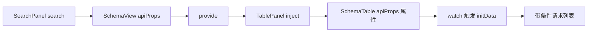
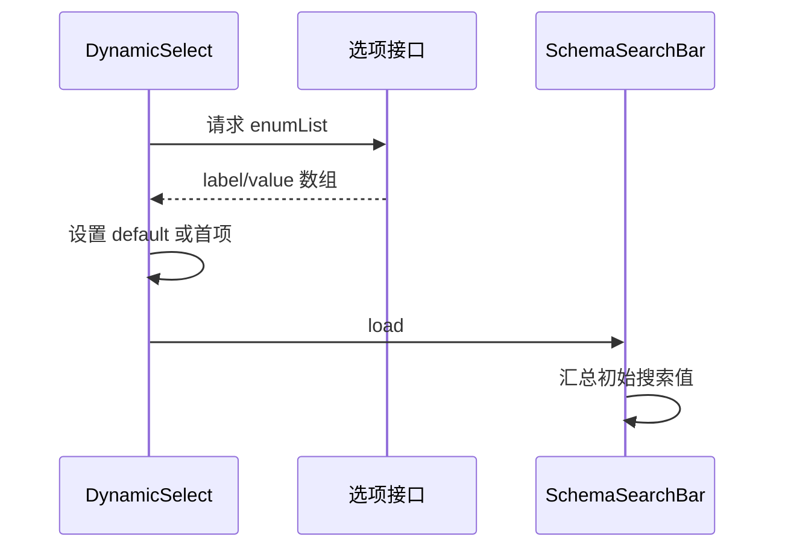

# 模板引擎 - SchemaSearchBar 实现（2）

<MuxPlayer
  className="mt-8"
  playbackId="iVPHVQPBSKcpyj2Y9IDdBxstDJeaMacha900dEqt4dZo"
  title="模板引擎 - SchemaSearchBar 实现（2）"
/>

> [!NOTE]
>
> 本节把 SchemaSearchBar 应用到页面，接通 **搜索条件变化 → 表格重新初始化 → 带条件请求列表** 的完整链路，并继续实现 Select、DynamicSelect 和日期范围控件。
>
> 核心设计是将搜索条件保存为 SchemaView 中的响应式 `apiProps`，经 TablePanel 传给 SchemaTable。这样分页时条件仍然存在，也避免为了搜索把同一个参数沿多层方法不断转发。
>
> 本节包含多次实际调试：空搜索区隐藏、inline 拼写、动态下拉初始化必须等待请求，以及日期范围输出多个查询字段。下面代码均为按课堂思路整理的简化示例。

## 把搜索栏接入 SearchPanel

上一节已经建立公共 SchemaSearchBar，本节由 SearchPanel 使用它。SearchPanel 从页面上下文取得 `searchSchema`，通过 `schema` 属性传入，并监听 `load`、`search`、`reset` 三个事件。

这三个事件在 Panel 中被收敛为一个面向页面的 `search` 事件：加载完成时把初始条件发出去，点击搜索时把当前条件发出去，重置时发出空条件。

```vue filename="SearchPanel.vue（简化示例）" copy
<template>
  <el-card class="search-panel">
    <SchemaSearchBar
      :schema="searchSchema"
      @load="onSearch"
      @search="onSearch"
      @reset="onReset"
    />
  </el-card>
</template>

<script setup>
import { inject } from "vue"
import SchemaSearchBar from "@/widgets/schema-search-bar/schema-search-bar.vue"

const { searchSchema } = inject("schemaViewData")
const emit = defineEmits(["search"])

function onSearch(searchValueObject) {
  emit("search", searchValueObject)
}

function onReset() {
  emit("search", {})
}
</script>
```

Panel 本身不发送商品列表请求，也不处理某个具体字段。它主要完成上下文接入与事件转发，这正是前面保留这一层的原因。

## 没有搜索字段时隐藏整个区域

接入后首先看到两个操作按钮，但没有搜索项。这样的 UI 容易让人困惑，因此 SchemaView 在显示 SearchPanel 前，检查搜索 DTO 是否包含字段。

```vue filename="SchemaView 显示搜索区域.vue" copy
<SearchPanel
  v-if="Object.keys(searchSchema?.properties || {}).length > 0"
  @search="onSearch"
/>
<TablePanel />
```

判断对象是 `searchSchema.properties`，不是原始业务 Schema。原始 Schema 可以有很多字段，但如果都没有配置 `searchOption`，它们就不应该让搜索栏占据一块空区域。

## 为什么不把搜索值一路传给 loadTableData

课程先讨论最直观的方案：SchemaView 收到搜索事件后调用 TablePanel 的方法，再把条件传入 SchemaTable 的 `loadTableData`，最后传入请求函数。

这条链路可以实现一次搜索，但用户翻页时，触发入口变成表格内部的分页事件。如果条件只存在于上一次调用参数里，翻页请求就可能丢失搜索条件。

为避免丢失，表格仍然需要保存一份当前条件。既然最终必须有状态，课程选择从一开始就把条件作为响应式数据管理，而不是先层层传参，再临时找位置缓存。



这样，搜索和分页的职责也更明确：搜索改变条件并回到第一页；分页改变页码，但继续使用当前条件。

## 在 SchemaView 中保存 apiProps

SchemaView 新增 `apiProps`，并把它加入提供给后代的页面上下文。搜索事件到来时，只更新这份对象。

```js filename="SchemaView 搜索状态.js" copy
import { provide, ref } from "vue"

const apiProps = ref({})

function onSearch(searchValueObject = {}) {
  apiProps.value = { ...searchValueObject }
}

provide("schemaViewData", {
  api,
  tableSchema,
  tableConfig,
  searchSchema,
  searchConfig,
  apiProps,
})
```

TablePanel 注入后，将它继续作为普通 Props 交给 SchemaTable。公共表格仍不需要直接知道 `schemaViewData`，所以并没有因为使用依赖注入而破坏 Widget 的独立性。

```vue filename="TablePanel 传递查询条件.vue" copy
<SchemaTable
  :schema="tableSchema"
  :api="api"
  :api-props="apiProps"
  :buttons="tableConfig.rowButtons || []"
/>
```

## SchemaTable 监听条件并重新初始化

SchemaTable 增加 `apiProps` 属性，将它加入原本监听 Schema 与 API 的 Watch 中。条件变化后调用 `initData`，将页码恢复为 1，再加载列表。

```js filename="SchemaTable 增加查询条件.js" copy
const props = defineProps({
  schema: { type: Object, default: () => ({}) },
  api: { type: String, default: "" },
  apiProps: { type: Object, default: () => ({}) },
  buttons: { type: Array, default: () => [] },
})

const { schema, api, apiProps } = toRefs(props)

watch([schema, api, apiProps], initData)

async function fetchTableData() {
  return curl({
    method: "get",
    url: `${api.value}/list`,
    query: {
      ...apiProps.value,
      page: currentPage.value,
      size: pageSize.value,
    },
  })
}
```

这里只展示新增条件的关键部分，Loading、返回校验与格式化仍沿用前面实现。示例将分页字段放在合并结果后面，明确由表格状态管理分页。

翻页时 `apiProps` 没有消失，它仍然是组件当前属性，因此后续请求可以继续带上相同条件。用户点击重置后，SchemaView 把它替换为空对象，又触发一次初始化。

## 用商品名称验证真实请求

课程先给商品名称配置一个 Input 搜索项，再在浏览器 Network 中观察输入 `123` 后的请求参数。确认请求确实带上 `productName`，重置后又不再携带旧值。

随后在测试 Controller 中增加简单过滤：如果有商品名称条件，就从固定商品列表中筛选匹配记录。这里的重点不是实现数据库查询，而是证明界面输入最终能影响列表结果。

```js filename="测试接口过滤示意.js" copy
function filterProducts(list, productName) {
  if (!productName) return list
  return list.filter((item) => item.productName === productName)
}
```

先看 Network，再看服务端收到的参数，最后看结果变化，比仅凭页面似乎刷新了一下更有说服力。搜索框能输入、事件能发出、请求能携带、后端能使用，是四个不同环节。

## 按统一机制增加 Select

只有 Input 的搜索栏不足以覆盖常见场景，本节继续增加静态下拉框。扩展步骤仍然沿用上一节的机制：创建控件文件、加入类型映射、在 DSL 中配置对应 `comType`。

Select 多出 `enumList`，每个选项包含 `label` 和 `value`。控件循环这个数组生成 `el-option`，其他接口保持不变：`getValue`、`reset`、`load`。

```js filename="静态下拉搜索配置.js" copy
const priceSearchOption = {
  comType: "select",
  enumList: [
    { label: "全部", value: -1 },
    { label: "39.9", value: 39.9 },
    { label: "199", value: 199 },
  ],
}
```

```vue filename="Select 搜索项模板.vue" copy
<el-select v-model="value" v-bind="schema.option">
  <el-option
    v-for="item in schema.option.enumList || []"
    :key="item.value"
    :label="item.label"
    :value="item.value"
  />
</el-select>
```

课程让未配置 default 的 Select 使用第一项作为默认展示。数字字段的选项值也应使用数字，避免界面显示相同但数据类型不一致。

## “全部”选项与重置语义

下拉框通常需要一个“全部”项。课程用 `-1` 作为价格下拉的特殊值，并在接口端为它安排不过滤的语义；动态商品名称列表则使用对应的字符串标识。

这个值没有跨业务通用的魔法含义。前端发送 `-1`，后端就必须知道它代表全部，而不是去查价格等于负数的商品。

本节也实际出现了“下拉框显示第一项，但重置发出空条件”的现象。它提醒我们，控件视觉状态与请求状态应该有明确对应。课堂通过增加“全部”项使初始显示更容易理解；更完整的实现还应统一 reset 恢复默认值后究竟发送当前默认条件，还是约定空条件代表全部。

> [!IMPORTANT]
>
> 不要把 UI 中显示的第一项自动等同于接口已经收到该值。搜索栏读值、重置事件以及页面 apiProps 之间必须保持一致，验证时应同时检查控件显示和请求参数。

## DynamicSelect 的选项来自接口

动态下拉框与静态 Select 的区别，在于选项数组不是直接来自 DSL，而是由 DSL 指定 API，再异步请求得到。

```js filename="动态下拉搜索配置.js" copy
const productNameSearchOption = {
  comType: "dynamicSelect",
  api: "/api/project/product/options",
}
```

示例路径用于表达项目业务接口，实际应使用项目既有业务路由。接口返回统一的 `label`、`value` 数组，控件无需知道这些选项来自哪个数据库或业务对象。

```js filename="DynamicSelect 初始化（简化示例）.js" copy
const enumList = ref([])
const value = ref()

async function fetchEnumList() {
  const result = await curl({
    method: "get",
    url: props.schema.option.api,
  })

  enumList.value = Array.isArray(result?.data) ? result.data : []
}

function reset() {
  value.value =
    props.schema.option.default ?? enumList.value[0]?.value
}

onMounted(async () => {
  await fetchEnumList()
  reset()
  emit("load")
})
```

这个顺序是本节重要的调试结论。请求开始不代表选项已经可用，如果立刻读取第一项，可能得到 undefined，甚至在没有安全访问时直接报错。

## await 解决的是实际数据依赖

课堂最初曾犹豫是否需要等待动态列表请求。运行后发现默认项没有正确出现，检查才确认初始化依赖选项数组，因此必须 `await` 请求结束，再设置默认值和发出 load。

这里不是所有异步函数都机械地加 await，而是先分析依赖关系：Reset 需要第一项，第一项由请求产生，所以 Reset 必须排在请求完成之后。

如果先发出 load，外层就可能按尚未准备好的条件加载表格。子组件 load 协议的意义，也正是在这里体现出来。



## 日期范围如何输出两个参数

本节最后增加 DateRange。DSL 仍然只对应一个业务字段，例如 `createTime`，但日期控件选择的是开始与结束两个值。

因此 `getValue()` 不能只返回一个标量，它需要生成 `createTime_start` 和 `createTime_end` 两个查询字段。前面让子控件统一返回对象的设计，正好能够承接这个变化。

```js filename="日期范围取值（简化示例）.js" copy
import moment from "moment"

const value = ref([])

function getValue() {
  if (!Array.isArray(value.value) || value.value.length !== 2) {
    return {}
  }

  return {
    [`${props.schemaKey}_start`]: moment(value.value[0]).format("YYYY-MM-DD"),
    [`${props.schemaKey}_end`]: moment(value.value[1]).format("YYYY-MM-DD"),
  }
}

function reset() {
  value.value = []
}
```

日期格式中的 `MM` 表示月份，`DD` 表示日期；如果使用带时间的格式，还需正确区分月份与小写分钟。当前示例按课堂使用 Moment 格式化，不把依赖替换成课程没有采用的新工具。

模板使用日期选择器的范围模式，开始和结束 Placeholder 根据字段 label 生成。选择完成后在 Network 中确认两个参数都准确传出，才能证明一个控件输出多个查询字段的机制成立。

## 扩展点究竟在哪里

本节不是为每一种控件重写一遍搜索流程。新控件只需要加入映射并遵守协议，搜索栏仍然循环字段、收集实例、等待加载、合并值。

```js filename="搜索控件注册示意.js" copy
const searchItemConfig = {
  input: { component: Input },
  select: { component: Select },
  dynamicSelect: { component: DynamicSelect },
  dateRange: { component: DateRange },
}
```

DSL 的 `comType` 与映射 key 必须一致。课堂在日期控件调试中遇到不该出现的 URL 请求，顺着错误检查到组件配置不正确；这类问题说明类型映射错误可能让页面渲染出另一种组件，进而触发完全不同的逻辑。

扩展时需要同时检查三处：DSL 写的类型名、注册表提供的 key，以及最终引用的组件。只新建文件而没有正确注册，并不算完成扩展。

## 本节小结

本节完成了搜索与表格的联动。搜索栏经 SearchPanel 向 SchemaView 提供条件，SchemaView 更新 `apiProps`，SchemaTable 监听到变化后回到第一页并带条件请求；翻页继续复用这份条件。

在控件层，本节增加了静态 Select、动态 Select 与 DateRange。它们共享加载、取值和重置协议，分别处理枚举配置、异步选项和一项输出多个参数的情况。最终同一份业务 Schema 已经能够同时生成列表和搜索栏，数据驱动的效果开始完整呈现。
