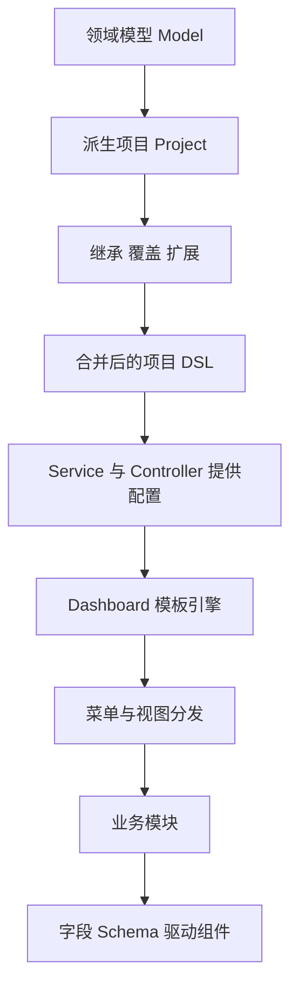
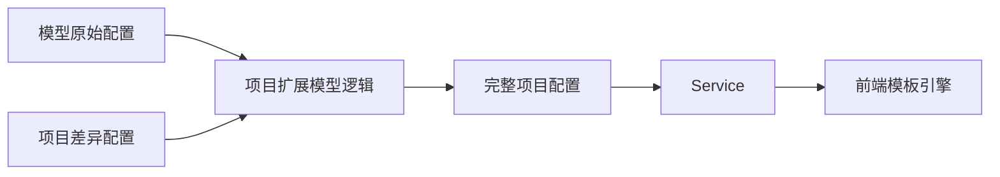
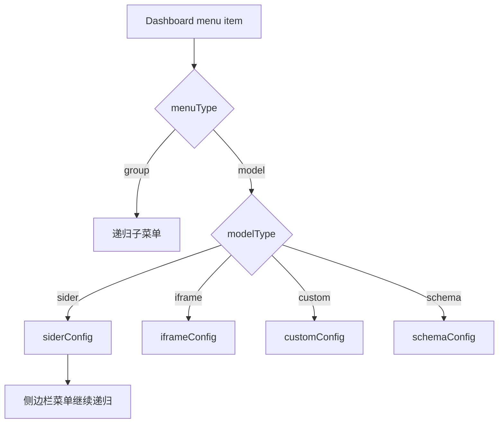
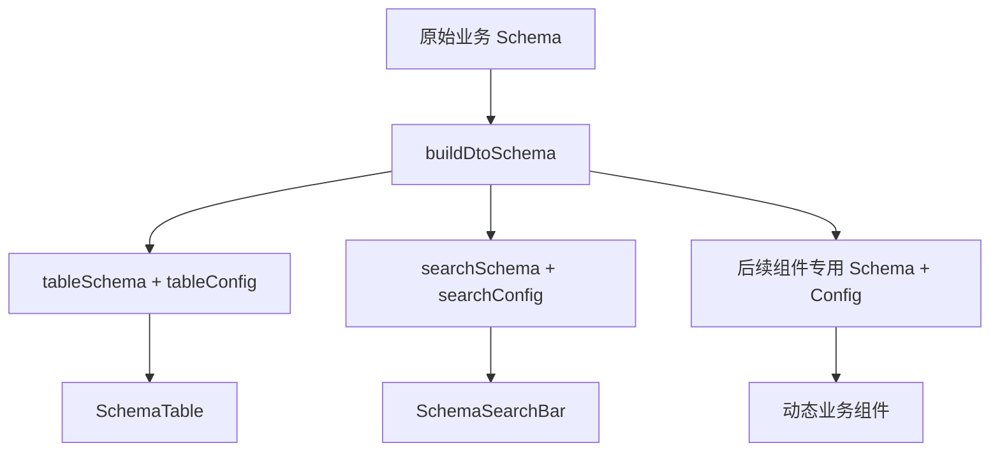

# 领域模型 DSL 设计与实践 - 阶段性复盘总结

<MuxPlayer
  className="mt-8"
  playbackId="JgIHzS00eGSfP2dgznLzsFEDwIwFZjI5CGg01pQ01LneBg"
  title="领域模型 DSL 设计与实践 - 阶段性复盘总结"
/>

> [!NOTE]
>
> 本节是 **领域模型 DSL 的阶段性复盘**。前面已经完成菜单、侧边栏、视图分发、表格与搜索栏，现在回到最初设计图，用已经写过的代码解释各层为什么这样组织。
>
> 复盘分为两层：第一层是模型到项目的继承、覆盖和扩展；第二层是一个业务模块如何由同一份字段 Schema 驱动表格、搜索以及后续动态组件。课程同时明确现阶段已实现的能力，以及 API 自动生成、数据库表生成等仍属于扩展设想的部分。
>
> 本节的目标是能把“配置怎样变成整个站点”讲清楚，并理解不同层级各自的扩展点。

## 从设计、实现再回到设计

课程最初介绍架构图时，很多概念还没有代码对应。经过实际开发，现在再看同一张图，就能把 Model、Project、Service、Dashboard、SchemaView 和各个 Widget 联系起来。

这也是课程安排阶段性复盘的原因：只看设计，容易停留在抽象名词；只写代码，又容易只记住局部函数。复盘要把已经实现的局部重新放回系统目标，确认它们解决了什么重复问题。

整体链路可以整理为：



这里的最终产物不只是一个表格。DSL 还决定站点名称、首页、菜单、菜单分组、页面类型以及具体模块的交互配置。

## 第一层复用：领域模型派生项目

课程以电商模型为例。模型中沉淀商品管理、订单管理、客户管理等常见模块；京东、拼多多和淘宝等项目在此基础上继承已有能力，再配置自己的差异。

这一层借鉴面向对象的思路，但实现对象是配置。没有覆盖的字段保留模型值，项目明确提供的字段覆盖模型值，新菜单则加入项目结果。

菜单合并以 `key` 作为身份，而不是依赖数组位置。因为项目可以增加、调整或覆盖部分菜单，仅按数组下标合并无法稳定表达“我要修改商品管理这一项”。

```js filename="模型与项目关系（简化示例）.js" copy
const model = {
  name: "电商系统",
  menu: [
    { key: "product", name: "商品管理", modelType: "schema" },
    { key: "order", name: "订单管理", modelType: "custom" },
    { key: "client", name: "客户管理", modelType: "custom" },
  ],
}

const project = {
  name: "拼多多",
  menu: [
    { key: "product", name: "商品管理（拼多多）" },
    { key: "client", name: "客户管理（拼多多）", modelType: "schema" },
    { key: "data", name: "数据分析", modelType: "sider" },
  ],
}
```

以上只是关系示例，真正的 Schema 与各类型专属配置仍需要完整提供。它展示的是：项目配置只写差异，合并后的结果才是完整站点描述。

## 三个项目分别体现什么能力

京东示例主要体现继承与新增。模型已有的商品、订单和客户管理自动保留，项目增加店铺设置分组，分组下继续包含店铺信息与店铺资质。

拼多多示例除了改站点名称，还覆盖商品菜单文字，将客户管理从 Custom 类型改成 Schema 类型，并增加数据分析和信息查询等模块。它证明项目不仅能改标签，也可以改变某个菜单的页面承载方式。

淘宝示例将订单管理改成 Iframe 类型，并增加运营活动模块。原本未覆盖的商品与客户管理仍然来自模型。

| 项目示例 | 继承部分 | 差异部分 |
| --- | --- | --- |
| 京东 | 商品、订单、客户管理 | 店铺设置分组 |
| 拼多多 | 未覆盖的基础配置 | 菜单名称、视图类型、数据分析等 |
| 淘宝 | 未覆盖的基础菜单 | iframe 订单页、运营活动 |

这些演示使用同一个模型，说明共享能力不需要在每个项目复制一份。项目开发者重点处理新增与特殊需求，框架维护者则维护共同模型与解析能力。

## 配置合并发生在服务端

课程回看模型加载逻辑：扫描模型与项目目录，按项目与模型的关系调用合并方法，利用已有的递归和 `mergeWith` 定制行为形成最终配置，再提供给 Service 使用。

重要的是对外输出已经合并好的项目配置。页面不需要一边渲染一边重新实现继承算法，也不需要知道某个字段究竟来自模型还是项目覆盖。



当项目覆盖 `modelType` 后，实际视图由最终类型决定。旧类型的专属配置即使仍存在于合并对象中，也不应被错误地用于新类型；框架应沿最终类型消费对应配置。

## DSL 的菜单层级

项目顶层模板类型当前是 Dashboard。Dashboard 的 `menu` 由多个菜单项组成，每个菜单项先通过 `menuType` 区分分组与业务模块。

分组类型继续递归菜单项；业务模块类型再通过 `modelType` 进入不同视图，并读取对应 Config。



“菜单”在这份 DSL 中不只是顶部的一段文字。它还是一个业务模块的入口，其下的配置继续描述这个模块呈现什么内容、由哪个视图承载。

理解这个层级后，再看 `schemaConfig` 就不会把它与整个项目配置混淆。它是 DSL 中进入 Schema 类型模块后的一个局部，负责描述该模块。

## HeaderContainer 与 SideContainer 的插槽

课程回看 HeaderView 与 HeaderContainer 的关系。容器负责布局与菜单展示，同时提供设置区和主内容区的插槽，让使用方填入具体内容。

SideView 也采用类似模式：根据 `siderConfig.menu` 渲染左侧菜单，右侧主内容插槽中放入 RouterView，响应当前子路由。

这是一种结构复用：容器沉淀布局，视图连接路由与配置，插槽保留内容扩展。外层布局不需要直接写入商品表格、订单详情等业务代码。

| 层级 | 已实现的职责 |
| --- | --- |
| HeaderContainer | 头部菜单、设置区域、主内容插槽 |
| HeaderView | 连接页面数据、头部操作与容器 |
| SideContainer | 侧边菜单与右侧内容区域 |
| SideView | 消费 siderConfig 并连接子路由 |

这也解释了为什么同一份配置可以同时出现顶部菜单和嵌套侧边菜单：菜单渲染和内容承载分别在对应层级完成。

## IframeView 与 CustomView 的扩展边界

SchemaView 沉淀常见管理页面，但实际业务总会出现通用配置难以表达的内容。课程为此保留两类直接扩展。

IframeView 使用第三方 URL 承载独立页面或应用。CustomView 则允许在当前项目中编写完全定制的页面，再通过配置接入菜单与路由。

课程中的 TodoView 是 Custom 路由的占位演示，不代表定制能力只能显示“待开发”。真正有需求时，可以把这个路由指向具体业务页面。

这两条路径保证框架不会因某个特殊需求无法用 Schema 表达，就让整个项目失去使用价值。通用部分与定制部分可以共存，而不是强迫所有交互都挤进同一种配置。

## 第二层复用：一份业务数据驱动整个模块

本节最核心的复盘是：为什么不是分别做一份搜索栏配置、一份表格配置、一份表单配置就结束。

如果这些配置彼此独立，同一个业务字段仍然需要在多个位置重复描述。字段名称变化、类型变化或新增字段时，开发者要分别检查几个组件，很容易不一致。

课程选择先描述模块背后的业务数据，再在每个字段上扩展不同组件需要的信息。它所依赖的前提是，大量普通后台模块围绕相对稳定的一份数据结构开展列表、搜索、录入和查看。

这个前提主要覆盖常见 CRUD。复杂统计、多表组合和特殊交互依然可能需要扩展或定制视图，课程没有把“80%”当作可以适用于所有系统的精确比例。

## Schema 的基础层与 UI 扩展层

基础层采用 JSON Schema 的类型与属性结构，描述一份数据由哪些字段组成。UI 扩展层再增加 label、tableOption、searchOption 等项目约定。

```js filename="同一业务字段的多种用途.js" copy
const schema = {
  type: "object",
  properties: {
    productName: {
      type: "string",
      label: "商品名称",
      tableOption: { minWidth: 200 },
      searchOption: { comType: "input" },
    },
  },
}
```

字段 `type` 即使当前表格没有直接使用，也不是多余信息。后续表单类型转换、校验或其他解析器都可以依赖它。业务数据描述不应该被眼前一个组件的需求限制住。

表格需要的整体按钮放 `tableConfig`，字段在表格中的表现放 `tableOption`；搜索整体配置放 `searchConfig`，字段如何搜索放 `searchOption`。整体与字段两个维度需要同时存在。

## Hook 为什么要拆出不同 DTO

同一份原始 Schema 包含多个组件的 Option，直接全量传给每个组件会引入大量无关信息。因此 `useSchema` 中的 `buildDtoSchema` 根据组件名提取字段，并将选中的配置归一为 `option`。



表格不必知道字段还有哪个搜索控件，搜索栏也不必携带列宽。输入在模型层统一，消费在组件层分离，这两件事并不矛盾。

这也是数据流的关键转换点：领域描述面向整个模块，DTO 面向具体消费方。Hook 在中间完成整理，Widget 只处理自己的协议。

## 已实现的能力与未来设想

课程在复盘中提出，既然字段 Schema 可以扩展表格和搜索配置，同样也可以扩展表单配置、API 参数配置、数据库映射配置，再为这些配置提供对应解析器。

但本阶段真正完成的是页面模板、视图组织、SchemaTable 与 SchemaSearchBar。API 当前仍然通过外层基础地址与约定手写实现，没有完成按字段自动生成全部业务接口；数据库表自动生成也还不是既成能力。

| 能力 | 本阶段状态 |
| --- | --- |
| 模型与项目合并 | 已实现 |
| Dashboard 菜单与视图分发 | 已实现 |
| SchemaTable、SchemaSearchBar | 已实现并联调 |
| 动态新增、修改、详情组件 | 后续章节实现 |
| Schema 自动生成业务 API | 设计扩展方向 |
| Schema 自动生成数据库表 | 设计扩展方向 |

把这条边界写清楚，才能正确评估当前架构。设计具有扩展空间，不等于所有扩展能力已经存在。

## 扩展能力分布在多个层级

第一层是领域模型与项目。可以增加新模型，也可以在已有模型上派生新项目，或覆盖现有菜单。

第二层是模板类型。当前用 Dashboard，但将来可以增加不同布局的模板，并实现对应解析引擎。

第三层是模块视图。当前有 Sider、Iframe、Custom、Schema，将来可以增加另一类视图，并建立对应 Config 与解析逻辑。

第四层是 SchemaView 内部组件。搜索控件注册表已经允许新增输入类型，表格按钮通过事件协议扩展行为，后续动态组件会继续承接弹窗、抽屉、表单等交互。

这些扩展并不都要求修改同一处核心代码。先判断变化属于模型、布局、视图、字段控件还是业务动作，再进入对应扩展点，能够让每次改动的范围更清楚。

## 规范如何减少无意义差异

课程还讨论了统一模块形态对产品工作的影响。如果相似功能没有共同约定，不同需求文档可能把按钮、分页和字段交互设计成不同样子，研发最终仍要维护多份近似代码。

当框架提供稳定的模块协议，产品与设计也能用同一套语言描述需求：有哪些字段、哪些字段可搜索、有哪些操作、哪里需要定制。这种协作规范可以减少没有业务价值的差异。

这不是要求产品永远服从固定页面，而是让真正的业务差异与随意的视觉差异更容易区分。前者进入扩展机制，后者尽量在共同规范中解决。

## 阶段性交付与里程碑

上一节完成搜索栏后，课程要求暂时只推送分支，不立即发合并请求。本节解释原因：先完成设计复盘文章，再将文章附到 MR 中，作为里程碑三的一部分。

课堂流程是整理框架设计说明，将 `dashboard subview` 功能分支合回 `develop`，在合并请求中附上文章地址，再把 MR 地址填写到课程协作文档。

这里记录的是课程的交付要求，不是笔记编辑过程中自动执行的仓库操作。文章的意义在于检验能否独立说明模型继承、数据驱动与扩展边界，而不仅是把运行截图放进去。

## 本节小结

本节将已实现代码重新对应到完整设计。第一层通过领域模型与项目配置的继承、覆盖和扩展，减少不同站点之间的重复工作；第二层通过一份业务字段 Schema 派生表格、搜索与后续组件的数据，减少同一模块内部的重复描述。

Dashboard 负责组织菜单和视图，容器与插槽负责布局复用，CustomView 与 IframeView 保留定制入口，DTO 提取让公共组件只消费自己的数据。现阶段已经落地表格与搜索能力，接下来会继续把新增、编辑和详情等交互纳入同一套动态组件机制。
