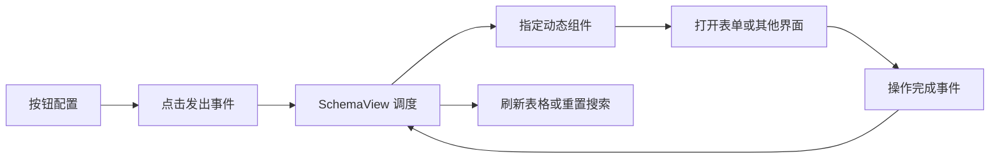
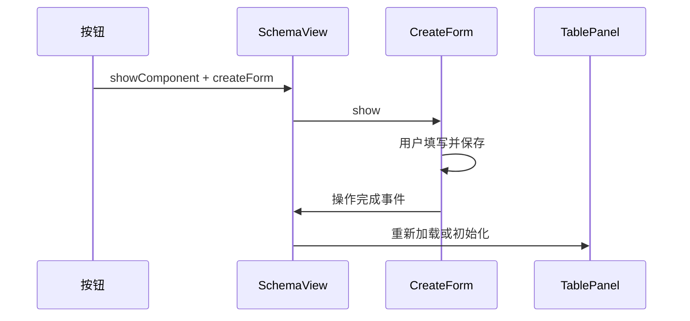

# 动态组件 - DSL设计

<MuxPlayer
  className="mt-8"
  playbackId="701VkVSWXccdpzWTpgZPYvfbPXRbxfeyuuEl01S2Kc8Gw"
  title="动态组件 - DSL设计"
/>

> [!NOTE]
>
> 本节进入 **动态组件的 DSL 设计**。已有搜索栏和表格能够常驻页面，但新增、修改、详情等能力通常需要点击按钮后再打开表单、弹窗或抽屉，因此还需要一套按事件调起组件的机制。
>
> 设计分为三部分：`componentConfig` 描述页面有哪些动态组件；字段中的 `createFormOption` 等配置描述字段在该组件中的表现；按钮通过 `showComponent` 事件和 `componentName` 指定要调起的组件。
>
> 本节主要完成协议设计，后续才实现组件解析、实例查找和实际表单。以下示例按课堂思路整理，展示配置之间的关系。

## 从列表操作走向完整交互

前面同一份数据已经能够生成搜索栏和表格。页面上也有新增、修改等按钮，但它们还没有完整的表单流程。

本节以新增商品为例继续推进：点击头部按钮，打开一个表单；用户填写后保存；组件完成操作，再通知页面刷新列表。修改、详情等交互也可以沿相似机制接入。

这并不意味着所有动态组件都是表单。课程明确提出，动态组件可以是弹窗、抽屉或其他类型的业务交互，CreateForm 只是第一种落地案例。



## 复用搜索栏已经验证过的模式

SchemaSearchBar 已经具备一种扩展方式：控件放在组件目录，注册表把类型名称映射到具体组件，DSL 通过类型字段选中它。

动态组件沿用这个思路，但扩展层级更高。搜索栏内部的 Input 是一个字段控件；这里的 CreateForm 则是一个包含完整业务流程的面板，它内部又会使用 SchemaForm，SchemaForm 再调度 Input、InputNumber 等字段控件。

因此可以形成两层扩展：外层决定打开哪一种业务组件，内层决定每个字段使用什么录入组件。两者都可以由配置驱动，但解决的问题不同。

## 先更新 DSL 文档

课程进入新功能前先建立功能分支，然后从文档开始更新 DSL。这里记录的是课堂研发流程，不是要求笔记编辑过程创建分支或提交代码。

先写协议的目的，是让后续组件和配置者有共同契约。如果实现已经变化，文档仍停留在旧字段名，配置错误就会越来越难定位。

动态组件涉及字段 Option、组件 Config 和按钮 Event 三处相互关联的约定，更需要先把名称和关系写清楚。后续实现时发现设计需要调整，可以继续迭代，但文档应与代码同步。

## componentConfig 为什么与 tableConfig 不同

表格与搜索栏在当前 SchemaView 中通常各只有一份，所以 `tableConfig`、`searchConfig` 可以直接描述那个组件。

动态组件却可能有很多个：CreateForm、EditForm、DetailPanel，或者其他业务自定义面板。因此 `componentConfig` 内部需要再按组件名分组。

```js filename="动态组件整体配置.js" copy
const componentConfig = {
  createForm: {
    title: "新增商品",
    saveButtonText: "保存商品",
  },
  // 后续可以继续加入 editForm、detailPanel 等组件。
}
```

`createForm` 是组件身份；它内部的 `title`、`saveButtonText` 才属于这一个组件的配置。其他组件可以拥有不同配置，不必强迫所有组件都具备保存按钮。

这层结构为扩展保留了空间。新增组件时，在对应 key 下提供自己的配置，由该组件负责解释即可。

## 字段 Option 与组件 Config 的对应关系

如果组件名是 `createForm`，字段中对应的配置就是 `createFormOption`。这个前缀关系让已有 `buildDtoSchema` 可以继续使用：传入组件名，就知道该提取哪个 Option。

```js filename="字段与动态组件的关系.js" copy
const schemaConfig = {
  schema: {
    type: "object",
    properties: {
      productName: {
        type: "string",
        label: "商品名称",
        tableOption: { minWidth: 200 },
        searchOption: { comType: "input" },
        createFormOption: {
          comType: "input",
          visible: true,
          disabled: false,
          default: "",
          placeholder: "请输入商品名称",
        },
      },
    },
  },
  componentConfig: {
    createForm: {
      title: "新增商品",
      saveButtonText: "保存商品",
    },
  },
}
```

同一个商品名称字段同时参与列表、搜索与新增表单，但三种表现可以不同。表格关心列宽，搜索关心筛选控件，新增表单关心是否可编辑、默认值与录入方式。

| 层级 | 表达内容 |
| --- | --- |
| `componentConfig.createForm` | 整个新增组件的配置 |
| `productName.createFormOption` | 商品名称在新增组件中的表现 |
| `productName.type`、`label` | 各组件共享的字段基础信息 |

把这些配置分开之后，就不会为了改一个保存按钮文案而进入字段配置，也不会把某个字段的禁用状态误当成整张表单的状态。

## CreateForm 字段可以配置什么

课程首先给新增表单字段开放组件类型、显示、禁用和默认值，并保留底层 Element Plus 控件属性的透传能力。

`comType` 选择 Input、Select、InputNumber 等控件；`visible` 决定该字段是否显示；`disabled` 决定是否允许编辑；`default` 提供初始值。

```js filename="新增表单字段 Option 示例.js" copy
const statusOption = {
  comType: "select",
  visible: true,
  disabled: false,
  default: "enabled",
  enumList: [
    { label: "启用", value: "enabled" },
    { label: "停用", value: "disabled" },
  ],
}
```

当 `comType` 是 Select 时，还需要 `enumList`；其他控件可能有自己的特殊配置，例如动态下拉需要 API。课程以这些例子说明 Option 应随控件能力扩展，而不是本节就穷尽所有表单类型。

显示与禁用也不能混为一谈。隐藏的字段不出现在界面上；禁用字段仍然可以显示，只是不允许用户修改。后续编辑表单中的主键就可能使用这种能力。

## 为什么配置组件后还需要事件

搜索栏只要存在搜索字段，就可以直接显示。动态表单则不能在页面加载时全部弹出来，即使 DSL 已经配置了 CreateForm，它也应先处于关闭状态。

因此组件配置回答“页面具备什么能力”，按钮事件回答“什么时候使用这项能力”。二者缺一不可。

课程使用 `eventKey: "showComponent"` 表达打开动态组件，再在 `eventOption.componentName` 中指定目标名称。

```js filename="新增商品按钮配置.js" copy
const createButton = {
  label: "新增商品",
  type: "primary",
  eventKey: "showComponent",
  eventOption: {
    componentName: "createForm",
  },
}
```

SchemaView 收到事件后，读取 componentName，找到对应组件实例并调用它的显示方法。这使一个统一事件可以打开不同组件，而不需要为新增、修改、查看各写一条硬编码按钮分支。

## 头部按钮与行按钮都可以调起组件

新增通常放在头部按钮中，修改与查看通常放在行操作列中，但两者可以共用 `showComponent` 协议。

行按钮除了组件名称，还天然具备当前行数据。SchemaView 可以将这份数据交给目标组件，为后续编辑或详情请求提供标识。头部按钮没有当前行，CreateForm 则按默认配置初始化。

```js filename="表格整体按钮配置示意.js" copy
const tableConfig = {
  headerButtons: [createButton],
  rowButtons: [
    {
      label: "修改",
      eventKey: "showComponent",
      eventOption: { componentName: "editForm" },
    },
  ],
}
```

这个片段中的 EditForm 是后续能力示意，真正使用前还要注册组件并提供对应的组件 Config。仅写按钮名称不会自动生成编辑表单。

## 不同事件拥有不同参数协议

`eventOption` 的结构不是所有事件都完全一样。删除操作需要知道请求参数和当前行字段的关系；打开组件需要 componentName；未来新增其他事件，也可能拥有新的参数结构。

因此 eventKey 应被看成协议分支：先判断动作是什么，再按该动作理解 eventOption。不要把所有事件参数都当作一个无差别对象直接传给任何处理器。

| eventKey | 本阶段关注的参数 |
| --- | --- |
| `remove` | 删除标识及其动态取值规则 |
| `showComponent` | `componentName` |

课程在复盘删除协议时又提到主键名、主键值等表达方式，后续实现会继续调整。这里最稳定的设计结论是“事件名决定参数语义”，而不是把某一版临时字段结构当作永远不变的标准。

## SchemaView 负责组件之间的联动

打开表单只是流程前半段。表单保存后，还可能需要关闭自身、清理搜索条件或刷新列表。课程把 SchemaView 作为调度层，让组件发出完成事件，由页面协调其他组件。

这样 CreateForm 不需要直接寻找 SearchBar 或 Table 内部实例。它只报告自己的操作完成；页面再调用已有的表格初始化方法。



本节先建立这条设计关系，真正的保存请求与完成事件将在后续组件实现中补齐。

## 本节小结

本节确定了动态组件 DSL 的三组关联：组件名在 `componentConfig` 下组织整体配置，字段通过同名前缀的 Option 声明表现，按钮通过 `showComponent` 与 `componentName` 调起目标组件。

CreateForm 是这一机制的第一个例子，设计本身允许继续加入编辑、详情、弹窗或抽屉。下一节将沿配置的数据流实现 DTO 构建、组件注册、实例查找与显示方法，让这些协议真正运行起来。
