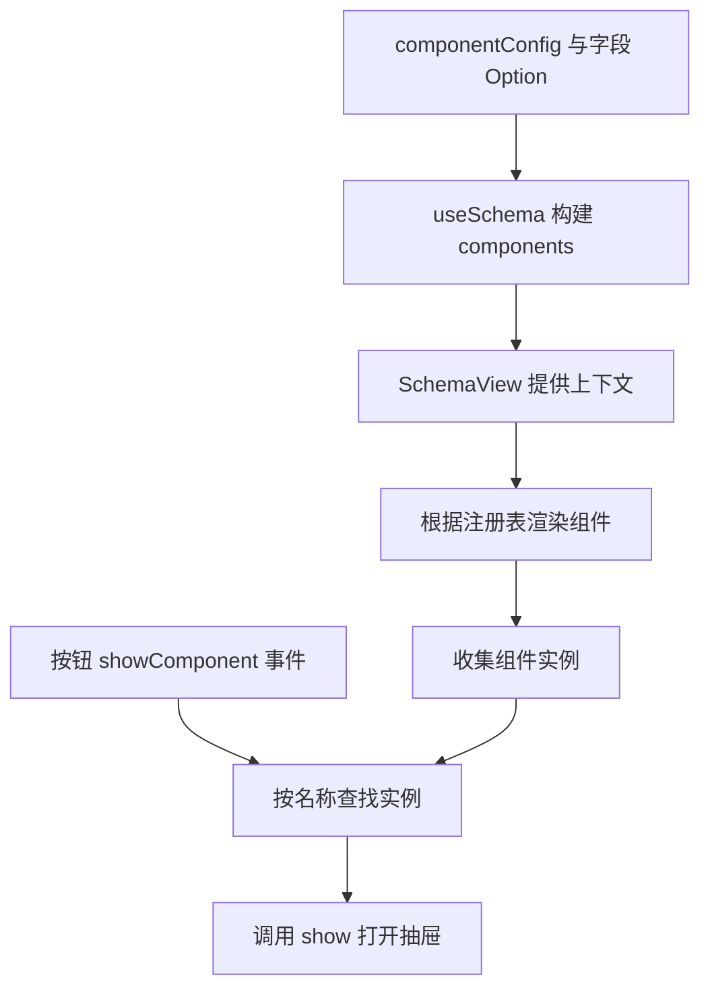

# 动态组件 - 机制实现

<MuxPlayer
  className="mt-8"
  playbackId="GQiOK48eEcQI02qcMNRGaYoU7Ltzwn25tlDXqY8eF6DE"
  title="动态组件 - 机制实现"
/>

> [!NOTE]
>
> 本节将上一节的动态组件协议落地。`useSchema` 根据 `componentConfig` 构建每个组件的 Schema 与 Config，SchemaView 注册并渲染组件，再根据按钮事件中的名称找到实例、调用 `show()`。
>
> 本节还把 JSON Schema 的 `required` 数组转换成字段级必填标记，为下一节 SchemaForm 校验做准备。CreateForm 当前只是可打开的抽屉骨架，完整表单尚未实现。
>
> 调试部分很有代表性：按钮无反应，最终定位到 eventKey 大小写、没有配置组件、配置层级名称写错等问题。代码为按课堂思路整理的简化示例。

## 沿着数据流确定开发顺序

动态组件涉及多个文件，随意跳着改很容易失去方向。课程沿着数据第一次进入系统的位置开始：DSL 已经定义好，接下来先修改最先消费它的 `useSchema`。

然后才是 SchemaView 提供上下文、动态组件接入、注册表、事件处理与模型联调。每一步都以“上一层输出什么，下一层需要什么”为线索。



这条顺序也给调试提供了反向路径：找不到实例时，可以向上检查是否渲染、是否有 DTO、是否有原始配置。

## 为什么不用两个平行对象

课程最初考虑分别维护 `componentSchema` 与 `componentConfig`，仿照前面的 tableSchema、tableConfig。

但动态组件数量不固定，两个对象内部都还要按 createForm、componentB 等名字再分组。这样就变成两套平行索引，需要始终保持 key 对应。

因此本节调整为单一 `components` 对象：第一层是组件名，第二层把该组件的 Schema 与 Config 放在一起。

```js filename="components DTO 目标结构.js" copy
const components = {
  createForm: {
    schema: {
      type: "object",
      properties: {},
    },
    config: {
      title: "新增商品",
      saveButtonText: "保存商品",
    },
  },
  anotherComponent: {
    schema: { type: "object", properties: {} },
    config: {},
  },
}
```

这个选择不是追求表面上所有 Hook 返回字段长得一样，而是让数据组织与真实用途一致。消费 CreateForm 时，只需要取得 `components.createForm`，就可以同时得到两部分配置。

## 以 componentConfig 为遍历入口

要构建哪些组件，由 `schemaConfig.componentConfig` 决定。Hook 遍历其中每个组件名称，再调用 `buildDtoSchema` 提取该组件的字段。

```js filename="构建动态组件 DTO.js" copy
function buildComponents(schemaConfig) {
  const configSchema = JSON.parse(
    JSON.stringify(schemaConfig.schema || {}),
  )
  const componentConfig = schemaConfig.componentConfig || {}
  const dtoComponents = {}

  for (const [componentName, config] of Object.entries(componentConfig)) {
    dtoComponents[componentName] = {
      schema: buildDtoSchema(configSchema, componentName),
      config,
    }
  }

  return dtoComponents
}
```

假如只有商品名称字段配置 `createFormOption`，生成的 CreateForm Schema 就只包含商品名称。表格中的其他字段并不会因为属于同一业务数据就自动全部进入新增表单。

这种提取机制已经用于 table 与 search，本节没有为动态组件再写一套规则，而是继续利用“组件名 + Option”的命名契约。

## 配置存在与字段存在是两回事

`componentConfig.createForm` 决定页面要建立 CreateForm 这项能力；字段的 `createFormOption` 决定它包含哪些字段。

因此即使字段里写了 createFormOption，但整个 componentConfig 没有 createForm，Hook 仍然不会遍历到这个组件。反过来，只配置组件而没有字段，可以先生成一个空 Schema，用于验证抽屉调起机制。

本节联调先以空内容抽屉证明机制成立，后面才补表单。这样可以把“按钮是否能找到组件”与“表单是否正确生成”分开验证。

## required 从标准结构转成字段标记

表格和搜索对必填要求不明显，但新增表单需要知道哪些字段必须提供。课程因此把 JSON Schema 的 `required` 数组加入配置，并在 DTO 构建时转成每个字段可直接读取的标记。

标准写法中 `required` 位于对象 Schema 层，与 `properties` 同级，内容是字段名数组。

```js filename="原始 Schema 的 required.js" copy
const schema = {
  type: "object",
  required: ["productName", "price"],
  properties: {
    productName: {
      type: "string",
      label: "商品名称",
      createFormOption: { comType: "input" },
    },
    price: {
      type: "number",
      label: "价格",
      createFormOption: { comType: "inputNumber" },
    },
  },
}
```

字幕多次将 `required` 读成 `require`，应按标准关键字与实际代码区分。笔记统一使用 `required` 表示标准数组和示例中的字段标记。

## 在 DTO 构建过程中补充必填信息

只有当前组件需要的字段被选中后，才为其建立 `option` 并处理 required。没有对应 Option 的字段不会为了必填规则被强行加进当前组件。

```js filename="buildDtoSchema 的 required 处理.js" copy
function buildDtoSchema(schema = {}, componentName) {
  const result = { type: schema.type || "object", properties: {} }
  const optionKey = `${componentName}Option`
  const required = new Set(schema.required || [])

  for (const [key, property] of Object.entries(schema.properties || {})) {
    if (!Object.prototype.hasOwnProperty.call(property, optionKey)) continue

    const dtoProperty = Object.fromEntries(
      Object.entries(property).filter(([name]) => !name.endsWith("Option")),
    )

    dtoProperty.option = {
      ...(property[optionKey] || {}),
      required: required.has(key),
    }
    result.properties[key] = dtoProperty
  }

  return result
}
```

输出后，表单控件可以在处理某一个字段时直接读取 `option.required`，不必每次回到外层数组查找。

这是数据形态转换，不是宣称 JSON Schema 的标准写法就是把 required 放在 Option 内。标准输入与组件 DTO 承担不同角色，转换过程把二者连接起来。

## 让 SchemaView 提供 components

Hook 返回 components，SchemaView 获取后把它加入 `schemaViewData`。动态业务组件需要自己的配置时，通过注入取得。

```js filename="SchemaView 提供动态组件数据.js" copy
const {
  api,
  tableSchema,
  tableConfig,
  searchSchema,
  searchConfig,
  components,
} = useSchema()

provide("schemaViewData", {
  api,
  tableSchema,
  tableConfig,
  searchSchema,
  searchConfig,
  components,
})
```

这里仍然传递响应式对象，使菜单切换后各个消费者可以得到当前配置。具体表单内容交给组件自己解释，SchemaView 只负责提供上下文与调度。

## CreateForm 先提供最小显示协议

本节新建 CreateForm 目录和组件文件。使用目录而不是零散单文件，是为了后续同一组件可以容纳样式、辅助方法或其他资源。

最小组件需要三个东西：一个稳定名称、一个显示状态、一个可被外部调用的 show 方法。

```vue filename="components/create-form/create-form.vue（骨架）" copy
<template>
  <el-drawer
    v-model="isShow"
    direction="rtl"
    :destroy-on-close="true"
  >
    <div>新增表单内容将在后续实现</div>
  </el-drawer>
</template>

<script setup>
import { inject, ref } from "vue"

const { components } = inject("schemaViewData")
const name = "createForm"
const isShow = ref(false)

function show(rowData) {
  isShow.value = true
}

defineExpose({ name, show })
</script>
```

这里 `rowData` 暂时未使用，但它让头部操作和行操作可以使用同一调用形式。后续 EditForm、DetailPanel 会需要当前行标识。

`destroy-on-close` 用于让抽屉关闭时销毁其内容，减少再次打开时遗留内部表单状态的机会。它与外层组件是否仍挂载不是同一概念：用于调度的组件实例可以保留，抽屉内部内容按开关生命周期建立和销毁。

## 注册表连接名字与组件实现

DSL 只有字符串名称，不能直接引用 Vue 文件，因此需要一个注册表将两者连接。

```js filename="components/component-config.js（简化示例）" copy
import CreateForm from "./create-form/create-form.vue"

export const componentRegistry = {
  createForm: CreateForm,
}
```

SchemaView 遍历解析出的 components，对每个已配置名称查找注册表，再动态渲染对应组件。

```vue filename="SchemaView 动态组件渲染示意.vue" copy
<template v-for="(_, componentName) in components" :key="componentName">
  <component
    v-if="componentRegistry[componentName]"
    :is="componentRegistry[componentName]"
    :ref="(instance) => setComponentRef(componentName, instance)"
  />
</template>
```

示例用函数 ref 按名字维护实例映射；课堂也讨论了直接使用 ref 数组的方式。两者都需要处理组件更新和卸载时的引用变化，不能在每次回调时无限向数组追加同一实例。

## 收集实例并响应 showComponent

渲染组件后，还要有办法按名称找到它。下面以 Map 表达同一机制：组件挂载时加入，卸载时移除。

```js filename="SchemaView 动态组件调度（简化示例）.js" copy
const componentRefs = new Map()

function setComponentRef(name, instance) {
  if (instance) componentRefs.set(name, instance)
  else componentRefs.delete(name)
}

function showComponent(buttonConfig, rowData) {
  const componentName = buttonConfig.eventOption?.componentName
  if (!componentName) {
    console.error("未配置 componentName")
    return
  }

  const instance = componentRefs.get(componentName)
  if (!instance || typeof instance.show !== "function") {
    console.error(`找不到可显示的组件：${componentName}`)
    return
  }

  instance.show(rowData)
}

function onTableOperate(buttonConfig, rowData) {
  if (buttonConfig.eventKey === "showComponent") {
    showComponent(buttonConfig, rowData)
  }
}
```

课堂通过组件暴露的 `name` 在实例列表中查找，示例在收集时以 DSL 名称建立映射。关键契约相同：按钮指定名称，已渲染组件提供 show，页面负责把两者连接。

## 验证配置必须同时满足三处约定

本节测试“新增商品”时，需要头部按钮、组件整体配置和注册表相互一致。

```js filename="可调起 CreateForm 的最小配置.js" copy
const schemaConfig = {
  schema: { type: "object", properties: {} },
  tableConfig: {
    headerButtons: [
      {
        label: "新增商品",
        eventKey: "showComponent",
        eventOption: { componentName: "createForm" },
      },
    ],
  },
  componentConfig: {
    createForm: {
      title: "新增商品",
      saveButtonText: "保存商品",
    },
  },
}
```

按钮不能替代 componentConfig。按钮只是调起入口，componentConfig 才决定 Hook 要构建并渲染哪个组件。这一点正是课堂实际故障的根源之一。

## 从按钮无反应逐层定位

课堂点击新增后没有反应，先在 SchemaView 的事件入口打印，确认事件确实到达。随后发现读取的 eventKey 为空，再打印完整 buttonConfig，发现对象中其实有值，是代码把 `eventKey` 的 K 写成了小写。

修正后进入 showComponent，但仍找不到组件。接着检查：是找到了组件却没有 show 方法，还是实例本身不存在？打印发现实例列表为空，于是继续追到动态渲染依赖的 components。

components 为空，又往上检查 Hook 和模型配置，发现只配了按钮，却没有配置动态组件。补上后仍有问题，再检查配置层级名称，最终使 DSL 中的配置 key 与 Hook 读取的 key 一致，抽屉才打开。

```text filename="本节调试链路" copy
按钮点击
  → 事件是否到达 SchemaView
  → buttonConfig 是否包含正确 eventKey
  → 是否进入 showComponent
  → 目标实例是否存在
  → 实例集合为什么为空
  → components DTO 是否存在
  → componentConfig 是否配置且命名一致
```

这条链路比猜测抽屉样式或重新绑定点击事件更有效，因为每一步都用观察结果排除一个层级。

## 顺带整理搜索栏引用与调试代码

本节还回看搜索栏实例收集方式，将容易重复触发的函数收集逻辑简化为直接 ref 列表，并修复 SearchPanel 的样式与语言属性拼写。

重点是引用机制必须与渲染更新方式相适应。若函数 ref 在多次更新时重复触发，又只做 push、不清理，就可能收集出重复实例，增加读值与重置的不确定性。

联调完成后，课程要求清除临时 console.log。用于解释缺少配置等异常的必要诊断可以保留，临时阶段编号和对象打印则不应该散落在最终代码中。

## 本节小结

本节完成的是动态组件调起机制。Hook 将组件专属 Schema 与 Config 聚合到 components，SchemaView 根据注册表渲染并保存实例，按钮事件按 componentName 调用目标 show 方法。

与此同时，required 被转换成字段级必填标记，为表单校验做好准备。当前 CreateForm 只验证抽屉能够按配置打开，下一节开始实现公共 SchemaForm，再将真正的字段录入能力嵌入这个动态组件。
