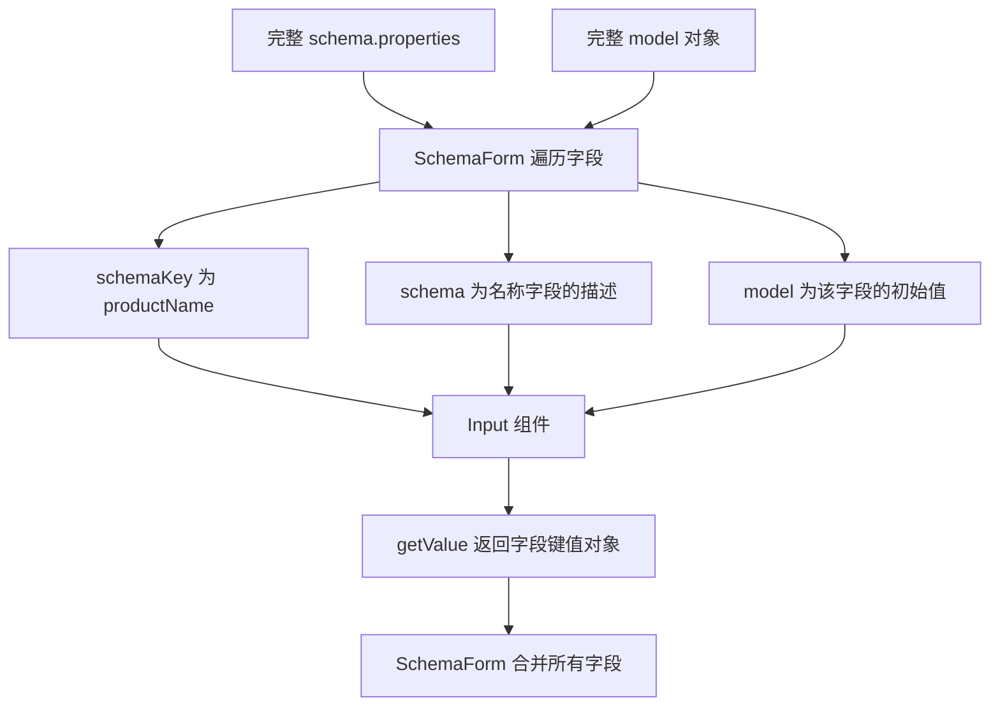

# 动态组件 - SchemaForm

<MuxPlayer
  className="mt-8"
  playbackId="y4xFp1EArUOctFjZfgOkLnGM9MnFXFPgYY012Noe41O4"
  title="动态组件 - SchemaForm"
/>

> [!NOTE]
>
> 前两节已经让 SchemaView 能按名称打开动态组件，但 CreateForm 还只是一个抽屉。本节建设它内部真正负责字段渲染、初始值、校验和取值的公共组件 SchemaForm。
>
> 课程先确定表单与字段控件的协议，再实现 Input、InputNumber、Select，把 JSON Schema 交给 AJV 校验，并将错误反馈到具体字段。理解这层分工后，新增、修改等业务组件就能共享同一套表单能力。
>
> 以下代码为按课堂思路整理的简化示例，补齐了示例之间的调用关系；不等同于视频逐行源码。字幕中部分连续重复内容无法恢复具体代码，相关段落只整理后续讲解能够确认的行为。

## 先划清 SchemaForm 和业务表单的职责

CreateForm 要处理“新增商品”，EditForm 要处理“修改商品”，两者都有抽屉、保存按钮和请求逻辑，但不应该各自再写一套输入框、枚举、校验和取值规则。

因此课程在 `widgets/schema-form` 建立公共表单。它只回答三个问题：根据什么结构渲染、初始数据显示什么、当前填写的数据是否合法。至于提交到哪个接口、使用 POST 还是 PUT、提交成功后刷新什么，由外部业务组件处理。

| 层次 | 本节承担的职责 | 主要输入和输出 |
| --- | --- | --- |
| CreateForm / EditForm | 业务流程、抽屉、接口请求 | 传入 Schema、Model，调用表单方法 |
| SchemaForm | 遍历字段、选择控件、汇总校验和数据 | 接收 `schema`、`model`，提供 `validate()`、`getValue()` |
| Input / InputNumber / Select | 单个字段的交互与校验提示 | 接收字段配置和初始值，提供相同的方法 |
| AJV | 执行 JSON Schema 规则 | 根据标准约束判断字段值是否合规 |

这种结构延续了 SearchBar 的设计经验：父级面向协议收集子组件实例，具体控件自行处理内部交互，业务容器不需要理解每种控件的取值细节。

## 先设计 props、事件和方法

写一个公共组件之前，先从三种通信方式考虑它的边界：props 用来接收什么，事件用来通知什么，公开方法让外部主动触发什么。

SchemaForm 接收两个对象：

- `schema`：描述有哪些字段、字段类型、标准约束和控件选项。
- `model`：描述已有数据，主要用于修改场景的初始值回显。

新增时可以不传 model，字段使用默认值；修改时传入接口返回的 model，字段显示实际数据。同一个 Schema 可以对应不同 Model，不能把某个商品的当前名称写死在 Schema 里。

```js filename="schema-form 输入示意.js" copy
const schema = {
  type: "object",
  properties: {
    productName: {
      type: "string",
      label: "商品名称",
      minLength: 3,
      maxLength: 20,
      option: {
        comType: "input",
        required: true,
        placeholder: "请输入商品名称",
      },
    },
    price: {
      type: "number",
      label: "商品价格",
      minimum: 30,
      maximum: 1000,
      option: { comType: "inputNumber", default: 30 },
    },
  },
};

// 新增时可以省略；修改时来自单条详情接口。
const model = { productName: "Vue 实战课程", price: 99 };
```

这里的 `option` 已经是 `useSchema` 转换后的 DTO。原始 DSL 中是 `createFormOption`、`editFormOption` 等组件专属配置，公共控件不需要知道自己正在服务哪个业务表单。

本节暂时没有必须向外通知的表单事件。外部保存按钮只需要主动调用两项能力：先 `validate()`，通过后再 `getValue()`。不要为了形式完整预先定义大量没有消费者的事件。

课程也强调注释的维护位置：SchemaForm 是公共能力，完整协议应在这里讲清楚；每个字段控件重复粘贴整份文档，会让修改一处协议时留下多份过期说明。子控件重点解释自身差异即可。

## 字段控件为什么要接收三个参数

每个字段组件接收 `schemaKey`、`schema` 和 `model`。

`schemaKey` 是字段名，例如 productName。它决定最终提交对象的键。`schema` 是这个字段的描述，用来读取 label、type、约束和 option。`model` 是这个字段的初始值，例如“Vue 实战课程”，并不是整个商品对象。



当控件返回 `{ productName: "Vue 实战课程" }` 时，父级可以统一合并；如果控件只返回一个字符串，父级就需要额外建立实例与字段名的对应关系。课程选择让字段组件自己带上 schemaKey，保持取值协议直接。

组件还应暴露一个便于调试的名称。后续校验失败时，可以知道是 input、inputNumber 还是 select 返回了 false，而不是面对一串无法定位的布尔值。

## 用注册表决定字段渲染成什么

表单项配置采用与搜索控件相近的注册表模式。业务 Schema 中只填写名称，真正的 Vue 组件由框架统一导入和注册。

```js filename="widgets/schema-form/form-item-config.js" copy
import Input from "./items/input.vue";
import InputNumber from "./items/input-number.vue";
import Select from "./items/select.vue";

export default {
  input: Input,
  inputNumber: InputNumber,
  select: Select,
};
```

SchemaForm 遍历 `schema.properties`，根据 `option.comType` 选择组件。新增一种控件时，主要工作是实现既定协议，再加入注册表，不需要在 CreateForm 和 EditForm 中各加一套分支。

下面把父级的核心结构连在一起。示例用带字段名的 Map 保存实例，避免函数 ref 在更新时重复执行而把同一个实例反复 push 进数组。

```vue filename="widgets/schema-form/schema-form.vue" copy
<template>
  <div v-if="schema.properties" class="schema-form">
    <component
      :is="formItemConfig[itemSchema.option.comType]"
      v-for="(itemSchema, key) in schema.properties"
      :key="key"
      :ref="instance => setItemRef(key, instance)"
      v-show="itemSchema.option.visible !== false"
      :schema-key="key"
      :schema="itemSchema"
      :model="model[key]"
    />
  </div>
</template>

<script setup>
import { provide } from "vue";
import Ajv from "ajv";
import formItemConfig from "./form-item-config";

const props = defineProps({
  schema: { type: Object, default: () => ({}) },
  model: { type: Object, default: () => ({}) },
});

// 一张表单共享一个 AJV 实例，字段组件负责自己的规则和提示。
provide("schemaFormAjv", new Ajv({ allErrors: true }));

const itemRefs = new Map();

function setItemRef(key, instance) {
  if (instance) itemRefs.set(key, instance);
  else itemRefs.delete(key);
}

function getItems() {
  return Object.keys(props.schema.properties ?? {})
    .map(key => itemRefs.get(key))
    .filter(Boolean);
}

function validate() {
  return getItems().every(item => item.validate());
}

function getValue() {
  return getItems().reduce(
    (result, item) => Object.assign(result, item.getValue()),
    {},
  );
}

defineExpose({ validate, getValue });
</script>
```

这里有两个不同层次的条件：外层等待 properties 存在后再渲染；单个字段的 visible 控制是否显示。课程后续验证的协议是，`visible: false` 的字段仍存在、仍可取值，因此这里采用 `v-show`，并要求字段组件有能够接受样式的根节点。没有相应表单 Option 的字段则在 DTO 阶段被过滤，根本不会进入这个循环。

`every()` 会在第一个 false 处停止。因此一次保存可能先只出现第一个失败字段的提示；这是本课程聚合实现的行为。如果需要一次展示全部错误，必须先完整执行每个字段的 validate，再汇总结果，不能误以为 every 会遍历所有项。

> [!TIP]
>
> 注册表名称、DSL 的 comType、组件实例公开的方法是一条完整协议。配置了不存在的名称时，应先检查注册链路；表单为空并不必然是 Vue 响应式失效。

## 输入框初始化：回显优先，默认值兜底

Input 内部维护 `dtoValue`，它是用户当前正在编辑的值。初始化时首先考虑传入的 model，只有 model 没有提供值时，才使用 option.default。

不能写成 `model || default`。数字 0、布尔值 false、空字符串都可能是明确传入的值，不能因为它们是假值就被默认值覆盖。虽然 Input 主要处理字符串，这个规则要贯穿后续 InputNumber 和 Select。

课程采用监听 model 加初始化的方式处理回显：组件第一次创建要有初始值，接口稍后返回的新 model 也要同步进入 dtoValue。下例用 `immediate` 的 watch 合并这两个入口，表达的仍是同一条初始化逻辑。

```js filename="Input 初始化逻辑.js" copy
const dtoValue = ref();
const validateTips = ref("");

function initData() {
  dtoValue.value = props.model !== undefined
    ? props.model
    : props.schema.option?.default;
  validateTips.value = "";
}

watch(
  () => [props.model, props.schema.option?.default],
  initData,
  { immediate: true, deep: true },
);
```

初始化同时清空错误提示很有必要。编辑甲商品时留下的错误，不能在打开乙商品后继续显示；接口新数据回显时，也不应该保留上一轮输入的状态。

监听的目标是外部 model 的变化，不是让父级每输入一个字符就重置整个表单。用户编辑主要发生在 dtoValue 中，外部需要提交时再主动 getValue。

## 复用 AJV：把标准约束交给统一的校验器

此前 BFF 参数校验已经使用过 JSON Schema 与 AJV。本节把同一类校验能力引入前端，而不是重新手写“类型是否正确、字符串长度是否越界、格式是否匹配”的整套判断。

这并不意味着把全部 UI 配置原样当成标准 JSON Schema。`label` 和 `option` 是框架的扩展信息；`type`、`minLength`、`maxLength`、`pattern` 等才是输入框需要执行的标准约束。整理示例将二者分开，避免 AJV 严格模式把扩展字段当成未知关键字。

AJV 实例在 SchemaForm 中创建，通过 provide/inject 给子组件。每个字段可以编译自己的规则，但没有必要每个字段都重新实例化一套校验器。

```js filename="Input 校验核心.js" copy
const ajv = inject("schemaFormAjv");

const validateField = computed(() => {
  const { label, option, ...rules } = props.schema;
  return ajv.compile(rules);
});

function validate() {
  validateTips.value = "";
  const value = dtoValue.value;
  const required = props.schema.option?.required;
  const empty = value === undefined || value === null || value === "";

  if (required && empty) {
    validateTips.value = "请输入" + props.schema.label;
    return false;
  }

  // 未提供的可选字段不参与提交，也不要求通过字段类型检查。
  if (!required && value === undefined) return true;

  const valid = validateField.value(value);
  if (!valid) {
    const error = validateField.value.errors?.[0];
    validateTips.value = getErrorTip(error);
  }
  return valid;
}

function getErrorTip(error) {
  switch (error?.keyword) {
    case "type":
      return "数据类型不正确";
    case "minLength":
      return `长度不能少于 ${props.schema.minLength} 个字符`;
    case "maxLength":
      return `长度不能超过 ${props.schema.maxLength} 个字符`;
    case "pattern":
      return "格式不正确";
    default:
      return "输入内容不符合要求";
  }
}
```

本例的函数依赖同一个 Input 文件中的 props、dtoValue、validateTips，以及从 Vue 导入的 computed、inject、ref、watch。独立片段按同一组件组织，不能把它当成没有依赖的工具函数直接调用。

父级的 required 数组在前面 DTO 转换时已变成 `option.required`。对子字段的 primitive 值直接运行 AJV 时，并不存在完整对象上的“该键是否缺失”信息，因此课程先处理字段级必填，再交给标准规则校验。

错误反馈读取 `errors[0].keyword`，以规则类型映射中文文案。AJV 可以收集多个错误，但本节 UI 一次显示一条，首先让用户知道当前需要改什么。对于暂时没有专门适配的关键字，保留通用提示，并在开发调试时查看错误对象；不能把底层错误结构直接当作用户文案。

## 校验结果必须落到字段旁边

课程没有让每个字段校验失败就弹一个全局消息框。多个字段连续失败时，全局弹窗会打断操作，也难以知道是哪一项有问题。

Input 自己保存 `validateTips`，在控件下方展示，并给控件边框添加错误样式。blur 时触发校验，focus 时清掉旧提示；保存按钮仍会通过父组件再次主动校验，避免只依赖用户有没有离开输入框。

```vue filename="Input 的模板与公开方法.vue" copy
<template>
  <div class="schema-form-item">
    <label class="form-item-label">
      <span v-if="schema.option.required" class="required">*</span>
      {{ schema.label }}
    </label>
    <div class="form-item-content">
      <el-input
        v-model="dtoValue"
        :disabled="schema.option.disabled"
        :placeholder="placeholder"
        :class="{ 'validate-border': validateTips }"
        @blur="validate"
        @focus="validateTips = ''"
      />
      <div v-if="validateTips" class="validate-tips">
        {{ validateTips }}
      </div>
    </div>
  </div>
</template>

<script setup>
// 本片段接续上文的状态、初始化和校验逻辑。
// 完整组件需导入 ref、watch、computed、inject，并声明如下 props。
const props = defineProps({
  schemaKey: { type: String, required: true },
  schema: { type: Object, required: true },
  model: { type: String, default: undefined },
});

function getValue() {
  return dtoValue.value === undefined
    ? {}
    : { [props.schemaKey]: dtoValue.value };
}

defineExpose({ name: "input", validate, getValue });
</script>
```

`getValue()` 必须用“是否为 undefined”判断有没有值，而不能用真值判断。空字符串是否允许，由 required、minLength 等规则决定；数值 0 是否允许，由数字规则决定。取值阶段不应该悄悄删除这些数据。

这也是校验与取值分成两个方法的原因：校验负责决定能否提交，取值负责忠实地把当前状态整理成对象，避免一个方法既弹提示又变更业务流程。

## 规则还要提前告诉用户

如果只有提交失败后才显示“至少三个字符”，用户在输入前并不知道限制。本节继续把长度要求组织进 placeholder，让规则不仅是事后的拒绝条件，也成为填写时的提示。

```js filename="Input placeholder.js" copy
const placeholder = computed(() => {
  const messages = [];
  const option = props.schema.option ?? {};
  if (option.placeholder) messages.push(option.placeholder);
  if (props.schema.minLength !== undefined) {
    messages.push(`至少 ${props.schema.minLength} 个字符`);
  }
  if (props.schema.maxLength !== undefined) {
    messages.push(`最多 ${props.schema.maxLength} 个字符`);
  }
  return messages.join("，");
});
```

用户配置的 placeholder 应当保留，再与标准规则组合。正则 pattern 可以用于校验，但原始正则不一定适合直接呈现在输入提示里；课程的关键是让限制有对应的可理解提示，而不是只依靠失败后的红字。

样式上，课程抽取了标签宽度、输入区域宽度、错误文字和必填星号等公共规则。为了让父组件的公共样式作用到动态子控件，可以使用非 scoped 样式，但所有选择器要放在 `.schema-form` 命名空间下，避免全局的 `.label`、`.content` 影响其他页面。

如果使用 scoped，则要考虑子组件边界和深度选择器。两种写法的目标一致：共享表单布局，又不污染表单外部；不能简单去掉 scoped 后把通用类名散落在全局。

## InputNumber：复用协议，替换类型相关行为

数字控件不是把输入框的名字改成 inputNumber 就结束了。输入类型、模型值类型、组件交互和校验文案都需要一致。

| 对比项 | Input | InputNumber |
| --- | --- | --- |
| 典型值 | 字符串 | 数字 |
| Schema 类型 | `string` | `number` 或对应整数约束 |
| 长度或范围规则 | `minLength`、`maxLength` | `minimum`、`maximum` |
| 规则失败说明 | 字符数越界 | 数值超出上下限 |
| 相同协议 | schemaKey/schema/model、validate/getValue | schemaKey/schema/model、validate/getValue |

例如一个 `type: "number"` 字段如果配置成普通 Input，组件可能提供字符串，AJV 会指出类型不符合。这不应通过无条件放宽校验来掩盖，而应该先检查字段类型与控件选择是否一致。

课程提到未来可以在配置侧提前限制不合理组合，但本节并未建设一套完整的配置编辑器。当前要先用现有校验发现错误，并正确注册和使用 InputNumber。

## Select：显示枚举和验证枚举是两种结构

Select 继续沿用相同的初始化、校验提示与取值协议，差异在于其候选项来自 `option.enumList`。每个选项有 label 和 value：label 用于展示，value 才是实际提交的数据。

```js filename="Select 字段配置.js" copy
const statusSchema = {
  type: "number",
  label: "商品状态",
  option: {
    comType: "select",
    default: 1,
    enumList: [
      { label: "上架", value: 1 },
      { label: "下架", value: 0 },
    ],
  },
};
```

AJV 的 enum 不能直接使用这些对象，否则它验证的是“值是否等于某一个 label/value 对象”。需要从 enumList 提取 value，组成标准 JSON Schema 的枚举数组。

```js filename="Select 构造校验规则.js" copy
const validateField = computed(() => {
  const { label, option, ...rules } = props.schema;
  return ajv.compile({
    ...rules,
    enum: (option.enumList ?? []).map(item => item.value),
  });
});

// 对应 getErrorTip 中的分支：
// case "enum": return "取值超出枚举范围";
```

Select 在 change 时进行校验，课堂版本没有照搬 Input 的 focus/blur 处理和 placeholder 拼接。这是当前实现的交互选择，并不表示 Select 控件本身不支持这些能力。

枚举类型必须与字段类型一致。配置 value 为数字 1，却回显字符串 "1"，不应被视为自动相等。后续 EditForm 的回显场景还会暴露“接口返回值不在当前枚举中”的真实问题，说明枚举约束不仅检查用户点击，也检查初始数据是否符合规则。

## 联调时按协议逐层检查

公共表单涉及动态组件、响应式数据和第三方校验器，出现空白或始终返回 false 时，需要先确认问题发生在哪一层。

1. SchemaForm 是否实际挂载，schema.properties 是否有字段。
2. 每个字段是否有 option，comType 是否命中注册表。
3. model 是否按字段取值传入，子组件 props 类型是否接受这个值。
4. 字段初始化是否执行，默认值是否覆盖了已有值。
5. AJV 是否成功编译规则，失败关键字是什么。
6. 子组件是否 expose 了 validate/getValue，父级是否收集到正确实例。

课堂后续 CreateForm 联调会具体展示这些检查：字段为空最终可能是 DSL Option 拼错，校验不通过也可能是控件实现中的拼写错误。先查输入，再查组件，最后查聚合结果，比直接怀疑整个框架更容易定位。

## 本节小结

SchemaForm 把“字段描述如何变成交互表单”封装成公共能力：父级负责动态渲染、共享 AJV、收集实例和聚合方法；字段控件负责初始值、具体交互、局部提示和字段键值输出。

本节真正建立的是一套可扩展协议。Input、InputNumber、Select 只是最初三种实现。只要新控件继续接收 schemaKey/schema/model，并提供 validate/getValue，它就能被新增和修改业务表单共同使用，而不需要把每一种字段行为写进业务容器。
