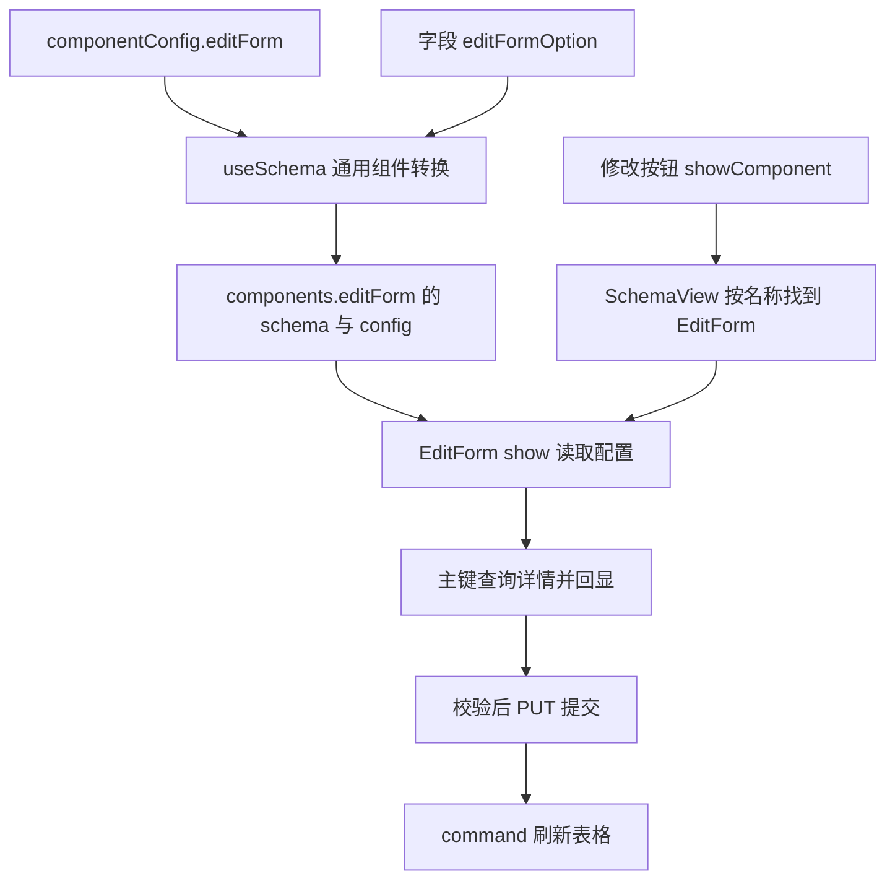

# 动态组件 - EditForm

<MuxPlayer
  className="mt-8"
  playbackId="AMEaTQLkhFwhTZ6gSA5EjuSI9VNTqj6yDG8PT42CHnU"
  title="动态组件 - EditForm"
/>

> [!NOTE]
>
> 本节从零增加 EditForm，用一次完整扩展验证前面建立的动态组件机制：先设计 DSL，再实现组件、注册到 SchemaView、配置按钮，最后接上详情回显和修改请求。
>
> 相比新增，修改多了“定位哪条记录”的问题，因此引入 `mainKey`、`mainValue` 和 `dtoModel`。课程还借真实回显数据检验了 SchemaForm 的 props 类型、枚举约束、visible 行为和标准校验规则的配置位置。
>
> 代码为按课堂思路整理的简化示例。字幕中约二十多分钟出现连续重复，无法确认的中间实现不作逐行复原；请求语义和最终联调结果依据前后完整讲解整理。

## 用新增一种组件验证框架是否真的可扩展

前面实现 CreateForm 时，同时建设了组件机制和公共表单，因此开发步骤交织在一起。本节刻意重新走一次新增组件流程，观察框架搭好后还需要改哪些地方。

EditForm 的工作可以拆成六步：设计组件配置与字段 Option；检查 DTO 是否已经支持新名字；实现 EditForm；加入动态组件注册；配置模型与修改按钮；验证回显和提交。

其中值得注意的是第二步。已有 Hook 根据 componentConfig 的组件名，读取同名前缀的字段 Option，再生成统一的 `{ schema, config }`，所以增加 editForm 不需要再写一份专门的 DTO 提取逻辑。



这个过程说明，扩展点有两类：框架通用机制已经支持的地方不必改；新增业务能力确实需要的组件、注册和配置则必须补齐。不能因为说“配置驱动”就期待不存在的业务组件自动生成。

## DSL 增加 mainKey，表达资源身份

CreateForm 创建一条新数据，不需要从当前行识别已有记录。EditForm 则必须知道要修改哪一条：商品可能用 productId，用户可能用 userId，其他资源可能有自己的唯一字段。

如果在 EditForm 内部写死 productId，它就只能服务商品场景。因此课程把“主键字段名”抽象为 `mainKey`，放进 editForm 的组件配置。

```js filename="EditForm 组件配置.js" copy
const componentConfig = {
  createForm: {
    title: "新增商品",
    saveButtonText: "创建",
  },
  editForm: {
    title: "修改商品",
    saveButtonText: "保存修改",
    mainKey: "productId",
  },
};
```

mainKey 是字段名，mainValue 是当前记录在该字段上的值。例如 mainKey 为 productId，点击某一行后 mainValue 才变成那一行的商品 ID。把这两个概念拆开，组件才能通过计算属性名构造请求参数。

配置中仍然包含 title 和 saveButtonText。将来需要其他外观或行为选项，可以继续扩展 config，并在组件内部消费；但当前只实现课堂实际需要的这些配置。

## 字段是否可编辑，与新增时的配置独立

字段增加 `editFormOption`，其结构与 createFormOption 相近，包括 comType、visible、disabled、default 等信息。

同一个字段在新增和修改场景下可以有不同表现。例如新增时需要填写名称，修改时业务可能不允许再更改；也可能新增时由后端生成某个值，修改时需要展示并编辑。

```js filename="商品字段的新增和修改配置.js" copy
const properties = {
  productId: {
    type: "string",
    label: "商品 ID",
    tableOption: { visible: true },
  },
  productName: {
    type: "string",
    label: "商品名称",
    minLength: 3,
    maxLength: 10,
    createFormOption: { comType: "input" },
    editFormOption: { comType: "input" },
  },
  price: {
    type: "number",
    label: "商品价格",
    minimum: 30,
    maximum: 1000,
    createFormOption: { comType: "inputNumber", default: 30 },
    editFormOption: { comType: "inputNumber" },
  },
};
```

这里 productId 不进入表单字段，它由业务组件单独保留作为资源身份。名称和价格则进入新增与修改两个 DTO。组件 Option 相互独立，而 type、minLength、maximum 等标准数据约束属于字段本身，可以被不同表单共享。

已有 `buildDtoSchema` 会按 editForm 找到 editFormOption，提取为字段的统一 option。因此 Hook 无需增加 `if (name === "editForm")` 的业务分支。这正是上一阶段统一组件结构带来的收益。

## 注册组件，再让行按钮带着数据打开它

建立 EditForm 组件文件后，先完成最小骨架：维护抽屉状态、公开 `name: "editForm"` 和 `show(rowData)`，再加入 SchemaView 使用的动态组件注册表。

```js filename="动态组件注册表示意.js" copy
import CreateForm from "./create-form.vue";
import EditForm from "./edit-form.vue";

export default {
  createForm: CreateForm,
  editForm: EditForm,
};
```

修改按钮通常属于 rowButtons。它继续使用现有的 showComponent 事件，只把目标 componentName 换成 editForm。

```js filename="商品修改按钮.js" copy
const editButton = {
  label: "修改",
  eventKey: "showComponent",
  eventOption: {
    componentName: "editForm",
  },
};
```

从用户点击到组件打开，中间还要保留当前行数据：SchemaTable 发出行按钮事件，TablePanel 向上转交，SchemaView 找到目标实例，再调用它的 `show(rowData)`。

主键值来自这份 rowData。因此“按钮能打开抽屉”只说明组件查找链路可用，还要验证传给 show 的 rowData 是否确实属于点击的那一行。

课程在最初打开抽屉时也遇到了绑定类型、拼写一类小问题。这里先验证空抽屉能被正确调起，再继续加入 SchemaForm，比把所有请求和表单逻辑写完后一次排查更容易确定失败边界。

## 修改表单比新增多出三份状态

EditForm 仍注入 api 和 components，也仍使用 title、saveButtonText、isShow、loading、schemaFormRef。新增的三个关键状态是：

| 状态 | 示例 | 用途 |
| --- | --- | --- |
| mainKey | `productId` | 确定资源标识字段名，来自组件 config |
| mainValue | 当前行的商品 ID | 确定本次修改哪条记录，来自 rowData |
| dtoModel | 详情接口返回的商品对象 | 作为 SchemaForm 的初始值来源 |

show 方法既读取配置，也确定本次资源身份，清空上一次的 dtoModel，然后打开抽屉并加载详情。

```js filename="EditForm 状态与 show.js" copy
import { inject, ref } from "vue";

const name = "editForm";
const { api, components } = inject("schemaViewData");

const isShow = ref(false);
const title = ref("");
const saveButtonText = ref("");
const formSchema = ref({});
const schemaFormRef = ref(null);
const loading = ref(false);

const mainKey = ref("");
const mainValue = ref();
const dtoModel = ref({});

function show(rowData = {}) {
  const component = components.value[name];
  if (!component) return;
  const { schema, config } = component;

  formSchema.value = schema;
  title.value = config.title;
  saveButtonText.value = config.saveButtonText;
  mainKey.value = config.mainKey;
  mainValue.value = rowData[mainKey.value];
  dtoModel.value = {};

  if (!mainKey.value || mainValue.value === undefined) return;
  isShow.value = true;
  loadFormData();
}

defineExpose({ name, show });
```

这里清空 dtoModel 是为了避免打开下一条记录时先显示上一条记录的数据。随后 GET 返回新对象，SchemaForm 通过 model 的变化驱动各字段初始化。示例用 undefined 判断主键缺失，以免误把合法的数值 0 当成没有主键。

rowData 已经包含部分表格内容，为什么还要请求详情？在本节设计中，行数据用来定位记录，详情接口提供编辑所需的数据模型；表格列与编辑字段并不要求完全一致。EditForm 因而不会把表格可见内容直接当成完整编辑数据。

## GET 回显：query 是 curl 的封装协议

课程专门回顾了 curl 对 Axios 的封装：本项目对 GET 参数使用 `query`，内部再映射到 Axios 的 `params`。这是为了让调用处更直接表达查询参数语义。

所以不能一边使用课程 curl，一边照搬 Axios 的参数字段；也不能把 curl 的 query 直接当成 Axios 原生接口。应当先分清当前调用的是哪一层。

```js filename="EditForm 加载详情.js" copy
import curl from "@/utils/curl";

async function loadFormData() {
  loading.value = true;
  try {
    const result = await curl({
      method: "GET",
      url: api.value,
      query: {
        [mainKey.value]: mainValue.value,
      },
    });

    if (!result?.success || !result.data) return;
    dtoModel.value = result.data;
  } finally {
    loading.value = false;
  }
}
```

与 CreateForm 的提交成功判断不同，这里不仅要有 success，也要确实有 data。没有详情对象，表单就没有可回显的业务数据。示例的 finally 用于保证异常路径也能释放 loading，业务错误提示继续沿用项目请求层的约定。

主键字段名通过 `[mainKey.value]` 动态生成。当配置从 productId 换成 userId 时，组件无需修改查询逻辑。由此可以看到 mainKey 的价值不是“多存一个字符串”，而是让请求构造与具体资源字段解耦。

## SchemaForm 的 model 终于进入实际使用场景

新增时没有传 model，因此前一节主要验证了默认值、用户输入和提交。修改时要把详情对象绑定给 SchemaForm，才能验证这条预留的输入协议是否正确。

```vue filename="EditForm 抽屉模板.vue" copy
<template>
  <el-drawer
    v-model="isShow"
    direction="rtl"
    destroy-on-close
  >
    <template #header>
      <h2>{{ title }}</h2>
    </template>

    <div v-loading="loading">
      <SchemaForm
        ref="schemaFormRef"
        :schema="formSchema"
        :model="dtoModel"
      />
    </div>

    <template #footer>
      <el-button type="primary" :loading="loading" @click="save">
        {{ saveButtonText }}
      </el-button>
    </template>
  </el-drawer>
</template>
```

模板、状态和请求片段按同一个 EditForm 文件组织，并导入公共 SchemaForm。SchemaForm 再把 dtoModel 中每个字段的值分发给对应子控件。

完整数据流为：详情接口返回对象 → dtoModel 变化 → SchemaForm 接收完整 model → 子控件收到 `model[key]` → 初始化 dtoValue → UI 显示实际值。

因此回显失败可以按这条顺序检查。接口已经返回正确数据，但某个控件没有显示时，应继续检查字段名、props 类型和监听初始化，而不是反复修改 GET 请求。

## PUT 保存：主键与表单值一起提交

修改提交仍先调用 SchemaForm.validate，通过后获取当前值。但仅有用户填写的字段还不够，服务端也必须知道这些值要更新到哪条记录，所以提交数据要同时携带主键。

```js filename="EditForm 保存逻辑.js" copy
import { ElMessage } from "element-plus";

const emit = defineEmits(["command"]);

async function save() {
  if (loading.value) return;
  const form = schemaFormRef.value;
  if (!form || !form.validate()) return;

  loading.value = true;
  try {
    const result = await curl({
      method: "PUT",
      url: api.value,
      data: {
        ...form.getValue(),
        [mainKey.value]: mainValue.value,
      },
    });

    if (!result?.success) return;
    ElMessage.success("修改成功");
    isShow.value = false;
    emit("command", "loadTableData");
  } finally {
    loading.value = false;
  }
}
```

这里的 command 与 CreateForm 相同，SchemaView 无需因为增加了 EditForm 就再设计一套列表刷新方式。组件只报告“需要重新加载表格”，容器继续调用已有 TablePanel 方法。

课程在写回显 loading 时，也回头发现新增保存缺少重复提交防护，于是在 CreateForm 中补上 `if (loading.value) return`。这提醒我们：实现相近流程时，要把发现的共性缺陷同步检查到已有组件，而不是只保证当前新文件正确。

loading 既用于加载详情，也用于保存。在详情请求期间阻止保存，可以避免数据尚未准备好时就提交；保存期间阻止再次点击，则避免产生多次修改请求。UI 展示与逻辑防护配合，不能只依靠视觉上的加载遮罩。

## 服务端增加单条查询与更新入口

为了验证完整链路，课程在现有商品接口中增加 GET 单条查询和更新处理。此时使用演示商品数据，通过主键寻找对应记录，再返回详情或处理修改。

字幕能够确认的实现要点包括：继续向数据处理逻辑传递 ctx，以保持项目上下文；从商品列表中按 ID 找到对象；单条 GET 返回可供表单回显的 data；更新入口接收前端提交的主键和字段数据。

| 前端动作 | 服务端需要验证的内容 | 联调观察点 |
| --- | --- | --- |
| 打开某行修改表单 | 查询参数中的主键、项目上下文 | 返回的是不是点击的那条商品 |
| 点击保存修改 | method、主键、body 字段 | 更新入口有没有收到实际改动值 |
| 修改成功后刷新 | 列表重新请求 | 页面使用的是否是新响应 |
| 再次打开编辑 | 单条详情重新获取 | 回显是否来自当前接口结果 |

本节仍以演示接口验证机制，没有完成真实数据库持久化。课程说明将来使用数据库时，需要把数据查找和更新替换为相应查询语句，但不应把“接口已经收到了参数”直接等同于“数据已可靠持久化”。

课程借这段后端联调强调，学习目标不应只停留在某个前端组件库的用法。要沿着业务操作看懂页面、请求、服务端和数据之间的联系，才能判断故障具体发生在哪一层。

## 第一类回显问题：model 的层级和类型声明不匹配

真实数据回显后，控制台出现了“期望 Object，却拿到 String”一类 props 警告。问题来自公共表单与单字段组件对 model 的理解混淆。

SchemaForm 接收的是完整对象，所以 model 声明为 Object；Input 接收的是某个字段的字符串；InputNumber 接收的是数字。不能把 SchemaForm 的 props 声明直接复制到所有子控件。

```js filename="字段 model 的类型边界.js" copy
// SchemaForm：完整业务对象。
const formModelProp = { type: Object, default: () => ({}) };

// Input：单个字符串字段。
const inputModelProp = { type: String, default: undefined };

// InputNumber：单个数字字段。
const numberModelProp = { type: Number, default: undefined };

// Select：枚举 value 可能是字符串，也可能是数字。
// 课堂使用不限定运行时类型的方式，具体数据约束交给 Schema。
const selectModelProp = { type: null, default: undefined };
```

Select 比输入框复杂一些，候选值的类型取决于配置。课程尝试避免把它固定成 String 或 Number，否则合法的另一类枚举值也会触发 Vue props 警告。

这不是取消业务校验。Vue props 声明用于组件输入边界，AJV 根据 schema.type 和 enum 检查实际数据，两者职责不同。Select 的运行时 props 可以兼容多种值，而具体字段仍应该用 Schema 明确它允许什么。

## 第二类回显问题：真实数据不在演示枚举范围内

上一节为了展示 Select，将库存配置成有限几个候选值。详情接口返回的库存却可能是 9999 等其他数字，于是枚举校验提示取值超出范围。

此时并不是 AJV 多管闲事，也不是表单回显机制损坏：当前配置确实宣称库存只能是几个固定值，而真实数据违反了这个约束。

课程随后调整库存字段的控件配置，使用更适合连续数字输入的 InputNumber。这个过程展示了 Schema 的两个作用：驱动 UI，也明确约束业务值。控件选择必须符合字段的真实语义，不能只为了在演示中出现某种组件而长期保留不合理枚举。

如果业务本来就是有限状态集合，则应保持 Select，并让接口数据与枚举定义一致。不能遇到一个越界值就统一关闭 enum 校验，否则配置表达的规则将失去意义。

## 点击保存没有请求：先看 Network，再看调用参数

课程后面出现保存按钮有响应，但 Network 没有请求的情况。排查先确认 save 确实执行，再查看 getValue 与主键值是否正确，随后沿 curl 内部报错继续追踪。

最终发现请求 URL 没有值，curl 内部使用 URL 的字符串方法时就已经异常，因此请求根本还没有发出去。这个现象与“后端没有返回”完全不同。

可以把排查过程拆成四层：

1. 保存事件是否触发，是否被 loading 或 validate 提前返回。
2. 组装出的 method、url、data 是否齐全。
3. curl 封装是否成功执行到真正发请求的位置。
4. Network 中是否已有请求，响应状态和内容是什么。

只有第四层已经出现请求后，才继续排查服务端路由和返回数据。课程通过这一过程确认修改接口收到了预期字段，并检查后续列表与再次打开时的响应。

调试结束还要清理 console 输出。公共表单会被多个场景复用，保留大量临时日志不仅干扰阅读，也会让下一次真正需要定位的异常淹没在正常输出里。

## visible 与是否配置 Option，不是同一件事

本节对 visible 做了明确验证，这是理解字段生命周期的重要补充。

没有 editFormOption，字段在 DTO 转换阶段就被排除，不会创建组件，也不会通过 getValue 提交。配置了 editFormOption，再设置 visible 为 false，字段组件仍然存在，只是界面上看不到，它的值仍然参与表单聚合。

| 配置方式 | 是否生成字段组件 | 是否显示 | 是否进入 getValue |
| --- | --- | --- | --- |
| 没有 editFormOption | 否 | 否 | 否 |
| 有 editFormOption，visible 未设置或为 true | 是 | 是 | 有值时进入 |
| 有 editFormOption，visible 为 false | 是 | 否 | 有值时仍进入 |

课堂用 productName 验证了第三种情况：页面没有显示名称输入框，但提交内容仍然包含 productName。原因是 SchemaForm 收集的是实际存在的子组件，隐藏并没有把它从实例集合中删除。

因此表单字段的隐藏语义需要用 `v-show` 等保留实例的方式实现，不能随意改成 `v-if` 后还期待原值继续提交。隐藏字段仍属于表单，相关默认值、回显值与校验也要保持一致。

课程在这时还全局检查了 visible 的拼写，发现前面 SchemaTable 相关位置曾出现多写字母的情况，并同步修正。DSL 名称必须在文档、模型、DTO 和组件中保持一致；配置键的一个拼写错误就可能让默认分支掩盖真实意图。

> [!TIP]
>
> 选择“不配置 Option”还是“visible 为 false”前，先决定该字段是否属于本次提交。前者移出表单，后者保留字段数据但隐藏 UI，它们不能互相替代。

## 标准校验规则应放在字段层

最后，课程回到商品名称与价格，实际验证字符串长度和数字上下限。最初把长度约束放进 createFormOption 后发现没有预期效果，随后明确了配置层级。

`type`、`minLength`、`maxLength`、`minimum`、`maximum` 是 JSON Schema 标准字段，应当放在具体属性的描述中。label 和各种组件 Option 是框架扩展字段，服务于展示与交互。

```js filename="标准约束与 UI 扩展的正确层级.js" copy
const productName = {
  type: "string",
  minLength: 3,
  maxLength: 10,
  label: "商品名称",
  createFormOption: {
    comType: "input",
    placeholder: "请输入商品名称",
  },
  editFormOption: {
    comType: "input",
  },
};

const price = {
  type: "number",
  minimum: 30,
  maximum: 1000,
  label: "商品价格",
  createFormOption: { comType: "inputNumber" },
  editFormOption: { comType: "inputNumber" },
};
```

这使同一个名称字段在新增和修改时都遵守相同长度约束，而不需要把标准规则重复放进两个组件配置中。UI 可以不同，数据契约仍然统一。

课堂分别验证少于最小长度、超过最大长度、价格低于下限和超过上限；枚举越界已经在前面的库存回显中被触发过。相比只检查“表单能提交”，这些验证进一步确认校验器是否真正读到了预期规则。

## 本节小结

EditForm 通过 mainKey 与 mainValue 定位资源，先 GET 详情并传给 SchemaForm 回显，再校验、取值、携带主键 PUT 提交，最后复用 command 刷新表格。新增组件主要增加 DSL、实现与注册，已有 Hook 和调度机制可以继续复用。

本节也把前面预留的表单能力放进真实修改场景验证：完整 model 与字段 model 类型不同，枚举必须覆盖实际业务值，visible 隐藏不等于移除字段，标准校验规则必须放在正确层级。至此新增、修改、删除链路已经打通，下一节继续补齐查看详情组件。
