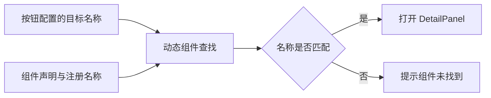
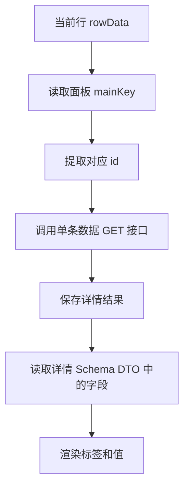
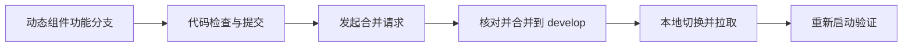

# 动态组件 - DetailPanel

<MuxPlayer
  className="mt-8"
  playbackId="DCLudQV00024F00CvILMgbZU01gxlHpTIAk00kkL5rVrOUI8"
  title="动态组件 - DetailPanel"
/>

> [!NOTE]
>
> 本节为动态组件库增加 **DetailPanel 详情面板**。列表已经能查询多条数据，新增和编辑也有了对应表单，现在需要点击某一行，按主键查询并展示单条记录。
>
> 课程仍然从 DSL 开始：先定义面板级的 `mainKey` 和 `title`，再给需要展示的字段增加 `detailPanelOption`，接着实现抽屉组件并接入动态组件注册机制。
>
> 最后清理检查工具发现的无用代码，把这一组动态组件合并回 `develop`，完成课程里程碑 4。

## 把详情看作一个新需求

前面已经实现 SchemaForm、CreateForm 和 EditForm。新增与修改都需要收集输入、校验并提交表单；详情的目标则是读取并展示一条记录。

课堂把它当作一次产品新需求来处理：表格行里增加“查看详情”，点击后弹出面板，展示当前对象的信息。

这一节不继续套用 SchemaForm，因为详情没有编辑与提交动作。它复用的是动态组件机制、抽屉容器和 Schema 字段约定。

| 能力 | CreateForm | EditForm | DetailPanel |
| --- | --- | --- | --- |
| 用户输入 | 需要 | 需要 | 不需要 |
| 按主键读取已有记录 | 通常不需要 | 需要 | 需要 |
| 提交创建或更新 | 需要 | 需要 | 不需要 |
| 字段选择依据 | 创建字段配置 | 编辑字段配置 | 详情字段配置 |

因此，DetailPanel 可以成为独立组件，与其他组件共享机制而保持自己的职责。

## 第一步先修改 DSL

课程强调，增加一种通用能力时，先想清楚它需要什么配置，而不是先在某个页面写死实现。

详情至少需要两个面板级信息：用什么字段定位数据，以及面板展示什么标题。

```js filename="DetailPanel 配置示意" copy
const componentConfig = {
  detailPanel: {
    mainKey: "productId",
    title: "商品详情",
  },
}
```

这段配置位于 `schemaConfig.componentConfig`；上一节的 Hook 再把它与字段规则合成运行时的 `components`。这里的 `mainKey` 是字段名，而不是某一条商品的 ID 值。真正打开组件时，才从当前行取出对应值。

例如配置 `mainKey: "productId"`，点击行的数据中 `productId` 为 `p1001`，详情请求才应使用 `p1001` 定位记录。

这个设计延续了 EditForm 的主键约定，让同一个 DetailPanel 可以用于商品、订单、人员等不同对象。

## 哪些字段进入详情面板

面板级配置确定“查谁”和“显示什么标题”，字段级配置则决定“展示哪些内容”。

课程给需要展示的字段增加 `detailPanelOption`。当前没有额外展示参数时，也可以先配置空对象，用它表达该字段参与详情。

```js filename="详情字段配置示意" copy
const schema = {
  type: "object",
  properties: {
    productId: {
      type: "string",
      label: "商品 ID",
      detailPanelOption: {},
    },
    name: {
      type: "string",
      label: "商品名称",
      detailPanelOption: {},
    },
    createTime: {
      type: "string",
      label: "创建时间",
      detailPanelOption: {},
    },
  },
}
```

创建时间就是很好的例子：用户新增或编辑商品时，不一定需要填写它，但查看详情时却很有价值。

所以不能直接把 CreateForm 的字段列表拿来作为详情字段列表。每一种消费场景有自己的 Option，才能表达字段在不同界面中的差异。

课堂讨论过是否继续增加表单中的 `visible` 概念，随后指出当前详情不涉及提交数据，暂时不需要照搬那一层表单语义。是否展示，先由字段有没有详情配置决定。

## 新增抽屉组件

DSL 确认后，创建 DetailPanel 组件文件。

外层沿用前面已经建立的抽屉交互：打开时展示，关闭时收起。内容区再放详情字段，不放输入表单。

```vue filename="DetailPanel 抽屉结构示意" copy
<template>
  <el-drawer v-model="visible" :title="panelTitle">
    <div class="detail-content">
      <!-- 单条记录的字段内容由后面的字段列表渲染。 -->
    </div>
  </el-drawer>
</template>
```

这段结构中的 `visible` 和 `panelTitle` 需要接入组件自己的状态与配置。此处先说明容器职责，后面再补内容。

课堂先建立打开与关闭行为，再验证组件能否被动态容器找到。这种推进方式可以把问题拆开：找不到组件时先检查注册，内容为空时再检查请求与字段。

## 注册名称必须一致

创建文件之后，还要把它加入前面实现的动态组件注册机制。按钮事件传来的组件名称，必须与注册表能够识别的名称对应。

课堂第一次尝试打开时出现 `DetailPanel` 找不到的提示，最终发现组件缺少 `name`。

```js filename="script setup 中暴露调度协议" copy
import { ref } from "vue"

const visible = ref(false)
const name = "detailPanel"

function show(rowData) {
  // 先建立打开行为；后续再用 rowData 的主键读取详情。
  visible.value = true
}

defineExpose({ name, show })
```

这里沿用上一节对外暴露的实例协议，调度名称为 `detailPanel`。仅设置 Vue 组件自身的显示名称，不等于已经向父级实例查找暴露这个字段。还需要检查文件是否被引入、是否加入组件集合，以及配置名称与实例名称是否一致。



这与前面的 `mainKey` 一样，都是配置和实现两端必须遵守的契约。

## 给表格增加查看详情操作

组件注册后，在商品列表的行按钮配置中增加“查看详情”，通过已有的 `showComponent` 事件打开 DetailPanel。

这个动作需要携带当前行数据。表头“新增”按钮没有当前行，但详情操作必须知道用户点击了哪一个商品。

```text filename="行操作的数据传递关系" copy
当前行数据
    ↓ 点击查看详情
showComponent 事件
    ↓ 目标组件与行数据
DetailPanel
```

字幕确认了通过同一事件机制打开详情组件的流程。具体事件参数对象的字段命名，应沿用前一节已经实现的分发器，不能在本节另起一套不兼容格式。

这也是动态组件机制的复用价值：增加详情能力时，不需要让表格自己承担抽屉和详情请求逻辑，只要发出约定的组件事件即可。

## 从当前行取得主键

打开面板以后，从组件配置中读取 `mainKey`，再从当前行中取得该字段的值。

```js filename="主键提取示意" copy
const mainKey = panelConfig.mainKey
const id = rowData[mainKey]

if (id === undefined || id === null || id === "") {
  throw new Error("当前记录缺少详情主键")
}
```

这里使用显式缺失判断，避免把数值 `0` 直接当成不存在。不同业务的主键类型可能不同，组件应按约定判断。

主键值应当用于构造单条数据请求，而不是把整个表格行不加区分地作为请求参数。



## 详情数据应从单条接口读取

列表数据通常只包含展示需要的字段，详情可能需要更多内容。因此课堂延续编辑表单的思路，使用主键请求单条记录。

列表行负责提供定位信息，详情接口负责提供详情数据。这两个职责分开后，列表不必为了详情功能一次性返回所有字段。

本节字幕约 8—19 分钟存在大量循环重复识别，无法可靠还原这一段的完整请求代码。能够确认的是：DetailPanel 接收输入参数，按 `mainKey` 调用对应的 GET 接口，并展示取回的字段。下面只给出流程示意，不把缺失的中间实现写成逐字源码。

```js filename="读取详情的流程示意" copy
async function loadDetail(rowData, panelConfig, fetchDetail) {
  const key = panelConfig.mainKey
  const id = rowData[key]

  if (id === undefined || id === null || id === "") {
    throw new Error("缺少详情主键")
  }

  // fetchDetail 是接入项目既有请求封装后的单条查询函数。
  return await fetchDetail({ [key]: id })
}
```

请求 URL、项目参数和签名等内容应由现有请求封装处理。详情组件复用这一层能力，不需要再次手写一遍签名算法。

## 根据配置生成展示列表

拿到详情对象以后，DetailPanel 消费的是 `useSchema` 为自己构建的 Schema DTO。上一节的转换已经根据 `detailPanelOption` 选好字段，并把这份配置统一放到字段的 `option` 中，因此组件不能再按原始 `detailPanelOption` 筛选一次，否则会把已转换的字段全部过滤掉。

下面的 `components` 表示已取得当前值的组件 DTO；在响应式实现中，应放进计算属性或随当前配置重新计算。

```js filename="详情展示项的整理示意" copy
const detailSchema = components.detailPanel.schema
const detailItems = Object.entries(detailSchema.properties)
  .map(([key, field]) => ({
    key,
    label: field.label || key,
    value: detailData[key],
    option: field.option,
  }))
```

这里不能用字段值的真假来判断是否展示。数值零、布尔值 `false` 都可能是有效详情，字段是否参与展示应由配置决定。

接着把每一项渲染成标签和值：

```vue filename="详情内容结构示意" copy
<div v-for="item in detailItems" :key="item.key" class="detail-row">
  <span class="item-label">{{ item.label }}</span>
  <span class="item-value">{{ item.value ?? "—" }}</span>
</div>
```

这里使用普通文本插值。当前课程的详情展示并没有要求任意执行字段中的 HTML，不需要为了展示内容引入额外的 HTML 解释能力。

对枚举、日期和复杂对象的格式化，可以由接口契约或后续展示扩展明确约定。本节先完成基础字段展示，不把未讲到的高级渲染器当成已经实现。

## 调整详情布局

课堂在字段已经能够显示后，继续调整边框、内边距、标签宽度和颜色，让面板内容更容易阅读。

标签有相对稳定的宽度，值区域承接实际内容；两者之间留出间距，避免字段和值挤在一起。

```css filename="详情面板布局示意" copy
.detail-content {
  padding: 20px;
  border: 1px solid #e5e7eb;
}

.detail-row {
  display: flex;
  gap: 16px;
  padding: 10px 0;
}

.item-label {
  flex: 0 0 100px;
  color: #6b7280;
}

.item-value {
  min-width: 0;
  color: #111827;
}
```

这些样式是对课堂布局意图的整理，具体颜色和尺寸可以随项目调整。复用能力来自结构与数据契约，而不是某一个固定像素值。

后面的人员管理实践还会遇到较长用户 ID 的展示问题，并进一步完善 DetailPanel。这里先建立基本可用的详情结构。

## 重新走一遍扩展过程

本节添加新组件的过程可以整理为一条固定顺序：

1. 修改 DSL，定义面板配置和字段配置。
2. 创建 DetailPanel 组件，建立抽屉与状态。
3. 声明组件名称并加入动态注册机制。
4. 在模型中配置详情面板和参与展示的字段。
5. 在表格行按钮中配置打开详情的事件。
6. 根据主键读取单条数据，并渲染字段。

这种顺序先固定输入输出，再逐步补实现。之后增加另一种动态面板时，也可以沿用同样的方法。

验证时，应分别点击两条不同记录，确认请求主键和面板内容随之变化；关闭后再次打开，也应指向本次点击的记录。只看到一个抽屉弹出，还不足以证明详情链路正确。

## 完成里程碑前检查代码

动态组件实现后，课堂运行代码检查，发现 DetailPanel 中未使用的关闭相关变量，以及 SchemaForm 子组件中未使用的类型信息。

老师清理这些内容后再次检查，再进行提交。

这一步关注的是本次新增组件与前面公共组件的一致性。复制 CreateForm 或 EditForm 的结构时，可能把详情不需要的表单字段、提交逻辑或导入也带过来，需要在结束前整理。

本节提交内容覆盖 SchemaForm 以及 CreateForm、EditForm、DetailPanel 动态组件，说明这次提交是整个动态组件阶段的收尾。

## 合并功能分支并同步本地

课堂在 Coding 中发起合并请求，将动态组件功能分支合入 `develop`，对应课程里程碑 4。

合并前检查源分支、目标分支、提交记录和文件变更，确认目标是开发分支。远端完成合并之后，本地再切回 `develop` 拉取最新代码，并启动项目。



这里延续了前面 GitFlow 的协同方式。组件能够使用和代码已经进入共同开发基线，是两个都需要完成的动作。

## 本节小结

DetailPanel 补齐了动态组件库中的单条详情查看能力。

它从 DSL 定义出发，用 `mainKey` 连接当前行与详情接口，用 `detailPanelOption` 决定展示字段，再通过动态组件注册和表格行事件进入统一交互体系。

本节也通过组件名称遗漏的错误，说明配置、注册与查找必须保持一致。最后清理代码检查问题、提交并合并功能分支，结束里程碑 4。接下来课程将继续把这些内核、工程化和组件能力抽离成可发布的 npm 包。
