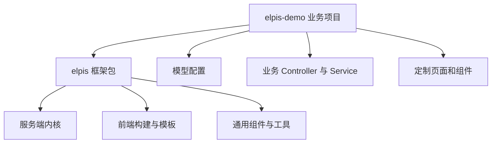

# 抽离并发布 npm 包（1）

<MuxPlayer
  className="mt-8"
  playbackId="Fsvm024HqiZ3stOK02EBKqr5QzhTutnpnIKVa02pHKyEOw"
  title="抽离并发布 npm 包（1）"
/>

> [!NOTE]
>
> 本章把前面同仓库开发的框架能力抽离成 npm 包。本节先建立独立使用方 `elpis-demo`，通过 `npm link` 联调，再把包入口改成显式 API，并改造服务端 Loader，让它们同时加载框架内部能力与使用方业务代码。
>
> 最重要的变化是路径语义：`process.cwd()` 指向启动命令所在的业务项目，`__dirname` 指向当前框架文件。框架内置模块与业务扩展不能再共用一套根路径。
>
> 以下代码按课程行为整理为简化示例。字幕后半部分有连续重复转写，无法支持全部 Config、Extend 和 Router 的逐行实现，因此相关部分以明确的加载边界和已有约定说明。

## 课程最终交付的是框架

此前为了把运行链路做完整，内核、构建配置、模板组件、领域模型和示例业务都写在同一个项目里。这便于边设计边验证，但不代表最终只能部署这个固定项目。

课程最初的目标，是把重复工作沉淀在框架里，使用方通过配置覆盖共性需求，再为差异需求编写自定义代码。本章让这个边界在目录与包依赖上真正体现出来。

框架项目保留服务端内核、前端工程、公共模板与组件能力；新的业务项目安装框架，存放模型配置、业务接口和定制页面。以后可以有多个业务项目共用同一个框架版本，各自实现不同的业务。



这里的“80% 配置、20% 定制”是架构目标的表达，不是对任何项目都能保证的精确比例。它要求框架同时具备可复用默认能力和明确扩展点，而不是把所有业务都硬塞进一套模板。

## 为什么先做独立使用方

仅在原仓库中移动几个文件，很难发现框架偷偷依赖了哪些项目级条件。代码可能仍然读到根目录的模型、仍然找到开发依赖，因此看起来一切正常。

课程新建 `elpis-demo` 仓库，克隆到本地后执行 npm 初始化，并准备 `.gitignore`。这个仓库扮演真正使用者：它不拥有内核源码，只通过包接口启动和扩展框架。

```text filename="两个仓库的初始关系" copy
elpis
├── package.json
├── index.js
├── elpis-core
└── app

elpis-demo
├── package.json
├── server.js
└── app
```

创建 demo 是一次消费侧验证。以后每暴露一项能力，都从这个仓库调用，而不是只在框架原仓库中运行。这样路径、依赖与 API 边界问题会更早显现。

## scoped 包名解决名称归属

课程把框架包名改成带个人 scope 的形式，例如 `@your-name/elpis`，并设置初始版本。scope 来自发布账号或组织，不应直接复制讲师账号。

```json filename="elpis/package.json：关键元数据" copy
{
  "name": "@your-name/elpis",
  "version": "1.0.0",
  "main": "index.js"
}
```

`name` 决定安装和引用时的包标识，`main` 决定 CommonJS 使用方 `require` 包时的入口。scope 是命名空间，并不天然表示私有包，具体访问级别会在发布课中处理。

本节仍在本地联调，不需要每改一行都发布新版本。课程因此先使用软链接建立消费关系。

## npm link 的两步关系

在框架仓库执行 `npm link`，把当前包登记为本机可链接的包；再到业务仓库执行 `npm link 包名`，让业务项目的依赖指向本地框架。

```bash filename="在 elpis 框架仓库执行" copy
npm link
```

```bash filename="在 elpis-demo 业务仓库执行" copy
npm link @your-name/elpis
```

框架代码修改后，业务项目通过链接能看到变化，适合这次持续重构。它与从 registry 安装一个已发布版本不同：前者消费本地工作目录，后者消费发布包内容。

课程安装 nodemon 后发现链接不见了，重新执行 link 恢复。这个现象提示：依赖安装可能改变当前 `node_modules` 状态，遇到找不到本地包时，应先确认链接仍然存在，而不是立刻怀疑包的导出错误。

> [!TIP]
>
> 本地链接验证的是“代码能否作为依赖使用”；正式发布后还要取消链接、安装真实版本再验证，才能发现漏发文件或依赖声明不完整的问题。两种验证覆盖的边界不同。

## 包入口不应一被 require 就启动服务

原来的根入口直接调用 `elpisCore.start`，这是一个应用启动脚本。变成 npm 包之后，使用方 `require` 包是为了获得能力，不应该被迫立即启动一个服务。

课程把根入口改成导出对象，其中提供 `serverStart` 方法。调用者决定什么时候启动、传入什么配置，并取得启动后的 app。

```js filename="elpis/index.js：对外服务 API" copy
const elpisCore = require("./elpis-core")

module.exports = {
  serverStart(options = {}) {
    return elpisCore.start(options)
  },
}
```

```js filename="elpis-demo/server.js" copy
const { serverStart } = require("@your-name/elpis")

const app = serverStart({
  name: "elpis-demo",
  homePage: "/view/project-list",
})

// 联调时可观察内核加载的结果。
console.log(app.middleware)
```

上例的方法名依据课堂意图统一整理。关键是导出显式启动函数、透传配置、返回 Koa 实例，而不是对某个拼写形成额外依赖。

内核也要真正 `return app`。如果外层返回了 `elpisCore.start()`，而内层没有返回值，demo 依然拿不到挂载结果。

## 使用方拥有自己的启动命令

业务项目安装 nodemon，并定义本地、测试和生产启动命令。环境变量仍沿用前面服务端约定，最终执行自己的 `server.js`，再由它调用包 API。

```text filename="启动责任的迁移" copy
原来：
elpis 的 npm script -> elpis/index.js -> elpis-core.start

现在：
elpis-demo 的 npm script -> server.js
  -> require 框架的 serverStart
  -> elpis-core.start
```

应用名称、首页和运行环境由使用方选择，内核负责依据这些输入组装服务。环境变量的 shell 写法要与本地平台匹配，课程演示的是其开发机器上的命令方式。

## cwd 和 dirname 从此承担不同职责

独立应用启动后，`process.cwd()` 已经是 `elpis-demo`。原来的 `app.baseDir` 和 `app.businessPath` 因而自然指向使用方目录。这正好适合寻找业务代码，但不适合寻找框架内置模块。

```js filename="两套路径的来源示意" copy
const path = require("path")

const businessRoot = process.cwd()
const businessAppPath = path.resolve(businessRoot, "app")

// 假设当前文件位于 elpis-core/loader。
const frameworkAppPath = path.resolve(__dirname, "../../app")
```

`__dirname` 是当前模块文件的位置，适合定位同一个包内的资源；`cwd` 是进程工作目录，适合定位调用方项目。它们在原仓库直接启动时可能恰好接近，但包被其他项目消费后就明确分离。

不能把所有 `cwd` 一次性替换成 `__dirname`。这样虽然可能找到框架内部目录，却会把业务扩展也指回包内部。每一处路径都要先问：正在寻找的是框架的东西，还是使用方的东西？

## Middleware Loader 改为两组文件

原 Loader 扫描一个目录，再把文件名和目录层级转换为对象，挂载到 `app.middleware`。现在保留同样的解析逻辑，只把输入扩大为框架目录和业务目录两组文件。

```js filename="middleware-loader.js：双来源扫描示意" copy
const path = require("path")
const glob = require("glob")

module.exports = function middlewareLoader(app) {
  const frameworkPath = path.resolve(__dirname, "../../app/middleware")
  const businessPath = path.resolve(app.businessPath, "middleware")
  const middleware = {}

  function mountFile(filePath, sourceRoot) {
    const names = path.relative(sourceRoot, filePath)
      .replace(/\.js$/, "")
      .split(path.sep)
      .map((name) => name.replace(/[-_](\w)/g, (_, c) => c.toUpperCase()))

    let target = middleware
    names.forEach((name, index) => {
      if (index === names.length - 1) {
        target[name] = require(filePath)(app)
      } else {
        target[name] = target[name] || {}
        target = target[name]
      }
    })
  }

  for (const sourceRoot of [frameworkPath, businessPath]) {
    const files = glob.sync(path.join(sourceRoot, "**/*.js"))
    files.forEach((file) => mountFile(file, sourceRoot))
  }

  app.middleware = middleware
}
```

这段整理代码显式把来源根目录传给公共处理函数，避免用框架目录截取业务文件，或用业务目录截取框架文件。双来源改造最容易遗漏的就是这些原本只适用于单目录的隐含条件。

加载顺序也有行为含义。先加载框架、后加载业务，如果双方最终落到同一个对象键，上例的后赋值会覆盖前赋值。这是当前实现带来的冲突规则，需要被理解，而不能把它当作无顺序的简单合并。

## 用 demo 中间件验证两边都存在

课程在业务项目建立 `app/middleware/demo.js`，导出一个测试中间件，再从 `serverStart` 返回的 app 打印 `middleware`。

```js filename="elpis-demo/app/middleware/demo.js" copy
module.exports = (app) => async (ctx, next) => {
  console.log("business middleware loaded", Boolean(app))
  await next()
}
```

验证时不只看 `demo` 是否出现，还要确认框架原有中间件仍在。如果新代码被加载了、内置中间件却不见了，说明改造把旧来源替换掉了，尚未实现双来源加载。

另外，挂载到 `app.middleware` 表示已被内核发现并准备好，不代表这个中间件已自动作用于所有路由。实际请求是否经过它，仍由路由或全局中间件注册决定。

## Router Schema 按对象规则合并

Schema Loader 处理的是接口参数规则对象，与 middleware 的函数工厂不同。课程同样扫描框架与业务目录，然后复用处理函数把规则放入统一的 `app.routerSchema`。

```js filename="router-schema-loader.js：合并关系示意" copy
const routerSchema = {}

function handleFile(filePath) {
  Object.assign(routerSchema, require(filePath))
}

frameworkFiles.forEach(handleFile)
businessFiles.forEach(handleFile)
app.routerSchema = routerSchema
```

这里的 `frameworkFiles` 与 `businessFiles` 分别来自两套目录扫描，示例只展开合并部分。业务项目新增 demo 规则后，打印结果应同时包含框架规则和业务规则。

如果两个文件导出相同接口键，后合并的值会影响最终结果。参数规则的覆盖与路由是否采用对应规则还要一起看，不能只打印出对象就断言请求校验已经完整生效。

## Controller 与 Service 保留原有模块协议

Controller 和 Service 的改造遵循同样步骤：读取框架目录、读取业务目录、抽取公共的单文件处理逻辑、依次加载并挂载到 app。

它们仍使用前面课程定义的工厂、类或实例化协议。双目录扫描改变文件来源，并不要求把 Controller 改成中间件函数，也不改变 Service 通过统一上下文提供能力的方式。

课程分别在 demo 新建 Controller 和 Service。Controller 测试时，目录名拼写错误导致 demo 没出现；Service 测试时，框架路径没有同步改好，结果只有 demo 而缺少框架原有的 base、project。通过逐项打印挂载结果，两个问题都被定位出来。

| Loader | 既要出现的框架内容 | 新增验证内容 |
| --- | --- | --- |
| Middleware | 原有通用中间件 | demo 中间件 |
| Router Schema | 原有接口规则 | demo 接口规则 |
| Controller | base、页面等原有控制器 | demo Controller |
| Service | base、project 等原有服务 | demo Service |

这个验证表表达的是“旧能力继续存在，新能力能够加入”。重构时只检查新增项，很容易忽略原功能被破坏。

## Config、Extend 与 Router 还要按职责处理

本节继续进入 Config 与 Extend 等 Loader 的改造，后续课程确认服务端内核已经完成这一轮扩展。字幕后半部分存在重复，因此不能据此补造配置覆盖的完整四层优先级或所有路由细节。

能够确定的是，Config 还要保留默认配置与环境配置的关系，Extend 仍然按原有扩展协议挂载，Router 仍需在依赖能力准备后注册。把文件来源扩展为两处，不会取消这些原有职责。

对这类模块，复盘应沿用同一方法：分别确定框架与业务位置，复用解析流程，再检查加载顺序、同名冲突与最终消费方。配置模块尤其不能只拼接文件列表后假定所有覆盖关系都正确。

## 本节小结

本节建立独立使用方，通过 npm link 把本地框架作为依赖消费，并把包入口从直接执行改成显式 `serverStart` API。服务端 Loader 随后从单来源扩展为框架与业务双来源，原有约定继续生效，使用方也能提供自己的模块。

这轮改造暴露了 SDK 最核心的边界：框架内置资源通过包自身路径定位，业务目录通过调用方工作目录定位。下一节把同样的方法应用到前端工程，让构建能力也能由外部项目调用，并把产物生成到使用方目录。
