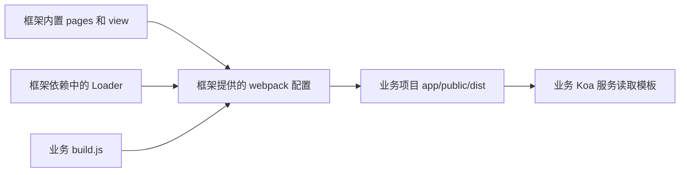

# 抽离并发布 npm 包（2）

<MuxPlayer
  className="mt-8"
  playbackId="NoiPYp27t8K5lEug5EyjRfgFSo4RUY1D01UTmpHygTgI"
  title="抽离并发布 npm 包（2）"
/>

> [!NOTE]
>
> 本节把前端工程化能力从直接执行的脚本改成框架 API，供 `elpis-demo` 调用。改造重点是重新区分构建输入、构建依赖和构建输出：模板与内置页面来自框架，Loader 从框架依赖中解析，最终产物写到业务项目。
>
> 本节先让使用方能够编译框架已有页面，再把领域模型配置迁到使用方。业务自定义入口和组件扩展将在后续两节继续开放，不要把当前阶段误认为前端扩展已经全部完成。

## 按原来的里程碑重构

上一节改造了服务端内核。接下来按最初建设框架的顺序，进入前端工程化部分：先让构建脚本能够被使用方调用，再处理路径与依赖，最后验证构建结果能够被业务服务消费。

这种顺序有利于缩小问题范围。先证明 API 调通，再证明入口找到，再证明 Loader 可用，最后观察页面。若一开始同时移动模板、入口、组件与模型，错误发生时就很难确认边界。

原来业务运行方式是 `node app/webpack/dev.js` 或 `node app/webpack/prod.js`。文件一被执行就启动编译。变成 SDK 后，使用方应通过包暴露的方法选择开发构建或生产构建。

## 构建脚本改为导出函数

课程把 `dev.js` 和 `prod.js` 的执行部分包进函数，再导出。原来的 Express 服务、中间件和 webpack 调用保留，只把触发时机交给调用方。

```js filename="elpis/app/webpack/dev.js：接口形态示意" copy
module.exports = function buildDev() {
  // 原有逻辑在调用时执行：
  // 创建 compiler，安装开发中间件，启动 Express。
  return startDevServer()
}
```

上面的 `startDevServer` 表示前面已经完成的启动逻辑，用于突出包装边界，不是要求另装一个同名工具。生产脚本同理导出函数，在函数被调用时执行 `webpack(productionConfig, callback)`。

这个改造和上一节 `serverStart` 一致：引入包获得能力，显式调用才开始工作。框架使用者可以在自己的脚本里安排执行顺序，也能给自己的命令赋予清楚名称。

## 根入口统一暴露前端构建方法

课程在框架 `index.js` 引入两种构建能力，并新增 `frontendBuild`，根据环境参数分流。示例采用课程最终统一后的 `local` 和 `production` 命名。

```js filename="elpis/index.js：构建 API 示意" copy
const elpisCore = require("./elpis-core")
const buildDev = require("./app/webpack/dev")
const buildProd = require("./app/webpack/prod")

module.exports = {
  serverStart(options = {}) {
    return elpisCore.start(options)
  },

  frontendBuild(env) {
    if (env === "production") {
      return buildProd()
    }
    return buildDev()
  },
}
```

调用者不需要了解框架内部脚本位置，也不用自己重新搭 Express 开发服务。公开接口与内部目录之间形成了一层稳定边界。

不过课程的环境分流仍然很简单：生产值走生产构建，其余走开发。复盘时要按这个实际逻辑理解，不应声称已经实现了任意环境的完整策略注册系统。

## 使用方分别管理 server 与 build

业务项目新增 `build.js`，与 `server.js` 分开。服务启动和前端构建是两个不同动作，开发时也通常分别运行。

```js filename="elpis-demo/build.js" copy
const { frontendBuild } = require("@your-name/elpis")

frontendBuild(process.env.env)
```

```json filename="elpis-demo/package.json：命令示意" copy
{
  "scripts": {
    "build:dev": "env=local node --max-old-space-size=4096 build.js",
    "build:prod": "env=production node build.js"
  }
}
```

这里沿用课程 shell 环境变量写法，实际项目按运行平台调整。重要的是命令执行业务项目自己的脚本，再进入框架公开 API。

这时运行命令可能显示完成，却没有任何页面产物。课程就遇到了这一现象：API 已经被调用，但内部路径仍然按照原仓库计算，导致入口列表为空。方法调用成功不等于构建输入正确。

## 先画清楚三个位置

SDK 化后，前端构建至少涉及三种位置。

| 位置 | 典型内容 | 应如何定位 |
| --- | --- | --- |
| 框架包内部 | 内置页面、模板、通用组件 | 当前包文件的相对路径 |
| 框架的依赖 | vue-loader、babel-loader 等 | 框架模块上下文中的 require.resolve |
| 业务项目 | 模型配置、最终 public/dist | process.cwd() 指向的工作目录 |

课程当前先编译框架内置页面，所以扫描入口时应找到框架 `app/pages`。而输出要给业务项目中的 Koa 读取，仍然应写入使用方 `app/public/dist`。



如果把输入与输出都改到框架目录，demo 仍然找不到模板；如果都指向业务目录，demo 尚未提供内置页面源码，入口又会为空。因此改路径必须按照“谁拥有这个文件”逐项判断。

## 内置页面与模板改用 dirname

webpack 配置文件位于框架的 `app/webpack/config`。从这里定位框架的 `app/pages` 和 `app/view`，应基于 `__dirname` 向上寻找。

```js filename="elpis/app/webpack/config/webpack.base.js：路径示意" copy
const path = require("path")
const glob = require("glob")

const frameworkPages = path.resolve(__dirname, "../../pages")
const frameworkTemplate = path.resolve(__dirname, "../../view/entry.tpl")
const businessDist = path.resolve(process.cwd(), "app/public/dist")

const entryFiles = glob.sync(
  path.join(frameworkPages, "**/entry.*.js")
)
```

入口扫描和模板输入换成框架路径，模板输出保持业务路径。已有 JS Loader 的 `include`、公共路径 alias 也要同步检查，否则可能出现入口找到了，内部引用或转换范围却还指向旧位置。

生产配置里若单独重写了 JavaScript 规则，也要检查其 `include`。只修改 base 不一定覆盖生产配置中的重复定义，这是课程逐份查看 dev、prod 配置的原因。

## 为什么 Loader 会找不到

修正输入路径后，构建开始真正读取内置页面，随后报 `babel-loader`、其他 Loader 或 hot middleware client 无法解析。

使用方只安装了框架与少量本地开发工具，并没有单独安装整个 webpack 工具链。框架却在配置中写了 `"babel-loader"` 这类裸模块名，构建上下文变化后，查找过程未必从框架自身依赖位置开始。

要求每个使用者手动安装 vue-loader、css-loader、less-loader、url-loader 等一长串内部依赖，会破坏 SDK 的封装目标。框架既然提供构建能力，就应清楚声明并定位自己所使用的工具。

## require.resolve 把依赖定位清楚

课程把 Loader 字符串改成 `require.resolve` 的结果。该调用在框架配置模块中执行，返回从该模块上下文解析到的文件路径，webpack 因此得到明确位置。

```js filename="Loader 的解析方式调整" copy
const rules = [
  {
    test: /\.vue$/,
    use: require.resolve("vue-loader"),
  },
  {
    test: /\.js$/,
    include: frameworkPages,
    use: require.resolve("babel-loader"),
  },
  {
    test: /\.css$/,
    use: [
      require.resolve("style-loader"),
      require.resolve("css-loader"),
    ],
  },
  {
    test: /\.less$/,
    use: [
      require.resolve("style-loader"),
      require.resolve("css-loader"),
      require.resolve("less-loader"),
    ],
  },
]
```

这里不是把第三方源码复制进框架，也不是手写某个绝对磁盘路径。路径由 Node.js 根据当前依赖关系解析，因此随包安装位置变化仍有机会正确工作。

图片、字体、生产模式下 HappyPack 内部引用的 Loader，也要按相同原则检查。课程先修一个错误再运行，看到下一个缺失依赖，最后统一梳理全部相关位置。

## 带查询参数的 Loader 要分开解析

某些字符串既含模块路径，又含插件参数。例如 HappyPack 的 `loader?id=js`。`require.resolve` 应解析真实模块路径，再拼接查询参数，而不是把整段查询串作为 npm 模块名。

```js filename="带参数的 Loader 与客户端示意" copy
const jsLoader = `${require.resolve("happypack/loader")}?id=js`
const cssLoader = `${require.resolve("happypack/loader")}?id=css`

const hmrClient = [
  require.resolve("webpack-hot-middleware/client"),
  "?path=http://127.0.0.1:9002/__webpack_hmr",
  "&timeout=20000&reload=true",
].join("")
```

这与前面开发环境 URL 参数拼接是同一个细节：模块定位和参数传递是两件事。先获得模块地址，再以该工具要求的格式传参。

## 依赖分类随包的职责变化

课程此时指出，原先放在 `devDependencies` 的某些构建工具，作为 SDK 的功能组成后，需要重新考虑依赖归属。

如果用户调用框架 `frontendBuild` 时会执行某个 Loader，而安装框架后这个 Loader 并未随依赖提供，公开 API 就不完整。判断应围绕“消费者执行公开能力时是否需要”，而不是简单看到 webpack 就认定永远只属于框架开发期。

本节先提出这个问题，最后发布课再统一整理 `package.json`。`require.resolve` 只能找到已经可解析的依赖，不能替代依赖声明，也不能自动下载缺失的包。

## 用开发和生产两条路径验证输出

课程先删除使用方产物，再运行开发构建，确认 `elpis-demo/app/public/dist` 出现模板。开发资源仍按前面设计由 dev server 提供，不能期待它与生产输出完全相同。

然后再清理并执行生产构建，确认模板和静态产物生成到业务项目，而框架源码目录没有被当作输出目标。两种模式都需要验证，因为它们可能拥有不同的规则和独立引用。

| 观察 | 说明 |
| --- | --- |
| 构建直接结束但没有产物 | 可能根本没有找到入口 |
| 找到 Vue 文件后报告 Loader 缺失 | 输入已找到，依赖解析仍有问题 |
| 产物出现在框架仓库 | 输出根目录仍然指错 |
| 产物出现在 demo 且能被请求 | 构建到服务端消费链路已连通 |

排错顺序是从输入、转换到输出，而不是同时修改所有配置。

## 页面出现但项目列表为空

工程路径修正后，课程已经能够访问项目列表页面，但列表中没有模型数据。这表明页面模板和静态资源可用，不代表领域数据来源已经正确。

模型加载器按 `app.baseDir` 或当前工作目录下的 `model` 扫描配置。现在服务从 demo 启动，模型加载器自然寻找 `elpis-demo/model`。原先的业务模型还留在框架仓库，就不会被当前业务目录扫描到。

正确处理是把具体模型配置迁移到使用方，而不是把模型加载器重新硬编码回框架样例目录。

```text filename="模型配置迁移" copy
elpis/model
  只保留框架的模型加载或相关通用能力

elpis-demo/model
  存放这个业务项目自己的领域模型配置
```

迁移之后重启服务，项目列表重新出现，点击进入后能继续按模型配置生成页面。这验证了框架消费业务配置的方式，而不是让框架永远内置讲师的示例数据。

## 当前边界与下一步

到本节结束，使用方已经能调用构建 API，编译框架内置页面，并把产物放到自己的目录；服务端也从使用方读取领域模型。业务项目逐渐只保留配置与启动脚本，框架承担重复的基建能力。

但当前入口扫描首先处理的是框架目录，业务自己新增的页面还需要后续双来源扫描；Dashboard 中的自定义视图与搜索、表单组件也还需要专门扩展入口。因此本节的阶段成果是“构建能力对外可用”，不是“所有前端定制能力已经开放”。

课程在此做阶段性提交，保留一个可运行的重构节点，便于继续开发和回看变化。

## 本节小结

本节把直接执行的前端脚本改成导出函数，再通过 `frontendBuild` 对外提供开发和生产构建能力。框架源码用 `__dirname` 定位，框架工具用 `require.resolve` 定位，构建产物和领域模型则属于调用方项目。

最关键的经验是：SDK 化会改变工作目录与依赖查找上下文。只有同时检查输入路径、Loader 来源、输出位置和业务配置位置，才能让原来在单仓库中工作的工程真正成为可被外部应用使用的框架。
