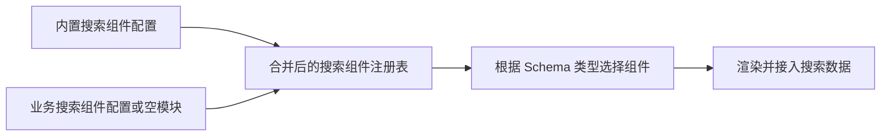

# 抽离并发布 npm 包（4）

<MuxPlayer
  className="mt-8"
  playbackId="xQzWRIzmAe5tIrVM02GQ900u2yS1BYvFUPGLCCVxzRgdE"
  title="抽离并发布 npm 包（4）"
/>

> [!NOTE]
>
> 本节把扩展边界推进到 Dashboard 内部：业务项目可以提供自定义视图和路由，也可以扩展 Schema View 交互组件、搜索项与表单项。
>
> 课程用 Todo 视图迁移验证路由扩展，并重点解决“业务不提供扩展文件时，静态构建仍然报错”的问题。最终在 webpack 配置阶段判断文件是否存在，为可选模块提供确定的空模块回退。
>
> 下文的目录和模块名用统一示例表达约定。字幕后半段部分组件代码被重复转写覆盖，因此只展开能够确认的扩展机制与组件协议，不假造完整业务实现。

## 独立页面与模板内视图不同

上一节支持业务项目新增独立 entry。这样的页面有自己的入口和模板，可以选择完全不同的布局。本节的自定义视图则位于 Dashboard 内部，仍然复用头部、侧边栏、菜单和通用框架，只替换中间的内容区域。

课程以原来写在框架里的 Todo 为例。Todo 是业务定制内容，放在框架内部只是前面演示方便。现在把它迁到使用方，同时为 Dashboard 提供路由扩展声明，让框架能把它重新接回来。

```text filename="Todo 迁移后的业务结构示意" copy
elpis-demo/app/pages
└── dashboard
    ├── router.js
    └── todo
        └── todo.vue
```

与独立页面不同，这里不需要为 Todo 再生成一份 HTML 模板。它由 Dashboard 的前端路由切换出来，拥有的是路由记录和组件，而不是新的服务端页面入口。

## 路由扩展需要接入两份配置

课程中 Dashboard 既有实际路由集合，也有供侧边区域使用的路由配置。业务扩展方法接收这些集合，加入自己的视图记录，使页面导航和界面结构都认识这个新增视图。

下面整理为 `routes` 与 `sideRoutes` 两个参数，具体字段仍需遵循原 Dashboard 组件协议。

```js filename="elpis-demo/app/pages/dashboard/router.js：示意" copy
import Todo from "./todo/todo.vue"

export default function extendDashboardRoutes(routes, sideRoutes) {
  routes.push({
    path: "/todo",
    name: "todo",
    component: Todo,
  })

  sideRoutes.push({
    path: "/todo",
    name: "todo",
  })
}
```

这段示例重点是函数接收框架已经构造的集合并扩展它们。菜单显示文字、模型中的路径等还需要与实际项目保持一致，不能凭增加一条路由就认为所有菜单配置自动出现。

框架先准备原有 iframe、schema 等路由，再调用业务函数，最后使用汇总后的结果创建 Dashboard 应用。

```js filename="框架 Dashboard 入口中的扩展点" copy
import businessRouterConfig from "business-dashboard-router"

// routes 与 sideRoutes 已包含框架内置路由。
if (typeof businessRouterConfig === "function") {
  businessRouterConfig(routes, sideRoutes)
}
```

这种接口把内置路由与业务扩展组合起来，同时不要求框架提前知道 Todo 的源文件位置和组件实现。

## 模型菜单负责把用户带到对应路由

把视图加入路由表以后，还要让模型配置里的菜单指向相应路径。用户点击菜单，Dashboard 根据配置切换到自定义路由，Vue Router 再显示 Todo。


因此扩展完整链路包括三部分：组件实现、路由注册、模型菜单指向。组件存在但路由未注册，无法通过预期地址打开；路由存在但菜单未配置，可能只能手工输入地址；菜单路径与路由不一致，则仍然无法正确显示。

课程迁移 Todo 后访问原来指向它的菜单，用相同显示结果确认视图虽然换了归属，用户访问路径仍然连通。

## 可选文件带来的静态构建问题

并不是每个业务项目都需要自定义 Dashboard 视图。如果框架 alias 永远指向业务 `router.js`，而使用者没有创建该文件，webpack 会在构建时解析这个模块并报错。

课程通过临时改名 `router.js` 模拟没有扩展配置的使用方。这个反向验证十分重要：可扩展能力应该允许使用者不用它，而不是强迫每个项目都创建一个空文件才能构建。

```js filename="直接指向可选文件的风险" copy
resolve: {
  alias: {
    "business-dashboard-router": path.resolve(
      process.cwd(), "app/pages/dashboard/router.js"
    ),
  },
}
```

`path.resolve` 只是计算路径，不会让不存在的文件变成存在，也不会告诉 webpack 这是可选模块。因此问题需要在模块解析层处理。

## 为什么 try/catch 没有解决课堂问题

课程尝试把引用放入 `try/catch`，也讨论额外判断和动态 import，但当前构建仍然报告缺失模块。原因是构建工具在分析源代码中的模块依赖时，就需要确定这些引用是否可解析。

运行时的异常处理逻辑，不能直接替代构建时的依赖存在性判断。特别是静态可分析的模块字符串，即使用在 `import()` 中，也不意味着构建工具完全不管这个依赖。

这里不需要得出“任何版本、任何形式的可选 require 都绝对不行”的过度结论。课程验证的是当前 webpack 配置下，这些尝试没有达成目标；最终选择在配置层提供可解析模块，避免让业务运行时代码承担构建期问题。

> [!IMPORTANT]
>
> 先判断错误发生在编译阶段还是浏览器运行阶段。缺失模块导致编译无法完成时，页面里的类型判断尚未执行，运行时逻辑自然无法把这条构建错误消除。

## 在 Node.js 配置阶段决定真实模块

webpack 配置运行在 Node.js 中，可以使用 `fs.existsSync` 判断业务扩展文件是否存在。如果存在，alias 指向真实文件；如果不存在，alias 指向框架提供的空模块。

```js filename="elpis/app/webpack/config/empty-config.js" copy
module.exports = {}
```

```js filename="webpack.base.js：可选模块回退示意" copy
const fs = require("fs")
const path = require("path")

const emptyConfig = path.resolve(__dirname, "empty-config.js")
const businessRouter = path.resolve(
  process.cwd(), "app/pages/dashboard/router.js"
)

const businessAliases = {
  "business-dashboard-router": fs.existsSync(businessRouter)
    ? businessRouter
    : emptyConfig,
}
```

这样框架入口始终可以 import 同一个模块名，webpack 也始终能找到真实文件。区别只在于导出的值：有扩展时是函数，没有扩展时是空对象。入口中的 `typeof ... === "function"` 判断这时才承担运行期的调用选择。

配置阶段负责“模块一定存在”，运行阶段负责“这个导出是否需要执行”。两层职责明确以后，错误就不再依赖不稳定的引用技巧规避。

## 有扩展与无扩展都要验证

课程先让业务路由文件不存在，确认构建通过且框架原有功能正常；再恢复文件名，确认 Todo 又能显示。这两次观察分别证明默认行为与扩展行为都成立。

由于文件存在性是在加载构建配置时判断，新增或删除这类扩展配置后，要确认构建配置已重新加载。不能假定所有开发服务都会在配置未重建时自动切换 alias 目标。

```text filename="可选扩展的两个验证场景" copy
没有业务 router.js
  -> alias 指向 empty-config
  -> 不执行扩展函数
  -> 使用框架默认路由

有业务 router.js
  -> alias 指向业务模块
  -> 调用扩展函数
  -> 默认路由加业务路由
```

这个机制还会用于后面的组件配置，避免为每个扩展点重新发明一套可选文件处理方案。

## Schema View 的组件也要允许业务加入

Dashboard 中有些交互组件由 Schema 配置指定，例如弹窗、移动或其他业务操作。框架已经有内置组件注册配置，Schema View 根据配置查找并渲染对应组件。

课程在原注册配置基础上再引入业务组件配置，将两者合并。业务只需要在约定目录编写组件和注册文件，不需要修改框架包里的组件列表。

```text filename="Schema View 组件扩展示意目录" copy
elpis-demo/app/pages/dashboard
└── complex-view
    └── schema-view
        └── components
            ├── component-config.js
            └── demo-component.vue
```

字幕对中间目录名称存在转写歧义，此处统一用 `complex-view` 说明层级，实际使用时应与框架扫描约定成套一致。决定扩展能否工作的是路径协议和注册协议，而不是目录名称本身有什么特殊能力。

## 扩展组件必须满足调用协议

课程用一个 Demo 组件验证 Schema View 扩展，明确提到组件名称、可见状态、`show` 方法以及通过 `defineExpose` 暴露方法。

```vue filename="demo-component.vue：交互协议示意" copy
<template>
  <el-dialog v-model="visible" title="业务扩展组件">
    <p>这是来自业务项目的组件。</p>
  </el-dialog>
</template>

<script>
export default {
  name: "DemoComponent",
}
</script>

<script setup>
import { ref } from "vue"

const visible = ref(false)

function show() {
  visible.value = true
}

defineExpose({ show })
</script>
```

这里展示能够从字幕确认的最小协议。如果原通用组件还需要接收行数据、表单数据或操作上下文，扩展实现也应遵循相同参数约定。只要页面能渲染，不代表被框架调用时就一定满足接口。

`defineExpose` 的作用是让父层通过组件实例引用调用 `show`。如果方法只定义在 `<script setup>` 中却未按需要暴露，外层通用控制逻辑可能找不到它。

## 合并配置把组件交给现有渲染器

业务注册文件导出本项目的组件映射，框架再与内置映射组合。下面展示映射形式，实际字段名需对应前面 Schema View 的实现。

```js filename="业务 component-config.js：示意" copy
import DemoComponent from "./demo-component.vue"

export default {
  DemoComponent,
}
```

```js filename="框架组件配置合并示意" copy
import businessComponents from "business-schema-components"

export default {
  ...builtInComponents,
  ...businessComponents,
}
```

`builtInComponents` 代表框架已建立的注册表。若采用后展开业务对象，同名键将由业务值覆盖，这是具体实现带来的规则；不需要替换内置能力时，应采用不冲突的组件名。

对应 alias 同样通过文件存在性判断指向业务配置或空对象模块。由于这里消费的是对象，空对象本身就是自然的默认值，不会增加任何组件。

## 搜索项扩展复用同一种机制

课程随后转到 Schema Search Bar。原有组件列表能根据配置渲染输入框、下拉框等控件，现在同样允许业务提供额外 item 配置。

它的流程没有变化：约定业务文件位置、配置可选模块 alias、引入业务映射、与内置映射合并、由原动态渲染器消费。



课程复制已有输入组件作为最小 Demo，并增加明显的 placeholder 来区分。这种验证不需要先实现一个复杂的新控件，只要能确认该类型来自业务扩展，并且仍能接入搜索值的流转即可。

表单项扩展遵循相同原则，但不应把搜索与表单的所有交互协议视为完全一样。两者都需要映射类型到组件，具体的值绑定、校验和提交职责仍要与各自父组件约定对齐。

## 扩展协议比目录扫描更重要

双来源扫描和可选模块只解决“能找到组件”。框架还要知道怎样使用它：配置里用哪个类型名、传哪些 props、监听哪个事件、是否需要 `show` 等实例方法。

因此本节与前面组件规范设计衔接紧密。内置组件和业务组件应遵循同一个使用协议，通用渲染器才能在不知道具体业务实现的情况下调用它们。

如果业务组件只是随意导出一个 Vue 文件，但返回数据形状与已有搜索项不同，页面可能显示正常，搜索提交却失败。验证不能只看外观，也要沿着值绑定和操作调用检查到最终结果。

## 为什么反复写最小 Demo

课程连续为路由、交互组件和搜索项写测试示例，看起来像重复工作，实际分别验证不同扩展入口。它们的路径、配置形状和消费方不同，不能因为 Todo 能加载，就断言所有组件扩展都能工作。

每完成一个入口就验证“有配置能扩展、没配置仍可运行”，能更早发现别名拼写、路径层级、导出形状或调用协议的问题。这也是框架开发中把抽象落到可观察行为的重要方式。

## 本节小结

本节把 Todo 自定义视图迁入使用方，通过路由扩展函数重新接入 Dashboard，并使用构建阶段的文件存在性判断与空模块回退，让可选扩展不会破坏默认构建。

同样的机制继续用于 Schema View 组件和搜索、表单项配置。框架保留通用渲染与调用协议，业务项目提供自己的组件实现和映射。下一节将清理剩余业务代码、整理依赖与使用文档，并真正发布和安装框架包。
