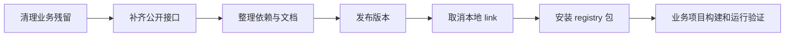
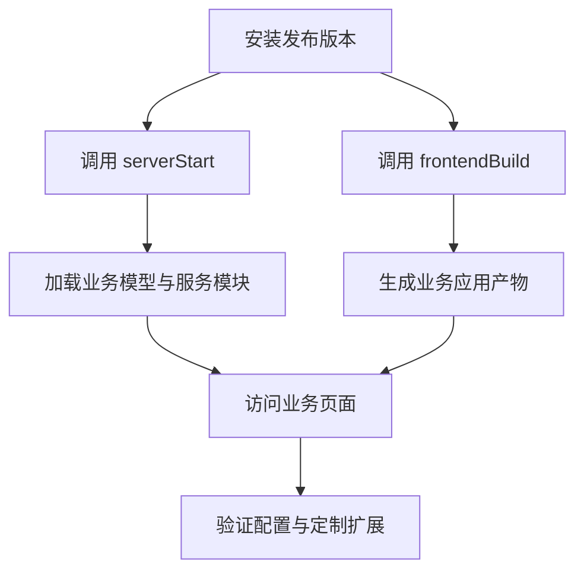

# 抽离并发布 npm 包（5）

<MuxPlayer
  className="mt-8"
  playbackId="00mCMncG01fBw00ke02gLyQ3LL7t3I1TXftipVliq17yCE8"
  title="抽离并发布 npm 包（5）"
/>

> [!NOTE]
>
> 本节完成框架抽离的收尾：迁出剩余业务接口，暴露服务端基础类，整理日志归属、使用文档与 package.json，再发布 scoped npm 包，并在 demo 中取消本地链接、安装真实包验证。
>
> 发布成功只说明 registry 接受了一个版本。消费者能否安装、构建并启动，才是框架交付的完整闭环。文中的命令用于复盘课堂流程，包名和版本均为示例，不涉及实际发布操作。

## 从功能可用走到可以交付

前面四节已经让业务项目通过包 API 启动服务、执行构建、加载模型，并扩展页面和组件。最后仍有几类内容要检查：框架里是否残留具体业务，公开能力是否有文档，依赖是否随包完整提供，安装发布包后是否仍能运行。

课程先把收尾工作列出来，再逐项处理。这样不会因为 npm 页面上出现一个包，就忽略代码边界和使用体验。



这条链路延续了前面“一步一回头”的方法，只是验证对象从函数和组件扩大到一个可消费的发布包。

## 按请求链路迁出业务接口

前面主要处理了前端页面与模型配置，服务端还残留一些示例业务接口。这些接口中的数据、行为和路由归属于 demo，不能继续作为框架默认内容发布。

课程从 router schema 开始，再看路由、Controller 与 Service，把纯业务部分迁到业务项目。迁移时应按一条请求链整体检查，而不是看到文件名带 business 就移动其中一份。

```text filename="业务接口迁移检查" copy
业务 router-schema
  -> 接口参数规则
业务 router
  -> 路由注册与中间件选择
业务 controller
  -> 具体请求处理
业务 service
  -> 业务服务能力
```

如果只移 Controller、不移路由，原路由可能继续指向框架中已删除的位置；只移路由、不移 Schema，也可能改变参数校验行为。前面双来源 Loader 已经允许业务目录参与加载，本节正是使用这些能力收拢真实业务边界。

框架继续保留 base、项目模型与页面渲染等通用能力。判断依据是职责，而不是所有 Controller 都必须迁出，或所有带业务数据的文件都可以留在框架。

## 使用方需要服务端基础类

业务 Controller 和 Service 迁出后，仍可能继承框架提供的基类。若使用方只能通过很深的内部路径引用它们，框架目录一调整，应用就会被迫跟着修改。

课程因此在包入口补充基础能力的导出，让使用者从稳定公开接口取得基类。下面按课程意图整理为嵌套对象，具体工厂调用仍遵循前面内核约定。

```js filename="elpis/index.js：公开基础模块示意" copy
module.exports = {
  serverStart,
  frontendBuild,
  controller: {
    base: require("./app/controller/base"),
  },
  service: {
    base: require("./app/service/base"),
  },
}
```

业务文件引用 `controller.base` 或 `service.base`，再按原有工厂协议传入 app 或进行继承。这里的重点是把确实需要被消费的稳定能力公开，而不是把框架的每一个内部模块都直接暴露出去。

公开接口会成为使用方依赖的契约。内部工具若只是当前实现细节，没有必要为了“方便”全部加入入口，避免以后难以调整。

## 日志应该属于运行应用

课程检查生产启动后的日志位置。框架被 demo 引用后，运行日志应生成在业务应用对应的目录里，而不是不断写进 npm 包或框架开发仓库。

这与前面路径分类一致：框架代码属于包，当前运行产生的日志属于当前应用。日志路径应使用运行项目的根目录，不能因为日志工具代码位于框架内，就把 `__dirname` 当成所有路径的起点。

课程在 demo 中观察日志正常生成，再清理框架中原有日志，并把业务日志目录加入忽略。日志是运行数据，不应与框架源码一起反复提交，也不应当成发布包的必要资源。

```text filename="运行数据与框架资源的归属" copy
框架包：内核、模板、组件、构建能力
业务仓库：模型、定制代码、启动脚本
业务运行目录：logs、当前应用生成的产物
```

这个检查能防止 npm link 掩盖问题。链接时框架目录可写，错误写入可能暂时不明显；正式安装后包目录与部署环境不同，才会出现更难排查的副作用。

## README 要让别人能够使用

课程准备框架文档，说明服务端启动、前端构建、模型配置和各类定制扩展的用法。文档不是最后贴一句介绍，而是帮助没有参与课程开发的人完成第一次接入。

最核心的信息包括调用哪个 API、文件应放在哪个目录、模块应导出什么形状、怎样启动以及怎样判断结果是否正确。

| 使用目标 | 文档至少需要说明 |
| --- | --- |
| 启动服务端 | 安装包、serverStart、应用配置 |
| 构建前端 | frontendBuild、开发和生产命令 |
| 配置模型 | model 目录和模型结构 |
| 新增独立页面 | entry 命名、页面位置、boot 引用 |
| Dashboard 自定义视图 | router 扩展函数与菜单对应 |
| Schema View 扩展组件 | 组件目录、注册映射、调用协议 |
| 搜索与表单项扩展 | 类型映射、值绑定和字段协议 |

前面反复说“这是目录约定”，到发布时就必须把约定写下来。只有作者知道目录层级的框架，实际上仍然难以被他人独立使用。

课程示范的是一份能够表达核心入口的文档，并未宣称已经拥有完整 API 站点。复盘也不应替它夸大为完善的生态文档系统。

## package.json 的 scripts 重新归属

原仓库同时扮演框架和应用，因此有直接启动本地、测试、生产服务的命令。现在服务和构建变成公开方法，真正的应用命令已经迁到 demo。

框架自身只需保留服务框架开发与质量检查所需的命令，例如 lint 和测试。业务项目保留自己的 server、build 及环境启动命令。

```text filename="命令归属调整" copy
elpis：
  lint、框架自身测试、发布相关流程

elpis-demo：
  本地服务、测试环境服务、生产服务
  开发构建、生产构建
```

这不是说 npm 包永远不能包含命令行工具，而是当前课程选择通过 JavaScript API 提供能力，使用方脚本负责调用。文档、导出与 scripts 应围绕这一个实际形态保持一致。

## dependencies 与 devDependencies 按消费者需要判断

课程集中整理依赖，把使用方运行公开框架能力时需要的包放进 `dependencies`，把只用于框架自身测试、lint、提交校验的工具留在开发依赖中。

构建工具的归属在这里尤其容易误判。对于普通业务应用，webpack 通常用于开发构建；但 elpis 把构建本身作为公开 API 提供，消费者调用它时也需要对应工具和 Loader。不能仅凭包的名字含 loader，就认定它永远不应作为框架运行依赖。

```text filename="判断依赖位置的依据" copy
消费者调用 serverStart 或 frontendBuild 时会加载
  -> 需要在发布后的依赖关系中完整提供

只有框架维护者执行 lint、测试、提交校验时使用
  -> 属于框架开发环境工具
```

字幕列举了 assert、测试与校验工具，也提到 Babel preset，但部分名称识别并不稳定。实际判断仍应追踪配置有没有在消费者构建时引用它：如果需要，就必须可被消费环境解析，不能机械照搬一份口述名单。

`npm link` 会连到完整开发工作目录，可能让缺失声明暂时不暴露，所以后面必须安装真实发布包再次验证。

## 发布前确认包身份与目标 registry

课程使用自己的 npm 账号发布 `@账号/elpis`。发布前要确认当前登录身份与 package.json 中的 scope 对应，同时确认请求目标是 npm registry，而不是仅用于下载加速的镜像源。

下面把课程“检查源、登录、确认身份”的过程整理成明确指定目标的示例，避免照抄字幕中含糊的清空配置口述。

```bash filename="课堂发布前检查示意" copy
npm config get registry
npm login --registry=https://registry.npmjs.org/
npm whoami --registry=https://registry.npmjs.org/
```

认证需要由账号所有者完成，课程中的验证码只属于当时登录演示，没有任何可复用意义。复盘记录流程与目的，不记录真实验证码、令牌或账户凭据。

这一步确认的是“以谁的身份向哪里发布”。包内容是否完整、版本是否正确，还需要继续检查 package.json 与实际交付文件。

## scoped 名称与 public 访问级别

课程直接发布 scoped 包时遇到访问级别相关错误，随后显式指定 public。它说明命名空间与公开性是两件事：`@your-name/elpis` 表示归属，`--access public` 表示这个发布包按公开访问方式交付。

```bash filename="公开发布命令示意" copy
npm publish --access public --registry=https://registry.npmjs.org/
```

本页复盘的是课程中公开 scoped 包的发布方式，不把当时界面、认证步骤和收费提示概括为所有未来 npm 客户端的固定行为。实际命令返回的信息仍是判断当前发布结果的依据。

课程还遇到版本冲突，随后使用新的版本号再次尝试。应将它理解为发布系统对包名与版本组合的管理，而不是认为修改任意一个数字只是为了“绕过错误”。版本号代表一次具体交付，使用方以后会依赖它。

## 发布结果不以搜索排名判断

发布完成后，课程在包页面看到了描述、README 和安装方式，但搜索结果有延迟或未立即显示。搜索发现与版本已经发布是不同层面的现象。

更直接的证据是命令输出、准确包名对应页面，以及使用方能否获取这个明确版本。不能因为泛搜索暂时找不到，就立即重复发布另一个版本；也不能只看到一个页面就跳过安装验证。

包页面显示文档，是前面整理 README 的直接结果。描述、入口说明和扩展目录现在成为使用者接触框架的第一手材料。

## 取消 link 后才能验证真正发布的包

课程回到 `elpis-demo`，先解除本地链接，再安装 registry 上发布的包。若不解除链接，业务项目可能仍在消费框架本地目录，页面正常也不能证明发布内容完整。

```bash filename="在 elpis-demo 验证真实包的示意" copy
npm unlink @your-name/elpis
npm install @your-name/elpis@1.0.1 --registry=https://registry.npmjs.org/
```

版本号仅示意课程里重试后的版本，不代表读者应安装同一个名称或该包现在仍然公开存在。课程也明确把发布当作教学演示，不以讲师账号作为长期依赖来源。

安装完成后，要看 `node_modules` 中对应包不再只是原工作目录链接，再通过使用方自己的命令启动服务与构建。这样才能验证 npm 实际交付了什么。

## 最终验证要覆盖公开能力

完整验收围绕框架宣称提供的能力：服务能启动，业务 Loader 能加载，模型能读取，开发和生产构建能够执行，自定义页面和模板内扩展仍能被解析，日志写入业务目录。

如果安装后缺少 Loader，优先检查依赖声明；找不到模板或组件，检查包文件与内部路径；服务正常但模型为空，检查业务配置位置；link 时成功而正式安装失败，则重点比较两种消费方式的文件和依赖差异。



这不是要求为了发布重写整个测试体系，而是沿前面已建立的最小 demo 检查实际消费链路。应用能够在不依赖框架源码工作目录的情况下运行，才真正完成抽离。

## 本节小结

本节把剩余业务接口迁到使用方，补充基础类公开接口，确认运行日志属于业务项目，并整理文档、命令与依赖声明。随后通过登录、确认包身份、公开发布和版本处理，完成 npm 交付流程。

最后取消本地 link、安装真实发布包，验证框架公开能力。经过这一章，elpis 从包含示例业务的开发项目，转成可以被多个应用安装、配置和扩展的框架；demo 则成为一个清楚展示消费方式的业务工程。
